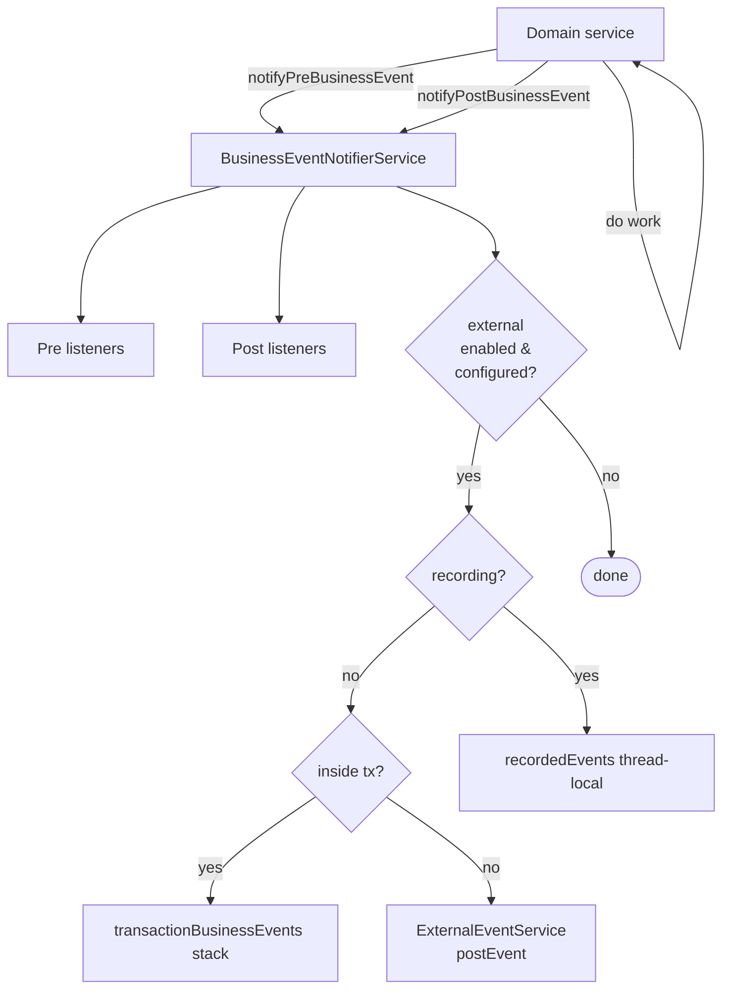

Inside the Apache Fineract JVM, domain modules raise **business events** every time something the rest of the system cares about happens. The receivers are other Spring beans — the accounting bridge, hook handlers, and (indirectly) the external event outbox. This page documents the in-process side of the bus: the contract, the notifier, and a representative catalogue of the event types that exist in tree.

The core types live in `fineract-core` under `org.apache.fineract.infrastructure.event.business`; the concrete event classes live next to the aggregates they describe, in `fineract-loan`, `fineract-provider`, `fineract-document`, `fineract-accounting`, and so on.

## The SPI

Three small types define the contract.

### `BusinessEvent<T>`

The root interface. Every event reports the aggregate it relates to, a stable type identifier, and a category:

```java
package org.apache.fineract.infrastructure.event.business.domain;

public interface BusinessEvent<T> {
    T get();
    String getType();
    String getCategory();
    Long getAggregateRootId();
}
```

`getType()` returns the discriminator that appears on the wire (`"LoanApprovedBusinessEvent"`), is used to look up `m_external_event_configuration` rows, and identifies the event in logs. `getCategory()` is a coarse grouping (`"Loan"`, `"Client"`, `"Savings"`) populated once by the category base class. `getAggregateRootId()` is the partition key for ordering — for a `LoanBusinessEvent` it returns `loan.getId()`.

### `AbstractBusinessEvent<T>` and category bases

`AbstractBusinessEvent<T>` is a Lombok-`@RequiredArgsConstructor` base that just holds the value:

```java
@RequiredArgsConstructor
public abstract class AbstractBusinessEvent<T> implements BusinessEvent<T> {
    private final T value;
    @Override public T get() { return value; }
}
```

Each domain provides a **category** abstract class on top of that — `LoanBusinessEvent`, `ClientBusinessEvent`, `SavingsAccountBusinessEvent`, `ShareAccountBusinessEvent`, `LoanProductBusinessEvent`. They fix `category` and `aggregateRootId` once so concrete events only need to provide `type`:

```java
public class LoanApprovedBusinessEvent extends LoanBusinessEvent {
    private static final String TYPE = "LoanApprovedBusinessEvent";
    public LoanApprovedBusinessEvent(Loan value) { super(value); }
    @Override public String getType() { return TYPE; }
}
```

### `BulkBusinessEvent`

```java
public class BulkBusinessEvent extends AbstractBusinessEvent<List<BusinessEvent<?>>> {
    public static final String TYPE = "BulkBusinessEvent";
    // verifies all events share one aggregate root
}
```

A `BulkBusinessEvent` is never raised directly by domain code — the notifier wraps a transaction's worth of recorded events into one when `startExternalEventRecording()` was called. It exists so a batch of related changes (e.g. a charge-off that touches many transactions) ships as a single message keyed by the same aggregate id.

### `NoExternalEvent`

A marker interface; events that implement it are dispatched to in-process listeners only and never written to the outbox. The notifier checks `instanceof NoExternalEvent` before considering an event for external posting.

### `BusinessEventListener<T>`

```java
public interface BusinessEventListener<T extends BusinessEvent<?>> {
    void onBusinessEvent(T event);
}
```

A listener is a plain Spring bean that registers itself against a specific event type at startup, typically in a `@PostConstruct` on the bean that owns it.

## The notifier

`BusinessEventNotifierService` is the publish side:

```java
public interface BusinessEventNotifierService {
    void notifyPreBusinessEvent(BusinessEvent<?> businessEvent);
    void notifyPostBusinessEvent(BusinessEvent<?> businessEvent);

    <T extends BusinessEvent<?>> void addPreBusinessEventListener(
            Class<T> eventType, BusinessEventListener<T> listener);
    <T extends BusinessEvent<?>> void addPostBusinessEventListener(
            Class<T> eventType, BusinessEventListener<T> listener);

    void startExternalEventRecording();
    void stopExternalEventRecording();
    void resetEventRecording();
}
```

Domain code calls `notifyPreBusinessEvent` before the work and `notifyPostBusinessEvent` after — the pre-hook is typically used for validation that needs to see the previous state (a guarantor check that blocks funds, for example), the post-hook for reactions to a committed change.

The implementation, `BusinessEventNotifierServiceImpl`, is also a Spring `TransactionExecutionListener` so it can flush "recorded" events when the surrounding transaction commits. Its core logic for the post-hook:

```java
public void notifyPostBusinessEvent(BusinessEvent<?> businessEvent) {
    throwExceptionIfBulkEvent(businessEvent);
    boolean isExternalEvent = !(businessEvent instanceof NoExternalEvent);
    List<BusinessEventListener> listeners =
            findSuitableListeners(postListeners, businessEvent.getClass());
    for (BusinessEventListener l : listeners) {
        l.onBusinessEvent(businessEvent);
    }
    if (isExternalEvent && isExternalEventPostingEnabled()) {
        if (externalBusinessEventConfigurationService.isExternalEventConfiguredForPosting(businessEvent)) {
            if (isExternalEventRecordingEnabled()) {
                recordedEvents.get().add(businessEvent);
            } else if (transactionHelper.hasTransaction()) {
                storeTransactionalBusinessEvent(businessEvent);
            } else {
                externalEventService.postEvent(businessEvent);
            }
        }
    }
}
```

So one call can do four things: notify in-process listeners, record the event for later bulking, store it for end-of-transaction flush, or post it immediately if there is no enclosing transaction.



## Registering listeners

A typical listener is a Spring bean wired into the notifier from `@PostConstruct`:

```java
@Component
@RequiredArgsConstructor
public class GuarantorOnLoanApprovalListener
        implements BusinessEventListener<LoanApprovedBusinessEvent> {

    private final BusinessEventNotifierService notifier;
    private final GuarantorDomainService guarantorService;

    @PostConstruct
    public void register() {
        notifier.addPostBusinessEventListener(
            LoanApprovedBusinessEvent.class, this);
    }

    @Override
    public void onBusinessEvent(LoanApprovedBusinessEvent event) {
        guarantorService.blockFundsForApprovedLoan(event.get());
    }
}
```

The notifier matches listeners by `Class.isAssignableFrom`, so registering against `LoanBusinessEvent` would also receive every concrete loan event. That makes the category base classes useful subscription points for cross-cutting concerns like accounting.

<Tip>
`notifyPreBusinessEvent` refuses to accept a `BulkBusinessEvent` — the notifier raises an `IllegalArgumentException` if one is passed in. Bulk wrapping is an implementation detail of the external event flush, not a primitive the domain produces directly.
</Tip>

## Recording windows

For long-running unit-of-work flows that mutate many things — a charge-off that adjusts many transactions, an interest recalculation across a schedule — the notifier offers an explicit recording mode:

```java
notifier.startExternalEventRecording();
try {
    // domain code raises many post-events
    loan.chargeOff(...);
    loan.recalculateSchedule(...);
} finally {
    notifier.stopExternalEventRecording();   // flushes one BulkBusinessEvent
}
```

While recording is on, the per-event outbox write is replaced by adding to a thread-local list. On `stop`, the list is wrapped in a single `BulkBusinessEvent` and posted, which gives downstream consumers an atomic "everything for this charge-off" message.

## Catalogue

The following are representative in-tree event types, grouped by aggregate. Names match the `getType()` discriminator the wire uses.

### Loan lifecycle

<AccordionGroup>
  <Accordion title="Application / approval">
    `LoanCreatedBusinessEvent`, `LoanApplicationModifiedBusinessEvent`, `LoanApprovedBusinessEvent`, `LoanUndoApprovalBusinessEvent`, `LoanRejectedBusinessEvent`, `LoanWithdrawnByApplicantBusinessEvent`, `LoanApprovedAmountChangedBusinessEvent`.
  </Accordion>
  <Accordion title="Disbursal & closure">
    `LoanDisbursalBusinessEvent`, `LoanUndoDisbursalBusinessEvent`, `LoanUndoLastDisbursalBusinessEvent`, `LoanUpdateDisbursementDataBusinessEvent`, `LoanCloseBusinessEvent`, `LoanCloseAsRescheduleBusinessEvent`.
  </Accordion>
  <Accordion title="Schedule, delinquency, status">
    `LoanRescheduledDueAdjustScheduleBusinessEvent`, `LoanRescheduledDueCalendarChangeBusinessEvent`, `LoanRescheduledDueHolidayBusinessEvent`, `LoanScheduleVariationsAddedBusinessEvent`, `LoanScheduleVariationsDeletedBusinessEvent`, `LoanDelinquencyRangeChangeBusinessEvent`, `LoanAccountDelinquencyPauseChangedBusinessEvent`, `LoanStatusChangedBusinessEvent`, `LoanBalanceChangedBusinessEvent`, `LoanInterestRecalculationBusinessEvent`.
  </Accordion>
  <Accordion title="Charges">
    `LoanAddChargeBusinessEvent`, `LoanUpdateChargeBusinessEvent`, `LoanDeleteChargeBusinessEvent`, `LoanWaiveChargeBusinessEvent`, `LoanWaiveChargeUndoBusinessEvent`, `LoanApplyOverdueChargeBusinessEvent`.
  </Accordion>
  <Accordion title="Transactions">
    `LoanRepaymentBusinessEvent`, `LoanRepaymentDueBusinessEvent`, `LoanRepaymentOverdueBusinessEvent`, `LoanAdjustTransactionBusinessEvent`, `LoanChargebackTransactionBusinessEvent`, `LoanChargeRefundBusinessEvent`, `LoanChargeAdjustmentPostBusinessEvent`, `LoanChargeAdjustmentPreBusinessEvent`, `LoanChargeOffPostBusinessEvent`, `LoanChargeOffPreBusinessEvent`, `LoanAccrualTransactionCreatedBusinessEvent`, `LoanAccrualAdjustmentTransactionBusinessEvent`, `LoanCreditBalanceRefundPostBusinessEvent`.
  </Accordion>
  <Accordion title="Capitalized income & buy-down fee">
    `LoanCapitalizedIncomeTransactionCreatedBusinessEvent`, `LoanCapitalizedIncomeAdjustmentTransactionCreatedBusinessEvent`, `LoanCapitalizedIncomeAmortizationTransactionCreatedBusinessEvent`, `LoanCapitalizedIncomeAmortizationAdjustmentTransactionCreatedBusinessEvent`, `LoanBuyDownFeeTransactionCreatedBusinessEvent`, `LoanBuyDownFeeAdjustmentTransactionCreatedBusinessEvent`, `LoanBuyDownFeeAmortizationTransactionCreatedBusinessEvent`, `LoanBuyDownFeeAmortizationAdjustmentTransactionCreatedBusinessEvent`.
  </Accordion>
  <Accordion title="Re-age & re-amortize">
    `LoanReAgeBusinessEvent`, `LoanUndoReAgeBusinessEvent`, `LoanReAmortizeBusinessEvent`, `LoanUndoReAmortizeBusinessEvent`.
  </Accordion>
  <Accordion title="Transfer & officer assignment">
    `LoanInitiateTransferBusinessEvent`, `LoanAcceptTransferBusinessEvent`, `LoanRejectTransferBusinessEvent`, `LoanWithdrawTransferBusinessEvent`, `LoanReassignOfficerBusinessEvent`, `LoanRemoveOfficerBusinessEvent`.
  </Accordion>
  <Accordion title="Snapshots">
    `LoanAccountSnapshotBusinessEvent`, `LoanAccountCustomSnapshotBusinessEvent` — used by reporting consumers that need a periodic full state, not just deltas.
  </Accordion>
</AccordionGroup>

### Client, group, centre

`ClientCreateBusinessEvent`, `ClientActivateBusinessEvent`, `ClientRejectBusinessEvent`, `GroupsCreateBusinessEvent`, `CentersCreateBusinessEvent` — defined in `org.apache.fineract.infrastructure.event.business.domain.client` (and equivalent group/centre packages) in `fineract-provider`.

### Savings, fixed deposit, recurring deposit

`SavingsCreateBusinessEvent`, `SavingsApproveBusinessEvent`, `SavingsActivateBusinessEvent`, `SavingsRejectBusinessEvent`, `SavingsCloseBusinessEvent`, `SavingsPostInterestBusinessEvent`, `SavingsDepositBusinessEvent`, `SavingsAccountTransactionBusinessEvent`, `SavingsAccountForceWithdrawalBusinessEvent`, plus `FixedDepositAccountCreateBusinessEvent` and `RecurringDepositAccountCreateBusinessEvent`.

### Share accounts

`ShareAccountCreateBusinessEvent`, `ShareAccountApproveBusinessEvent`, `ShareProductDividentsCreateBusinessEvent` — from the share portfolio module under `fineract-provider`.

### Accounting & journal entries

`JournalEntryBusinessEvent` (from `fineract-accounting`) is raised after a journal entry is posted; `LoanJournalEntryCreatedBusinessEvent` (from `fineract-loan`) is the loan-specific variant that ships the loan id and the resulting GL movements.

### Documents

`DocumentCreatedBusinessEvent` and `DocumentDeletedBusinessEvent` from `fineract-document` cover changes to documents attached to clients, loans, etc.

### Datatables

Generic events on rows of ad-hoc datatables: `DatatableEntryCreatedBusinessEvent`, `DatatableEntryUpdatedBusinessEvent`, `DatatableEntryDeletedBusinessEvent`, carrying a `DatatableEntryDetails` payload that names the table and the primary key.

## In-process consumers in tree

<CardGroup cols={2}>
  <Card title="Accounting bridge">
    Listens on the category bases (`LoanBusinessEvent`, `SavingsAccountBusinessEvent`) and posts journal entries through `JournalEntryWritePlatformService`. This is the canonical example of why business events exist — accounting needs to react to every domain change without being called explicitly.
  </Card>
  <Card title="Hooks framework">
    Generic hook handlers register against event types and dispatch to external HTTP/Webhook endpoints configured per tenant.
  </Card>
  <Card title="Notifications">
    The notification module raises in-process alerts off events like `LoanApprovedBusinessEvent` and `LoanRepaymentDueBusinessEvent`.
  </Card>
  <Card title="External event outbox">
    The biggest single consumer is the outbox writer itself — `ExternalEventService` is called by the notifier when external posting is enabled and the event type is in `m_external_event_configuration`.
  </Card>
</CardGroup>

<Note>
Every event class in tree is essentially a typed wrapper around the aggregate it relates to. The wire payload (Avro `LoanAccountDataV1`, `ClientDataV1`, …) is derived from that aggregate by a domain-specific `BusinessEventSerializer` at outbox-write time — see [the pipeline page](/events/external-events-pipeline) for the serialiser dispatch.
</Note>
