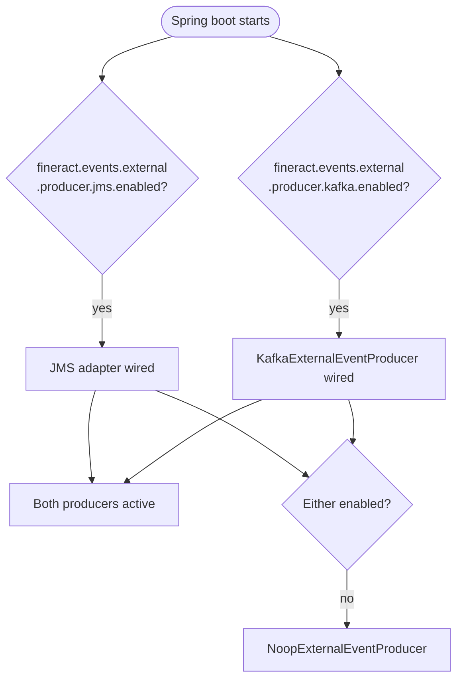
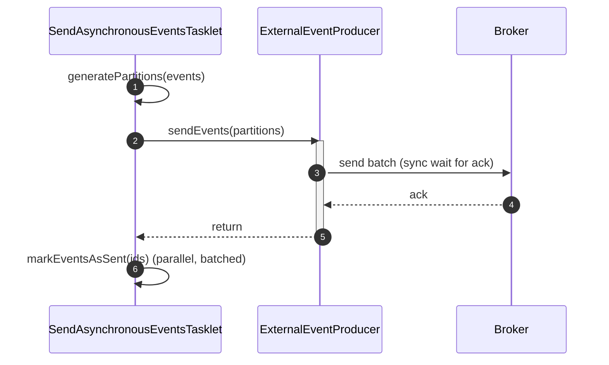

The `SendAsynchronousEventsTasklet` in Apache Fineract never talks to a broker directly. Instead it hands its batches of Avro-encoded bytes to an `ExternalEventProducer` — a one-method SPI with a handful of implementations selected at startup by Spring conditions. This page documents the SPI, the three in-tree implementations (the Noop default, the JMS adapter, and `KafkaExternalEventProducer`), and the property-driven `@Conditional` plumbing that wires the right one in.

All these types live under `org.apache.fineract.infrastructure.event.external.producer`. The SPI itself ships in `fineract-core`; the Kafka adapter is in `fineract-provider` so the core jar does not pull a Kafka client onto the classpath of consumers that don't need it.

## The SPI

```java
package org.apache.fineract.infrastructure.event.external.producer;

import org.apache.fineract.infrastructure.event.external.exception.AcknowledgementTimeoutException;

public interface ExternalEventProducer {

    /**
     * Sends the created ExternalEvents.
     *
     * @param partitions
     *      The value is list of external events belong to the same key,
     *      serialized into byte array
     */
    void sendEvents(Map<Long, List<byte[]>> partitions)
            throws AcknowledgementTimeoutException;
}
```

The contract is deliberately narrow:

- **Input.** A map keyed by aggregate-root id. Within one partition the list is in domain order; the producer must preserve that ordering when sending to the broker.
- **Output.** Nothing — success is fire-and-forget. The producer must block until the broker has acknowledged the batch (synchronous send semantics), so that the tasklet only marks rows `SENT` after they are durably on the wire.
- **Error.** `AcknowledgementTimeoutException` if the broker fails to acknowledge in the configured timeout. Any other failure is allowed to bubble as a runtime exception; the tasklet logs and the rows remain `TO_BE_SENT` for the next run.

A reasonable mental model is "JDBC `executeBatch` for events" — the producer takes a batch, blocks until success, and returns.

## Which implementation runs?

Implementation selection is mutually exclusive and entirely property-driven. The `NoopExternalEventEnabled` condition is satisfied **only** when neither JMS nor Kafka is enabled.



In a normal deployment exactly one producer ends up registered. Running JMS **and** Kafka simultaneously is supported — every queued event is published to both — but is rarely useful in production.

## NoopExternalEventProducer

The default. Picked when nothing else is enabled, used in unit tests, and the right choice for a development instance that should still write the outbox but never ship.

```java
@Component
@Conditional(NoopExternalEventEnabled.class)
@Slf4j
public class NoopExternalEventProducer implements ExternalEventProducer {
    @Override
    public void sendEvents(Map<Long, List<byte[]>> messages)
            throws AcknowledgementTimeoutException {}
}
```

The selection condition:

```java
public class NoopExternalEventEnabled extends PropertiesCondition {
    @Override
    protected boolean matches(FineractProperties properties) {
        return (!getEffectiveJMSProperty(properties)
             && !getEffectiveKafkaProperty(properties));
    }
    // ... null-safe getters for jms.enabled / kafka.enabled
}
```

Note that the `SendAsynchronousEventsTasklet` separately checks `isDownstreamChannelEnabled()` — when neither JMS nor Kafka is enabled it exits early, so the Noop producer's `sendEvents` is never actually invoked in production. Its purpose is to keep the bean graph well-formed so `ExternalEventService` can still be wired up to write to `m_external_event`.

## JMS adapter

Activated when `fineract.events.external.producer.jms.enabled = true` together with a queue name or topic name. The choice between queue-style and topic-style delivery is made by two conditions that look at the configured target:

```java
public class EnableExternalEventQueueCondition extends PropertiesCondition {
    @Override
    protected boolean matches(FineractProperties properties) {
        return StringUtils.isNotBlank(properties.getEvents().getExternal()
                .getProducer().getJms().getEventQueueName());
    }
}

public class EnableExternalEventTopicCondition extends PropertiesCondition {
    @Override
    protected boolean matches(FineractProperties properties) {
        return StringUtils.isNotBlank(properties.getEvents().getExternal()
                .getProducer().getJms().getEventTopicName());
    }
}
```

So:

- Setting `event-queue-name` activates the queue listener configuration; messages are point-to-point — one consumer per message.
- Setting `event-topic-name` activates the topic listener configuration; messages are pub-sub — every subscriber gets a copy.
- Setting both activates both — events are published to the queue and the topic.

The relevant properties on `FineractProperties.FineractExternalEventsProducerJmsProperties`:

```java
public static class FineractExternalEventsProducerJmsProperties {
    private boolean enabled;
    private String  eventQueueName;
    private String  eventTopicName;
    private String  brokerUrl;
    private String  brokerUsername;
    private String  brokerPassword;
    private int     producerCount;
    private boolean asyncSendEnabled;
    private int     threadPoolTaskExecutorCorePoolSize;
    private int     threadPoolTaskExecutorMaxPoolSize;

    public boolean isBrokerPasswordProtected() {
        return StringUtils.isNotBlank(brokerUsername)
            || StringUtils.isNotBlank(brokerPassword);
    }
}
```

`broker-url` is the JMS provider URL (e.g. an ActiveMQ `tcp://...` endpoint); `producer-count` controls how many parallel `MessageProducer` connections are pooled; `async-send-enabled` toggles JMS asynchronous send mode. The `isBrokerPasswordProtected()` helper is read by the connection-factory configuration to decide whether to apply credentials.

## KafkaExternalEventProducer

Activated by `fineract.events.external.producer.kafka.enabled = true` and selected with Spring Boot's standard property condition (no custom condition class needed):

```java
@Component
@ConditionalOnProperty(value = "fineract.events.external.producer.kafka.enabled",
                       havingValue = "true")
public class KafkaExternalEventProducer implements ExternalEventProducer {

    @Autowired private KafkaTemplate<Long, byte[]> externalEventsKafkaTemplate;
    @Autowired private FineractProperties fineractProperties;

    @Override
    public void sendEvents(Map<Long, List<byte[]>> partitions)
            throws AcknowledgementTimeoutException {
        var kafkaProperties = fineractProperties.getEvents().getExternal()
                .getProducer().getKafka();
        String topicName = kafkaProperties.getTopic().getName();
        var sendResults = new ArrayList<CompletableFuture<SendResult<Long, byte[]>>>();

        for (var entry : partitions.entrySet()) {
            for (byte[] message : entry.getValue()) {
                sendResults.add(externalEventsKafkaTemplate
                        .send(topicName, entry.getKey(), message));
            }
        }
        CompletableFuture<Void> all =
                CompletableFuture.allOf(sendResults.toArray(new CompletableFuture[0]));
        all.get(kafkaProperties.getTimeoutInSeconds(), TimeUnit.SECONDS);
    }
}
```

Three points worth noting:

1. **Key = aggregate-root id.** That is what gives downstream consumers per-loan / per-account ordering — Kafka guarantees order within a partition, and a stable key always maps to the same partition. Events with no aggregate are bucketed under `-1L` by the tasklet's partitioner.
2. **Synchronous wait.** Each individual `send` is asynchronous (`KafkaTemplate.send` returns a future), but the producer blocks on `CompletableFuture.allOf(...).get(timeout, SECONDS)` before returning. This is what makes the outbox safe to mark `SENT` afterwards.
3. **Timeout.** `timeoutInSeconds` is the per-batch acknowledgement timeout, configured via `fineract.events.external.producer.kafka.timeout-in-seconds`.

`FineractExternalEventsProducerKafkaProperties` carries the broker addresses, topic config, and nested `KafkaProperties` blocks for the producer and admin clients:

```java
public static class FineractExternalEventsProducerKafkaProperties {
    private boolean enabled;
    private String  bootstrapServers;
    private KafkaTopicProperties topic;
    private KafkaProperties producer;
    private KafkaProperties admin;
    private int timeoutInSeconds;
}
```

The `producer` and `admin` blocks are passed straight through to the Kafka client builders, so any Kafka client setting (security, compression, batching) can be tuned without code changes.

## Property surface, side by side

| Property | Producer | Purpose |
| --- | --- | --- |
| `fineract.events.external.enabled` | all | Master switch; gates outbox writes |
| `…producer.jms.enabled` | JMS | Activates JMS connection-factory wiring |
| `…producer.jms.event-queue-name` | JMS | Picks queue delivery (`EnableExternalEventQueueCondition`) |
| `…producer.jms.event-topic-name` | JMS | Picks topic delivery (`EnableExternalEventTopicCondition`) |
| `…producer.jms.broker-url` | JMS | Provider URL |
| `…producer.jms.broker-username/password` | JMS | Credentials |
| `…producer.jms.producer-count` | JMS | Pool size |
| `…producer.kafka.enabled` | Kafka | Activates `KafkaExternalEventProducer` |
| `…producer.kafka.bootstrap-servers` | Kafka | Broker list |
| `…producer.kafka.topic.name` | Kafka | Target topic |
| `…producer.kafka.timeout-in-seconds` | Kafka | Per-batch ack timeout |

When everything is left off, `NoopExternalEventProducer` is selected and the tasklet's `isDownstreamChannelEnabled()` returns false, so outbox rows accumulate but no broker traffic is generated.

## Inside the tasklet handoff



Because `sendEvents` is synchronous, the tasklet has a clear before/after boundary for marking the rows. If the producer throws `AcknowledgementTimeoutException` (or any other exception), the `markEventsAsSent` call simply never happens — the rows remain `TO_BE_SENT` and the next scheduler run retries them.

<Tip>
The producer is the only place in the pipeline where retry semantics differ between brokers. The Noop producer cannot fail. The JMS adapter relies on the JMS client's own send-with-ack semantics. The Kafka adapter relies on Spring Kafka's `KafkaTemplate` future and the explicit `timeoutInSeconds` wait. If you implement a custom `ExternalEventProducer`, make sure it blocks until durable persistence and throws on timeout — the tasklet's correctness assumes that.
</Tip>

## Writing a custom producer

The SPI is open. To target a broker not covered by the in-tree adapters (e.g. AWS SNS, Google Pub/Sub, NATS):

1. Add a `@Component` implementing `ExternalEventProducer`.
2. Gate it with a Spring condition (e.g. `@ConditionalOnProperty("fineract.events.external.producer.myprovider.enabled")`).
3. Inside `sendEvents`, publish each `byte[]` keyed by the partition id and **block** until acknowledged.
4. Translate timeout failures into `AcknowledgementTimeoutException`; let other failures bubble as runtime exceptions.
5. Update `NoopExternalEventEnabled` (or override `isDownstreamChannelEnabled` in a custom tasklet config) so the new producer also disables the Noop fallback.

That last point matters: the Noop condition currently only considers JMS and Kafka. A new producer needs to participate in that check, otherwise the Noop bean will also be registered and `isDownstreamChannelEnabled()` will continue to return false, and the tasklet will never run.

<Note>
`MessageV1` is a single, stable envelope across all producers — the producer is only responsible for shipping bytes. Schema evolution lives in `fineract-avro-schemas`, not in the producer code, so changing the payload of `LoanAccountDataV1` does not require touching any adapter.
</Note>
