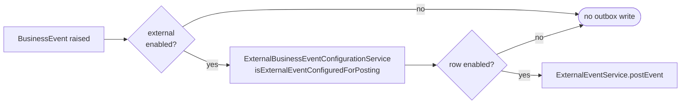
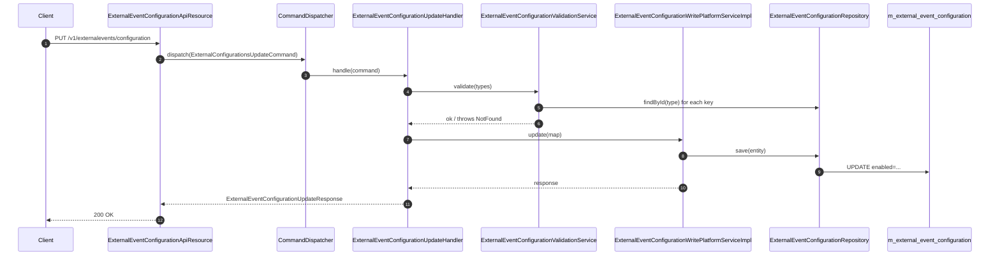
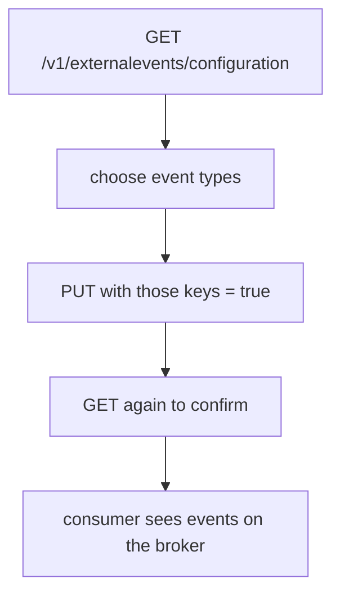

Apache Fineract publishes a lot of business events — sixty-odd loan ones alone — and a tenant rarely wants all of them on the broker. The decision of "which event types should be externalised?" is a per-tenant runtime setting backed by a single `m_external_event_configuration` table, exposed by a small REST resource, and primed at install time by Liquibase changelogs. This page documents the entity, the API contract, the read/write services behind it, and the seed data.

The code lives in `org.apache.fineract.infrastructure.event.external` under `fineract-core`.

## The entity

```java
@Entity
@Table(name = "m_external_event_configuration")
@Getter
@NoArgsConstructor
@AllArgsConstructor
public class ExternalEventConfiguration {

    @Id
    @Column(name = "type", nullable = false)
    private String type;

    @Column(name = "enabled", nullable = false)
    private boolean enabled = false;

    public void setEnabled(boolean enabled) {
        this.enabled = enabled;
    }
}
```

Two columns and that is the whole story:

- **`type`** — the primary key. Matches `BusinessEvent.getType()` exactly (e.g. `"LoanApprovedBusinessEvent"`). One row per known event type.
- **`enabled`** — boolean. When `false`, the notifier silently skips the outbox write for that type; when `true`, every successful occurrence is written to `m_external_event`.

The table is created in the same Liquibase changeset as the outbox (`0043_add_external_event_table.xml`):

```xml
<changeSet author="fineract" id="4">
    <createTable tableName="m_external_event_configuration">
        <column name="type" type="VARCHAR(100)">
            <constraints nullable="false" primaryKey="true"/>
        </column>
        <column name="enabled" type="boolean">
            <constraints nullable="false"/>
        </column>
    </createTable>
</changeSet>
```

There is no row for the master switch — that lives in `fineract.events.external.enabled` on `FineractProperties`. The table only configures **which types** are externalised when the master switch is on.

## How the notifier uses it



`BusinessEventNotifierServiceImpl` checks both gates on every post-event:

```java
if (isExternalEvent && isExternalEventPostingEnabled()) {
    if (externalBusinessEventConfigurationService
            .isExternalEventConfiguredForPosting(businessEvent)) {
        // ... outbox write
    }
}
```

`ExternalBusinessEventConfigurationService` (in the same package) wraps `ExternalEventConfigurationRepository.findById(type)`, returning `false` for missing or disabled rows. So forgetting to seed a row for a new event type is safe — it just stays off until an operator explicitly turns it on.

## The REST resource

`ExternalEventConfigurationApiResource` is a Jakarta REST resource mounted at `/v1/externalevents/configuration`:

```java
@RequiredArgsConstructor
@Path("/v1/externalevents/configuration")
@Component
@Tag(name = "External event configuration",
     description = "External event configuration enables user to enable/disable event posting to downstream message channel")
public class ExternalEventConfigurationApiResource {

    private final ExternalEventConfigurationReadPlatformService readPlatformService;
    private final CommandDispatcher dispatcher;

    @GET
    @Produces(MediaType.APPLICATION_JSON)
    public ExternalEventConfigurationResponse getExternalEventConfigurations() {
        return readPlatformService.findAllExternalEventConfigurations();
    }

    @PUT
    @Consumes(MediaType.APPLICATION_JSON)
    @Produces(MediaType.APPLICATION_JSON)
    public ExternalEventConfigurationUpdateResponse updateExternalEventConfigurations(
            @Valid ExternalEventConfigurationUpdateRequest request) {
        final var command = new ExternalConfigurationsUpdateCommand();
        command.setPayload(request);
        final Supplier<ExternalEventConfigurationUpdateResponse> response = dispatcher.dispatch(command);
        return response.get();
    }
}
```

Two endpoints.

### `GET /v1/externalevents/configuration`

Returns every row in the table as a single response:

```java
public class ExternalEventConfigurationResponse {
    private List<ExternalEventConfigurationItemResponse> externalEventConfigurations;
}

public class ExternalEventConfigurationItemResponse implements Serializable {
    private String type;
    private boolean enabled;
}
```

A trimmed example body:

```json
{
  "externalEventConfigurations": [
    { "type": "ClientActivateBusinessEvent",           "enabled": false },
    { "type": "ClientCreateBusinessEvent",             "enabled": true  },
    { "type": "LoanApprovedBusinessEvent",             "enabled": true  },
    { "type": "LoanDisbursalBusinessEvent",            "enabled": true  },
    { "type": "LoanRepaymentBusinessEvent",            "enabled": true  },
    { "type": "SavingsActivateBusinessEvent",          "enabled": false },
    { "type": "SavingsDepositBusinessEvent",           "enabled": false }
  ]
}
```

`ExternalEventConfigurationReadPlatformServiceImpl` simply fetches every row from `ExternalEventConfigurationRepository` and maps them into the DTO list, so this endpoint is a clean snapshot of the table.

### `PUT /v1/externalevents/configuration`

Updates one or more rows in a single call. The request body is a flat map keyed by event type:

```java
public class ExternalEventConfigurationUpdateRequest implements Serializable {
    @NotNull
    private Map<String, Boolean> externalEventConfigurations;
}
```

Example:

```json
{
  "externalEventConfigurations": {
    "LoanRepaymentBusinessEvent": true,
    "LoanRepaymentDueBusinessEvent": true,
    "LoanRepaymentOverdueBusinessEvent": true,
    "SavingsDepositBusinessEvent": false
  }
}
```

The map is wrapped in an `ExternalConfigurationsUpdateCommand` and routed through the standard `CommandDispatcher`. The handler is `ExternalEventConfigurationUpdateHandler`, and behind it `ExternalEventConfigurationWritePlatformServiceImpl` walks the map, asks `ExternalEventConfigurationValidationService` to validate every key (rejecting any type that doesn't exist in the table with `ExternalEventConfigurationNotFoundException`), and then persists the changes.



The response (`ExternalEventConfigurationUpdateResponse`) carries the rows that were changed so the caller can confirm what landed.

<Tip>
The PUT updates only the keys named in the body — any row not mentioned keeps its current value. So you can flip a single event type on without sending the entire configuration.
</Tip>

## Permissions

`0063_add_permissions_for_external_event_configuration.xml` adds the standard four permission rows (`READ_`, `CREATE_`, `UPDATE_`, `DELETE_`) into `m_permission`, scoped to a `EXTERNALEVENT` group. Callers need at minimum `UPDATE_EXTERNALEVENT` for the PUT, and `READ_EXTERNALEVENT` for the GET — both are checked by the standard Fineract auth filters.

## Seed data: the default catalogue

The set of rows that exists in `m_external_event_configuration` is built up by a sequence of Liquibase changelogs that insert one row per known event type, all with `enabled=false`. The relevant files in `fineract-provider/.../db/changelog/tenant/parts/`:

| Changelog | Adds |
| --- | --- |
| `0056_add_external_event_default_configuration.xml` | The initial big seed — client lifecycle (`ClientCreateBusinessEvent`, `ClientActivateBusinessEvent`, `ClientRejectBusinessEvent`), group & centre creation, loan charge lifecycle (`LoanAddChargeBusinessEvent`, `LoanWaiveChargeBusinessEvent`, `LoanChargePaymentPostBusinessEvent`, …), loan product create, fixed/recurring deposit account create, and dozens more. |
| `0080_add_external_event_configuration_for_stayed_locked_loans_business_event.xml` | The "loans stayed locked" snapshot event. |
| `0082_add_external_event_default_configuration.xml` | Subsequent loan and savings additions. |
| `0094_add_external_event_default_configuration.xml` | More loan-side additions. |
| `0099_add_accrual_transaction_external_event_configuration.xml` | `LoanAccrualTransactionCreatedBusinessEvent` and related accrual-side events. |
| `0102_add_external_event_for_loan_reschedule.xml` | The `LoanRescheduled*` family. |
| `0135_add_external_event_for_loan_reaging.xml` | `LoanReAgeBusinessEvent`, `LoanUndoReAgeBusinessEvent`. |
| `0137_add_external_event_for_loan_reamortization.xml` | `LoanReAmortizeBusinessEvent`, `LoanUndoReAmortizeBusinessEvent`. |
| `0138_add_external_event_for_loan_reaging_reamortization_2.xml` | Follow-up reage/reamortize rows. |
| `1004_add_external_event_configuration_for_down_payment_transaction_event.xml` *(module `fineract-loan`)* | Down-payment transaction event. |

The pattern repeats in every file:

```xml
<insert tableName="m_external_event_configuration">
    <column name="type" value="LoanApprovedBusinessEvent"/>
    <column name="enabled" valueBoolean="false"/>
</insert>
```

Two operational consequences:

1. **Out of the box, nothing is externalised.** Every seeded row ships with `enabled=false`. Even with the master switch on, an operator has to opt event types in deliberately.
2. **New event types arrive in changelogs.** Whenever the codebase adds a new `BusinessEvent`, the same PR adds a Liquibase row so the configuration API exposes it. Tenants upgrading get the new row at startup, defaulted to off.

<Note>
If you write a custom `BusinessEvent` outside of the main codebase, ship a tenant-changelog row to seed it with `enabled=false`. Without that row, `isExternalEventConfiguredForPosting` returns false forever and your event will silently never reach the broker.
</Note>

## Working with the API

A common operator workflow:



Enabling, e.g., the repayment family looks like this:

```bash
curl -X PUT \
  -H "Content-Type: application/json" \
  -u admin:password \
  https://fineract.example/fineract-provider/api/v1/externalevents/configuration \
  -d '{
    "externalEventConfigurations": {
      "LoanApprovedBusinessEvent": true,
      "LoanDisbursalBusinessEvent": true,
      "LoanRepaymentBusinessEvent": true,
      "LoanRepaymentDueBusinessEvent": true,
      "LoanRepaymentOverdueBusinessEvent": true
    }
  }'
```

After that PUT, the next time any of those events is raised by domain code, the notifier passes the configuration check, writes a row to `m_external_event`, and the send tasklet ships it on its next run.

## Validation edge cases

`ExternalEventConfigurationValidationService` rejects requests that name types not present in the table — operators cannot accidentally turn on an event type that doesn't exist:

| Error condition | Exception | HTTP shape |
| --- | --- | --- |
| Key in request body not present in `m_external_event_configuration` | `ExternalEventConfigurationNotFoundException` | `404` with `error.msg.externalevent.configuration.notfound` |
| `externalEventConfigurations` map is `null` | bean-validation failure (`@NotNull`) | `400` with `org.apache.fineract.externalevent.configurations.not-null` |
| Missing permission | standard auth failure | `403` |

So an attempt like `{"LoanIdontExistBusinessEvent": true}` rolls back the whole call before anything is written.

## Putting it together

The configuration table is small and the API is small, but the consequences are large: this is the per-tenant control plane for external eventing. Operators rarely need to touch the underlying database directly — the GET/PUT surface combined with the Liquibase-shipped catalogue is enough to onboard a new downstream consumer ("turn on these eight event types"), pause a noisy event without a redeploy ("flip this one to false"), or audit what is currently being published. Combined with the master switch on `FineractProperties`, this gives a two-layer kill design: production deployments can keep the master switch on and rely on the per-type rows for fine control, or flip the master switch off for an emergency stop that doesn't touch the database at all.

For the rest of the pipeline — what the outbox looks like once those rows are written, and how they reach a broker — see [the pipeline page](/events/external-events-pipeline) and [the producers page](/events/event-producers).
