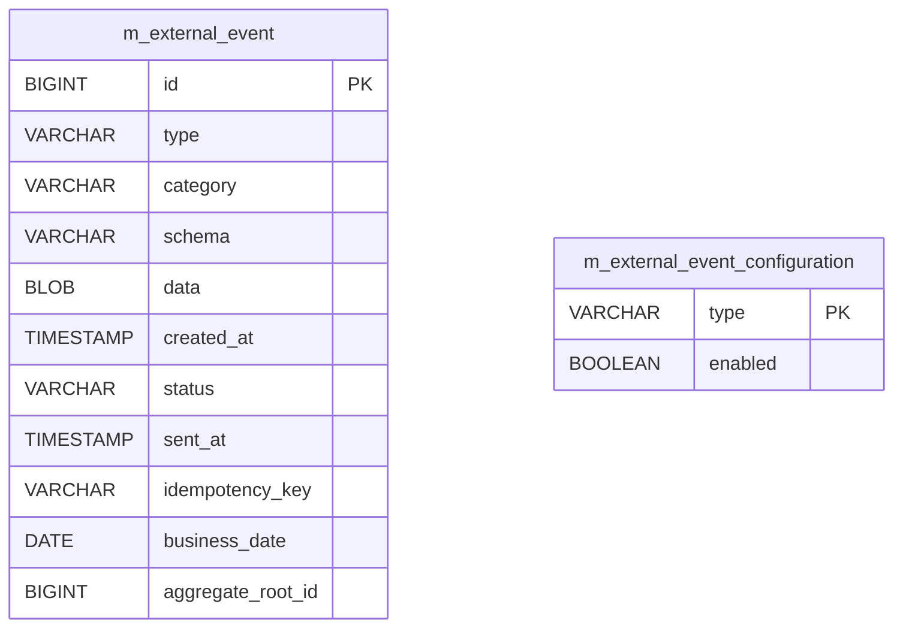
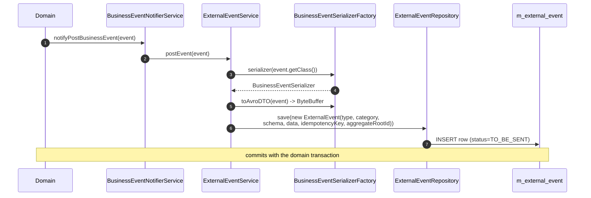
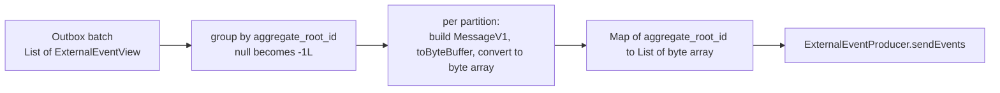
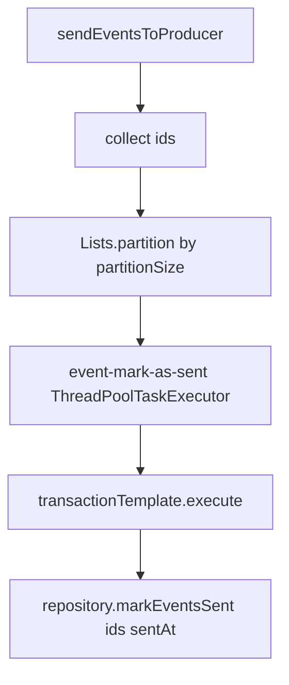
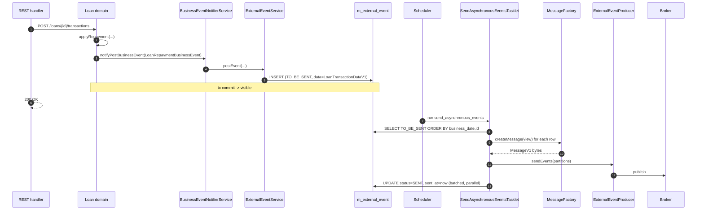

When Apache Fineract is running with external events turned on, every business event that passes the per-type configuration check is written to a database **outbox** in the same transaction as the domain change, and a background Spring Batch tasklet later picks rows up, encodes them as Avro `MessageV1` messages, and hands them to whichever `ExternalEventProducer` is wired in. This page traces that pipeline end to end — the outbox table, the write path, the tasklet, partitioning, and the retry behaviour.

All code referenced here lives in `org.apache.fineract.infrastructure.event.external` in `fineract-core`, except the concrete broker producers which are in `fineract-provider`.

## The outbox table



The table is created in `fineract-provider/.../db/changelog/tenant/parts/0043_add_external_event_table.xml` and extended by later changelogs:

- `0045_external_event_table_data_binary.xml` — switches `data` to a binary column for Avro bytes.
- `0046_external_event_table_schema_info.xml` — adds the `schema` column (FQCN of the payload schema).
- `0051_external_event_table_category_info.xml` — adds `category`.
- `0085_add_aggregate_root_id_external_events.xml` — adds `aggregate_root_id` for partitioned delivery.
- `0096_modify_created_and_sent_at_date_external_events.xml` — promotes the timestamps to `timestamp with time zone`.

The JPA entity:

```java
@Entity
@Table(name = "m_external_event")
public class ExternalEvent extends AbstractPersistableCustom<Long> {
    private String type;
    private String category;
    private String schema;
    @Basic(fetch = FetchType.LAZY) private byte[] data;
    private OffsetDateTime createdAt;
    @Enumerated(EnumType.STRING) private ExternalEventStatus status;
    private OffsetDateTime sentAt;
    private String idempotencyKey;
    private LocalDate businessDate;
    private Long aggregateRootId;
    // ctor stamps createdAt=NOW, status=TO_BE_SENT, businessDate=BusinessLocalDate
}
```

Status is a two-value enum:

```java
public enum ExternalEventStatus { TO_BE_SENT, SENT }
```

Two indexes back the hot read path: `m_external_event_status_index` on `status` so the tasklet can quickly find pending rows, and `m_external_event_business_date_index` on `business_date` so the purge job can drop old sent rows.

## Write path



`ExternalEventService.postEvent(BusinessEvent)` does five things:

1. Resolves the `BusinessEventSerializer` for the event's class via `BusinessEventSerializerFactory`. The factory matches concrete event types to serialiser beans (`LoanBusinessEventSerializer`, `ClientBusinessEventSerializer`, `SavingsBusinessEventSerializer`, …).
2. Lets the serialiser produce an Avro `SpecificRecord` payload (e.g. `LoanAccountDataV1`) from the domain aggregate, then writes that to a `ByteBuffer`.
3. Generates an idempotency key with `ExternalEventIdempotencyKeyGenerator` — a stable UUID per event instance.
4. Constructs an `ExternalEvent` (which stamps `createdAt`, `businessDate`, and `status = TO_BE_SENT` in its ctor) and saves it through `ExternalEventRepository`.
5. For `BulkBusinessEvent`, packs each child event into a `BulkMessageItemV1`, then a `BulkMessagePayloadV1`, and writes a single row.

Because the entire chain runs inside the same JPA transaction that owns the domain mutation, the outbox insert and the domain change are atomic. If the transaction rolls back, no row is left behind — the outbox can never tell a downstream consumer about a change that did not happen.

<Info>
The `data` column holds the **payload** (e.g. a `LoanAccountDataV1` Avro record), not the wire `MessageV1`. The `MessageV1` envelope is constructed later, by `MessageFactory`, when the tasklet ships the row. That separation lets the wire schema evolve without rewriting outbox rows.
</Info>

## The send tasklet

`SendAsynchronousEventsTasklet` is a Spring Batch `Tasklet` triggered by the Fineract scheduler. Its top-level loop:

```java
public RepeatStatus execute(StepContribution contrib, ChunkContext ctx) {
    try {
        if (isDownstreamChannelEnabled()) {
            List<ExternalEventView> events = getQueuedEventsBatch();
            log.debug("Queued events size: {}", events.size());
            sendEvents(events);
        }
    } catch (Exception e) {
        log.error("Error occurred while processing events: ", e);
    }
    return RepeatStatus.FINISHED;
}
```

### Downstream channel gate

```java
protected boolean isDownstreamChannelEnabled() {
    return fineractProperties.getEvents().getExternal().getProducer().getJms().isEnabled()
        || fineractProperties.getEvents().getExternal().getProducer().getKafka().isEnabled();
}
```

If neither JMS nor Kafka is enabled, the tasklet exits immediately — rows accumulate in the outbox but are never shipped. That is how the `NoopExternalEventProducer` deployment mode works in practice: the producer is wired (so listeners can still register), but the tasklet never reads.

### Reading a batch

```java
private List<ExternalEventView> getQueuedEventsBatch() {
    int readBatchSize = getBatchSize();          // from c_configuration
    Pageable batchSize = PageRequest.ofSize(readBatchSize);
    return repository.findByStatusOrderByBusinessDateAscIdAsc(
            ExternalEventStatus.TO_BE_SENT, batchSize);
}
```

The query orders by `business_date ASC, id ASC` so events from earlier business days drain first, and within a business day the insertion order is preserved. The batch size is read from `c_configuration` via `ConfigurationDomainService.retrieveExternalEventBatchSize()` — operators can tune it without restarting.

`ExternalEventView` is a read-only projection of `ExternalEvent` that the repository returns to avoid loading the binary payload and the JPA entity context for rows the tasklet may not even touch in the same transaction.

### Partitioning



`generatePartitions` groups the read batch by `aggregate_root_id` (with `-1L` for nullable cases) and then maps each group through `createMessages`, which calls `MessageFactory.createMessage(event)` to build the Avro `MessageV1` envelope, serialises it to a `ByteBuffer`, and converts that to `byte[]`. The map is what gets passed to the producer:

```java
private List<byte[]> createMessages(List<ExternalEventView> events) {
    List<byte[]> messages = new ArrayList<>();
    for (ExternalEventView event : events) {
        MessageV1 message = messageFactory.createMessage(event);
        ByteBuffer buf = message.toByteBuffer();
        messages.add(byteBufferConverter.convert(buf));
    }
    return messages;
}
```

Keeping the key as the aggregate-root id is what lets Kafka consumers see per-loan / per-account events in the order they happened — they all land on the same partition.

### Marking as sent

After the producer call returns successfully, the tasklet marks every shipped row `SENT` in batched UPDATEs. The list of ids is partitioned to stay within JDBC's parameter limit:

```java
final int partitionSize = fineractProperties.getEvents().getExternal().getPartitionSize();
List<List<Long>> partitions = Lists.partition(eventIds, partitionSize);
// 65,535-parameter limit on PreparedStatement
```

Each partition is submitted to the `EVENT_MARKS_AS_SENT_EXECUTOR_BEAN_NAME` thread pool and runs in its own transaction (`TransactionTemplate.execute`). The Fineract tenant context is re-attached on each worker via `ThreadLocalContextUtil.init(context)`.



## Retries and failure modes

The tasklet does **not** have an explicit retry loop. Instead, the design relies on re-reading unsent rows on the next run:

| Failure | What stays in DB | What happens next |
| --- | --- | --- |
| Domain transaction rolls back | nothing — no outbox row was committed | nothing to do, consumers see no event |
| Tasklet crashes before producer call | row remains `TO_BE_SENT` | next tasklet run reads it again |
| Producer throws `AcknowledgementTimeoutException` | row remains `TO_BE_SENT` | next tasklet run re-publishes (consumer must de-duplicate on `idempotencyKey`) |
| `markEventsSent` fails after a successful broker publish | row remains `TO_BE_SENT` | next tasklet run re-publishes — at-least-once delivery |
| Whole tasklet fails | exception is logged and swallowed; `RepeatStatus.FINISHED` is still returned | scheduler runs the job again on its normal cadence |

So delivery is **at-least-once**, and downstream consumers are expected to de-duplicate on the `idempotencyKey` carried in `MessageV1`. Every outbox row is given a stable key by `ExternalEventIdempotencyKeyGenerator` and that key never changes across retries.

<Tip>
Because the tasklet swallows top-level exceptions, monitoring should watch the `external_events_purge` and `send_asynchronous_events` job runs in `m_scheduler_job_run_history`, and alert on outbox rows that have been `TO_BE_SENT` for longer than a few minutes — that signals a stuck broker or a deserialisation problem in `MessageFactory`.
</Tip>

## Purging sent rows

A separate Spring Batch job (`PurgeExternalEventsConfig` / its tasklet) deletes rows where `status = SENT` and `business_date` is older than the retention window configured in `c_configuration`. The default purge job is added by `0053_add_external_events_purge_job.xml`. Without it the outbox would grow unboundedly.

## Configuration knobs

The relevant `FineractProperties` paths (mapped from `application.properties` / env vars):

```
fineract.events.external.enabled              # master switch, gates the writer
fineract.events.external.partition-size       # ids per UPDATE batch
fineract.events.external.thread-pool-core-pool-size
fineract.events.external.thread-pool-max-pool-size
fineract.events.external.thread-pool-queue-capacity

fineract.events.external.producer.jms.enabled
fineract.events.external.producer.jms.event-queue-name
fineract.events.external.producer.jms.event-topic-name
fineract.events.external.producer.jms.broker-url

fineract.events.external.producer.kafka.enabled
fineract.events.external.producer.kafka.bootstrap-servers
fineract.events.external.producer.kafka.topic.name
fineract.events.external.producer.kafka.timeout-in-seconds
```

The two `Enable…Condition` classes in `org.apache.fineract.infrastructure.event.external.config` consume those properties to gate the JMS queue and topic listeners respectively — see the [producers page](/events/event-producers) for the full conditional wiring.

## End-to-end picture



That is the full life of an external event in Apache Fineract — from a single domain method call all the way to bytes on the broker, with the database transaction as the durability boundary on one side and the consumer's idempotency check as the consistency boundary on the other.
