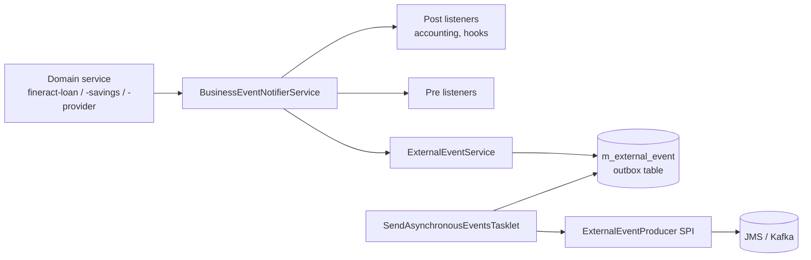
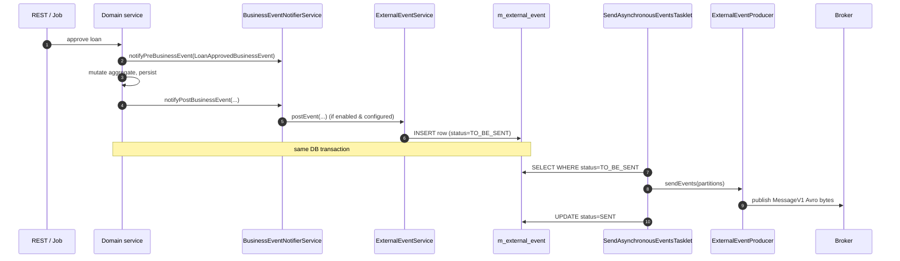
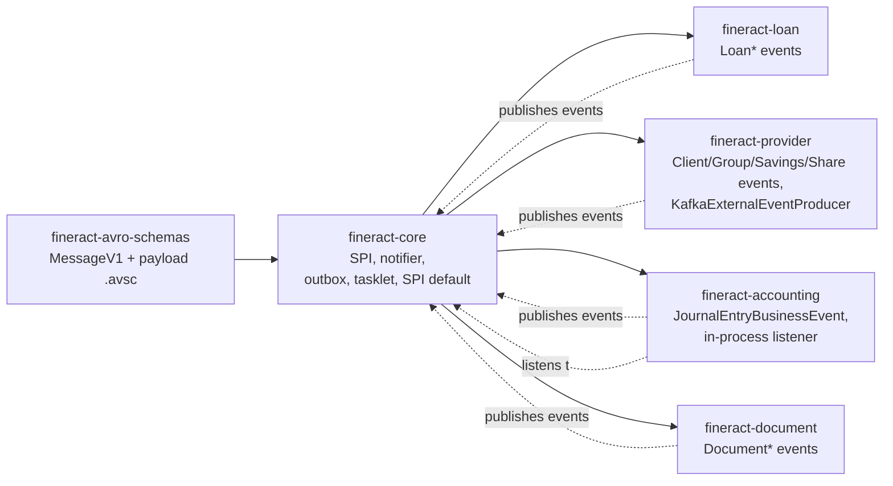

Apache Fineract turns every meaningful change in a tenant — a loan being approved, a savings deposit clearing, a client being activated — into a **business event** that other code can react to. Some reactions stay inside the same JVM (the accounting bridge, hooks, scheduled-job triggers); others have to leave the process so downstream services in a wider system-of-record landscape can hear about them. To keep both audiences happy without coupling them, Fineract runs a **dual event model**: an in-process publish/subscribe bus, and a transactional outbox that ships an Avro-encoded copy of the same event to a message broker.

This page is the entry point to that subsystem. It explains the two halves, points at the moving parts in `org.apache.fineract.infrastructure.event`, and links to deep-dive pages for each component. The code lives mainly in `fineract-core`, with the broker-specific producers in `fineract-provider` and the wire schemas in `fineract-avro-schemas`.

## The dual event model



Two collaborating mechanisms:

1. **In-process bus.** `BusinessEventNotifierService` lets domain code raise an event before and after a unit of work. Components register typed `BusinessEventListener<E>` beans at startup and are dispatched synchronously, inside the same Spring-managed transaction as the domain change. This is the channel the accounting module and various hook-handlers use.
2. **External outbox.** The same notifier — when external events are enabled and the event type is opted in via `m_external_event_configuration` — also persists an Avro-encoded copy of the event into `m_external_event`. A Spring Batch tasklet (`SendAsynchronousEventsTasklet`) picks rows up in a separate transaction and hands them to whichever `ExternalEventProducer` SPI implementation is wired in (`NoopExternalEventProducer`, the JMS adapter, or `KafkaExternalEventProducer`).

The outbox write and the domain write share one transaction; the broker send is decoupled. Combined with the idempotency key on every row, this gives the **transactional outbox pattern** as classically described — no event is "sent" until the database commit makes it visible.

## Who emits what

<CardGroup cols={2}>
  <Card title="Loan domain" icon="hand-holding-dollar">
    Approvals, disbursals, repayments, charges, transactions, schedule changes, re-aging, charge-off — everything from the Loan aggregate publishes as a `LoanBusinessEvent` subclass.
  </Card>
  <Card title="Savings, Fixed & Recurring" icon="piggy-bank">
    Application lifecycle (`SavingsCreate/Approve/Activate/Close`), deposits, withdrawals, interest posting, plus fixed-deposit and recurring-deposit account events.
  </Card>
  <Card title="Client, Group, Centre" icon="users">
    `ClientCreateBusinessEvent`, `ClientActivateBusinessEvent`, `ClientRejectBusinessEvent`, plus `GroupsCreateBusinessEvent` and `CentersCreateBusinessEvent`.
  </Card>
  <Card title="Share accounts" icon="chart-pie">
    `ShareAccountCreateBusinessEvent`, `ShareAccountApproveBusinessEvent`, dividend declarations — published from the share portfolio module.
  </Card>
  <Card title="Journal entries" icon="book">
    Accounting raises `JournalEntryBusinessEvent` and `LoanJournalEntryCreatedBusinessEvent` after posting GL movements, mainly for downstream reconciliation consumers.
  </Card>
  <Card title="Datatables" icon="table">
    Generic `DatatableEntryCreatedBusinessEvent`, `DatatableEntryUpdatedBusinessEvent`, `DatatableEntryDeletedBusinessEvent` for changes to ad-hoc data attached to entities.
  </Card>
</CardGroup>

## Anatomy of an event

Every event implements the small `BusinessEvent<T>` root interface in `fineract-core`:

```java
public interface BusinessEvent<T> {
    T get();              // the domain aggregate (Loan, Client, SavingsAccount, …)
    String getType();     // e.g. "LoanApprovedBusinessEvent"
    String getCategory(); // e.g. "Loan", "Client", "Savings"
    Long getAggregateRootId();
}
```

Concrete classes extend `AbstractBusinessEvent<T>` and almost always inherit from a category base such as `LoanBusinessEvent`, `ClientBusinessEvent`, or `SavingsAccountBusinessEvent`, which fixes `category` and the aggregate-root id once. `BulkBusinessEvent` carries a list of events sharing one aggregate root so the outbox can flush them together. The marker interface `NoExternalEvent` opts an event **out** of external publishing — it stays purely in-process.

## How a request becomes a wire message



Step (4) is where the in-process listeners fire — accounting writes journal entries, hooks invoke external webhooks, etc. Step (5) only happens when both the global flag `fineract.events.external.enabled` is true **and** an `m_external_event_configuration` row with `enabled = true` exists for the event type. Steps (6)–(9) run independently in the Spring Batch scheduler.

## Encoding: Avro `MessageV1`

The wire format is **Avro** and the envelope is `MessageV1` (defined in `fineract-avro-schemas/src/main/avro/MessageV1.avsc`):

| Field | Purpose |
| --- | --- |
| `id` | Outbox row id, monotonic per tenant |
| `source` | UUID of the Fineract instance that emitted the message |
| `type` | Event type, e.g. `LoanApprovedBusinessEvent` |
| `category` | Coarse grouping, e.g. `Loan` |
| `createdAt`, `businessDate` | ISO timestamps for system and business time |
| `tenantId` | The Fineract tenant the event belongs to |
| `idempotencyKey` | Stable per-event UUID for consumer de-duplication |
| `dataschema` | FQCN of the payload schema, e.g. `org.apache.fineract.avro.loan.v1.LoanAccountDataV1` |
| `data` | Avro-serialised payload bytes |

The payload schemas (`LoanAccountDataV1`, `ClientDataV1`, `SavingsAccountTransactionDataV1`, …) all live under `fineract-avro-schemas/src/main/avro/<domain>/v1/` and are generated into Java `SpecificRecord` classes at build time.

## The producer SPI

`ExternalEventProducer` is a one-method interface:

```java
public interface ExternalEventProducer {
    void sendEvents(Map<Long, List<byte[]>> partitions) throws AcknowledgementTimeoutException;
}
```

The map key is the aggregate-root id, which becomes the partition key on Kafka (so events for one loan stay ordered) or the JMS message group. Three ship in-tree:

- **`NoopExternalEventProducer`** — picked when neither JMS nor Kafka is enabled. Drops messages silently, useful for tests and minimal deployments.
- **JMS adapter** — activated when `fineract.events.external.producer.jms.enabled = true`. Targets ActiveMQ-style brokers; the queue or topic name selects between `EnableExternalEventQueueCondition` and `EnableExternalEventTopicCondition`.
- **`KafkaExternalEventProducer`** — activated by `fineract.events.external.producer.kafka.enabled = true`; uses a Spring `KafkaTemplate<Long, byte[]>` and publishes to the topic named in `fineract.events.external.producer.kafka.topic.name`.

## Deep dives

<CardGroup cols={2}>
  <Card title="In-process business events" icon="bolt" href="/events/business-events">
    BusinessEvent SPI, BusinessEventListener, BusinessEventNotifierService, and a catalogue of event types raised across the loan, savings, client, share, and accounting modules.
  </Card>
  <Card title="External event outbox pipeline" icon="database" href="/events/external-events-pipeline">
    The `m_external_event` table, how rows are written transactionally, and how `SendAsynchronousEventsTasklet` drains them in batches with retries.
  </Card>
  <Card title="External event producers" icon="paper-plane" href="/events/event-producers">
    The `ExternalEventProducer` SPI, the Noop default, the JMS and Kafka adapters, and the conditional configuration that swaps between them.
  </Card>
  <Card title="Avro schemas" icon="file-code" href="/events/avro-schemas">
    A tour of `fineract-avro-schemas` — the `.avsc` files for `MessageV1`, `LoanAccountDataV1`, `ClientDataV1`, savings/share/payment payloads, and how they generate into `SpecificRecord` classes.
  </Card>
  <Card title="External event configuration API" icon="sliders" href="/events/external-event-configuration">
    `ExternalEventConfigurationApiResource`, the `m_external_event_configuration` table, the GET/PUT contract, and Liquibase seed data that ships defaults disabled.
  </Card>
  <Card title="Business event catalogue" icon="list" href="/events/business-events#catalogue">
    A representative list of ~60 in-tree event types, grouped by aggregate, with the trigger that raises each one.
  </Card>
</CardGroup>

## Operational properties at a glance

<AccordionGroup>
  <Accordion title="Transactional consistency">
    `BusinessEventNotifierServiceImpl` is itself a `TransactionExecutionListener`. The outbox INSERT runs in the same JPA transaction as the domain mutation, so a successful HTTP 200 implies the event row is durably committed. If the transaction rolls back, no row is left behind.
  </Accordion>
  <Accordion title="Idempotency">
    Every outbox row stores an `idempotency_key` generated by `ExternalEventIdempotencyKeyGenerator`. The same key rides on the `MessageV1` envelope, so downstream consumers can de-duplicate on replay or producer retries.
  </Accordion>
  <Accordion title="Ordering">
    Within an aggregate root (a single loan, savings account, …) events keep insertion order. The tasklet groups by `aggregate_root_id` and the Kafka producer uses that id as the partition key, preserving per-aggregate order across consumers.
  </Accordion>
  <Accordion title="At-least-once delivery">
    The send step is best-effort. If the broker is unavailable or the row update to `SENT` fails, the same row is re-read on the next tasklet run and re-published. Consumers must treat delivery as at-least-once and de-duplicate by `idempotencyKey`.
  </Accordion>
  <Accordion title="Backpressure & cleanup">
    Batch size is read from `c_configuration.external_events_purge_batch_size`/`external_events_batch_size`. A separate purge job (`PurgeExternalEventsConfig`) removes `SENT` rows older than the configured retention window so the outbox table stays bounded.
  </Accordion>
  <Accordion title="Disable everything">
    Setting `fineract.events.external.enabled = false` is the global kill switch — the outbox is never written and the tasklet exits early. Individual event types can also be turned off via the configuration API even when the global flag is on.
  </Accordion>
</AccordionGroup>

<Info>
Throughout the rest of this section, "business event" means an in-process `BusinessEvent` instance flowing through the notifier; "external event" means a row in `m_external_event` and the `MessageV1` it becomes on the wire. The same domain action typically produces both.
</Info>

## Package map

The events subsystem sits in two top-level packages, both rooted under `org.apache.fineract.infrastructure.event`:

```
infrastructure.event
├── business/                              -- in-process bus
│   ├── BusinessEventListener.java         (SPI for consumers)
│   ├── domain/
│   │   ├── BusinessEvent.java             (root interface)
│   │   ├── AbstractBusinessEvent.java     (base implementation)
│   │   ├── BulkBusinessEvent.java         (transaction-scoped batch wrapper)
│   │   ├── NoExternalEvent.java           (marker: in-process only)
│   │   ├── datatable/                     (DatatableEntry*BusinessEvent)
│   │   ├── client/                        (Client*BusinessEvent)
│   │   ├── savings/                       (Savings*BusinessEvent)
│   │   ├── share/                         (ShareAccount*BusinessEvent)
│   │   └── loan/                          (60+ Loan*BusinessEvent classes)
│   └── service/
│       ├── BusinessEventNotifierService.java
│       ├── BusinessEventNotifierServiceImpl.java
│       ├── ExternalBusinessEventConfigurationService.java
│       └── TransactionHelper.java
└── external/                              -- outbox pipeline
    ├── api/                               (ExternalEventConfigurationApiResource)
    ├── command/                           (ExternalConfigurationsUpdateCommand)
    ├── config/                            (Enable*Condition, executors, configuration)
    ├── data/                              (request/response DTOs)
    ├── exception/                         (ExternalEventConfigurationNotFoundException)
    ├── handler/                           (ExternalEventConfigurationUpdateHandler)
    ├── jobs/                              (SendAsynchronousEventsTasklet, purge)
    ├── producer/                          (ExternalEventProducer SPI, Noop default)
    ├── repository/                        (ExternalEventRepository, entity classes)
    └── service/                           (ExternalEventService, MessageFactory, serializer)
```

The `business` half is conceptually free-standing — domain code never imports anything from `external`. The `external` half listens on the `business` notifier and is the bridge to the wire.

## Configuration at a glance

The complete event subsystem is configured by a handful of `FineractProperties` paths and one database table:

| Setting | Where | Purpose |
| --- | --- | --- |
| `fineract.events.external.enabled` | `application.properties` | Master switch — gates the entire outbox writer |
| `fineract.events.external.partition-size` | `application.properties` | Max ids per `markEventsSent` UPDATE batch |
| `fineract.events.external.producer.jms.enabled` | `application.properties` | Activates the JMS adapter |
| `fineract.events.external.producer.kafka.enabled` | `application.properties` | Activates `KafkaExternalEventProducer` |
| `m_external_event_configuration` (row) | DB / Liquibase seed | Per-event-type opt-in for outbox writes |
| `c_configuration.external_events_batch_size` | DB | Tasklet read batch size |
| `c_configuration.external_events_purge_*` | DB | Purge job batch size and retention |

The two-layer design (master switch in properties, per-type rows in the database) is deliberate: operators can flip the master switch off without database access for an emergency stop, or curate per-type rows for normal day-to-day operation.

## Module ownership



The dependency arrows point from the modules that import the SPI to `fineract-core`; the dashed arrows show the runtime publish/subscribe relationships. Notably, `fineract-accounting` is both a publisher (it raises `JournalEntryBusinessEvent`) and a consumer (it listens to loan and savings category events to post journal entries). That round trip lives entirely in-process and never touches the outbox.

<Tip>
The cleanest way to understand the subsystem on first reading is in this order: start with [business events](/events/business-events) to see what gets raised, then [the pipeline](/events/external-events-pipeline) to see what happens to the ones that opt in, then [producers](/events/event-producers) for the broker side, [Avro schemas](/events/avro-schemas) for the wire shape, and finally [configuration](/events/external-event-configuration) for the operator control plane.
</Tip>
