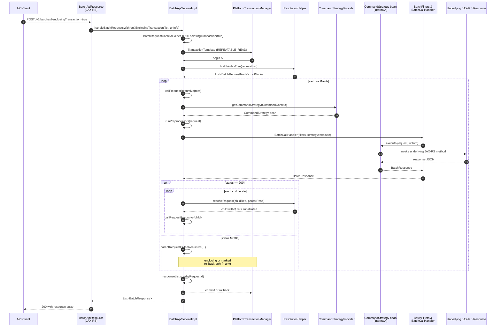

The `POST /v1/batches` endpoint is Apache Fineract's general-purpose batching mechanism: a client packages several normally-independent REST calls into one HTTP request, optionally chains them together, and chooses whether the platform should run them as a single transaction or as N independent ones. The plumbing is small and lives in `fineract-core/src/main/java/org/apache/fineract/batch/`, but it gets a lot of work done because it reuses the same JAX-RS resources that handle the corresponding individual calls.

This page traces the path through `BatchApiServiceImpl`, the strategy lookup in `CommandStrategyProvider`, and the dependency tree built by `ResolutionHelper`.

## The two top-level modes

`BatchApiServiceImpl` exposes two entry points that differ only in the `enclosingTransaction` flag:

```java
@Override
public List<BatchResponse> handleBatchRequestsWithoutEnclosingTransaction(final List<BatchRequest> requestList, UriInfo uriInfo) {
    return handleBatchRequests(requestList, uriInfo, false);
}

@Override
public List<BatchResponse> handleBatchRequestsWithEnclosingTransaction(final List<BatchRequest> requestList, final UriInfo uriInfo) {
    return handleBatchRequests(requestList, uriInfo, true);
}
```

The JAX-RS resource picks one based on the `enclosingTransaction` query parameter the client sends. The semantic difference is large:

- **Non-transactional.** Every root batch request runs in its own transaction. A failure in request 3 has no effect on requests 1 and 2 — they have already committed. Request 4 still runs.
- **Transactional.** The entire batch runs inside one Spring `TransactionTemplate`, isolation `REPEATABLE_READ`. Any failure rolls the whole thing back. Resilience4j retries the outer supplier on `ConcurrencyFailureException` so optimistic-locking conflicts can recover automatically.

`BatchRequestContextHolder.setIsEnclosingTransaction(enclosingTransaction)` propagates the choice through thread-local state so each command strategy can react if it needs to (for example by flushing the EntityManager mid-batch).

## End-to-end sequence



The same recursion runs in both modes. What differs is the transaction boundary and the failure semantics described in the next section.

## Strategy lookup and `CommandContext`

Each `BatchRequest` carries a `method` (HTTP verb) and `relativeUrl` (`v1/clients`, `v1/loans/123?command=disburse`, etc.). `BatchApiServiceImpl.executeRequest` builds a `CommandContext` from those and asks the provider for the matching strategy:

```java
final CommandStrategy commandStrategy = this.strategyProvider
        .getCommandStrategy(CommandContext.resource(request.getRelativeUrl()).method(request.getMethod()).build());
```

`CommandStrategyProvider` keeps a static `ConcurrentHashMap<CommandContext, String>` where the key is a regex-based context and the value is the Spring bean name of the strategy. Entries are registered in `init()`:

```java
commandStrategies.put(CommandContext.resource("v1\\/clients").method(POST).build(), "createClientCommandStrategy");
commandStrategies.put(CommandContext.resource("v1\\/loans").method(POST).build(), "applyLoanCommandStrategy");
commandStrategies.put(CommandContext.resource("v1\\/loans\\/" + NUMBER_REGEX + "\\?command=approve").method(POST).build(),
        "approveLoanCommandStrategy");
commandStrategies.put(CommandContext.resource("v1\\/loans\\/" + NUMBER_REGEX + "\\?command=disburse").method(POST).build(),
        "disburseLoanCommandStrategy");
```

`getCommandStrategy` first tries the exact map key, then falls back to a linear scan with `commandContext.matcher(entry.getKey())` so regex entries match. If nothing matches, the provider returns an `UnknownCommandStrategy` which produces a structured 501-style error rather than throwing.

Each strategy bean (in `fineract-provider/.../batch/command/internal/`) is a small adapter — for example `ApplyLoanCommandStrategy`, `ApproveLoanCommandStrategy`, `CreateClientCommandStrategy`. The bean's `execute(BatchRequest, UriInfo)` calls the corresponding JAX-RS resource bean directly with the batch request's body, then wraps the resource's JSON output in a `BatchResponse`.

The advantage of going through strategies rather than HTTP loopback is that there is no extra deserialization, no extra authentication round-trip, and no second filter chain — all the work happens inside the same request thread, sharing the same security context and (in transactional mode) the same Hibernate session.

## Backward compatibility

The provider also handles requests that omit the `v1/` prefix:

```java
if (isResourceVersioned(commandContext)) {
    return internalGetCommandStrategy(commandContext);
} else {
    CommandContext alteredCommandContext = CommandContext.resource("v1/" + commandContext.getResource())
            .method(commandContext.getMethod()).build();
    return internalGetCommandStrategy(alteredCommandContext);
}
```

Clients on older SDKs can send `clients` or `loans/123` and the platform still finds the right strategy.

## Dependency tree

A `BatchRequest` has a `requestId` (set by the client) and an optional `reference` (the `requestId` of its parent). `ResolutionHelper.buildNodesTree` walks the flat list and produces a forest:

```java
public List<BatchRequestNode> buildNodesTree(final List<BatchRequest> requests) {
    final List<BatchRequestNode> rootNodes = new ArrayList<>();
    for (BatchRequest request : requests) {
        if (request.getReference() == null) {
            rootNodes.add(new BatchRequestNode(request));
        } else {
            if (!addDependingRequest(request, rootNodes)) {
                throw new BatchReferenceInvalidException(request.getReference());
            }
        }
    }
    return rootNodes;
}
```

`addDependingRequest` recurses through the already-built tree and attaches the new node under whichever node owns the matching `requestId`. If no parent is found — for example because the client referenced a `requestId` that does not exist in the same payload — the helper throws `BatchReferenceInvalidException`, which the service surfaces as the very first response item with an error status.

`callRequestRecursive` then performs depth-first traversal: parent first, children after, in the order they were attached. The output is collected into `responseList`, which is sorted by `requestId` at the end so the caller sees stable ordering regardless of traversal order.

## Substituting parent results into children

A common pattern is: create a client, then immediately create a loan for the new client. The client id is not known to the caller in advance, so the batch syntax lets the child reference parent JSON via JsonPath expressions like `"$.resourceId"`. `ResolutionHelper.resolveRequest` does the substitution:

```java
public BatchRequest resolveRequest(final BatchRequest request, final BatchResponse parentResponse) {
    final ReadContext responseCtx = JsonPath.parse(parentResponse.getBody());
    String requestBody = request.getBody();
    if (requestBody != null) {
        final JsonObject jsonRequestBody = this.fromJsonHelper.parse(requestBody).getAsJsonObject();
        // walk each entry, replacing values that contain "$." with the JsonPath result against parentResponse
        ...
    }
    // also resolve $.tokens inside relativeUrl and query parameters
}
```

If the JsonPath cannot be evaluated, the helper throws `JsonPathException`. `BatchApiServiceImpl` catches it in `callRequestRecursive`:

```java
try {
    resolvedChildRequest = this.resolutionHelper.resolveRequest(childRequest, response);
    callRequestRecursive(resolvedChildRequest, childNode, responseList, uriInfo);
} catch (JsonPathException jpex) {
    responseList.add(buildOrThrowErrorResponse(jpex, childRequest));
}
```

In transactional mode `buildOrThrowErrorResponse` additionally marks the enclosing transaction rollback-only and rethrows as `BatchExecutionException`, so a bad substitution kills the whole batch instead of skipping to siblings.

## Failure cascade

When a request returns a non-200 status, every descendant is auto-failed:

```java
if (response.getStatusCode() != null && response.getStatusCode() == SC_OK) {
    // run children
} else {
    responseList.addAll(parentRequestFailedRecursive(request, requestNode, response, null));
}
```

`parentRequestFailedRecursive` emits a synthetic 409-like response for each descendant with body `"Parent request with id N was erroneous!"`. The root of the failing subtree also calls `BatchRequestContextHolder.getEnclosingTransaction().ifPresent(TransactionExecution::setRollbackOnly)`, so transactional batches abort cleanly.

## Filters and preprocessors

Two extension points wrap every request:

- **`BatchFilter` chain.** Built into a `BatchCallHandler` around the strategy's `execute`, this is analogous to a servlet filter chain but for batch requests. Filters can observe or modify both request and response — useful for cross-cutting headers, audit metadata, or feature flags.
- **`BatchRequestPreprocessor` list.** Each one returns `Either<RuntimeException, BatchRequest>`. The service folds them left-to-right; the first preprocessor that returns a `Left` short-circuits and yields an error response without ever calling the strategy.

```java
BatchCallHandler callHandler = new BatchCallHandler(this.batchFilters, commandStrategy::execute);
final BatchResponse rootResponse = callHandler.serviceCall(request, uriInfo);
```

Preprocessors are typically used to validate or rewrite the body before the strategy sees it; filters are typically used to enrich the response.

## Retry on REPEATABLE_READ conflicts

In transactional mode the service wraps the supplier with a Resilience4j `Retry`:

```java
Retry retry = retryConfigurationAssembler.getRetryConfigurationForBatchApiWithEnclosingTransaction();
Supplier<List<BatchResponse>> retryingBatch = Retry.decorateSupplier(retry, batchSupplier);
try {
    return retryingBatch.get();
} catch (TransactionException | NonTransientDataAccessException ex) {
    return buildErrorResponses(ex, responseList);
}
```

Because the isolation level is `REPEATABLE_READ`, concurrent batches that touch overlapping rows can fail with `ConcurrencyFailureException`. The retry config restarts the whole batch from scratch — clearing `responseList` on each attempt — so the final response array always corresponds to exactly one successful (or definitively failed) run.

## Step-by-step walkthrough

<Steps>
<Step title="Mode selection">
The JAX-RS resource calls `handleBatchRequestsWithEnclosingTransaction` or `handleBatchRequestsWithoutEnclosingTransaction` based on the client's `enclosingTransaction` flag. The service stores the choice in `BatchRequestContextHolder` for downstream code.
</Step>
<Step title="Tree construction">
`ResolutionHelper.buildNodesTree` produces a forest of `BatchRequestNode` instances. Every node is either a root (no `reference`) or attached to its referenced parent. Bad references abort the whole batch immediately.
</Step>
<Step title="Transaction boundary">
In transactional mode the service wraps `handleRequestNodes` in a `TransactionTemplate` configured for `REPEATABLE_READ` and decorated with a Resilience4j retry. In non-transactional mode each root request owns its own transaction inside its strategy.
</Step>
<Step title="Strategy lookup">
For each request `CommandStrategyProvider.getCommandStrategy(CommandContext)` returns the matching bean. Unknown verbs/paths fall back to `UnknownCommandStrategy`, which yields a structured error.
</Step>
<Step title="Preprocessing">
Every registered `BatchRequestPreprocessor` is given the request. A `Left` result becomes an error response without invoking the strategy; otherwise the (possibly rewritten) request continues.
</Step>
<Step title="Filter chain and strategy execution">
A `BatchCallHandler` invokes the `BatchFilter` chain around `strategy::execute`. The strategy itself calls the underlying JAX-RS resource bean and converts the JSON output into a `BatchResponse`.
</Step>
<Step title="Child dispatch on 200">
On `SC_OK` the service iterates children, calling `ResolutionHelper.resolveRequest` to substitute `$.x` tokens from the parent body, then recurses into the child node.
</Step>
<Step title="Cascade on failure">
On any non-200 the service calls `parentRequestFailedRecursive`, which emits synthetic 409 responses for every descendant and marks the enclosing transaction rollback-only if there is one.
</Step>
<Step title="Sort and return">
After the recursion completes the response list is sorted by `requestId` so the caller can deterministically index into it.
</Step>
</Steps>

<Warning>
In transactional mode, mid-batch reads see other batch writes inside the same Hibernate session. `entityManager.flush()` is called before each request when the enclosing transaction is non-read-only, but a strategy that bypasses JPA — for instance one that hits a raw JDBC datasource — will not see uncommitted in-batch state.
</Warning>

The combined effect is that the batch API is a thin coordinator: strategy classes do the real work, `ResolutionHelper` handles dependency wiring, and the service itself focuses on transactions, ordering, and failure semantics.
