Apache Fineract closes the business day for each loan via a Spring Batch job named `LOAN_COB`. The job is launched by Quartz, partitioned by loan-id ranges, executed in chunks against the loan repository, and for each loan it runs a chain of registered `LoanCOBBusinessStep` beans inside an aggregate `@Transactional` boundary. Around the per-loan work, a lock is taken and released so concurrent API writes cannot corrupt the loan mid-COB.

This page traces a full COB cycle against the current sources under `fineract-cob/`, `fineract-loan/`, and `fineract-provider/cob/`.

## What is in scope

| Layer | File / class |
| --- | --- |
| Quartz trigger | `JobName.LOAN_COB` registration in the scheduler — see `runtime/spring-boot-configuration` and `jobs/scheduler-service` |
| Job definition | `LoanCOBManagerConfiguration` (`fineract-provider/src/main/java/org/apache/fineract/cob/loan/LoanCOBManagerConfiguration.java`) |
| Partitioner | `LoanCOBPartitioner` (`fineract-provider/.../cob/loan/LoanCOBPartitioner.java`) + `CommonPartitioner.getPartitions` (`fineract-cob/.../common/CommonPartitioner.java:52`) |
| Custom-parameter step | `ResolveLoanCOBCustomJobParametersTasklet` |
| Worker step | `LoanCOBWorkerConfiguration` (`fineract-provider/.../cob/loan/LoanCOBWorkerConfiguration.java:94`) |
| Reader / Processor / Writer | `LoanItemReader`, `LoanItemProcessor`, `LoanItemWriter` |
| Business step service | `COBBusinessStepService.run` (`fineract-cob/.../COBBusinessStepService.java:29`) |
| Business step beans | implementations of `LoanCOBBusinessStep` — `ApplyChargeToOverdueLoansBusinessStep`, `LoanDelinquencyClassificationBusinessStep`, `AddPeriodicAccrualEntriesBusinessStep`, ... |
| Locking | `LoanAccountLock`, `LockingService`, `ApplyLoanLockTasklet` (L148 of `LoanCOBWorkerConfiguration`) |
| Tail steps | `StayedLockedLoansTasklet`, `UnlockProcessedLoansTasklet` (L72-86 of `LoanCOBManagerConfiguration`) |
| Job constants | `LoanCOBConstant` (`fineract-provider/.../cob/loan/LoanCOBConstant.java`) — `JOB_NAME="LOAN_COB"`, `LOAN_COB_WORKER_STEP="loanCOBWorkerStep"` |

## The job topology

`LoanCOBManagerConfiguration.loanCOBJob` (`LoanCOBManagerConfiguration.java:117`) wires four steps in series:

```java
return new JobBuilder(JobName.LOAN_COB.name(), jobRepository)
    .listener(new COBExecutionListenerRunner(applicationContext, JobName.LOAN_COB.name()))
    .start(resolveCustomJobParametersStep())   // 1. resolve parameters
    .next(loanCOBStep(partitioner))            // 2. partitioned worker (this is the body)
    .next(stayedLockedStep())                  // 3. notify on stuck locks
    .next(unlockProcessedLoansStep())          // 4. release locks
    .incrementer(new RunIdIncrementer())
    .build();
```

Step 2 is itself a **manager step** that builds partitions and dispatches them to worker channels. The worker step lives in `LoanCOBWorkerConfiguration.loanCOBWorkerStep()` (L94) and is a chunk-oriented Spring Batch step.

## End-to-end sequence

```mermaid
sequenceDiagram
    autonumber
    participant Quartz as Quartz Scheduler
    participant Scheduler as Fineract Scheduler service<br/>(JobName.LOAN_COB)
    participant Launcher as Spring Batch JobLauncher
    participant Repo as JobRepository<br/>(BATCH_JOB_INSTANCE / EXECUTION)
    participant Job as loanCOBJob<br/>LoanCOBManagerConfiguration L117
    participant Listener as COBExecutionListenerRunner
    participant S1 as Step: Resolve custom job parameters<br/>ResolveLoanCOBCustomJobParametersTasklet
    participant Mgr as Manager Step: Loan COB partition<br/>loanCOBStep L91
    participant Part as LoanCOBPartitioner<br/>partition L40
    participant Common as CommonPartitioner<br/>getPartitions L52
    participant IdSvc as RetrieveLoanIdService<br/>retrieveLoanCOBPartitions
    participant LoanDB as m_loan (read-only)
    participant Steps as COBBusinessStepService<br/>getCOBBusinessSteps
    participant Channel as outboundRequests DirectChannel
    participant Worker as Worker Step: loanCOBWorkerStep<br/>LoanCOBWorkerConfiguration L94
    participant Init as InitialisationTasklet<br/>(via CobWorkerStepListener)
    participant Lock as ApplyLoanLockTasklet<br/>+ LockingService
    participant LockDB as m_loan_account_locks
    participant Reader as LoanItemReader<br/>extends AbstractLoanItemReader
    participant Processor as LoanItemProcessor<br/>AbstractLoanItemProcessor.process L39
    participant BSS as COBBusinessStepService.run L29
    participant Step as LoanCOBBusinessStep bean<br/>(e.g. LoanDelinquencyClassification...)
    participant Writer as LoanItemWriter
    participant JPA as EntityManager / EclipseLink
    participant Bus as BusinessEventNotifierService
    participant Reset as ResetContextTasklet
    participant Stuck as StayedLockedLoansTasklet
    participant Unlock as UnlockProcessedLoansTasklet

    Quartz->>Scheduler: cron fires for LOAN_COB
    Scheduler->>Launcher: jobLauncher.run(loanCOBJob, params with COB business date)
    Launcher->>Repo: persist JobInstance + JobExecution
    Launcher->>Job: execute
    Job->>Listener: beforeJob — initialize MDC, tenant
    Job->>S1: execute "Resolve custom job parameters - Step"
    S1->>S1: ResolveLoanCOBCustomJobParametersTasklet.execute
    Note over S1: copies dashboard parameters<br/>(e.g. catch-up flag, number of days)<br/>into stepExecutionContext
    S1-->>Job: FINISHED
    Job->>Mgr: execute manager step
    Mgr->>Part: partition(gridSize)
    Part->>Steps: cobBusinessStepService.getCOBBusinessSteps(LoanCOBBusinessStep.class, LOAN_COB_JOB_NAME) L44
    Steps-->>Part: ordered set of BusinessStepNameAndOrder
    Part->>Common: getPartitions(partitionSize, cobBusinessSteps) L46
    Common->>Common: resolve businessDate + catch-up flag from stepExecution L57-59
    Common->>IdSvc: retrieveLoanCOBPartitions(numberOfDays, businessDate, isCatchUp, partitionSize) L62
    IdSvc->>LoanDB: SELECT min(id), max(id), count(*), page_no FROM m_loan WHERE ...<br/>(loans behind the COB date, not hard-locked)
    IdSvc-->>Common: List<COBPartition>
    Common-->>Part: Map<String, ExecutionContext> per partition<br/>(BUSINESS_STEPS, COB_PARAMETER, PARTITION_KEY, BUSINESS_DATE)
    Part-->>Mgr: partitions map
    loop for each partition
        Mgr->>Channel: send StepExecutionRequest via outboundRequests
        Channel->>Worker: dispatch worker step
        Worker->>Init: CobWorkerStepListener.beforeStep — InitialisationTasklet
        Init->>Init: pin AppUser + tenant + MDC for this thread
        Worker->>Lock: ApplyLoanLockTasklet.execute
        Lock->>IdSvc: getAllNonAccruedLoanIdsByMinAndMaxLoanId(min, max)
        Lock->>LockDB: INSERT m_loan_account_locks(loan_id, lock_owner=LOAN_COB_PROCESSING, version)
        Lock-->>Worker: locks taken
        loop chunk of size propertyService.getChunkSize(LOAN_COB)
            Worker->>Reader: read()
            Reader->>LoanDB: SELECT loan WHERE id IN (locked, this partition) ORDER BY id
            Reader-->>Worker: Loan aggregate
            Worker->>Processor: process(loan) L39
            Processor->>BSS: run(executionMap of stepName→beanName, loan) L29
            loop for each business step in order
                BSS->>Step: execute(loan)
                Step->>Step: e.g. classify delinquency / apply overdue charges /<br/>add periodic accrual / change due-date
                Step->>JPA: mutate loan aggregate (children persisted on flush)
                Step->>Bus: notifyPostBusinessEvent(LoanDelinquencyRangeChange...)
                Step-->>BSS: mutated Loan
            end
            BSS-->>Processor: processed Loan
            Processor->>Processor: processedLoan.setLastClosedBusinessDate(businessDate) L53
            Processor-->>Worker: Loan
        end
        Worker->>Writer: write(chunk)
        Writer->>JPA: persist + flush each loan
        JPA->>LoanDB: UPDATE m_loan SET last_closed_business_date=businessDate,<br/>summary columns, delinquency_tag, ...<br/>INSERT m_loan_transaction (accrual, charges)
        Writer-->>Worker: chunk OK
        Note over Worker: chunk is .faultTolerant().retry(Exception.class)<br/>.skip(Exception.class) — failures isolated per loan
        Worker->>Reset: CobWorkerStepListener.afterStep — ResetContextTasklet
        Reset->>Reset: ThreadLocalContextUtil.reset()
        Worker-->>Channel: partition complete
    end
    Mgr-->>Job: all partitions done
    Job->>Stuck: StayedLockedLoansTasklet.execute L74-78
    Stuck->>IdSvc: find loans still locked (failed/skipped)
    Stuck->>Bus: notifyPostBusinessEvent(LoanStayedLockedBusinessEvent) per stuck loan
    Stuck-->>Job: FINISHED
    Job->>Unlock: UnlockProcessedLoansTasklet.execute L82-86
    Unlock->>LockDB: DELETE m_loan_account_locks WHERE lock_owner=LOAN_COB_PROCESSING<br/>AND loan_id IN (processed list)
    Unlock-->>Job: FINISHED
    Job->>Listener: afterJob — reset MDC, finalize status
    Job-->>Launcher: COMPLETED / FAILED
    Launcher->>Repo: persist exit status, end time
    Launcher-->>Scheduler: result
```



## Step-by-step

### 1 — Quartz trigger and job lookup

`LOAN_COB` is registered as a Quartz job by `JobRegisterServiceImpl` at startup. When the cron expression configured on `m_scheduled_email_configuration` / `job` fires, Quartz hands off to the Fineract scheduler service, which calls Spring Batch's `JobLauncher.run(loanCOBJob, params)` with parameters that include the business date and an instance-mode flag.

The `JobName.LOAN_COB` enum is the key wired into `LoanCOBManagerConfiguration.loanCOBJob` (`LoanCOBManagerConfiguration.java:118`).

### 2 — Resolve custom job parameters

The first step is a tasklet (`resolveCustomJobParametersTasklet`, L82) that copies dashboard-set parameters (catch-up flag, number-of-days-behind, ...) from the persisted `m_custom_job_parameter` rows into the Spring Batch `StepExecutionContext`. These flow through to the partitioner and worker step via `ExecutionContext` keys defined in `COBConstant`.

### 3 — Partitioning

`LoanCOBPartitioner.partition(gridSize)` (`LoanCOBPartitioner.java:40`) asks `CommonPartitioner.getPartitions(partitionSize, cobBusinessSteps)` (`CommonPartitioner.java:52`) to do the real work:

```java
LocalDate businessDate = BusinessDateResolver.resolve(stepExecution);
boolean isCatchUp = CatchUpFlagResolver.resolve(stepExecution);
List<COBPartition> partitions = new ArrayList<>(
        retrieveIdService.retrieveLoanCOBPartitions(numberOfDays, businessDate, isCatchUp, partitionSize));
if (partitions.isEmpty()) {
    partitions.add(new COBPartition(0L, 0L, 1L, 0L));
}
return partitions.stream().collect(Collectors.toMap(l -> COBConstant.PARTITION_PREFIX + l.getPageNo(),
        l -> createExecutionContextForPartition(cobBusinessSteps, l, businessDate, isCatchUp)));
```

Each partition carries:

- `BUSINESS_STEPS` — the ordered set of `BusinessStepNameAndOrder` returned by `COBBusinessStepService.getCOBBusinessSteps(LoanCOBBusinessStep.class, "LOAN_CLOSE_OF_BUSINESS")` (`LoanCOBPartitioner.java:44`). The order comes from `m_batch_business_steps`.
- `COB_PARAMETER` — `min_loan_id` / `max_loan_id` for that partition.
- `PARTITION_KEY` and `BUSINESS_DATE_PARAMETER_NAME` and `IS_CATCH_UP_PARAMETER_NAME`.

If there are **no** loans to process the partitioner still emits one empty partition so the job graph completes — and otherwise it calls `stopJobExecution()` only when there are also no business steps (`CommonPartitioner.java:54-56, 91-99`).

### 4 — Manager → worker dispatch

`loanCOBStep` (`LoanCOBManagerConfiguration.java:91`) is built with `RemotePartitioningManagerStepBuilderFactory`:

```java
return stepBuilderFactory.get(LoanCOBConstant.LOAN_COB_PARTITIONER_STEP)
    .partitioner(LoanCOBConstant.LOAN_COB_WORKER_STEP, partitioner)
    .pollInterval(propertyService.getPollInterval(JOB_NAME))
    .outputChannel(outboundRequests)
    .build();
```

Each partition is sent as a `StepExecutionRequest` on the `outboundRequests` Spring Integration `DirectChannel`. The worker side (configured by `LoanCOBWorkerConfiguration`) listens on `inboundRequests` and executes the chunk-oriented `loanCOBWorkerStep` for that partition.

### 5 — Worker step internals

`LoanCOBWorkerConfiguration.loanCOBWorkerStep()` (`LoanCOBWorkerConfiguration.java:94`):

```java
final SimpleStepBuilder<Loan, Loan> stepBuilder = stepBuilderFactory.get("Loan COB worker - Step")
    .inputChannel(inboundRequests)
    .<Loan, Loan>chunk(propertyService.getChunkSize(JobName.LOAN_COB.name()), transactionManager)
    .reader(cobWorkerItemReader())
    .processor(cobWorkerItemProcessor())
    .writer(cobWorkerItemWriter())
    .faultTolerant()
    .retry(Exception.class)
    .retryLimit(propertyService.getRetryLimit(LoanCOBConstant.JOB_NAME))
    .skip(Exception.class)
    .skipLimit(propertyService.getChunkSize(LoanCOBConstant.JOB_NAME) + 1)
    .listener(loanItemListener())
    .listener(cobWorkerStepListener())
    .transactionManager(transactionManager);
```

The `CobWorkerStepListener` (L131) wraps three tasklets around the chunk loop:

- **Before-step** — `InitialisationTasklet` (L138) pins the system user, tenant, business date, MDC.
- **Apply-lock** — `ApplyLoanLockTasklet` (L148) inserts rows into `m_loan_account_locks` with `lock_owner = LOAN_COB_PROCESSING` for every loan that will be touched.
- **After-step** — `ResetContextTasklet` (L162) clears the thread context.

### 6 — Per-loan chain: reader → processor → writer

`LoanItemReader` (`LoanCOBWorkerConfiguration.java:167`) uses `BeforeStepLockingItemReaderHelper` (L168) to inject the locked loan-id list and read pages from `LoanRepository`.

`LoanItemProcessor` (`LoanItemProcessor.java:33`) extends `AbstractLoanItemProcessor.process(Loan)` (`AbstractLoanItemProcessor.java:39`), which:

1. delegates to `AbstractItemProcessor.process(item)` (`AbstractItemProcessor.java:53`),
2. which calls `cobBusinessStepService.run(executionMap, loan)` (`COBBusinessStepService.java:29`),
3. then `processedLoan.setLastClosedBusinessDate(getBusinessDate())` (`AbstractLoanItemProcessor.java:53`).

`COBBusinessStepService.run` walks the ordered map (key = step order, value = bean name) and applies each `LoanCOBBusinessStep` to the loan in sequence. Built-in steps include:

- `ApplyChargeToOverdueLoansBusinessStep`
- `LoanDelinquencyClassificationBusinessStep`
- `AddPeriodicAccrualEntriesBusinessStep`
- `CheckLoanRepaymentDueBusinessStep`
- `IncreaseBusinessDateForLoanBusinessStep`
- `IncreaseAgeOfOverdueDaysBusinessStep`
- `ReProcessLoanTransactionsBusinessStep`

Each step mutates the loan aggregate and may publish business events (`LoanDelinquencyRangeChangeBusinessEvent`, `LoanAccountSnapshotBusinessEvent`, ...). Because the whole chunk runs inside a single `transactionManager`-managed transaction, all changes commit atomically per chunk.

`LoanItemWriter` flushes the chunk: JPA dirty-checking emits the appropriate `UPDATE m_loan`, `INSERT m_loan_transaction` (accruals, overdue charges), `UPDATE m_loan_arrears_aging` SQL.

### 7 — Fault tolerance

`.faultTolerant().retry(Exception.class).skip(Exception.class)` (L100-103) means that:

- if a loan throws on first pass, Spring Batch retries up to `retryLimit` times,
- on persistent failure the loan is **skipped** — the chunk continues, the chunk's transaction still commits for the others, and the skipped loan keeps its `LOAN_COB_PROCESSING` lock,
- the listener `ChunkProcessingLoanItemListener` (L143) records the skipped loan via `loanLockingService` so the tail tasklet can report it.

### 8 — Stuck-lock detection and unlock

After the worker step finishes:

- `StayedLockedLoansTasklet` (`LoanCOBManagerConfiguration.java:104`) reads which loans are still locked with `LOAN_COB_PROCESSING` (i.e. failed/skipped) and fires `LoanStayedLockedBusinessEvent` per loan for operator alerting,
- `UnlockProcessedLoansTasklet` (`LoanCOBManagerConfiguration.java:111`) deletes the lock rows for loans that completed successfully via `loanAccountLockService` — see also `cob/loan-account-lock`.

### 9 — Job-level listener

`COBExecutionListenerRunner` (registered at L121 via `.listener(...)`) runs before/after the job, taking care of MDC initialization, the system `AppUser` context, and instance-mode awareness.

## Catch-up runs and number-of-days-behind

`LoanCOBPartitioner` is created `@StepScope` (`LoanCOBManagerConfiguration.java:84`) so it gets a fresh `StepExecution` per run, and it is constructed with `LoanCOBConstant.NUMBER_OF_DAYS_BEHIND` as the cap on how many business dates the job will fast-forward. When the configured COB date is more than one day behind the system date, `isCatchUp` is `true` and `CommonPartitioner` honors this flag when querying for loan partitions — see `cob/cob-catch-up` for the catch-up semantics.

## What runs in parallel

The job has two layers of parallelism:

1. **Partition level** — manager fans out N partitions via `outboundRequests`; with remote partitioning these can run on different workers. In a single-node deployment both sides resolve in the same JVM.
2. **Chunk level inside a partition** — `cobTaskExecutor()` (L116) creates a `ThreadPoolTaskExecutor` if `threadPoolMaxPoolSize > 1`; otherwise a `SyncTaskExecutor` is used. Loans inside a partition are processed in parallel by `corePoolSize` threads, each with their own `ContextAwareTaskDecorator` to carry the tenant/MDC.

## Related pages

- [Inline COB flow](/flows/inline-cob-flow) — how the same partitioner+worker pieces are reused to catch up a single loan at API time.
- `cob/loan-account-lock` — the `m_loan_account_locks` table and lock owners.
- `cob/business-step-engine` — how `m_batch_business_steps` drives the ordered set of steps.
- `cob/cob-catch-up` — how multi-day arrears are handled.
- `jobs/scheduler-service` and `jobs/job-registry` — the Quartz side.
