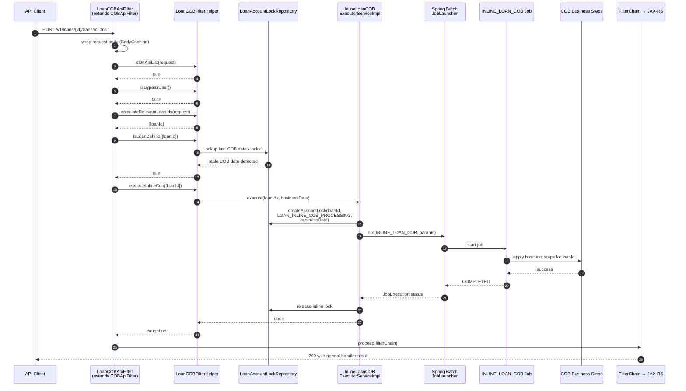

Apache Fineract runs a daily Close-of-Business (COB) batch job that walks every active loan and applies day-end business steps — accrual, fee posting, delinquency aging, charge-off evaluation, and so on. Most of the time COB runs cleanly overnight, but in real deployments operators face two awkward situations: the nightly batch was skipped or failed, or a specific loan was held by an account lock and could not be processed. Either way, when an API client later arrives with a write request against that loan, the platform must not act on stale state.

The **inline COB** subsystem solves that by intercepting incoming requests at the servlet filter layer, detecting which loans they target, and — if any of those loans are behind on COB — running just-in-time COB for them before the original request is allowed to proceed. This page walks the path through the source.

The two anchor classes:

- **`LoanCOBApiFilter`** (and its base `COBApiFilter`) — the servlet filter that decides whether to trigger inline COB.
- **`InlineLoanCOBExecutorServiceImpl`** — the service that locks the loan, launches the Spring Batch job in-process, and reports the result back to the filter.

Both live in the `fineract-provider` module and are activated only when `LoanCOBEnabledCondition` is true.

## Why inline COB exists

The nightly COB job is the canonical place to advance a loan's business date. Skipping it leaves a loan in a state where:

- Accrual is missing for one or more days.
- Delinquency buckets and charge-off thresholds are not up-to-date.
- A repayment or disbursement received "today" would be applied against yesterday's view of the loan, producing wrong interest and wrong allocations.

Inline COB makes this safe by guaranteeing that any API call that *uses* a loan first brings that loan to today. The cost — a few extra milliseconds on the maker's API call — is acceptable in exchange for not silently writing against stale ledgers.

## The filter contract

`LoanCOBApiFilter` is a thin specialization:

```java
@Conditional(LoanCOBEnabledCondition.class)
public class LoanCOBApiFilter extends COBApiFilter {

    public LoanCOBApiFilter(LoanCOBFilterHelper helper) {
        super(helper);
    }
}
```

The real work lives in the abstract `COBApiFilter`. Its `doFilterInternal` is short enough to reason about end-to-end:

```java
request = new BodyCachingHttpServletRequestWrapper(request);

if (!helper.isOnApiList((BodyCachingHttpServletRequestWrapper) request)) {
    proceed(filterChain, request, response);
} else {
    try {
        boolean bypassUser = helper.isBypassUser();
        if (bypassUser) {
            proceed(filterChain, request, response);
        } else {
            try {
                List<Long> loanIds = helper.calculateRelevantLoanIds((BodyCachingHttpServletRequestWrapper) request);
                if (!loanIds.isEmpty() && helper.isLoanBehind(loanIds)) {
                    helper.executeInlineCob(loanIds);
                }
                proceed(filterChain, request, response);
            } catch (LoanIdsHardLockedException e) {
                Reject.reject(e.getLoanIdFromRequest(), HttpStatus.SC_CONFLICT).toServletResponse(response);
            }
        }
    } catch (UnAuthenticatedUserException e) {
        throw new AuthenticationCredentialsNotFoundException("Not Authenticated", e);
    }
}
```

Four things are happening:

1. The body is wrapped in `BodyCachingHttpServletRequestWrapper` because the filter may need to read the JSON to extract loan IDs, and the downstream JAX-RS resource must also be able to read the same body.
2. The filter is opt-in per URL: `helper.isOnApiList(...)` returns false for read-only or unrelated endpoints, in which case the request passes through untouched.
3. Certain users — for example the COB job runner itself, or admins flagged as bypass — are allowed to skip the catch-up entirely via `helper.isBypassUser()`.
4. When `LoanIdsHardLockedException` is thrown, the filter responds with `409 Conflict` and a body produced by `ApiGlobalErrorResponse.loanIsLocked(loanId).toJson()`. That hard-lock case is the one the inline run could not resolve — typically because the loan is still being processed by another worker.

## End-to-end sequence



If a competing worker is already holding the loan when the filter tries to lock it, the helper throws `LoanIdsHardLockedException` and the filter returns `409` so the client can retry rather than racing against the other process.

## Detecting "behind"

`isLoanBehind(loanIds)` is the gate. It compares the platform's current business date with the last COB date recorded for each loan in scope. The check is intentionally cheap — a single indexed lookup — because every write request that names a loan goes through it. Only when at least one loan is actually behind does the filter pay the cost of taking a lock and starting the batch job.

The set of "behind" cases includes:

- The loan was account-locked overnight and skipped by the regular COB worker.
- The COB scheduler was off or paused.
- The loan was recently disbursed and its last-processed date is still empty.
- The clock advanced past midnight on a system that does not run a real overnight job (a common dev or single-tenant production setup).

## The executor

`InlineLoanCOBExecutorServiceImpl` extends a shared `InlineCommonLockableCOBExecutorService<LoanAccountLock>` and supplies the loan-specific lock factory:

```java
@Service
@Conditional(LoanCOBEnabledCondition.class)
public class InlineLoanCOBExecutorServiceImpl extends InlineCommonLockableCOBExecutorService<LoanAccountLock> {

    public InlineLoanCOBExecutorServiceImpl(LoanAccountLockRepository loanAccountLockRepository,
            InlineLoanCOBExecutionDataParser dataParser, JobLauncher jobLauncher, JobLocator jobLocator,
            JobExplorer jobExplorer, TransactionTemplate transactionTemplate,
            CustomJobParameterRepository customJobParameterRepository, PlatformSecurityContext context,
            RetrieveLoanIdService retrieveIdService, FineractProperties fineractProperties) {
        super(loanAccountLockRepository, dataParser, jobLauncher, jobLocator, jobExplorer, transactionTemplate,
                customJobParameterRepository, context, retrieveIdService, fineractProperties);
    }

    @Override
    public LoanAccountLock createAccountLock(Long loanId, LockOwner loanInlineCobProcessing, LocalDate businessDate) {
        return new LoanAccountLock(loanId, LockOwner.LOAN_INLINE_COB_PROCESSING, businessDate);
    }
}
```

The collaborators describe the full machinery:

- `LoanAccountLockRepository` is the source of truth for which loans are currently held. Every inline run grabs a `LOAN_INLINE_COB_PROCESSING` lock for its loan IDs to make sure a parallel nightly batch does not touch the same row.
- `JobLauncher` and `JobLocator` come from Spring Batch — inline COB really does run the same job (the `INLINE_LOAN_COB` variant) the scheduler would launch, just with a tiny loan-id list as parameters.
- `TransactionTemplate` is used so the lock acquisition is committed before the long job starts, and so the in-process job sees a stable view.
- `CustomJobParameterRepository` lets the executor pass the list of loan IDs and target business date into the job as serialized parameters.

The lock owner enum value `LOAN_INLINE_COB_PROCESSING` is intentionally distinct from the nightly worker's owner. That way the conflict detection in `isLoanBehind` / `LoanIdsHardLockedException` can correctly attribute who holds the row.

## Step-by-step walkthrough

<Steps>
<Step title="Request enters the filter chain">
A write call against `/v1/loans/...`, `/v1/loans/{id}/charges`, `/v1/loans/{id}/transactions`, or related URLs is matched by `helper.isOnApiList(request)`. Read-only and unrelated endpoints bypass inline COB entirely.
</Step>

<Step title="Body is cached for re-reading">
The filter wraps the request in `BodyCachingHttpServletRequestWrapper` because both `calculateRelevantLoanIds` and the downstream JAX-RS resource need to read the JSON body. Without caching, the input stream would be drained by the filter.
</Step>

<Step title="Bypass check">
`helper.isBypassUser()` lets the COB job runner, system accounts, and administrator-flagged users skip inline COB so they can perform corrective work without retriggering it on every call.
</Step>

<Step title="Loan IDs extracted">
`helper.calculateRelevantLoanIds(request)` resolves the loan IDs implicated by the call: path params, query params, body fields, and (for some endpoints) joins through clients or groups to all loans owned by the resource.
</Step>

<Step title="Behind check">
`helper.isLoanBehind(loanIds)` compares each loan's last COB date to the platform's current business date. If every loan is up-to-date, the filter immediately proceeds without taking any locks.
</Step>

<Step title="Inline lock and job launch">
For each behind loan, `InlineLoanCOBExecutorServiceImpl.createAccountLock(loanId, LOAN_INLINE_COB_PROCESSING, businessDate)` records the lock. The executor then assembles job parameters from `CustomJobParameterRepository` and calls `JobLauncher.run(INLINE_LOAN_COB, parameters)`.
</Step>

<Step title="Business steps execute">
The Spring Batch job runs the same business-step pipeline used overnight — accrual, fee posting, delinquency aging, charge-off evaluation, etc. — but scoped to just the loan IDs supplied as parameters.
</Step>

<Step title="Lock release and proceed">
On success the inline lock is released and control returns to the filter, which calls `filterChain.doFilter(...)`. The original API request now executes against a fully up-to-date loan.
</Step>

<Step title="Hard lock → 409">
If the loan is already held by another worker, `LoanIdsHardLockedException` propagates out of `executeInlineCob`. The filter catches it and writes `Reject.reject(loanId, HttpStatus.SC_CONFLICT)` as the response, with a structured error body. The client should back off and retry.
</Step>
</Steps>

## Bypass users and body size

Apache Fineract exposes an `application.properties` knob that limits how large a body the filter is willing to peek into:

```
fineract.api.body-item-size-limit.inline-loan-cob=${FINERACT_API_REQUEST_BODY_SIZE_LIMIT_INLINE_COB:1000}
```

This bounds how many entries the filter will pull out of a batch-style request when computing the loan-id list. It exists because the filter sits in front of every relevant write — even very large `POST /v1/batches` calls — and unbounded parsing would defeat the cost trade-off inline COB depends on.

The bypass-user path is the other half of the contract. The COB worker itself, when it later runs the nightly job, should not be re-triggered by the filter for the loans it is about to process. Bypass-user matching is the helper's responsibility, but the practical effect is that system identities can short-circuit the gate.

<Warning>
Inline COB launches a real Spring Batch job in the request thread. For pathological payloads that name hundreds of loans, that can lengthen the response significantly. The body-size limit and the per-tenant pool sizing in `fineract.tenant.config` are the levers operators tune to keep tail latency under control.
</Warning>

## Authentication errors

The outer try/catch in `doFilterInternal` translates `UnAuthenticatedUserException` into Spring Security's `AuthenticationCredentialsNotFoundException`. This keeps the inline COB filter aligned with the standard security failure model: a request that is not authenticated should never reach the loan-resolution step, and if it slips through, it must produce the platform's normal 401 path rather than a confusing inline-COB error.

The net effect is that inline COB is invisible on the happy path — clients never see it — and explicit on the error path: a `409` with a locked-loan body if the catch-up could not run, or a normal authentication error if the request never had a chance.

## How clients should respond to a 409

The `409 Conflict` body emitted by the filter is the structured `loanIsLocked` error built by `ApiGlobalErrorResponse.loanIsLocked(loanId).toJson()`. It identifies the specific loan that could not be advanced. Recommended client behavior:

1. **Backoff and retry.** The lock is held by another worker — usually the nightly COB processing the same loan, or a competing inline run kicked off by a different request. A short exponential backoff almost always recovers within a few hundred milliseconds.
2. **Do not silently fall through.** Treating the `409` as a generic failure and re-issuing the request without backoff just keeps colliding with the same lock. Clients should respect the conflict status.
3. **Surface the loan id.** The body identifies which loan is locked. When the originating request named multiple loans (a batch, for example), this is the only signal that tells the caller which one is the blocker.

## Interaction with the nightly COB job

Inline COB and the nightly `LOAN_COB` Spring Batch job are designed to coexist. Three properties of the design keep them honest:

- **Distinct lock owners.** The inline path uses `LockOwner.LOAN_INLINE_COB_PROCESSING`; the nightly worker uses its own owner. Whichever holds the lock for a given loan is visible in `m_loan_account_locks`, so operators can see who is responsible at any moment.
- **Bypass for the COB user.** The bypass check in the filter prevents the nightly worker from triggering inline COB recursively on loans it is itself about to process.
- **Same business steps.** Both paths execute the same business-step pipeline, so a loan brought to today by inline COB is indistinguishable from one brought to today by the overnight run.

## Where to look when inline COB misbehaves

A few quick checks cover most operational issues:

- **`m_loan_account_locks` table.** Rows here indicate which loans are currently held and by which owner. Stale entries are usually the result of a crashed inline run; the lock TTL or a manual cleanup script reconciles them.
- **`m_loan` last-COB column.** When the value lags the platform business date for a loan that is being actively used, inline COB will run on every request that names it — a clear signal that the nightly job is failing for this loan and an alert worth surfacing.
- **Spring Batch job history.** `INLINE_LOAN_COB` job executions show up in the Spring Batch metadata tables. Looking at status, step exit messages, and parameters is the fastest way to determine whether the inline run completed or fell over.

Together these give operators enough visibility to keep inline COB doing what it was designed for: an invisible safety net, not a routine code path.
