Disbursing a loan in Apache Fineract is the canonical example of a write command: it touches the loan aggregate, generates a `LoanTransaction`, regenerates the repayment schedule, posts journal entries through the accounting bridge, may trigger an auto down-payment, and fires multiple `BusinessEvent`s. This page traces the call graph end-to-end against the code in `fineract-provider/`, `fineract-loan/`, and `fineract-core/`.

The endpoint exercised is `POST /api/v1/loans/{loanId}?command=disburse`. The body carries `actualDisbursementDate`, `transactionAmount`, optional `paymentTypeId`, `externalId`, and so on — all of which the handler parses via `JsonCommand`.

## Files involved

| Role | File |
| --- | --- |
| JAX-RS resource | `fineract-provider/src/main/java/org/apache/fineract/portfolio/loanaccount/api/LoansApiResource.java` (and `LoanTransactionsApiResource` for the transactions namespace) |
| Wrapper builder | `fineract-core/src/main/java/org/apache/fineract/commands/service/CommandWrapperBuilder.java:1541` |
| Dispatcher | `fineract-core/.../SynchronousCommandProcessingService.java:91` |
| Handler | `fineract-loan/src/main/java/org/apache/fineract/portfolio/loanaccount/handler/DisburseLoanCommandHandler.java:35` |
| Write service | `fineract-provider/src/main/java/org/apache/fineract/portfolio/loanaccount/service/LoanWritePlatformServiceJpaRepositoryImpl.java:324` |
| Aggregate assembler | `LoanAssembler.assembleFrom(loanId)` |
| Journal entry bridge | `LoanJournalEntryPoster#postJournalEntriesForLoanTransaction` |
| Down-payment service | `LoanDownPaymentHandlerService#handleDownPayment` |
| Business events | `BusinessEventNotifierService` + `LoanDisbursalBusinessEvent`, `LoanDisbursalTransactionBusinessEvent`, `LoanBalanceChangedBusinessEvent` |

## The handler

`DisburseLoanCommandHandler` is a thin Spring bean carrying `@CommandType(entity = "LOAN", action = "DISBURSE")`:

```java
@Service
@RequiredArgsConstructor
@CommandType(entity = "LOAN", action = "DISBURSE")
public class DisburseLoanCommandHandler implements NewCommandSourceHandler {
    private final LoanWritePlatformService writePlatformService;
    private final DataIntegrityErrorHandler dataIntegrityErrorHandler;

    @Transactional
    @Override
    public CommandProcessingResult processCommand(final JsonCommand command) {
        try {
            return this.writePlatformService.disburseLoan(command.entityId(), command, false);
        } catch (final JpaSystemException | DataIntegrityViolationException dve) {
            dataIntegrityErrorHandler.handleDataIntegrityIssues(command, dve.getMostSpecificCause(), dve, "loan.disbursement",
                    "Disbursement");
            return CommandProcessingResult.empty();
        }
    }
}
```
*(`fineract-loan/.../handler/DisburseLoanCommandHandler.java:33-51`)*

It delegates everything to `LoanWritePlatformService.disburseLoan(loanId, command, isAccountTransfer)`, implemented by `LoanWritePlatformServiceJpaRepositoryImpl`.

## End-to-end sequence

```mermaid
sequenceDiagram
    autonumber
    participant Client
    participant Resource as LoansApiResource<br/>disburseLoanApplication
    participant Builder as CommandWrapperBuilder<br/>disburseLoanApplication L1541
    participant Portfolio as PortfolioCommandSourceWritePlatformServiceImpl<br/>logCommandSource L57
    participant Sync as SynchronousCommandProcessingService<br/>executeCommand L91
    participant CSS as CommandSourceService
    participant DB as m_portfolio_command_source
    participant Provider as CommandHandlerProvider<br/>getHandler L88
    participant Handler as DisburseLoanCommandHandler<br/>processCommand L41
    participant Write as LoanWritePlatformServiceJpaRepositoryImpl<br/>disburseLoan L324
    participant Val as LoanTransactionValidator
    participant Assembler as LoanAssembler
    participant JPA as EntityManager
    participant LoanDB as m_loan / m_loan_repayment_schedule / m_loan_transaction
    participant PayDet as PaymentDetailWritePlatformService
    participant Cashier as CashierTransactionDataValidator
    participant Disb as LoanDisbursementService<br/>adjustDisburseAmount
    participant Schedule as LoanScheduleService<br/>regenerateRepaymentSchedule
    participant Accrual as LoanAccrualsProcessingService
    participant DownPay as LoanDownPaymentHandlerService<br/>handleDownPayment
    participant Bus as BusinessEventNotifierService
    participant GL as LoanJournalEntryPoster
    participant GLDB as acc_gl_journal_entry
    participant Domain as LoanAccountDomainService<br/>setLoanDelinquencyTag
    participant Hook as Hook / Webhook publisher

    Client->>Resource: POST /api/v1/loans/{loanId}?command=disburse<br/>body { actualDisbursementDate, transactionAmount, ... }
    Resource->>Builder: CommandWrapperBuilder.withJson(body).disburseLoanApplication(loanId)
    Builder->>Builder: actionName=DISBURSE, entityName=LOAN, loanId=loanId L1541
    Resource->>Portfolio: logCommandSource(commandRequest)
    Portfolio->>Portfolio: authenticatedUser().validateHasPermissionTo("DISBURSE_LOAN") L69
    Portfolio->>Portfolio: build JsonCommand
    Portfolio->>Sync: executeCommand(wrapper, command, false)
    Sync->>CSS: saveInitialNewTransaction(...) L121
    CSS->>DB: INSERT m_portfolio_command_source(status=UNDER_PROCESSING)
    Sync->>Provider: findCommandHandler({entity=LOAN, action=DISBURSE})
    Provider-->>Sync: DisburseLoanCommandHandler bean
    Sync->>CSS: processCommand(handler, command, source, user, false)
    CSS->>Handler: processCommand(command) L41
    Handler->>Write: disburseLoan(loanId, command, false) L44
    Write->>Val: loanTransactionValidator.validateDisbursement(command, false, loanId) L326
    Write->>Assembler: loanAssembler.assembleFrom(loanId) L328
    Assembler->>JPA: SELECT loan + children
    JPA->>LoanDB: SELECT m_loan, m_loan_repayment_schedule, m_loan_transaction, m_loan_charge
    JPA-->>Assembler: Loan aggregate
    alt loanProduct.isDisallowExpectedDisbursements()
        Write->>Write: synthesize artificial LoanDisbursementDetails<br/>(no expected disbursal record found) L334-345
    end
    Write->>Write: extract actualDisbursementDate, adjustRepaymentDate L347-350
    Write->>Write: loanUtilService.buildScheduleGeneratorDTO(loan, null) L356
    Write->>Bus: notifyPreBusinessEvent(new LoanDisbursalBusinessEvent(loan)) L355
    Bus->>Bus: invoke pre-listeners (lifecycle hooks, validation)
    Write->>PayDet: paymentDetailWritePlatformService.createAndPersistPaymentDetail(command, changes) L361
    PayDet->>JPA: persist PaymentDetail
    alt paymentType is cash
        Write->>Cashier: validateOnLoanDisbursal(currentUser, currency, amount) L363
    end
    Write->>Write: updateLoanCounters(loan, actualDisbursementDate) L370
    Write->>Disb: loanDisbursementService.adjustDisburseAmount(loan, command, actualDisbursementDate) L386
    Disb-->>Write: Money disburseAmount
    alt loan.isTopup() && clientId != null
        Write->>Val: validateTopupLoan(loan, actualDisbursementDate)
        Write->>Write: disburseLoanToLoan(loan, command, loanOutstanding) — apply against prior loan
    end
    alt isAccountTransfer (disburseToSavings)
        Write->>Write: disburseLoanToSavings(loan, command, amountToDisburse, paymentDetail) L398
    else regular cash/transfer disburse
        Write->>Write: build LoanTransaction.disbursement(loan, amountToDisburse, paymentDetail, date, txnExternalId, overpaid) L401
        Write->>JPA: loanTransactionRepository.saveAndFlush(disbursementTransaction) L405
        JPA->>LoanDB: INSERT m_loan_transaction (type=1, principal=amount)
        Write->>GL: journalEntryPoster.postJournalEntriesForLoanTransaction(disbursementTransaction, false, false) L406
        GL->>GLDB: INSERT acc_gl_journal_entry (Dr Loan Portfolio / Cr Fund source)
    end
    Write->>Schedule: regenerateScheduleOnDisbursement(command, loan, recalc, dto, nextRepay, rescheduled) L413
    Schedule->>JPA: update m_loan_repayment_schedule rows
    JPA->>LoanDB: UPDATE m_loan_repayment_schedule SET principal_amount, interest_amount, ...
    alt interest recalculation enabled or down payment
        Write->>Write: createAndSaveLoanScheduleArchive(loan, scheduleGeneratorDTO) L417
    end
    Write->>Write: disburseLoan(command, isPaymentTypeApplicableForDisbursementCharge, paymentDetail, loan, ...) L419
    Note over Write: applies due-at-disbursement charges,<br/>updates summary, persists changes
    Write->>Accrual: loanAccrualsProcessingService.reprocessExistingAccruals(loan, true) L423
    alt interest bearing & first installment before today
        Write->>Accrual: processIncomePostingAndAccruals(loan, true) L428
    end
    alt isAutoRepaymentForDownPaymentEnabled
        alt linked savings + standing instruction at disbursement
            Write->>Write: accountTransfersWritePlatformService.transferFunds(downPayment AccountTransferDTO) L455
        else
            Write->>DownPay: handleDownPayment(scheduleGeneratorDTO, command, disbursementTransaction, loan) L458
            DownPay->>JPA: create LoanTransaction.downPayment
            DownPay->>GL: post GL entries for down payment
        end
        Write->>Accrual: reprocessExistingAccruals / processIncomePostingAndAccruals L459-461
    end
    Write->>Write: loanBalanceService.updateLoanSummaryDerivedFields(loan) (after charge transfers) L495
    Write->>JPA: saveAndFlushLoanWithDataIntegrityViolationChecks(loan) L466
    JPA->>LoanDB: UPDATE m_loan SET principal_outstanding, total_repayment, ...
    Write->>Write: updateRecurringCalendarDatesForInterestRecalculation(loan) L504
    Write->>Accrual: processAccrualsOnInterestRecalculation(loan, ..., true) L505
    Write->>Domain: loanAccountDomainService.setLoanDelinquencyTag(loan, today) L507
    Write->>Bus: notifyPostBusinessEvent(new LoanDisbursalBusinessEvent(loan)) L516
    Bus->>Bus: post-listeners + ExternalEvent row queued
    Write->>Bus: notifyPostBusinessEvent(new LoanDisbursalTransactionBusinessEvent(txn, flags)) L527
    Write->>Bus: notifyPostBusinessEvent(new LoanBalanceChangedBusinessEvent(loan)) L531
    Write-->>Handler: CommandProcessingResult (entityId=loanId, subEntityId=disbursalTxnId)
    Handler-->>CSS: result
    CSS-->>Sync: result (maker-checker pass-through)
    Sync->>CSS: saveResultInTransaction(commandSource) L190
    CSS->>DB: UPDATE m_portfolio_command_source SET status=PROCESSED, result_status_code=200, result=JSON, resource_id=loanId, sub_resource_id=txnId
    Sync->>Hook: publishHookEvent("LOAN", "DISBURSE", command, result) L217
    Sync-->>Portfolio: result
    Portfolio-->>Resource: result
    Resource-->>Client: 200 OK + { resourceId, subResourceId, changes, ... }
```



## Step-by-step

### 1 — Wrapper

`CommandWrapperBuilder.disburseLoanApplication(loanId)` (`fineract-core/.../CommandWrapperBuilder.java:1541`) sets:

```java
this.actionName = ACTION_DISBURSE;
this.entityName = ENTITY_LOAN;
this.entityId = loanId;
this.loanId = loanId;
this.href = "/loans/" + loanId;
```

That's what `CommandHandlerProvider.getHandler("LOAN", "DISBURSE")` will resolve to `DisburseLoanCommandHandler` via the registry built in `CommandHandlerProvider.initializeHandlerRegistry` (`CommandHandlerProvider.java:58`).

### 2 — Dispatcher

`SynchronousCommandProcessingService.executeCommand` runs the [command pipeline](/flows/command-execution-flow) — idempotency lookup, initial `CommandSource` row, handler lookup, transactional invocation, result persistence, hook publication. We won't repeat it here; everything between the resource and `DisburseLoanCommandHandler` is the same as for any other command.

### 3 — Handler delegates to the write service

`DisburseLoanCommandHandler.processCommand` calls `this.writePlatformService.disburseLoan(command.entityId(), command, false)`. The boolean is `isAccountTransfer`, which is `false` for a direct cash disburse and `true` when the API path is `disburseToSavings`.

### 4 — `disburseLoan` in `LoanWritePlatformServiceJpaRepositoryImpl`

This is where the business logic lives. The method is marked `@Transactional` (`LoanWritePlatformServiceJpaRepositoryImpl.java:323`) and runs entirely inside the surrounding `@Transactional` boundary of the handler.

Key steps in order:

1. **Validation** — `loanTransactionValidator.validateDisbursement(command, isAccountTransfer, loanId)` (L326).
2. **Load aggregate** — `loanAssembler.assembleFrom(loanId)` (L328) eagerly loads the `Loan`, `LoanRepaymentScheduleInstallment`s, `LoanTransaction`s, `LoanCharge`s, and `LoanDisbursementDetails`.
3. **Synthesize disbursal record** — if the loan product has `isDisallowExpectedDisbursements()` and no pending `LoanDisbursementDetails` exists, the write service builds an "artificial" one (L334-345) so multi-disbursal code paths still apply.
4. **Read parameters** — `actualDisbursementDate`, `adjustRepaymentDate`, `netDisbursalAmount` (L347-352).
5. **Pre-business-event** — `businessEventNotifierService.notifyPreBusinessEvent(new LoanDisbursalBusinessEvent(loan))` (L355) — synchronous pre-listeners run.
6. **Payment detail** — `paymentDetailWritePlatformService.createAndPersistPaymentDetail(command, changes)` (L361) returns a `PaymentDetail` if the command carried payment metadata. If the payment type is cash, `cashierTransactionDataValidator.validateOnLoanDisbursal` runs (L363).
7. **Amount adjustment** — `loanDisbursementService.adjustDisburseAmount(loan, command, actualDisbursementDate)` (L386) calculates the net amount to disburse and may diff against `expectedDisbursementDate`.
8. **Top-up handling** — if the loan is a top-up (`loan.isTopup()`), `disburseLoanToLoan(loan, command, loanOutstanding)` (L394) applies part of the new disbursal to settle a prior loan.
9. **Cash vs savings disbursement**:
    - `isAccountTransfer == true` — `disburseLoanToSavings(loan, command, amountToDisburse, paymentDetail)` (L398) builds an `AccountTransferDTO` and calls `accountTransfersWritePlatformService.transferFunds`.
    - Otherwise — build `LoanTransaction.disbursement(...)`, persist via `loanTransactionRepository.saveAndFlush` (L405), then call `journalEntryPoster.postJournalEntriesForLoanTransaction(disbursementTransaction, false, false)` (L406) to post **Dr Loan Portfolio / Cr Fund Source** entries.
10. **Schedule regeneration** — `regenerateScheduleOnDisbursement(command, loan, recalculateSchedule, scheduleGeneratorDTO, nextPossibleRepaymentDate, rescheduledRepaymentDate)` (L413). For interest-recalculation or down-payment loans, `createAndSaveLoanScheduleArchive(loan, scheduleGeneratorDTO)` (L417) snapshots the original schedule before mutation.
11. **Inner `disburseLoan(...)`** — the package-private overload at L557 applies due-at-disbursement charges and runs lifecycle hooks. Outer method continues at L419.
12. **Accruals** — `loanAccrualsProcessingService.reprocessExistingAccruals(loan, true)` (L423). If interest-bearing and the first installment is already due, `processIncomePostingAndAccruals(loan, true)` (L428) is also called.
13. **Auto down payment** — when the product has `isAutoRepaymentForDownPaymentEnabled`, the service either runs `accountTransfersWritePlatformService.transferFunds` for a savings-funded down payment (L455) or calls `loanDownPaymentHandlerService.handleDownPayment(...)` (L458). Either path creates a `DOWN_PAYMENT` `LoanTransaction` and posts its own journal entries.
14. **Charge transfers** — if any active charge is `isDueAtDisbursement` and configured as `ACCOUNT_TRANSFER`, the loop at L478-492 calls `accountTransfersWritePlatformService.transferFunds` per charge, generating `REPAYMENT_AT_DISBURSEMENT` transactions. `loanBalanceService.updateLoanSummaryDerivedFields(loan)` (L495) refreshes the summary fields after those side-effecting transfers.
15. **Delinquency tag** — `loanAccountDomainService.setLoanDelinquencyTag(loan, DateUtils.getBusinessLocalDate())` (L507).
16. **Post-business-events** — three events fire in order:
    - `LoanDisbursalBusinessEvent(loan)` — L516
    - `LoanDisbursalTransactionBusinessEvent(disbursalTransaction, flags)` — L527 (only when not an account transfer; the transaction id is fetched from the latest reversed view of `loan.getLoanTransactions()` filtered by type `DISBURSEMENT`)
    - `LoanBalanceChangedBusinessEvent(loan)` — L531

Each post-event is consumed by `BusinessEventNotifierServiceImpl.notifyPostBusinessEvent` (`fineract-core/.../service/BusinessEventNotifierServiceImpl.java:88`), which:
- invokes any synchronous post-listeners,
- queues an `ExternalEvent` row in `m_external_event` (status `TO_BE_SENT`) when external events are enabled,
- defers the actual persistence until the surrounding transaction commits via `TransactionExecutionListener` (the bean is registered as one).

The flow downstream from there — outbox → `SendAsynchronousEventsTasklet` → broker — is covered on the [External event emission flow](/flows/external-event-emission-flow) page.

### 5 — CommandProcessingResult

The return value:

```java
return new CommandProcessingResultBuilder()
    .withCommandId(command.commandId())
    .withEntityId(loan.getId())
    .withEntityExternalId(loan.getExternalId())
    .withSubEntityId(disbursalTransactionId)
    .withSubEntityExternalId(disbursalTransactionExternalId)
    .withOfficeId(loan.getOfficeId())
    .withClientId(loan.getClientId())
    .withGroupId(loan.getGroupId())
    .withLoanId(loan.getId())
    .with(changes)
    .build();
```
*(`LoanWritePlatformServiceJpaRepositoryImpl.java:534-544`)*

`SynchronousCommandProcessingService` then copies `entityId`/`subEntityId` into `CommandSource.resource_id` / `CommandSource.sub_resource_id` via `commandSource.updateForAudit(result)` (`SynchronousCommandProcessingService.java:186`) before flipping the row to `PROCESSED`.

### 6 — Hook event

After the row is persisted, `publishHookEvent("LOAN", "DISBURSE", command, result)` (L217) fans the result out to any registered Apache Fineract Hook subscriptions (`Hooks` module). The full result JSON is the payload.

## What the database looks like afterwards

After a successful `POST /loans/123?command=disburse` for amount 1000:

- `m_portfolio_command_source` — one new row: `action_name=DISBURSE`, `entity_name=LOAN`, `resource_id=123`, `sub_resource_id=<txnId>`, `status=PROCESSED`, `result_status_code=200`.
- `m_loan_transaction` — one `DISBURSEMENT` row (type id `1`) for amount 1000; plus possibly a `DOWN_PAYMENT` row and one or more `REPAYMENT_AT_DISBURSEMENT` rows for due-at-disbursement charges.
- `m_loan_repayment_schedule` — recomputed installments.
- `m_loan` — updated `principal_outstanding`, `principal_disbursed_derived`, `disbursedon_date`, summary columns.
- `acc_gl_journal_entry` — paired entries against the loan's accounting mapping (or none if `NONE` accounting type is configured).
- `m_external_event` — one row per fired business event with status `TO_BE_SENT` (when external events enabled).
- `m_loan_arrears_aging` — updated by `setLoanDelinquencyTag` if any installment is overdue.

## Error and rollback paths

- **Validation failure** — `LoanTransactionValidator.validateDisbursement` throws `PlatformApiDataValidationException`. Caught by the JAX-RS exception mapper, the dispatcher records the error on the `CommandSource` row (`status=ERROR`) in a new transaction and rethrows.
- **Data integrity violation** — `JpaSystemException` / `DataIntegrityViolationException` are caught inside `DisburseLoanCommandHandler` (L46) and translated by `DataIntegrityErrorHandler` into a domain-specific `error.msg.loan.disbursement.*` error code.
- **Top-up settlement failure** — `validateTopupLoan` throws if the prior loan is closed/paid; the entire disburse rolls back.
- **Maker-checker enabled** — `CommandSourceService.processCommand` raises `RollbackTransactionNotApprovedException` after the handler returns; the `m_portfolio_command_source` row is left in `AWAITING_APPROVAL`, and no `m_loan` mutation is committed. See [Maker-checker flow](/flows/maker-checker-flow).

## Related pages

- [Command execution flow](/flows/command-execution-flow) — the framework wrapping every handler.
- [Loan repayment flow](/flows/loan-repayment-flow) — the inverse operation, sharing many of the same building blocks.
- [External event emission flow](/flows/external-event-emission-flow) — how `LoanDisbursalBusinessEvent` becomes an outbox row.
- `loan/loan-disbursement` and `loan/loan-transactions` for the domain model details.
