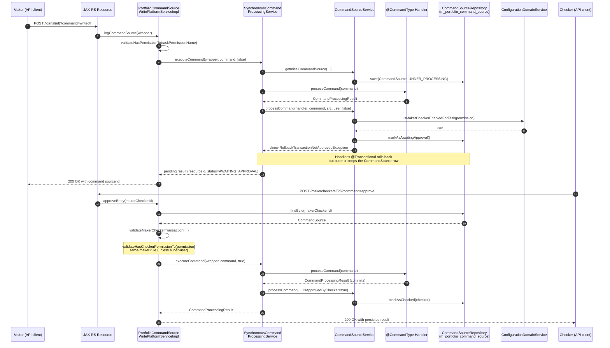

Apache Fineract ships with a built-in four-eyes (maker-checker) workflow that lets institutions require a second user to approve sensitive write operations before they take effect. Instead of being a separate subsystem, it is woven into the same command pipeline that handles every other write: any permission can be flagged as maker-checker enabled, and the platform will automatically rollback the maker's transaction, persist the pending command, and wait for a checker to either approve or reject it.

This page traces the maker-checker path through `fineract-core/` against the current implementation. The key actors are:

- **`PortfolioCommandSourceWritePlatformServiceImpl`** — the dispatcher for both the original maker call and the later `approveEntry` / `rejectEntry` calls.
- **`SynchronousCommandProcessingService`** plus **`CommandSourceService.processCommand`** — the logic that decides whether the maker's transaction must be rolled back into "awaiting approval" status.
- **`CommandSource`** — the JPA entity mapped to `m_portfolio_command_source`, which is the audit table for the entire flow.
- **`ConfigurationDomainService.isMakerCheckerEnabledForTask(permission)`** — the per-permission flag that turns the workflow on.

## Why maker-checker exists

A microfinance core system has many operations where a single mistake — a wrong loan write-off, a fat-fingered fund transfer, a backdated reversal — has real money consequences. Maker-checker addresses this by splitting one logical operation into two physical API calls performed by two different users:

1. **The maker** issues a normal API request (`POST /loans/{id}?command=writeoff`, for example). If the corresponding permission is maker-checker enabled, Apache Fineract executes the handler inside a transaction, then deliberately throws `RollbackTransactionNotApprovedException` so that the database changes are rolled back. The only thing that survives the rollback is the `CommandSource` row, persisted in an outer transaction with status `AWAITING_APPROVAL`.
2. **The checker** later calls one of two dedicated endpoints — `POST /makercheckers/{id}?command=approve` or `command=reject` — handled by `approveEntry` / `rejectEntry`. Approval replays the original command with `isApprovedByChecker = true`, this time letting the handler's transaction commit; rejection simply marks the row as rejected.

The result is a complete audit trail: every sensitive change is represented by a row in `m_portfolio_command_source` showing who proposed it, what JSON they sent, who approved or rejected it, and when.

## The permission flag

Maker-checker is configured per task permission. Each row in `m_permission` has a boolean `can_maker_checker` (mirrored in domain code as the per-task flag). The dispatcher consults it via `ConfigurationDomainService.isMakerCheckerEnabledForTask(permission)` after the handler has already executed:

```java
// CommandSourceService.processCommand (excerpt)
final CommandProcessingResult result = handler.processCommand(command);

String permission = commandSource.getPermissionCode();
boolean isMakerChecker = configurationDomainService.isMakerCheckerEnabledForTask(permission);
if (isMakerChecker || result.isRollbackTransaction()) {
    if (isApprovedByChecker || user.isCheckerSuperUser()) {
        commandSource.markAsChecked(user);
    } else {
        if (commandSource.isSanitized()) {
            throw new GeneralPlatformDomainRuleException("error.msg.invalid.sanitization",
                    "Maker-checker command can not be sanitized, please change the permission configuration", permission);
        }
        commandSource.markAsAwaitingApproval();
        throw new RollbackTransactionNotApprovedException(commandSource.getId(), commandSource.getResourceId());
    }
}
return result;
```

Two interesting subtleties show through this snippet:

- `result.isRollbackTransaction()` is OR-ed with `isMakerChecker`. Even a permission that is not flagged for maker-checker can be forced into the pending state if the handler explicitly asks for it — useful for commands whose business rules require deferred application.
- **Checker super-users** bypass the wait. An app user that has been granted `CHECKER_SUPER_USER` simply marks the command as checked in-line.
- **Sanitized commands cannot be maker-checked.** If the wrapper has registered JSON sanitization keys (for example to wipe out a secret on its way to the audit table), the platform refuses to defer it, because replaying a sanitized command would lose the original input.

## End-to-end sequence

The diagram below covers the happy path: maker submits, the platform persists a pending row, the checker approves, the original handler re-runs successfully.



The two distinct `executeCommand` invocations share exactly the same handler logic. That symmetry is what makes the workflow safe: the checker's approval really does run the same code path the maker would have, with the same validation and the same side effects.

## Step-by-step walkthrough

<Steps>
<Step title="Maker authenticates and submits">
The maker's request hits a JAX-RS resource, which constructs a `CommandWrapper` (via `CommandWrapperBuilder`) and calls `logCommandSource`. The wrapper carries `taskPermissionName`, entity and action names, the JSON payload, and resource identifiers like `loanId` or `clientId`.
</Step>

<Step title="Permission check before any work">
`logCommandSource` calls `context.authenticatedUser(wrapper).validateHasPermissionTo(wrapper.getTaskPermissionName())`. The maker must hold the *base* task permission. The only carve-out is when the wrapper represents the user editing their own account — see `wrapper.isChangeOfOwnUserDetails(...)` — in which case the platform self-approves to avoid an absurd "approve your own profile edit" loop.
</Step>

<Step title="Initial CommandSource row">
`CommandSourceService.getInitialCommandSource(...)` builds a `CommandSource` with status `UNDER_PROCESSING`, the maker's user reference, the idempotency key, and the (possibly sanitized) command JSON. It is saved before the handler runs, so even a crash mid-handler leaves a forensic trace.
</Step>

<Step title="Handler executes in an inner transaction">
The handler resolved by `CommandHandlerProvider.getHandler(entityName, actionName)` runs inside its own `@Transactional` boundary. It modifies entities just like any non-maker-checker write — the platform does not give it a chance to know its transaction will be rolled back.
</Step>

<Step title="Decision: commit or rollback">
After the handler returns, `processCommand` checks the maker-checker flag. Because `isApprovedByChecker` is `false` and the maker is not a `CHECKER_SUPER_USER`, the row is flipped to `AWAITING_APPROVAL` and `RollbackTransactionNotApprovedException` is thrown. Spring rolls back the inner transaction; the `CommandSource` survives because it was saved in an outer tx.
</Step>

<Step title="Checker lists pending commands">
A checker UI typically queries `m_portfolio_command_source` for rows where the status is `AWAITING_APPROVAL` and the user has the matching `CHECKER_<permission>` grant. Apache Fineract exposes a read API on the resource for paginated retrieval.
</Step>

<Step title="Checker approves or rejects">
Approval calls `approveEntry(makerCheckerId)`. Rejection calls `rejectEntry(makerCheckerId)`. Both go through `validateMakerCheckerTransaction(makerCheckerId)`, which (a) finds the row, (b) confirms it is still awaiting approval, (c) validates the checker permission, and (d) enforces the same-maker rule.
</Step>

<Step title="Approval replays the command">
`approveEntry` reconstructs the original `CommandWrapper` and `JsonCommand` from the stored row and calls `executeCommand` with `isApprovedByChecker = true`. The handler runs again, this time committing, and the row is updated via `markAsChecked(checker)`.
</Step>

<Step title="Rejection just marks the row">
`rejectEntry` calls `commandSourceInput.markAsRejected(maker)`, saves it, and runs any registered `CleanupService` implementations so that anything provisional written outside the rolled-back transaction (for example uploaded documents) can be removed.
</Step>
</Steps>

## The same-maker rule

A nuance often missed during integration is the **same-maker** check inside `validateMakerCheckerTransaction`:

```java
if (!configurationService.isSameMakerCheckerEnabled() && !appUser.isCheckerSuperUser()) {
    AppUser maker = commandSource.getMaker();
    if (maker == null) {
        throw new UnsupportedCommandException(permissionCode, "Maker user is missing.");
    }
    if (Objects.equals(appUser.getId(), maker.getId())) {
        throw new UnsupportedCommandException(permissionCode, "Can not be checked by the same user.");
    }
}
```

There are three levers:

- **`isSameMakerCheckerEnabled()`** — a global configuration flag. When `true`, an institution opts in to allow the same person to act as both maker and checker. Useful for low-risk tenants or during development; almost never appropriate in production.
- **`isCheckerSuperUser()`** — a per-role escape hatch. Super-users can always approve, including their own commands.
- The default — same-user attempts are rejected with `UnsupportedCommandException`.

The deliberate `Maker user is missing.` branch protects against commands persisted by a system actor (for example a scheduled job) trying to be promoted into a maker-checker flow.

## The audit table

Every state transition lands in `m_portfolio_command_source`. Notable columns surfaced by the entity:

- `action_name`, `entity_name`, `resource_id`, `sub_resource_id` — what the command targeted.
- `command_as_json` — the original payload, optionally sanitized.
- `maker_id`, `made_on_date`, `checker_id`, `checked_on_date` — the four-eyes audit trail.
- `processing_result_enum` — `UNDER_PROCESSING`, `AWAITING_APPROVAL`, `PROCESSED`, or `REJECTED` via `CommandProcessingResultType`.
- `idempotency_key` — set on creation so that maker retries do not produce duplicate pending rows.
- `result`, `error_message`, `error_status_code` — populated either on the maker's failed attempt or on the checker's replay.

Because the row is created in an outer transaction and updated on each transition, the table is the canonical source of truth for both compliance reports and the maker-checker UI itself.

## Rejection cleanup

`rejectEntry` iterates over the registered `CleanupService` implementations:

```java
if (cleanupServices != null) {
    for (CleanupService cleanupService : cleanupServices) {
        cleanupService.cleanup(commandSourceInput);
    }
}
```

This hook exists because some commands have side effects that cannot be wrapped in the same database transaction as the handler — for example file uploads to a document store, or rows written through a non-JPA datasource. A `CleanupService` bean inspects the rejected command and removes whatever provisional artifacts the maker created.

## Update lock

Both `logCommandSource` and `approveEntry`/`rejectEntry` call `validateIsUpdateAllowed()`, which delegates to `SchedulerJobRunnerReadService.isUpdatesAllowed()`. While certain disruptive scheduler jobs are running — most notably the close-of-business batch — the platform refuses to accept new maker-checker actions. The resulting error tells the operator to retry once the job completes, which prevents a checker from approving a command in the middle of, for example, the loan COB recalculation.

<Warning>
The replay of an approved command happens in a fresh transaction with a fresh `JsonCommand`. If the underlying data has changed between maker and checker (for example, a loan that was current when the writeoff was proposed has since been paid off), the handler will re-validate and may throw a domain rule exception. The checker, not the maker, then sees the error.
</Warning>

## Idempotency and replays

The `CommandSource` row carries an `idempotency_key`. If the same maker retries the same command with the same key while the first attempt is still pending, the dispatcher recognizes it and returns the existing command source id rather than spawning a duplicate. The checker therefore approves a single pending row even when the maker's network was flaky.

This combination — idempotent maker submits, deterministic checker replay, and the audit table as the single source of truth — is what lets Apache Fineract deliver real four-eyes control without changing how individual command handlers are written.

## Observability tips

`m_portfolio_command_source` is the natural starting point for any operational question about the workflow. The columns worth pulling into dashboards:

- A view filtered to rows where the status enum is `AWAITING_APPROVAL`, joined to `m_appuser` on both `maker_id` and `checker_id`, gives a live "pending queue" with who proposed each item.
- The pair `made_on_date` / `checked_on_date` measures maker-to-checker latency. Tracking the p95 over a rolling window surfaces approval bottlenecks before they show up as customer-impacting delays.
- A breakdown of rejection rate per `action_name` / `entity_name` pair is a useful leading indicator. A sudden spike usually means either a training gap (legitimate commands being rejected) or a permission misconfiguration (commands that should never have been proposed in the first place).

The platform also publishes hook events for the maker submission and for the checker's approve and reject calls. Subscribers can mirror the audit trail into a SIEM or external compliance store without polling the table directly.

## Failure modes worth understanding

Three failure modes show up in practice and are worth calling out explicitly:

1. **Permission drift.** A maker holds the base permission today, submits a command that becomes pending, and then loses the permission before the checker approves. `approveEntry` re-runs the handler under the checker's identity, so the maker's loss of permission does not block the approval — but the checker must still hold the matching `CHECKER_<permission>` grant.
2. **Resource gone.** The handler may resolve a `loanId` or `clientId` that no longer exists by the time the checker arrives. The replay then throws the standard domain-not-found exception. The checker sees the error and typically rejects the pending row to clean it up.
3. **Configuration toggled mid-flow.** If `isMakerCheckerEnabledForTask(permission)` was true when the maker submitted but false by the time the checker approves, the replay still proceeds because `approveEntry` explicitly passes `isApprovedByChecker = true`. The result commits exactly as it would for any other write.

Each of these is handled by the existing code paths without special casing — the workflow's main guarantee is that the *only* place a maker-checker command can take effect is the `executeCommand(wrapper, command, true)` call inside `approveEntry`. Everything else either persists an audit row or rolls back.

## Where to extend

Most extensions land in three predictable places:

- A new `CleanupService` bean, picked up by `PortfolioCommandSourceWritePlatformServiceImpl` constructor injection, to roll back side effects that escape the handler's transaction (uploaded files, externally-sent messages, etc.).
- A new `m_permission` row with `can_maker_checker = true` and a matching `CHECKER_<permission>` entry, so a previously direct-write operation now requires approval.
- A hook subscriber that listens for the approve / reject events and forwards them to an external workflow engine, ticketing system, or notification channel.

None of these require changing the dispatcher, the source service, or the handler logic. The maker-checker pipeline is intentionally additive: existing handlers do not know whether they will be approved synchronously or via the four-eyes detour, and that is exactly what keeps the workflow safe to enable on more permissions over time.

## Quick reference

Key entry points to bookmark when reading or extending the workflow in Apache Fineract:

- `PortfolioCommandSourceWritePlatformServiceImpl.logCommandSource` — the maker's entry point. Every flagged or unflagged command lands here first.
- `PortfolioCommandSourceWritePlatformServiceImpl.approveEntry` and `rejectEntry` — the checker's entry points. Both validate the pending row, the checker's permission, and the same-maker rule before continuing.
- `CommandSourceService.processCommand` — the decision between `markAsChecked` and `markAsAwaitingApproval`, plus the `RollbackTransactionNotApprovedException` that defers the maker's transaction.
- `CommandSource.markAsAwaitingApproval`, `markAsChecked`, `markAsRejected` — the state transitions that show up as rows in `m_portfolio_command_source`.
- `ConfigurationDomainService.isMakerCheckerEnabledForTask` and `isSameMakerCheckerEnabled` — the two configuration knobs that govern when the workflow engages and whether the same user may approve their own command.

Reading those five places in order gives a complete mental model of how a single API call becomes a two-phase, fully audited workflow inside Apache Fineract.
