Apache Fineract turns the configured nominal annual interest rate into actual `INTEREST_POSTING` transactions on `m_savings_account` through two parallel entry points:

1. The scheduled batch job **`POST_INTEREST_FOR_SAVINGS`** (`PostInterestForSavingTasklet`) that walks every active savings account in pages and posts due interest.
2. The manual command **`SAVINGSACCOUNT|POSTINTEREST`** triggered by a `POST /api/v1/savingsaccounts/{id}?command=postInterest` request — handled by `PostInterestSavingsAccountCommandHandler`.

Both paths converge on `SavingsAccountWritePlatformServiceJpaRepositoryImpl.postInterest(...)` and ultimately on `SavingsAccount.postInterest(...)` in the domain model, then post journal entries via the accounting bridge. This page traces both end-to-end against the current sources.

## Files involved

| Role | File |
| --- | --- |
| JAX-RS resource | `fineract-provider/src/main/java/org/apache/fineract/portfolio/savings/api/SavingsAccountsApiResource.java` |
| Wrapper builder | `fineract-core/.../CommandWrapperBuilder.java` (`postInterestSavingsAccount(loanId)`) |
| Command handler | `fineract-provider/src/main/java/org/apache/fineract/portfolio/savings/handler/PostInterestSavingsAccountCommandHandler.java:30` |
| Write service entry | `fineract-provider/src/main/java/org/apache/fineract/portfolio/savings/service/SavingsAccountWritePlatformServiceJpaRepositoryImpl.java:542` |
| Internal posting orchestration | same file, private `postInterest(account, ...)` (L600) |
| Domain math | `fineract-savings/src/main/java/org/apache/fineract/portfolio/savings/domain/SavingsAccount.java:516` |
| Interest period helpers | `fineract-core/src/main/java/org/apache/fineract/portfolio/savings/domain/interest/` (`AnnualCompoundingPeriod`, `BiAnnualCompoundingPeriod`, `CompoundInterestHelper`, ...) |
| Posting period type | `SavingsPostingInterestPeriodType` |
| Compounding period type | `SavingsCompoundingInterestPeriodType` |
| Calculation type | `SavingsInterestCalculationType` (daily balance, average daily balance) |
| Days-in-year basis | `SavingsInterestCalculationDaysInYearType` |
| Scheduled job | `fineract-provider/.../portfolio/savings/jobs/postinterestforsavings/PostInterestForSavingTasklet.java` + `PostInterestForSavingConfig.java` |
| Multi-threaded poster | `SavingsSchedularInterestPosterTask` |
| Accounting bridge | `SavingsAccountWritePlatformServiceJpaRepositoryImpl.postJournalEntries(...)` |
| Events | `SavingsPostInterestBusinessEvent`, `SavingsAccountTransactionCreatedBusinessEvent`, `SavingsAccountBalanceChangedBusinessEvent` |

## Two entry points, one engine

The manual command path runs:

```java
@Service
@CommandType(entity = "SAVINGSACCOUNT", action = "POSTINTEREST")
public class PostInterestSavingsAccountCommandHandler implements NewCommandSourceHandler {
    private final SavingsAccountWritePlatformService writePlatformService;

    @Transactional
    @Override
    public CommandProcessingResult processCommand(final JsonCommand command) {
        return this.writePlatformService.postInterest(command);
    }
}
```
*(`PostInterestSavingsAccountCommandHandler.java:30-43`)*

The scheduled job path runs:

```java
public RepeatStatus execute(StepContribution contribution, ChunkContext chunkContext) throws Exception {
    ...
    List<SavingsAccountData> savingsAccounts = savingAccountReadPlatformService
            .retrieveAllSavingsDataForInterestPosting(backdatedTxnsAllowedTill, pageSize, ACTIVE.getValue(), maxSavingsIdInList);
    ...
    postInterest(queue.remove(), threadPoolSize, backdatedTxnsAllowedTill, pageSize, maxSavingsIdInList, queue);
    ...
}
```
*(`PostInterestForSavingTasklet.java:60-90`)*

Both ultimately call `SavingsAccountWritePlatformServiceJpaRepositoryImpl.postInterest(account, ...)` (L600), which delegates to `SavingsAccount.postInterest(...)` (L516 of `SavingsAccount.java`) for the math. The job uses `SavingsSchedularInterestPosterTask` as a per-page parallel executor; the manual command runs synchronously inside the request thread.

## Domain math, briefly

`SavingsAccount.postInterest` (L516) calls `calculateInterestUsing(...)` (L822) to build a list of `PostingPeriod` objects. Each `PostingPeriod` knows:

- the start/end date of its posting window (e.g. the calendar month for `MONTHLY`),
- the inner compounding periods within that window (daily, weekly, ...),
- the interest earned in that posting period, computed from `daily balance × rate / daysInYear`, compounded per the inner periods.

For each posting period, `SavingsAccount.postInterest` (L545-619 of `SavingsAccount.java`):

1. checks whether a matching `INTEREST_POSTING` transaction already exists for that date (`findInterestPostingTransactionFor`),
2. if not, builds `SavingsAccountTransaction.interestPosting(this, office(), date, amount, isUserPosting)` — or `SavingsAccountTransaction.overdraftInterest(...)` for negative interest on overdraft accounts — and appends it via `addTransaction(...)` or `addTransactionToExisting(...)` depending on whether pivot-date backdating is enabled,
3. if a transaction already exists but the amount differs, reverses it (and any associated withholding tax transaction) and creates fresh ones,
4. if withholding tax is applicable (`isWithHoldTaxApplicableForInterestPosting`), creates a paired `WITHHOLD_TAX` transaction via `createWithHoldTransaction(...)`.

The result is a set of new `SavingsAccountTransaction` rows plus updated `account.summary.totalInterestPosted` and daily-balance recompute markers.

## End-to-end sequence

```mermaid
sequenceDiagram
    autonumber
    participant Quartz as Quartz Scheduler
    participant JobLauncher as Spring Batch JobLauncher
    participant Job as POST_INTEREST_FOR_SAVINGS<br/>(PostInterestForSavingConfig)
    participant Tasklet as PostInterestForSavingTasklet<br/>execute L62
    participant Read as SavingsAccountReadPlatformService<br/>retrieveAllSavingsDataForInterestPosting
    participant DB as m_savings_account / m_savings_account_transaction
    participant Pool as ThreadPoolTaskExecutor
    participant Poster as SavingsSchedularInterestPosterTask
    participant Client
    participant Resource as SavingsAccountsApiResource
    participant Builder as CommandWrapperBuilder<br/>postInterestSavingsAccount
    participant Portfolio as PortfolioCommandSourceWritePlatformServiceImpl<br/>logCommandSource
    participant Sync as SynchronousCommandProcessingService
    participant Handler as PostInterestSavingsAccountCommandHandler<br/>processCommand L41
    participant Write as SavingsAccountWritePlatformServiceJpaRepositoryImpl<br/>postInterest L542
    participant Val as SavingsAccountTransactionDataValidator
    participant Assembler as SavingAccountAssembler<br/>assembleFrom L551
    participant Config as ConfigurationDomainService
    participant Inner as Write service private<br/>postInterest(account, ...) L600
    participant Account as SavingsAccount<br/>postInterest L516
    participant Calc as SavingsAccount<br/>calculateInterestUsing L822
    participant Helper as CompoundInterestHelper / PostingPeriod
    participant Txn as SavingsAccountTransaction<br/>interestPosting / overdraftInterest
    participant JPA as EntityManager
    participant TxnRepo as savingsAccountTransactionRepository
    participant AccRepo as savingAccountRepositoryWrapper
    participant GLBridge as postJournalEntries L644
    participant Acc as AccountingProcessorForSavings
    participant GLDB as acc_gl_journal_entry
    participant Bus as BusinessEventNotifierService
    participant Hook as Hook / Webhook publisher

    rect rgba(220, 240, 255, 0.4)
        Note over Quartz,DB: Scheduled path — POST_INTEREST_FOR_SAVINGS
        Quartz->>JobLauncher: cron fires for POST_INTEREST_FOR_SAVINGS
        JobLauncher->>Job: launch job with thread-pool-size + batch-size params
        Job->>Tasklet: execute(contribution, chunkContext) L62
        Tasklet->>Config: retrievePivotDateConfig() L70
        Tasklet->>Read: retrieveAllSavingsDataForInterestPosting(backdated, pageSize, ACTIVE, maxId) L74
        Read->>DB: SELECT savings accounts with rate>0 or overdraft rate>0,<br/>status=ACTIVE, id > maxId, paginated
        Read-->>Tasklet: List<SavingsAccountData> page
        Tasklet->>Tasklet: queue.add(page) L78
        loop until queue empty
            Tasklet->>Pool: submit SavingsSchedularInterestPosterTask per slice
            Pool->>Poster: call()
            Poster->>Account: post interest per account (via write service helpers)
        end
        Note over Tasklet: next page fetched until empty L82-87
    end

    rect rgba(255, 245, 220, 0.4)
        Note over Client,Hook: Manual path — POSTINTEREST command
        Client->>Resource: POST /api/v1/savingsaccounts/{savingsId}?command=postInterest<br/>{ transactionDate, isPostInterestAsOn }
        Resource->>Builder: postInterestSavingsAccount(savingsId)
        Resource->>Portfolio: logCommandSource(commandRequest)
        Portfolio->>Sync: executeCommand(wrapper, command, false)
        Sync->>DB: INSERT m_portfolio_command_source(status=UNDER_PROCESSING)
        Sync->>Handler: processCommand(command) L41
        Handler->>Write: writePlatformService.postInterest(command) L42
        Write->>Val: validatePostInterest(command) L544
        Write->>Write: read isPostInterestAsOn, transactionDate, externalId L545-548
        Write->>Assembler: savingAccountAssembler.assembleFrom(savingsId, backdated) L551
        Assembler->>DB: SELECT m_savings_account + transactions + charges
        Assembler-->>Write: SavingsAccount aggregate
        Write->>Val: checkClientOrGroupActive L552
        Write->>Val: validateTransactionWithPivotDate(date, account) L554
        alt postInterestAs == true
            Write->>Write: date null/before activation/in future checks L557-579
            Write->>Write: cannot be before any existing transaction L569
        end
        Write->>Inner: postInterest(account, postInterestAs, date, backdated, externalId) L581
        Inner->>Config: isSavingsInterestPostingAtCurrentPeriodEnd / retrieveFinancialYearBeginningMonth L601-604
        alt nominal annual rate > 0 OR (overdraft allowed and overdraft rate > 0)
            Inner->>Inner: updateSavingsTransactionsDetails (snapshot existing ids) L611
            Inner->>Account: account.postInterest(mc, today, false, atPeriodEnd,<br/>finYearMonth, postInterestOnDate, backdated, postReversals=false) L625
            Account->>Calc: calculateInterestUsing(mc, upToDate, isInterestTransfer, atPeriodEnd, finYearMonth, postOnDate, backdated, postReversals) L519
            Calc->>Helper: build daily balance × rate, compounded per inner periods
            Helper-->>Calc: list of PostingPeriod (interestEarned)
            Calc-->>Account: postingPeriods L519-521
            loop for each posting period
                Account->>Account: find existing INTEREST_POSTING txn for date L549-553
                alt not found
                    Account->>Txn: SavingsAccountTransaction.interestPosting(this, office, date, amount, isUserPosting) L559
                    Account->>Account: addTransaction(...) / addTransactionToExisting(...) L568-571
                    opt withholding tax applicable
                        Account->>Txn: createWithHoldTransaction(amount, date, backdated) L573
                    end
                else amount differs (correction)
                    Account->>Account: postingTransaction.reverse() L583
                    opt postReversals
                        Account->>Txn: SavingsAccountTransaction.reversal(...) L586
                    end
                    Account->>Account: build fresh interestPosting txn + (optional) reversal record
                end
            end
            Account-->>Inner: side-effected account with new transactions
            Inner->>Inner: updateManualInterestPostingExternalId (sets external id on last user-posting txn) L626
            alt not backdated
                Inner->>TxnRepo: save each new transaction with null id L631-637
            else backdated
                Inner->>TxnRepo: saveAll(account.getSavingsAccountTransactionsWithPivotConfig()) L641
            end
            Inner->>AccRepo: saveAndFlush(account) L643
            AccRepo->>JPA: UPDATE m_savings_account summary columns
            JPA->>DB: INSERT m_savings_account_transaction (type=INTEREST_POSTING)<br/>UPDATE m_savings_account summary
            Inner->>GLBridge: postJournalEntries(account, existingIds, existingReversed, backdated) L644
            GLBridge->>Acc: AccountingProcessorForSavings.createJournalEntriesForSavings<br/>(SAVINGS_INTEREST_POSTING product mapping)
            Acc->>JPA: persist journal entries (Dr Interest Expense / Cr Savings Reference)<br/>or Dr Savings Reference / Cr Overdraft Interest Income for overdraft
            JPA->>GLDB: INSERT acc_gl_journal_entry
        end
        Write->>Bus: notifyPostBusinessEvent(new SavingsPostInterestBusinessEvent(account)) L583
        Bus->>Bus: queue ExternalEvent rows (status TO_BE_SENT)
        Write-->>Handler: CommandProcessingResultBuilder.withEntityId(savingsId).build() L584
        Handler-->>Sync: result
        Sync->>DB: UPDATE m_portfolio_command_source SET status=PROCESSED, result=JSON
        Sync->>Hook: publishHookEvent("SAVINGSACCOUNT","POSTINTEREST", command, result)
        Sync-->>Resource: result
        Resource-->>Client: 200 OK + { savingsId, officeId, clientId, ... }
    end
```



## Step-by-step

### A — Scheduled job

1. **Trigger** — Quartz fires `POST_INTEREST_FOR_SAVINGS` at the cron configured on the job dashboard (`m_jobs`).
2. **Tasklet starts** — `PostInterestForSavingTasklet.execute` (`PostInterestForSavingTasklet.java:62`) reads `thread-pool-size` and `batch-size` from job parameters (L65-69), configures the shared `ThreadPoolTaskExecutor`, and resolves `backdatedTxnsAllowedTill = retrievePivotDateConfig()` (L70).
3. **Page accounts** — `savingAccountReadPlatformService.retrieveAllSavingsDataForInterestPosting(backdated, pageSize, ACTIVE, maxSavingsIdInList)` (L74) pulls the next page of active savings whose `nominal_annual_interest_rate > 0` (or overdraft rate > 0). `pageSize` is `batchSize × threadPoolSize`.
4. **Multi-threaded posting** — the tasklet hands each page to `postInterest(queue.remove(), threadPoolSize, ...)` (L86) which slices the page into `threadPoolSize` sublists, wraps each in a `SavingsSchedularInterestPosterTask`, submits to the pool, and awaits all `Future`s. Inside each task the per-account flow mirrors the manual command but skips JSON / permission code.
5. **Loop** — the next page is fetched using the last id of the current page as `maxSavingsIdInList`. The loop exits when `retrieveAllSavingsDataForInterestPosting` returns an empty list (L82).

### B — Manual command

1. **Resource** — `SavingsAccountsApiResource` builds the wrapper via `CommandWrapperBuilder.postInterestSavingsAccount(savingsId)` and calls `commandsSourceWritePlatformService.logCommandSource(...)`.
2. **Dispatcher** — same as every command: idempotency, `CommandSource` row, handler lookup. `CommandHandlerProvider.getHandler("SAVINGSACCOUNT", "POSTINTEREST")` returns `PostInterestSavingsAccountCommandHandler`.
3. **Handler** — calls `writePlatformService.postInterest(command)` (`PostInterestSavingsAccountCommandHandler.java:42`).

### C — Common engine: `SavingsAccountWritePlatformServiceJpaRepositoryImpl.postInterest(JsonCommand)`

```java
@Override
@Transactional
public CommandProcessingResult postInterest(final JsonCommand command) {
    Long savingsId = command.getSavingsId();
    this.savingsAccountTransactionDataValidator.validatePostInterest(command);
    final boolean postInterestAs = command.booleanPrimitiveValueOfParameterNamed("isPostInterestAsOn")
            || command.booleanPrimitiveValueOfParameterNamed("postInterestManualOrAutomatic");
    final LocalDate transactionDate = command.localDateValueOfParameterNamed("transactionDate");
    final ExternalId externalId = this.externalIdFactory.createFromCommand(command, SavingsApiConstants.externalIdParamName);

    final boolean backdatedTxnsAllowedTill = this.savingAccountAssembler.getPivotConfigStatus();
    final SavingsAccount account = this.savingAccountAssembler.assembleFrom(savingsId, backdatedTxnsAllowedTill);
    checkClientOrGroupActive(account);
    this.savingsAccountTransactionDataValidator.validateTransactionWithPivotDate(transactionDate, account);

    if (postInterestAs) {
        // multiple date validity checks
    }
    postInterest(account, postInterestAs, transactionDate, backdatedTxnsAllowedTill, externalId);

    businessEventNotifierService.notifyPostBusinessEvent(new SavingsPostInterestBusinessEvent(account));
    return new CommandProcessingResultBuilder()
            .withEntityId(savingsId).withOfficeId(account.officeId()).withClientId(account.clientId())
            .withGroupId(account.groupId()).withSavingsId(savingsId).build();
}
```
*(`SavingsAccountWritePlatformServiceJpaRepositoryImpl.java:540-590`)*

The flag `postInterestAs` differentiates **interest-as-on** (post interest as of a specific date) from a routine posting up to today.

### D — Private posting orchestration

`postInterest(account, postInterestAs, transactionDate, backdated, externalId)` (L600):

```java
final boolean isSavingsInterestPostingAtCurrentPeriodEnd = configurationDomainService.isSavingsInterestPostingAtCurrentPeriodEnd();
final Integer financialYearBeginningMonth = configurationDomainService.retrieveFinancialYearBeginningMonth();

if (account.getNominalAnnualInterestRate().compareTo(BigDecimal.ZERO) > 0
        || (account.allowOverdraft() && account.getNominalAnnualInterestRateOverdraft().compareTo(BigDecimal.ZERO) > 0)) {
    final Set<Long> existingTransactionIds = new HashSet<>();
    final Set<Long> existingReversedTransactionIds = new HashSet<>();
    if (backdatedTxnsAllowedTill) {
        updateSavingsTransactionsDetails(account, existingTransactionIds, existingReversedTransactionIds);
    } else {
        updateExistingTransactionsDetails(account, existingTransactionIds, existingReversedTransactionIds);
    }
    final LocalDate today = DateUtils.getBusinessLocalDate();
    final MathContext mc = new MathContext(10, MoneyHelper.getRoundingMode());
    LocalDate postInterestOnDate = postInterestAs ? transactionDate : null;
    boolean postReversals = false;
    account.postInterest(mc, today, false, isSavingsInterestPostingAtCurrentPeriodEnd, financialYearBeginningMonth,
            postInterestOnDate, backdatedTxnsAllowedTill, postReversals);
    updateManualInterestPostingExternalId(account, externalId, transactionDate, backdatedTxnsAllowedTill);

    // persist new transactions
    if (!backdatedTxnsAllowedTill) {
        for (SavingsAccountTransaction accountTransaction : account.getTransactions()) {
            if (accountTransaction.getId() == null) {
                savingsAccountTransactionRepository.save(accountTransaction);
            }
        }
    } else {
        savingsAccountTransactionRepository.saveAll(account.getSavingsAccountTransactionsWithPivotConfig());
    }
    savingAccountRepositoryWrapper.saveAndFlush(account);
    postJournalEntries(account, existingTransactionIds, existingReversedTransactionIds, backdatedTxnsAllowedTill);
}
```
*(L600-644)*

The `existingTransactionIds` and `existingReversedTransactionIds` snapshots are passed to `postJournalEntries` so the accounting bridge can diff and emit GL entries **only** for transactions that are new in this run, or newly reversed.

### E — Domain math

`SavingsAccount.postInterest` (`SavingsAccount.java:516`) calls `calculateInterestUsing(mc, upToDate, isInterestTransfer, atPeriodEnd, finYearMonth, postOnDate, backdated, postReversals)` (L519) which:

1. Builds an outer list of `PostingPeriod` objects using `SavingsPostingInterestPeriodType` (`MONTHLY`, `QUARTERLY`, `BIANNUAL`, `ANNUAL`) — see `AnnualCompoundingPeriod`, `BiAnnualCompoundingPeriod`, `MonthlyCompoundingPeriod`, `QuarterlyCompoundingPeriod` in `fineract-core/.../portfolio/savings/domain/interest/`.
2. Within each posting period, builds inner `CompoundingPeriod` objects per `SavingsCompoundingInterestPeriodType` (daily, weekly, biweekly, ...).
3. Walks `SavingsAccountTransaction` history to compute the running daily balance per `SavingsInterestCalculationType` — daily balance or average daily balance.
4. Applies `rate / SavingsInterestCalculationDaysInYearType` per day, compounds across inner periods, and returns the earned amount per posting period.

For each posting period the outer loop in `SavingsAccount.postInterest` (L545-619) either:

- creates a new `INTEREST_POSTING` (`SavingsAccountTransaction.interestPosting(...)`) or `OVERDRAFT_INTEREST` (`SavingsAccountTransaction.overdraftInterest(...)`) transaction,
- creates a paired `WITHHOLD_TAX` transaction when `isWithHoldTaxApplicableForInterestPosting()` returns true,
- or **reverses and replaces** an existing `INTEREST_POSTING` if the recomputed amount differs (correction path, L575-616).

### F — Persistence and accounting

Back in the write-service:

- Unsaved transactions are flushed via `savingsAccountTransactionRepository.save` or `saveAll` (`SavingsAccountWritePlatformServiceJpaRepositoryImpl.java:633-641`).
- The account aggregate (summary fields) is flushed via `savingAccountRepositoryWrapper.saveAndFlush(account)` (L643).
- `postJournalEntries(account, existingTransactionIds, existingReversedTransactionIds, backdatedTxnsAllowedTill)` (L644) hands the diff to `AccountingProcessorForSavings`, which posts GL legs against the savings product's accounting mapping (`acc_product_mapping`). For interest posting the typical legs are **Dr Interest Expense on Savings / Cr Savings Reference** for accrual-based products. For overdraft interest the direction reverses — **Dr Savings Reference / Cr Interest on Overdraft Income**.

### G — Events

`SavingsPostInterestBusinessEvent(account)` (L583) is the top-level event. Each new `SavingsAccountTransaction` may itself fire `SavingsAccountTransactionCreatedBusinessEvent` from within the helper paths. Both go through `BusinessEventNotifierServiceImpl.notifyPostBusinessEvent` and end up as `m_external_event` rows when external events are enabled — see [External event emission flow](/flows/external-event-emission-flow).

### H — Result and audit

The returned `CommandProcessingResult` carries `entityId=savingsId`, `officeId`, `clientId`, `groupId`, `savingsId`. `SynchronousCommandProcessingService` copies those into `m_portfolio_command_source.resource_id` and flips the row to `PROCESSED`.

## Daily accrual vs period posting

Apache Fineract does **not** store a daily accrual row on `m_savings_account_transaction` by default; the daily interest amount is implicit in the day-by-day balance walk that `calculateInterestUsing` performs at posting time. The persisted transactions are:

- `INTEREST_POSTING` — one per posting period (monthly/quarterly/...).
- `OVERDRAFT_INTEREST` — one per period when interest is negative due to overdraft usage.
- `WITHHOLD_TAX` — paired with each `INTEREST_POSTING` when the product enables it.

For products configured to post interest **at current period end**, `isSavingsInterestPostingAtCurrentPeriodEnd` (`SavingsAccountWritePlatformServiceJpaRepositoryImpl.java:601`) is true and the current period is closed during the run; otherwise only fully-closed periods are posted.

## Failure paths

- **Future date** — `PostInterestAsOnDateException(FUTURE_DATE)` thrown at L577.
- **Date before activation** — `PostInterestAsOnDateException(ACTIVATION_DATE)` at L561.
- **Date before last transaction** — `PostInterestAsOnDateException(LAST_TRANSACTION_DATE)` at L573.
- **Inactive client / group** — `checkClientOrGroupActive` throws at L552.
- **Pivot-date violation** — `validateTransactionWithPivotDate` throws when the date is before the configured pivot.

When the scheduled job hits an exception for one account, the surrounding `SavingsSchedularInterestPosterTask` records the failure and lets the rest of the page continue — failures are isolated per account, not per page.

## Related pages

- `savings/savings-account` — the domain model and lifecycle.
- `accounting/journal-entries` — what `postJournalEntries` does in detail.
- [Command execution flow](/flows/command-execution-flow) — wrapping the manual POSTINTEREST command.
- [External event emission flow](/flows/external-event-emission-flow) — fan-out of `SavingsPostInterestBusinessEvent`.
- `jobs/savings-jobs-deep-dive` — the scheduled job configuration.
