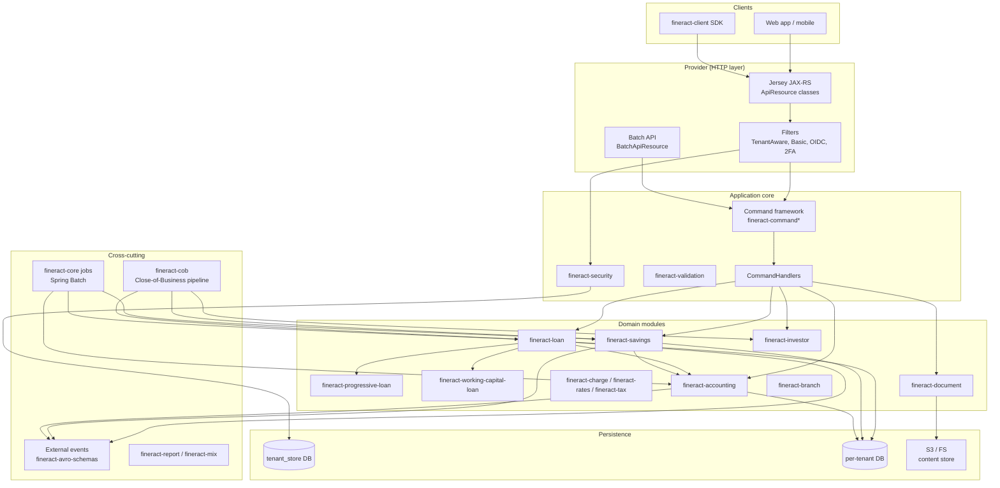

Apache Fineract is an open-source core banking platform written in Java on Spring Boot. It is built as a multi-module Gradle project (40+ subprojects) implementing loans, savings, accounting, share accounts, asset externalization, scheduled jobs, multi-tenant data isolation, and a 110+ endpoint REST API. This wiki is an engineering reference for the codebase — it documents what each module does, where each subsystem lives, how requests flow through the system, and how to navigate the source.

## Architecture at a glance

## Repository map

Every top-level Gradle subproject corresponds to a deployable JAR. The mapping below shows where each lives in the source tree and which wiki group documents it.

| Source directory | Contents | Wiki coverage |
| --- | --- | --- |
| `fineract-provider/` | Main Spring Boot application (`ServerApplication.java`), Jersey wiring, 111 `*ApiResource` classes, jobs, handlers | [Provider Application Layer](/provider/overview) |
| `fineract-core/` | Cross-cutting infrastructure: command framework, batch API, JPA, business-date, codes, external events, jobs, util | [fineract-core](/core/overview) |
| `fineract-security/` | Auth filters, basic auth, OIDC federation, 2FA, tenant resolution, `SqlInjectionPreventer` | [Security & Auth](/security/overview) |
| `fineract-cob/` | Close-of-Business engine: `COBBusinessStep`, partitioner, resolver, listeners, locks | [Close of Business](/cob/overview) |
| `fineract-validation/` | `@*` validation constraints reused across modules | [Provider Application Layer](/provider/overview) |
| `fineract-command*` | Command source / async / disruptor / JDBC / audit variants of the maker-checker bus | [Commands & Maker-Checker](/commands/overview) |
| `fineract-accounting/` | GL accounts, journal entries, accrual, closure, provisioning, trial balance, rules | [Accounting Subsystem](/accounting/overview) |
| `fineract-loan/` | Cumulative loan domain: `Loan`, `LoanCharge`, schedule generators, processors | [Loan Subsystem](/loan/overview) |
| `fineract-progressive-loan/` | Progressive interest method: `ProgressiveEMICalculator`, `ProgressiveLoanScheduleGenerator` | [Progressive Loan](/progressive-loan/overview) |
| `fineract-progressive-loan-embeddable-schedule-generator/` | Standalone Progressive schedule generator for embedding | [Progressive Loan](/progressive-loan/embeddable-schedule-generator) |
| `fineract-working-capital-loan/` | Working-capital loan product, breach detection, dedicated COB pipeline | [Working Capital Loan](/working-capital/overview) |
| `fineract-loan-origination/` | Loan origination application workflow | [Loan Origination](/origination/overview) |
| `fineract-savings/` | Savings, fixed deposit, recurring deposit, GSIM | [Savings Subsystem](/savings/overview) |
| `fineract-investor/` | Asset externalization: investor transfer, COB steps, accounting | [Asset Externalization](/investor/overview) |
| `fineract-charge/` `fineract-rates/` `fineract-tax/` | Charges, floating rates, tax groups | [Portfolio – Reference Data](/reference/charges) |
| `fineract-branch/` | Branch / teller / cashier domain | [Organisation](/organisation/teller) |
| `fineract-document/` | Document management, content store (FS/S3), policies | [Integrations](/integrations/document-management) |
| `fineract-report/` `fineract-mix/` | Pentaho/Jasper reports, MIX XBRL reporting | [Integrations](/integrations/mix-xbrl) |
| `fineract-avro-schemas/` | Avro `.avsc` schemas for external events | [Events & Messaging](/events/avro-schemas) |
| `fineract-client/` `fineract-client-feign/` | Generated Java SDK and Feign variant | [Generated Clients](/clients/fineract-client) |
| `fineract-war/` | WAR packaging for legacy servlet containers | [Build, Test & Deployment](/build/release-process) |
| `fineract-doc/` | Asciidoc developer manual sources | [Build, Test & Deployment](/build/gradle-layout) |
| `integration-tests/` `oauth2-tests/` `twofactor-tests/` | Provider-side JUnit integration tests | [Build, Test & Deployment](/build/testing) |
| `fineract-e2e-tests-core/` `fineract-e2e-tests-runner/` | Cucumber/Gherkin E2E suite | [Build, Test & Deployment](/build/cucumber-features) |
| `custom/` | Dynamically-loaded customer-specific modules (see `settings.gradle`) | [Build, Test & Deployment](/build/dependency-management) |
| `docker/` `kubernetes/` | Container images and k8s manifests | [Build, Test & Deployment](/build/docker-image) |

## Subsystems

<CardGroup cols={2}>
  <Card title="Bootstrap & Runtime" icon="play" href="/runtime/server-application">
    `ServerApplication`, Spring Boot configuration, profiles, multi-tenant DataSource resolution.
  </Card>
  <Card title="fineract-core" icon="gears" href="/core/overview">
    Cross-cutting infrastructure: command bus, batch API, business date, codes, JPA, external events.
  </Card>
  <Card title="Security & Auth" icon="lock" href="/security/overview">
    Filter chain, basic auth, OAuth2/OIDC, two-factor, tenant resolution, SQL injection prevention.
  </Card>
  <Card title="Provider Layer" icon="server" href="/provider/overview">
    Jersey JAX-RS bootstrap, 111 `*ApiResource` classes, Swagger, actuator/metrics.
  </Card>
  <Card title="Commands & Maker-Checker" icon="check-double" href="/commands/overview">
    `CommandSource`, `CommandHandler` dispatch, audits, idempotency, async/disruptor/JDBC variants.
  </Card>
  <Card title="Batch API" icon="layer-group" href="/batch/overview">
    `BatchApiService` fan-out of internal `CommandStrategy` calls in one HTTP request.
  </Card>
  <Card title="Loan Subsystem" icon="hand-holding-dollar" href="/loan/overview">
    `Loan`, products, schedule generators, transaction processors, reschedule, COB integration.
  </Card>
  <Card title="Progressive Loan" icon="chart-line" href="/progressive-loan/overview">
    Progressive interest method, `EMICalculator`, dedicated schedule generator.
  </Card>
  <Card title="Working Capital Loan" icon="briefcase" href="/working-capital/overview">
    Working-capital product with breach / near-breach evaluation and its own COB pipeline.
  </Card>
  <Card title="Loan Origination" icon="folder-plus" href="/origination/overview">
    Loan application workflow upstream of the cumulative loan domain.
  </Card>
  <Card title="Savings Subsystem" icon="piggy-bank" href="/savings/overview">
    Savings, fixed deposit, recurring deposit accounts, GSIM, interest rate charts.
  </Card>
  <Card title="Share Accounts" icon="chart-pie" href="/shares/overview">
    Share products, share accounts, dividend posting.
  </Card>
  <Card title="Accounting Subsystem" icon="book" href="/accounting/overview">
    GL accounts, journal entries, accrual engine, closure, provisioning, trial balance.
  </Card>
  <Card title="Portfolio – Clients & Groups" icon="users" href="/portfolio/client">
    Client / group / center hierarchy, transfers, calendars, search.
  </Card>
  <Card title="Portfolio – Reference Data" icon="tags" href="/reference/charges">
    Charges, funds, rates, tax, floating rates, payment types, collateral templates.
  </Card>
  <Card title="Organisation" icon="building" href="/organisation/offices">
    Offices, staff, tellers, holidays, working days, monetary currency, provisioning criteria.
  </Card>
  <Card title="User Administration" icon="user-shield" href="/users/overview">
    `AppUser`, roles, permissions, password preferences, forgot password.
  </Card>
  <Card title="Close of Business (COB)" icon="moon" href="/cob/overview">
    `COBBusinessStep` engine, partitioner, loan account lock, inline COB, catch-up.
  </Card>
  <Card title="Scheduled Jobs" icon="clock" href="/jobs/overview">
    `JobName` registry, scheduler, tasklets across loan / savings / accounting / campaigns.
  </Card>
  <Card title="Events & Messaging" icon="tower-broadcast" href="/events/overview">
    Business event bus, external event producer, Avro schemas, queue/topic adapters.
  </Card>
  <Card title="Notification & Campaigns" icon="bell" href="/notification/overview">
    In-app notifications, SMS / email campaigns, templates, hooks.
  </Card>
  <Card title="Integrations" icon="plug" href="/integrations/overview">
    Document store (S3), credit bureau, Mojaloop interop, MIX XBRL, SPM surveys, GCM/FCM.
  </Card>
  <Card title="Asset Externalization (Investor)" icon="handshake" href="/investor/overview">
    Loan ownership transfer to investors, dedicated COB step, investor-side journal entries.
  </Card>
  <Card title="Data & Persistence" icon="database" href="/data/overview">
    HikariCP, EclipseLink JPA, Liquibase tenant/tenant-store changelogs, datatables, reports.
  </Card>
  <Card title="Data Models" icon="diagram-project" href="/models/loan-model">
    Entity relationship overviews for loan, savings, accounting, client, group, user.
  </Card>
  <Card title="API Reference" icon="code" href="/api/overview">
    Endpoint catalogue grouped by resource with handler file and command names.
  </Card>
  <Card title="Key Flows" icon="route" href="/flows/request-lifecycle">
    Step-by-step traces: disbursement, repayment, COB, maker-checker, batch, accounting bridge.
  </Card>
  <Card title="Configuration & Environment" icon="sliders" href="/config/application-properties">
    `application.properties`, env vars, `c_configuration` global flags, instance mode toggles.
  </Card>
  <Card title="Build, Test & Deployment" icon="hammer" href="/build/gradle-layout">
    Gradle multi-module build, Docker Compose matrix, k8s, static weaving, E2E Cucumber suite.
  </Card>
  <Card title="Generated Clients" icon="boxes-stacked" href="/clients/fineract-client">
    OkHttp-based `fineract-client` and Feign-based `fineract-client-feign` SDKs.
  </Card>
</CardGroup>

## Where to start

If you are new to the codebase, read these pages in order:

<Steps>
  <Step title="Architecture overview">
    Start with [Architecture](/overview/architecture) and the [Repository layout](/overview/repository-layout) page for the module map. The [Module graph](/overview/module-graph) describes the Gradle subproject dependency graph from `settings.gradle`.
  </Step>
  <Step title="Bootstrap path">
    Trace [`ServerApplication.main`](/runtime/server-application) → [`FineractWebApplicationConfiguration`](/runtime/spring-boot-configuration) → [Multi-tenancy](/runtime/multi-tenancy) → [Jersey bootstrap](/provider/jersey-bootstrap).
  </Step>
  <Step title="Request lifecycle">
    Follow a real HTTP request through [Filters](/security/filters) → [Jersey ApiResource](/provider/api-resources-index) → [Command framework](/commands/overview) → [CommandHandler](/commands/command-handlers) → domain service.
  </Step>
  <Step title="Pick a subsystem">
    Open the subsystem you need (e.g. [Loan](/loan/overview), [Savings](/savings/overview), [Accounting](/accounting/overview)) and read its overview page first, then drill into the per-module deep dives.
  </Step>
</Steps>

<Note>
  Important entry points worth bookmarking:

  - `fineract-provider/src/main/java/org/apache/fineract/ServerApplication.java` — `main()` for embedded Tomcat.
  - `fineract-provider/src/main/java/org/apache/fineract/infrastructure/core/boot/FineractWebApplicationConfiguration.java` — Spring Boot `@Configuration`.
  - `fineract-loan/src/main/java/org/apache/fineract/portfolio/loanaccount/domain/Loan.java` — the central `Loan` aggregate.
  - `fineract-cob/src/main/java/org/apache/fineract/cob/COBBusinessStep.java` — COB step interface implemented by every business step.
  - `fineract-core/src/main/java/org/apache/fineract/batch/api/BatchApiResource.java` — Batch API entry resource.
</Note>
