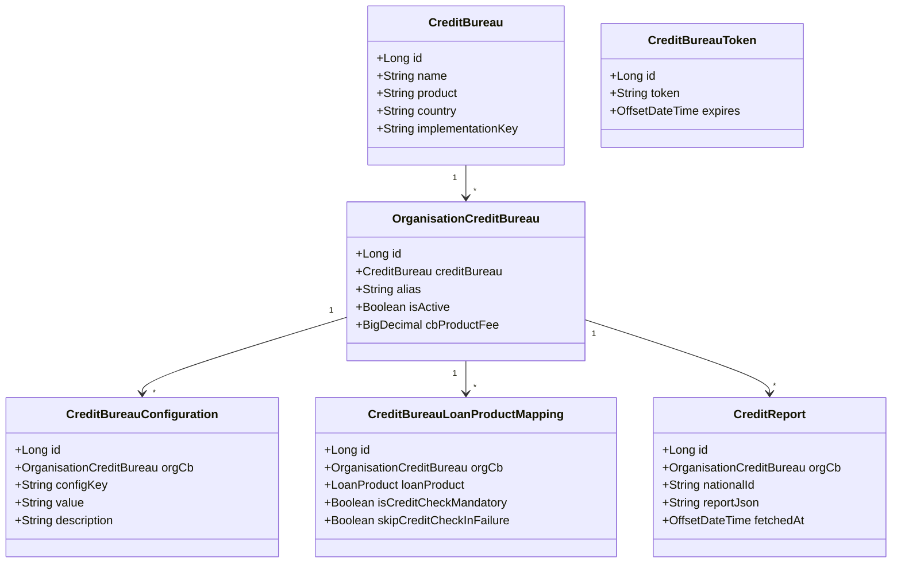
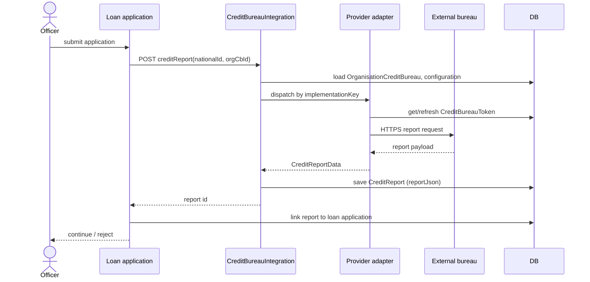
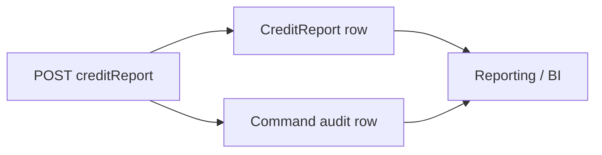
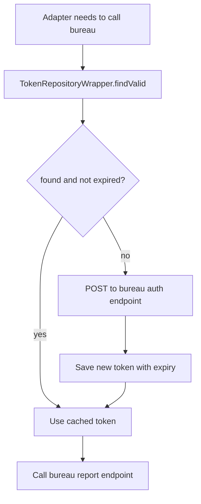

Credit bureaus are the canonical example of an external lookup that an MFI cares about: during loan origination you want to know whether the applicant has been seen before, what their existing exposure is, and what risk class they fell into last time. Apache Fineract ships a framework — not a finished adapter — for plugging bureau providers into the origination workflow. This page describes the data model, the configuration surface, the report-fetching API, and how a tenant wires a specific provider in.

## What ships and what does not

`org.apache.fineract.infrastructure.creditbureau` is a *framework*. The entities, the REST API, and the wiring for storing the resulting reports are all in core. The concrete HTTP adapter for any specific bureau (Equifax, Experian, Compuscan, Datafast, etc.) is **not** in core — it ships separately, often per-deployment, and registers itself by being available as a bean and being referenced through `OrganisationCreditBureau`.

The framework's job is to:

- Catalogue which bureaus exist (`m_credit_bureau`).
- Per-tenant, decide which bureaus are enabled and how (`m_organisation_credit_bureau`).
- Map loan products to bureaus so origination knows which one to call (`m_creditbureau_loanproduct_mapping`).
- Store bureau-specific connection settings (`m_creditbureau_configuration`).
- Cache short-lived authentication tokens (`m_creditbureau_token`).
- Persist the fetched report so downstream steps can read it (`m_credit_report`).

## Package layout

`fineract-provider/src/main/java/org/apache/fineract/infrastructure/creditbureau/` contains the usual command-pipeline subpackages:

| Package | Role |
| --- | --- |
| `api/` | Two JAX-RS resources — `CreditBureauConfigurationApiResource`, `CreditBureauIntegrationApiResource` |
| `data/` | Read-side DTOs for bureau, configuration, report |
| `domain/` | The seven JPA entities below |
| `exception/` | Provider-not-found, mapping-not-found |
| `handler/` | Command handlers for activate/deactivate/save-report |
| `serialization/` | Command JSON deserialisers |
| `service/` | Read and write platform services, the bureau dispatcher |

## Domain model

### `CreditBureau`

The catalogue row. One per bureau provider known to the platform, identified by name, country, and an implementation key that the runtime uses to dispatch to a specific adapter bean. Tenants do not edit these directly; they are seed data.

### `OrganisationCreditBureau`

The per-tenant activation: the tenant picks a `CreditBureau` from the catalogue, gives it a local alias, sets a product fee (charged to the applicant when running a check), and marks it active or not. Most credit-check logic looks up by `OrganisationCreditBureau` id, not by `CreditBureau` id.

### `CreditBureauConfiguration`

Free-form key/value rows scoped to an `OrganisationCreditBureau`. This is where endpoint URLs, credentials, subscriber codes, product identifiers, and whatever else a provider needs go. Conventional keys include `username`, `password`, `subscriptionKey`, `serviceUrl`, `endpointType` — but the framework does not enforce names; the adapter decides what to read.

### `CreditBureauLoanProductMapping`

The join from a loan product to the bureau that should be called for it. Two booleans drive behaviour:

- `isCreditCheckMandatory` — origination will refuse to advance the application if the bureau lookup fails.
- `skipCreditCheckInFailure` — when `true`, mandatory still applies for *unavailable*-response but the adapter is allowed to gracefully short-circuit specific provider failures.

### `CreditBureauToken`

Cached OAuth/JWT/session tokens. Adapters that talk to OAuth-style bureau APIs save the issued token here so multiple concurrent applications can share it until expiry. The cache is per-`OrganisationCreditBureau`.

### `CreditReport`

The fetched report itself, stored as JSON (`reportJson`). Keyed by the applicant's national identifier so the same report can be re-read on subsequent application steps without paying for a second pull.

## REST surface

### `CreditBureauConfigurationApiResource`

Path: `/v1/CreditBureauConfiguration`. CRUD for the rows above:

- `GET /CreditBureau` — catalogue
- `GET /organisationCreditBureau` — enabled bureaus for this tenant
- `PUT /organisationCreditBureau/{id}` — activate / deactivate / set fee
- `GET /config/{organisationCreditBureauId}` — list configuration keys
- `PUT /configuration/{configurationId}` — update a config value
- `POST /loanProduct` — create or update a loan-product mapping
- `GET /loanProduct/{loanProductId}` — current mapping

### `CreditBureauIntegrationApiResource`

Path: `/v1/creditBureauIntegration`. The runtime side:

| Method | Path | Purpose |
| --- | --- | --- |
| `POST` | `creditReport` | Fetch a fresh credit report from the bureau |
| `POST` | `addCreditReport` | Upload a file-based report (some bureaus return PDFs/zips) |
| `POST` | `saveCreditReport` | Persist a fetched report against a loan application |
| `GET` | `creditReport/{creditBureauId}` | Read back a previously stored report |
| `DELETE` | (token) | Invalidate the cached token to force a fresh auth |

The `POST creditReport` endpoint takes a national identifier, an organisation credit bureau id, and any provider-specific extras in the request body. The dispatcher looks up the configured `implementationKey` and routes to the matching adapter bean.

## Origination flow

The origination state machine uses the loan-product mapping to decide whether the lookup is mandatory and whether to gate the next state on a successful pull. If mandatory and the report is unavailable, the application stays in a "pending bureau check" state.

## Adapter integration model

Concrete adapters are plain Spring beans. They are expected to expose a method that the dispatcher calls with the configuration map and applicant identifier and that returns a normalised report DTO. There is no rigid SPI interface mandated by core — different bureaus have very different request/response shapes, so adapters tend to live in their own module with their own DTOs and just reuse the persistence layer.

What the framework guarantees the adapter:

- A loaded `OrganisationCreditBureau` with its config keys as a `Map<String,String>`.
- A `TokenRepositoryWrapper` for the cached-token cache.
- A `CreditReportRepository` for persisting the result.
- A tenant-aware database connection and transaction.

What the adapter must provide:

- An `implementationKey` matching the catalogue row.
- A bean method the dispatcher invokes.
- Sensible mapping of provider errors into Apache Fineract exceptions so the origination state machine can react.

## Permissions

The endpoints sit behind the standard permission system. Credit-bureau-specific permissions include:

- `READ_CREDIT_BUREAU`
- `CREATE_CREDIT_BUREAU`
- `UPDATE_CREDIT_BUREAU`
- `READ_ORGANISATION_CREDIT_BUREAU`
- `UPDATE_ORGANISATION_CREDIT_BUREAU`
- `READ_CREDIT_BUREAU_CONFIGURATION`
- `UPDATE_CREDIT_BUREAU_CONFIGURATION`
- `READ_LOAN_PRODUCT_CREDIT_BUREAU_MAPPING`
- `CREATE_LOAN_PRODUCT_CREDIT_BUREAU_MAPPING`

Officers who run reports during application capture only need the read-side permission on the integration API.

## Practical tips

- Treat the `reportJson` column as schemaless from core's perspective: it is whatever your adapter saved. Build reporting (Pentaho / SQL views) against the provider-specific shape rather than against core.
- Cache tokens aggressively; bureau APIs frequently rate-limit the auth endpoint more strictly than the report endpoint.
- Use `cbProductFee` as the canonical knob for the customer-facing charge — let core compute and post it via the standard charge mechanism instead of bolting on a side-pipeline.
- Keep the implementation key short and stable; the catalogue row is the integration's externally visible name.

## Reporting and audit

Every report fetch is a `CreditReport` row, every configuration change goes through the command-source pipeline. That gives you a full audit trail without extra plumbing: who ran a check on whom, when, what was returned, and which adapter version handled it (if the adapter writes its version into the JSON envelope).

## What this is not

- Not an underwriting engine. The report is data; the lend/no-lend decision lives in your loan product rules.
- Not a bureau-portability layer. There is no normalised cross-bureau schema; each adapter writes whatever its provider returns.
- Not a real-time monitoring hook. If you want to re-pull on every payment, schedule it yourself via a custom job.

## Token cache lifecycle

The token table prevents adapters from re-authenticating on every report pull. The typical flow:

Adapters that talk to OAuth-style APIs save the access token plus its expiry from the auth response. The wrapper's `findValid` returns only tokens whose expiry is in the future, so stale tokens are ignored without explicit invalidation. The `DELETE` endpoint on the integration resource is for the rare case where the bureau invalidates a token early and you need to force a refresh.

## Mapping mandatory vs optional

The two flags on `CreditBureauLoanProductMapping` interact:

| `isCreditCheckMandatory` | `skipCreditCheckInFailure` | Behaviour |
| --- | --- | --- |
| `false` | (any) | Bureau check is optional; failure is logged and ignored |
| `true` | `false` | Bureau check is mandatory; any failure blocks application progression |
| `true` | `true` | Bureau check is mandatory but specific transient failures (timeout, 5xx) are tolerated |

The "skip on failure" flag is what makes mandatory checks operationally tractable — the bureau being down should not halt your origination floor for half an hour.

## Multiple bureaus per product

A single `LoanProduct` can have more than one `CreditBureauLoanProductMapping` row, allowing a "check all of these" or "check whichever succeeds first" strategy. The dispatcher invokes each in turn; the order depends on the row order. There is no native fall-through-after-failure flag at the framework level — the adapter has to model that explicitly.

## Reading a stored report

`GET /v1/creditBureauIntegration/creditReport/{creditBureauId}` takes the bureau id and (typically) a national identifier as a query parameter, and returns the most recent `CreditReport` for that combination. The shape is `{ id, fetchedAt, reportJson }`. Clients deserialise the `reportJson` to the bureau-specific schema.

For historical pulls (audit, dispute resolution), there is also a list endpoint that returns reports in `fetchedAt` descending order.

## Charges and the product fee

Most bureaus charge a per-query fee. `OrganisationCreditBureau.cbProductFee` is the configured pass-through cost. When the bureau check runs, the loan write-platform service posts a charge of that amount against the application's holding charge account. That keeps the bureau cost traceable per loan rather than buried in a general operating expense.

If your bureau contract is flat-rate (per-month rather than per-query), set `cbProductFee` to zero and account for the contract cost separately.

## Where to next

- The Mojaloop interop page shows another external-HTTP integration with very different shape.
- Report mailing covers scheduling regular bureau-sourced exposure reports out to email recipients.

<CardGroup cols={2}>
  <Card title="Integrations overview" icon="map" href="/integrations/overview">
    Back to the index.
  </Card>
  <Card title="Mojaloop interop" icon="network-wired" href="/integrations/interoperation-mojaloop">
    Another HTTP-shaped integration to compare against.
  </Card>
</CardGroup>
