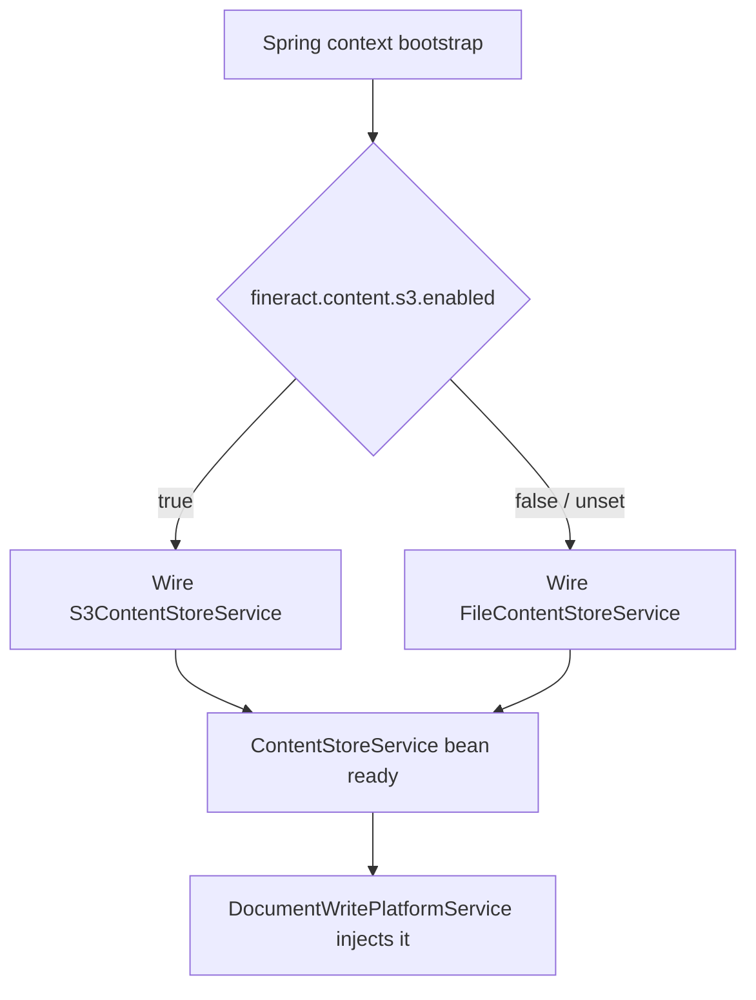
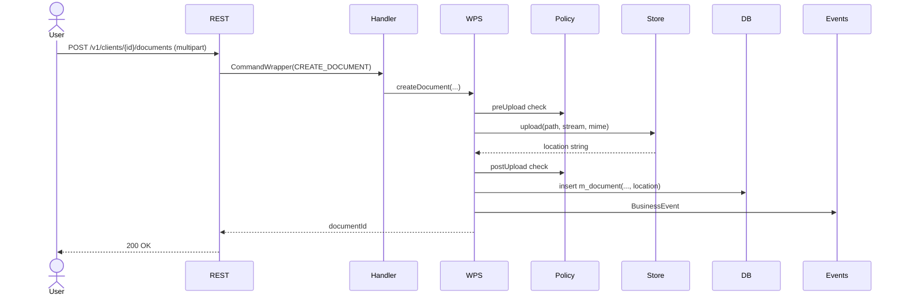

The `fineract-document` module is how Apache Fineract gets binary blobs — KYC scans, signed loan agreements, group photos — out of the JVM and onto durable storage without coupling the rest of the codebase to a specific backend. It exposes per-entity REST attachment endpoints, drives uploads through a `ContentStoreService` SPI, and supports filesystem and S3 backends out of the box.

## Module layout

`fineract-document/src/main/java/org/apache/fineract/infrastructure/` splits the responsibility into three packages:

| Package | Purpose |
| --- | --- |
| `documentmanagement` | The entity API: `m_document` rows, REST upload/download endpoints, mapping |
| `contentstore` | The SPI: `ContentStoreService`, dispatch, policies, sanitisation, detectors |
| `event` | Business events fired when a document is attached or removed |

The two halves are deliberately separated. `documentmanagement` owns the JPA entity, the per-entity (`clients/{id}/documents`, `loans/{id}/documents`, …) URL space, and the command-handler envelope. `contentstore` owns where the bytes actually go.

```mermaid
flowchart LR
    REST[REST /clients/{id}/documents] --> CMD[CommandHandler]
    CMD --> WPS[DocumentWritePlatformService]
    WPS --> STORE[ContentStoreService]
    WPS --> JPA[(m_document)]
    STORE -->|fs| FS[FileContentStoreService]
    STORE -->|s3| S3[S3ContentStoreService]
    FS --> DISK[(local filesystem)]
    S3 --> BUCKET[(S3 bucket)]
```

## `documentmanagement` package

The subpackages mirror the standard Apache Fineract command pipeline:

- `api/` — JAX-RS resources for the per-entity endpoints. Same URL shape across clients, loans, savings, groups: `POST /v1/{entity}/{id}/documents` to upload, `GET .../documents/{documentId}/attachment` to stream back, `DELETE .../documents/{documentId}` to remove.
- `command/` — command DTOs carrying the multipart form fields (name, description, file metadata).
- `data/` — read-side response DTOs returned by the resources.
- `domain/` — the JPA entity `Document` mapped to `m_document` plus the storage type and content-repository factory abstractions.
- `handler/` — `CreateDocumentCommandHandler`, `UpdateDocumentCommandHandler`, `DeleteDocumentCommandHandler`. These are the entry points for command sourcing.
- `mapping/` — JOOQ/JDBI mappers between rows and read DTOs.
- `service/` — read- and write-platform services, plus the `DocumentReadPlatformService` used by reports and downloads.
- `exception/` — `DocumentNotFoundException`, `InvalidEntityTypeForDocumentManagementException`.

### The `Document` entity

`m_document` holds metadata about each attachment: the parent entity type and id (`parent_entity_type`, `parent_entity_id`), the original file name, content type, size, the storage-type discriminator, and the `location` — which is the path under which the content-store implementation can fetch the bytes back. The actual file contents are never in the database row.

A document row is fully meaningful only in combination with the content store it was uploaded to: if you switch from filesystem to S3 in place, old `location` strings will still point at the filesystem, and downloads will fail.

## `contentstore` package

The store side is the interesting bit because it is the only place Apache Fineract gates *what* gets stored.

| Subpackage | Role |
| --- | --- |
| `service/` | `ContentStoreService` SPI plus `FileContentStoreService` and `S3ContentStoreService` |
| `config/` | Spring config — currently an executor bean used by the processor pipeline |
| `policy/` | Pre/post upload, download, delete policies — quotas, allow-lists, size caps |
| `processor/` | Async content processor framework (for e.g. virus scanning, thumbnailing) |
| `detector/` | Content-type/MIME detection (defence in depth against forged headers) |
| `util/` | Path sanitisation to keep callers from walking outside the configured root |
| `data/` | Storage type discriminator (`FILE_SYSTEM`, `S3`) |
| `exception/` | `ContentStoreException`, `ContentPolicyException` |

### `ContentStoreService` SPI

The single contract that every backend implements is small. The relevant operations are:

```java
public interface ContentStoreService {
    InputStream download(String path);
    String      upload(String path, InputStream is, String mimeType);
    void        delete(String path);
}
```

That is the entire SPI surface. The write-platform service does not know whether it is talking to disk or to S3; it calls `upload(...)`, gets back a string, and stores that string in `m_document.location`. On retrieval it calls `download(location)` and streams bytes to the HTTP response.

### Dispatch by configuration

The two shipped implementations are both Spring beans, each guarded by a `@ConditionalOnProperty`. Only one of them will be eligible at a time:

```java
@Service
@ConditionalOnProperty(name = "fineract.content.s3.enabled", havingValue = "true")
public class S3ContentStoreService implements ContentStoreService { ... }
```

`FileContentStoreService` carries the inverse guard (or `havingValue = "false"` with `matchIfMissing = true`) so it is the default. When neither flag is true the platform fails fast at boot rather than running with documents silently disabled.



## Upload flow end-to-end

A multipart upload to `POST /v1/clients/{clientId}/documents` flows through:

1. The JAX-RS resource validates the path and parses the multipart form.
2. The handler builds a `CommandWrapper` and hands it to the command-source service so the upload participates in command sourcing and tenant context.
3. `CreateDocumentCommandHandler` resolves the parent entity (client/loan/savings/group), checks the user has the right permission for the entity type, and validates name/description.
4. The write-platform service invokes the pre-upload policies (size limit, MIME allow-list, regex allow-list) via `ContentPolicyContext`.
5. `ContentStoreService.upload(path, inputStream, mimeType)` writes the bytes. The returned location is persisted to `m_document.location`.
6. The post-upload policies run (e.g. file detector reads the head bytes and verifies they match the declared MIME type).
7. The new `Document` row is flushed and a `BusinessEvent` is fired.

If any step fails after bytes were already written, the store-level delete is attempted as a compensating action so orphan blobs do not pile up.

## Path sanitisation

`ContentPathSanitizer` strips path traversal sequences (`..`, leading `/`, embedded `\`) and normalises the result so callers cannot escape the root folder on filesystem stores, or the configured prefix on S3. Both implementations always run the path through the sanitiser before passing it to the underlying API:

```java
final var safePath = pathSanitizer.sanitize(path);
s3Client.getObject(GetObjectRequest.builder()
    .bucket(properties.getContent().getS3().getBucketName())
    .key(safePath).build(), ResponseTransformer.toBytes());
```

This is the same defence used regardless of where the path string originated — caller-supplied or computed from entity ids.

## Image vs. arbitrary document

Apache Fineract also supports client and staff *images* (the small profile picture) through a sibling code path. The image endpoints (`POST /v1/clients/{id}/images`, …) reuse the same `ContentStoreService` but write into a separate logical subtree, since image content has its own size/MIME constraints. The same dispatch by `fineract.content.s3.enabled` applies.

## Configuration surface

The two configurable areas are policy and store backend. Policies live in `FineractContentProperties`:

| Property | Effect |
| --- | --- |
| `fineract.content.regex-whitelist-enabled` | Reject uploads whose name does not match one of the regex allow-list entries |
| `fineract.content.regex-whitelist` | The list of allowed name regexes |
| `fineract.content.mime-whitelist-enabled` | Reject uploads whose detected MIME is not in the allow-list |
| `fineract.content.mime-whitelist` | The list of allowed MIME types |
| `fineract.content.default-buffer-size` | I/O buffer size for streaming |

Backend selection lives in two sibling property groups:

| Property | Effect |
| --- | --- |
| `fineract.content.filesystem.enabled` | Enable the filesystem store |
| `fineract.content.filesystem.root-folder` | Root directory under which paths are written |
| `fineract.content.s3.enabled` | Enable the S3 store (mutually exclusive with FS) |
| `fineract.content.s3.bucket-name` | Bucket to upload to |
| `fineract.content.s3.region` | AWS region |
| `fineract.content.s3.endpoint` | Override endpoint (for MinIO / S3-compatible services) |
| `fineract.content.s3.path-style-addressing-enabled` | Path-style addressing toggle |
| `fineract.content.s3.access-key` / `secret-key` | Static credentials, else default chain |

The S3 page covers these in detail.

## What it does not do

`fineract-document` is deliberately small. It does not version files (overwrites the location), it does not encrypt at rest (delegated to the backend), it does not own retention policy (callers delete when they please), and it does not deduplicate by content hash. If you need any of these, build them on top — by wrapping `ContentStoreService` with a decorator bean, or by writing a custom implementation that wraps the shipped one.

## Plugging in a custom backend

A new backend is a single `@Service` bean that implements `ContentStoreService`, guarded by your own `@ConditionalOnProperty` so it can coexist with the shipped ones in classpath but only be wired by configuration. You do **not** need to touch `documentmanagement` — the write-platform service injects whatever single bean is in the context.



## Permissions

The document endpoints sit behind the standard Apache Fineract permission system. The conventional permission names are:

| Permission | Effect |
| --- | --- |
| `READ_DOCUMENT` | Read documents for any entity (still requires entity-level read permission) |
| `CREATE_DOCUMENT` | Upload new documents |
| `UPDATE_DOCUMENT` | Update name/description of an existing document |
| `DELETE_DOCUMENT` | Remove a document |

These compose with the parent-entity permission: to attach a file to a client you need both `READ_CLIENT` and `CREATE_DOCUMENT`. The platform checks both — there is no superset shortcut.

## Read-side path

The read path is the mirror image of upload. `GET /v1/clients/{clientId}/documents` lists metadata only (no bytes), while `GET .../documents/{documentId}/attachment` is what streams the file. The read service:

1. Loads the `m_document` row.
2. Verifies the caller can read the parent entity (re-runs the permission check).
3. Calls `ContentStoreService.download(location)`.
4. Sets `Content-Disposition: attachment; filename="..."` from the original name.
5. Streams the input stream to the response body.

Browsers honour `Content-Disposition` and present a download dialog; calling the endpoint from a backend is just an HTTP GET.

## Update and delete

`PUT /v1/{entity}/{id}/documents/{documentId}` updates the metadata (name, description) but does not replace the file. To replace the file, delete and re-upload — the platform does not version content, so an update-in-place would silently drop the old version.

`DELETE` is a hard delete: the JPA row is removed and `ContentStoreService.delete(location)` is invoked. There is no soft-delete / tombstone for documents.

## Concurrency

A document row carries the audit columns from `AbstractAuditableWithUTCDateTimeCustom`, but it does not have an optimistic-lock `@Version`. Concurrent updates to the same `m_document` row race; the last write wins. In practice that is acceptable because document metadata is rarely co-edited.

## Multipart upload shape

The upload endpoint expects a `multipart/form-data` request with three parts:

| Part name | Type | Required |
| --- | --- | --- |
| `file` | The binary file content | Yes |
| `name` | Human-friendly name | Yes |
| `description` | Free text | No |

A curl example for attaching a file to a client:

```bash
curl -X POST \
  -u user:password \
  -H 'fineract-platform-tenantid: default' \
  -F 'file=@kyc.pdf' \
  -F 'name=KYC document' \
  -F 'description=Notarised signature' \
  https://host/fineract-provider/api/v1/clients/42/documents
```

The response is the standard command-processing result with the new document id. The id is what callers use for subsequent reads, updates, and deletes.

## Content detection

`ContentDetectorManager` runs after the bytes hit the store and inspects the file head to detect the *real* MIME type. If the detected type disagrees with the declared type from the multipart form, the post-upload policy will reject the upload and the compensating delete runs. This blocks the common forged-extension attack (`malware.pdf.exe` rebranded as `image/jpeg`).

The detector chain is plugin-friendly: drop in additional `ContentDetector` beans for proprietary formats.

## Buffering

The `default-buffer-size` property controls how many bytes are read into memory in one go during streaming upload/download. The default is conservative; increase it on deployments with large files to reduce syscall overhead, but watch heap with concurrent uploads.

## Working with the V1 enrichers

In a deployment that enables both `fineract-document` and `fineract-investor`, the V1 loan read enrichers (see the [investor overview](/investor/overview)) decorate the loan read DTOs with both attached-document metadata and ownership info. The two modules do not know about each other directly — both register V1 enrichers that compose at the read-API layer.

## Where to next

- [S3 content store](/integrations/s3-content-store) — the production-grade backend most deployments enable.
- The accompanying entity write platforms (client, loan, savings) are documented in their respective sections.

<CardGroup cols={2}>
  <Card title="S3 content store" icon="aws" href="/integrations/s3-content-store">
    Detailed configuration for the S3 backend.
  </Card>
  <Card title="Integrations overview" icon="map" href="/integrations/overview">
    Back to the index.
  </Card>
</CardGroup>
