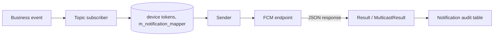
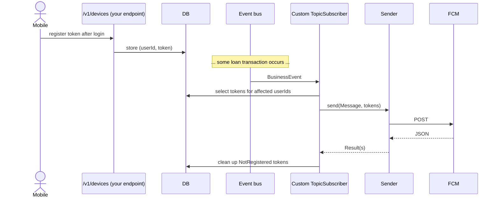
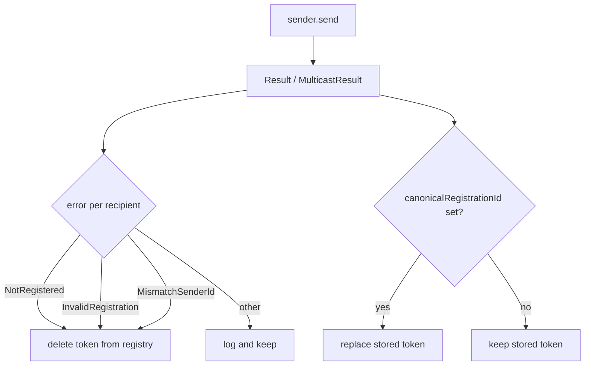

Apache Fineract carries a notification subsystem that fans business events out to subscribers (in-app, email, push). For mobile push the platform ships scaffolding to talk to Google's push services — historically GCM (Google Cloud Messaging) and, after Google rebranded the service, FCM (Firebase Cloud Messaging). This page describes what is in the box, what is configured externally, and where the scaffolding stops short of a turnkey push pipeline.

## What ships

Two parts:

1. **`infrastructure/gcm/`** — a small in-tree implementation of a GCM/FCM sender, the data types for a push message, and the constants/enums for parsing the GCM JSON response.
2. **`infrastructure/configuration/`** — `c_external_service` rows for `NOTIFICATION_GCM_END_POINT` and `NOTIFICATION_FCM_END_POINT`, allowing tenants to configure the endpoint URL and API key without redeploying.

The notification subsystem (`org.apache.fineract.notification`) takes business events from the event bus, but the path that connects "savings transaction posted" to "send a push to the depositor's phone" is **not** wired end-to-end in upstream Apache Fineract. The push side is best thought of as a kit, not an appliance.

## Package layout

```
fineract-provider/src/main/java/org/apache/fineract/infrastructure/gcm/
├── GcmConstants.java
└── domain/
    ├── Message.java          // builder for the GCM/FCM JSON message
    ├── Notification.java     // the notification payload (title, body, sound)
    ├── Result.java           // single-recipient result
    ├── MulticastResult.java  // multi-recipient result
    └── Sender.java           // the HTTP sender — talks to fcm.googleapis.com
```

`Sender` is the active piece. It builds an HTTP POST against the FCM legacy endpoint, sets the `Authorization: key=<server-key>` header, serialises a `Message` to JSON, parses the response, and returns either a `Result` or a `MulticastResult`. It is the same model Google's legacy Java sample carried, brought into the tree so Apache Fineract does not depend on Google's library jar.

## External-service configuration

`ExternalServicesConstants` declares the two relevant keys:

```java
public static final String NOTIFICATION_GCM_END_POINT = "gcm_end_point";
public static final String NOTIFICATION_FCM_END_POINT = "fcm_end_point";
```

These map to rows in `c_external_service`. Each row is a key/value pair scoped to a named service group (here, the `NOTIFICATION` group). At runtime, `ExternalServicesPropertiesReadPlatformService` reads them out:

```java
} else if (rs.getString("name").equalsIgnoreCase(ExternalServicesConstants.NOTIFICATION_GCM_END_POINT)) {
    // populate endpoint string
} else if (rs.getString("name").equalsIgnoreCase(ExternalServicesConstants.NOTIFICATION_FCM_END_POINT)) {
    // populate endpoint string
}
```

So tenants set the endpoint (and the API key, by convention in an adjacent row) via the standard external-services CRUD API. Changing the endpoint does not require a restart.

## The `Sender` class

Conceptually, `Sender` exposes:

| Method | Behaviour |
| --- | --- |
| `Sender(String key)` | Construct with the FCM server key |
| `send(Message msg, String regId, int retries)` | Send to a single registration id |
| `send(Message msg, List<String> regIds, int retries)` | Send to a list of registration ids (multicast) |
| `sendNoRetry(...)` | Single attempt — leaves retry to the caller |

The constructor parameter is described in source as "FCM Server Key obtained through the Firebase Web Console", confirming the FCM-era intent even though the class name retains the historical "GCM" prefix.



The arrow from `SUB` to `SENDER` is the part that is convention rather than upstream-wired code — see "What is stubbed" below.

## The `Message`, `Notification`, and `Result` types

`Message` is a builder for the JSON payload that FCM expects:

| Field | Notes |
| --- | --- |
| `to` / `registration_ids` | Target token(s) |
| `data` | Free-form map for client-side handling |
| `notification` | Visible notification (title, body, sound, icon) |
| `collapseKey` | Group key for collapsing pending notifications |
| `priority` | `normal` or `high` |
| `timeToLive` | TTL in seconds |
| `dryRun` | Test send without delivery |

`Result` carries the per-recipient outcome (`messageId`, `canonicalRegistrationId`, `error`). `MulticastResult` aggregates these. The error strings come from FCM and are documented in `GcmConstants` — `NotRegistered`, `InvalidRegistration`, `Unavailable`, `InternalServerError`, …

## Notification subsystem context

`fineract-provider/.../notification/` provides:

| Package | Role |
| --- | --- |
| `service/` | Notification write/read services, dispatching |
| `domain/` | Notification entities (`m_notification`, mapper to recipients) |
| `eventandlistener/` | Listeners attached to the event bus |
| `cache/` | Per-user inbox cache |
| `api/` | The end-user-facing notifications REST |
| `config/`, `starter/` | Wiring |

The notification subsystem hands you in-app notifications cleanly. What it does **not** ship is:

- Registration table for FCM tokens by user/device.
- An event-to-push-message mapping (which events become pushes, what subject and body).
- A `TopicSubscriber`-style bean that listens to events and calls `Sender.send`.

These are the integration points a deployment fills in.

## What you build to make push work

A working push pipeline involves three pieces of glue:

1. **A device registration endpoint.** A REST endpoint your mobile app calls at login time to register the device's FCM token against the Apache Fineract user. A small entity (`m_notification_device` or similar) keyed by user id storing the token. This is *not* in core; spin it up alongside.
2. **An event listener.** A Spring bean that subscribes to whichever business events should produce a push (e.g. `LoanRepaymentBusinessEvent`, `SavingsTransactionBusinessEvent`), looks up the relevant user's device tokens, and calls `Sender.send` with a built `Message`.
3. **A retry/back-off and token-cleanup pass.** When FCM returns `NotRegistered` or a canonical registration id, the listener should clean up the stale token or rewrite it to the canonical one. The `Result.canonicalRegistrationId` field is there for exactly this.



## What is stubbed for future expansion

The presence of `infrastructure/gcm/` and the external-service constants is the scaffolding. The current state is:

- The HTTP sender works end-to-end against FCM (legacy HTTP API).
- The external-service configuration shape exists.
- There is **no** shipped subscriber bean translating business events into pushes.
- There is **no** shipped device-registration entity or REST endpoint.

Treat this integration as "the network code is done; you write the policy". For a turnkey push pipeline, layer the three pieces above on top.

## A note on FCM HTTP v1

The shipped `Sender` uses FCM's *legacy* HTTP API (the `key=<server-key>` authorisation header). Google has, over time, signalled that the legacy API will sunset in favour of the OAuth2-based HTTP v1 API. If you start a new deployment today:

- The shipped class still works against legacy API.
- For new code, prefer FCM HTTP v1 (which requires obtaining a short-lived OAuth2 token from a service account). You can keep `Message`/`Notification` as DTO shapes and replace just the `Sender` HTTP layer.

## Operational considerations

- Treat the FCM server key as a secret. Rotate via the external-services endpoint; do not bake it into property files.
- Push delivery is best-effort; do not rely on it for state synchronisation. Use a normal data-fetch path on app foreground to reconcile.
- If you scale notifications, batch the device tokens — FCM supports up to 1000 per multicast.

## Implementing the device registration endpoint

A working push pipeline needs the device-token registry. A minimal sketch:

| Element | Suggested shape |
| --- | --- |
| Table | `m_notification_device(id, user_id, token, platform, created_on, last_seen)` |
| Index | `(user_id)`, `(token)` |
| Endpoint | `POST /v1/devices` body `{ token, platform }` — caller authenticated |
| Endpoint | `DELETE /v1/devices/{id}` — explicit logout |

Apache Fineract's existing user model is the join target: the `user_id` is `m_appuser.id`. The platform should attribute the call to the currently-authenticated user via `PlatformSecurityContext`, so a token can only ever be registered against the calling user's identity.

## Sketch of an event listener

A `BusinessEventListener<LoanRepaymentBusinessEvent>` would do something like:

```java
@Component
@RequiredArgsConstructor
public class LoanRepaymentPushNotifier implements BusinessEventListener<LoanRepaymentBusinessEvent> {

    private final NotificationDeviceRepository devices;
    private final Sender sender;

    @Override
    public void onBusinessEvent(LoanRepaymentBusinessEvent event) {
        Long clientId = event.get().getLoan().getClient().getId();
        List<String> tokens = devices.findTokensByClientId(clientId);
        if (tokens.isEmpty()) return;
        Message msg = new Message.Builder()
            .notification(new Notification.Builder("notification_icon")
                .title("Payment received")
                .body("We've received your repayment.")
                .build())
            .build();
        MulticastResult result = sender.send(msg, tokens, 3);
        // clean up NotRegistered tokens from result
    }
}
```

This is intentionally minimal — production code adds tenant context, throttling, locale resolution for the message text, and template loading.

## Cleaning up stale tokens

The most common pitfall with FCM is leaving stale tokens in the registry. The cleanup pattern:



Both legs of this graph should be implemented in the listener — without them, the registry rots and delivery rates drop.

## End-user-facing notifications vs push

The notification subsystem has two distinct delivery channels conceptually:

1. **In-app**, served by `/v1/notifications` — read by the web UI to populate a bell icon. The platform owns this end-to-end.
2. **Push to mobile**, served by FCM — this page. The platform owns the *sending half* via `Sender`; the *triggering half* is your responsibility.

There is no overlap in storage between the two: a fired push is not retained in any "sent push" table by the upstream platform. If you need send-history, write it as part of your custom listener.

## Where to next

- [Report mailing](/integrations/report-mailing-job) — the most production-grade outbound integration in core.
- The notification subsystem documentation in the core section (event bus and listeners) explains the upstream half of the wiring.

<CardGroup cols={2}>
  <Card title="Integrations overview" icon="map" href="/integrations/overview">
    Back to the index.
  </Card>
  <Card title="Report mailing" icon="envelope" href="/integrations/report-mailing-job">
    A production-ready outbound integration to compare against.
  </Card>
</CardGroup>
