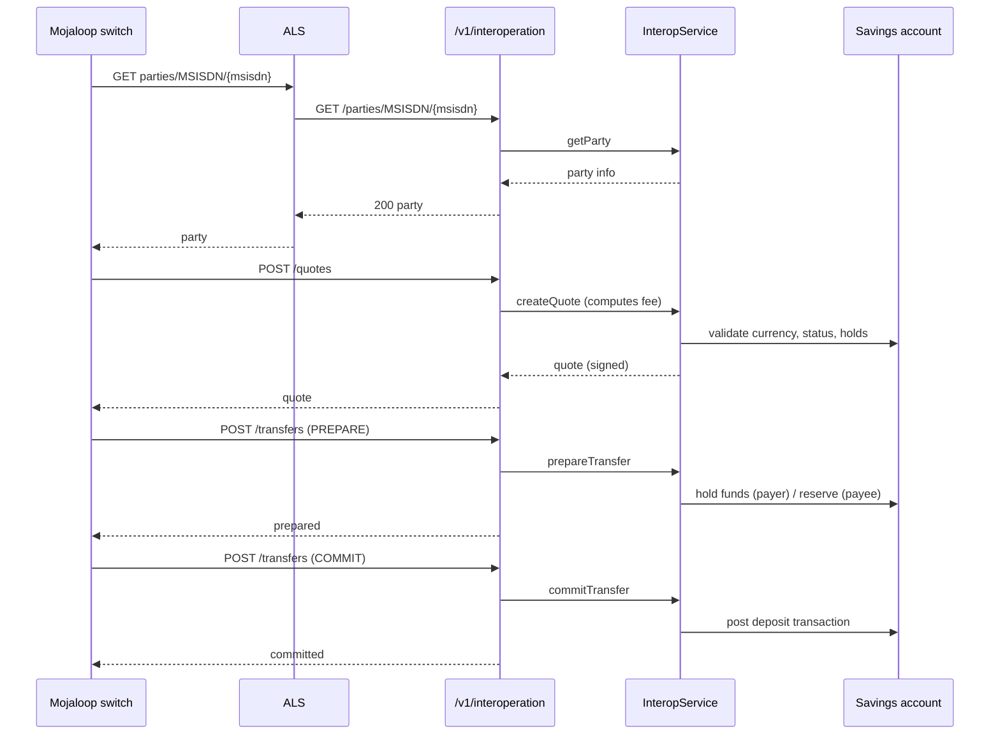
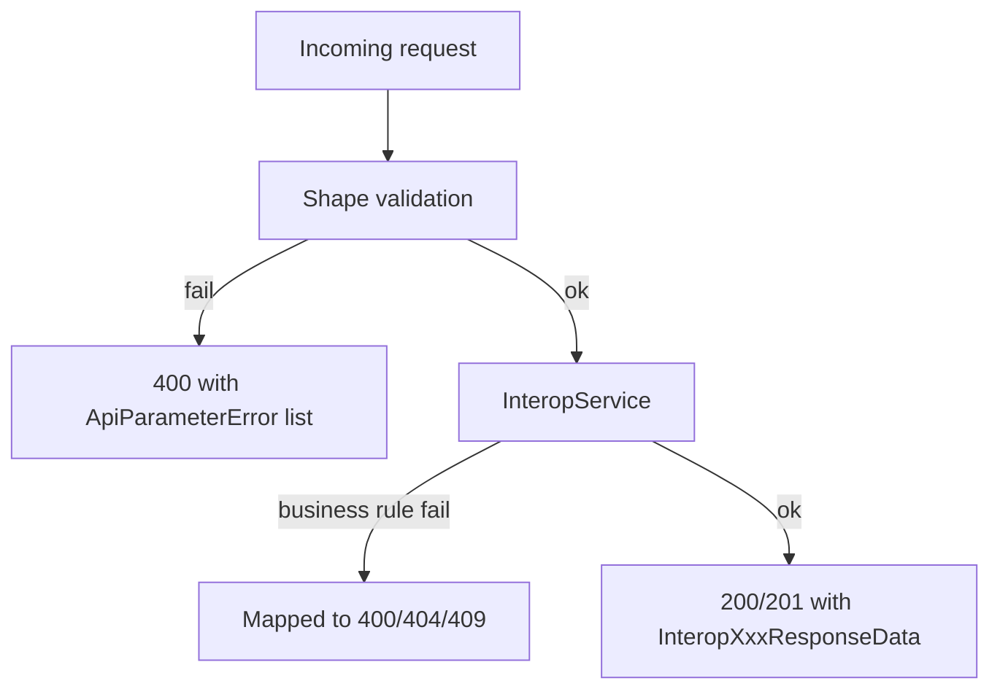
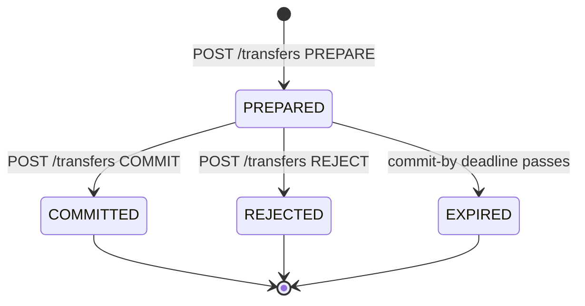

Mojaloop is the open-source real-time payment interoperability platform — the runtime piece behind several national instant-payment switches. Apache Fineract ships an interoperation API that speaks the data shapes Mojaloop's account lookup, quote, and transfer flows expect, so a savings account in Apache Fineract can be the endpoint of an interoperable payment. This page documents the REST surface, the call sequence, and how it maps onto savings transactions.

## Where it lives

`fineract-provider/src/main/java/org/apache/fineract/interoperation/` is the module:

- `api/InteropApiResource.java` — the JAX-RS resource serving `/v1/interoperation`
- `data/Interop*Data.java` — the request and response DTOs (JSON-Schema-shaped to match Mojaloop)
- `domain/` — `InteropIdentifierType`, `InteropTransferActionType`, account-link entities
- `service/InteropService` — the interface the resource calls into; implementations sit alongside
- `util/InteropUtil.java` — shared constants and helpers

The single resource binds the URL space:

```java
@Path("/v1/interoperation")
@Component
@Tag(name = "Inter Operation", description = "")
@RequiredArgsConstructor
public class InteropApiResource {
    private final PlatformSecurityContext context;
    private final ApiRequestParameterHelper apiRequestParameterHelper;
    private final DefaultToApiJsonSerializer<CommandProcessingResult> jsonSerializer;
    private final InteropService interopService;
    private final PortfolioCommandSourceWritePlatformService commandsSourceService;
    // ...
}
```

## Endpoint map

The shipped endpoints fall into five groups, mirroring the Mojaloop ALS → Quoting Service → Transfer Service flow.

### Health and accounts

| Method | Path | Purpose |
| --- | --- | --- |
| `GET` | `/health` | Liveness probe — returns `"OK"` |
| `GET` | `/accounts/{accountId}` | Account snapshot — `InteropAccountData` |
| `GET` | `/accounts/{accountId}/transactions` | Recent transactions — `InteropTransactionsData` |
| `GET` | `/accounts/{accountId}/identifiers` | Aliases registered for this account |
| `GET` | `/accounts/{accountId}/kyc` | KYC summary — `InteropKycResponseData` |

`accountId` here is the Apache Fineract savings account number, not the Mojaloop party id.

### Party lookup (ALS)

| Method | Path | Purpose |
| --- | --- | --- |
| `GET` | `/parties/{idType}/{idValue}` | Look up a party by alias |
| `GET` | `/parties/{idType}/{idValue}/{subIdOrType}` | Same with a sub-identifier (e.g. MSISDN + extension) |
| `POST` | `/parties/{idType}/{idValue}` | Register an alias on a savings account |
| `POST` | `/parties/{idType}/{idValue}/{subIdOrType}` | Register a sub-aliased party |
| `DELETE` | `/parties/{idType}/{idValue}` | Unregister an alias |
| `DELETE` | `/parties/{idType}/{idValue}/{subIdOrType}` | Unregister a sub-aliased party |

`idType` values come from `InteropIdentifierType` and correspond to Mojaloop's enum (`MSISDN`, `EMAIL`, `IBAN`, `BUSINESS`, etc.). The `idValue` is the literal alias the switch will resolve when it sees a payment instruction.

### Transaction requests

| Method | Path | Purpose |
| --- | --- | --- |
| `GET` | `/transactions/{transactionCode}/requests/{requestCode}` | Fetch a stored transaction request |
| `POST` | `/requests` | Create a transaction request (payee pull) |

### Quotes

| Method | Path | Purpose |
| --- | --- | --- |
| `GET` | `/transactions/{transactionCode}/quotes/{quoteCode}` | Fetch a stored quote |
| `POST` | `/quotes` | Create a quote — compute fees and commit |

### Transfers

| Method | Path | Purpose |
| --- | --- | --- |
| `GET` | `/transactions/{transactionCode}/transfers/{transferCode}` | Fetch a stored transfer |
| `POST` | `/transfers` | Prepare / commit / reject a transfer |
| `POST` | `/transactions/{accountId}/disburse` | Disburse a loan via the interop channel |

The `POST /transfers` body carries a `transferAction` of `PREPARE`, `COMMIT`, or `REJECT` (see `InteropTransferActionType`), which is the Mojaloop two-phase commit protocol.

## End-to-end flow

A successful Mojaloop transfer landing on a Apache Fineract savings account goes through:



`PREPARE` and `COMMIT` are split because Mojaloop's settlement model requires the receiving DFSP to acknowledge prepare before the switch agrees to commit. Apache Fineract honours that by reserving but not posting on prepare, and posting on commit.

## Mapping to savings transactions

When a transfer commits inbound, the implementation posts a savings deposit transaction with a transaction note pointing back at the Mojaloop transfer code. When a transfer commits outbound, the implementation posts a savings withdrawal. Both use the existing savings write-platform service, so:

- The transaction shows up in the standard savings transaction history.
- Standard charges, balance updates, and journal-entry posting all run normally.
- The transaction's external id is set to the Mojaloop transfer code, so reconciliation against switch records is by id.

## Party identifiers and account links

`InteropIdentifierType` maps to columns on the link table that joins savings accounts to aliases:

| Type | Typical content |
| --- | --- |
| `MSISDN` | Mobile number in E.164 |
| `EMAIL` | Email address |
| `PERSONAL_ID` | National ID / passport |
| `BUSINESS` | Business registration number |
| `DEVICE` | Device identifier (mobile money agents) |
| `ACCOUNT_ID` | Bank account number |
| `IBAN` | International bank account number |
| `ALIAS` | Free-form alias |

A single savings account can have many aliases; deletion is per-alias.

## Validation

The resource pre-validates incoming payloads via `DataValidatorBuilder` before handing off to `InteropService`. Failures are aggregated as `PlatformApiDataValidationException` (HTTP 400 with the standard error envelope). Once the validators pass, the service handles business-rule failures by throwing the more specific Apache Fineract exceptions (`SavingsAccountNotFoundException`, `InsufficientAccountBalanceException`, …), which the global exception mapper translates into the appropriate HTTP status.



## Quotes and fees

The quote endpoint is where Apache Fineract gets to add its own pricing. The service:

1. Loads the savings account.
2. Resolves the currency match against the requested currency.
3. Calculates any fees that should attach (account-level fees, transaction-level fees configured on the savings product).
4. Returns the signed quote response with the gross/net amounts and the commit-by timestamp.

The fee component is the natural extension point — write a custom `InteropQuoteService` and replace the bean if your switch agreement has bespoke pricing.

## Disbursement via interop

`POST /transactions/{accountId}/disburse` is an interesting endpoint: it lets a loan be disbursed straight into an interoperable payee account without going through a separate transfer dance. It is convenient for digitally originated loans where the entire flow runs through Mojaloop.

## Configuration and security

The endpoints live behind the standard Apache Fineract security stack:

- A first-party caller (your origination UI) authenticates with basic auth or OAuth like any other endpoint.
- A switch-side caller (the Mojaloop ALS or quoting service) typically authenticates via a service account whose permissions are scoped to just the interop endpoints.

Mojaloop traffic is mTLS in production; that is terminated at the ingress (NGINX, Envoy, an API gateway) — Apache Fineract itself sees the decrypted HTTPS request.

## Limitations

- The shipped implementation does not implement the Mojaloop SDK callback model directly; it implements the *server* side of the API (the DFSP). A client adapter for outbound payee/quote calls is a separate piece of work.
- The party lookup is per-tenant; in a multi-tenant deployment ensure the URL routing strategy your switch uses (subdomain, header, path prefix) is plumbed into Apache Fineract's tenant resolver.
- Settlement reporting at the switch level is not in scope — the platform records transactions, you reconcile externally.

## Mojaloop role in summary

Mojaloop separates concerns across several services: the Account Lookup Service (ALS) resolves party aliases to DFSPs, the Quoting Service prices the transfer, and the Transfer Service moves the money. The Apache Fineract interop endpoints implement the *DFSP-side* responses to all three:

| Mojaloop service | What it asks the DFSP | Apache Fineract endpoint |
| --- | --- | --- |
| ALS | "Which DFSP owns this MSISDN?" | `GET /parties/{idType}/{idValue}` |
| Quoting | "Quote a transfer of X from A to B" | `POST /quotes` |
| Transfer | "Prepare/commit/reject this transfer" | `POST /transfers` |

Aside from these reactive endpoints, the integration also supports proactive registration of party aliases through the `POST /parties/...` endpoints — useful when the operator adds a new savings account and wants to make it interoperable from day one.

## Identifier model in detail

`InteropIdentifierType` is the enum of supported alias kinds. The platform maps each value onto the `m_interop_identifier` table; the unique key is the `(type, value, subValueOrType)` triple. That triple has to be globally unique within the tenant — the same `MSISDN` cannot be linked to two savings accounts at once.

Registration is per-tenant. When a switch sends a party lookup against the platform, the tenant resolution must happen before the alias is queried (via subdomain, header, or path prefix routing), or the lookup might cross tenants and reveal the wrong account.

## Quote shape

`InteropQuoteResponseData` (returned from `POST /quotes`) carries:

| Field | Meaning |
| --- | --- |
| `quoteCode` | Echo of the request quote code |
| `transactionCode` | Echo of the transaction code |
| `state` | Quote state |
| `expiration` | When the quote becomes stale |
| `transferAmount` | Net amount the payee will receive |
| `payeeReceiveAmount` | Final amount credited |
| `payeeFspFee` | Fee charged by the payee FSP |
| `payeeFspCommission` | Commission paid to the payee FSP |
| `ilpPacket` | Interledger packet for the switch |
| `condition` | The HTLC condition |

The `condition`/`fulfilment` pair is Mojaloop's HTLC envelope — Apache Fineract generates and verifies them as part of the transfer commit step. The actual cryptographic plumbing is in the service layer.

## Transfer state machine



`InteropTransferActionType` carries the three action values that drive these transitions. The platform's commit step posts the savings transaction synchronously and records the fulfilment on the transfer record; subsequent `GET` calls reflect the final state.

## Idempotency

The two `transferCode` and `quoteCode` parameters make the API idempotent at the protocol level. A `POST /transfers` with a `transferCode` that already exists in `COMMITTED` state is a no-op success — the platform simply returns the previously stored result. This matters because Mojaloop switches retry aggressively on timeout.

## Where to next

- Savings transactions, hold/release semantics, and the savings product fee model are covered in the savings section.
- For other external integrations with a similar HTTP-callback shape, see [credit bureau](/integrations/credit-bureau).

<CardGroup cols={2}>
  <Card title="Integrations overview" icon="map" href="/integrations/overview">
    Back to the index.
  </Card>
  <Card title="Credit bureau" icon="id-card" href="/integrations/credit-bureau">
    Another outbound-HTTP integration to compare against.
  </Card>
</CardGroup>
