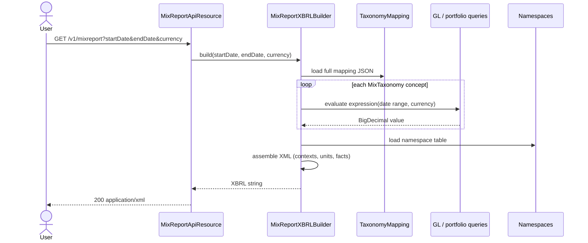
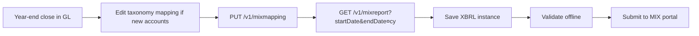

The Microfinance Information Exchange (MIX, now part of the World Bank) collects standardised performance and outreach data from financial inclusion providers worldwide. The data exchange format is XBRL with a domain-specific MIX taxonomy. Apache Fineract ships the `fineract-mix` module so a deployment can generate those XBRL filings from its own ledger and portfolio data — no external accountant spreadsheet round-trip required.

## Module layout

`fineract-mix/src/main/java/org/apache/fineract/mix/`:

| Package | Role |
| --- | --- |
| `api/` | Three JAX-RS resources — report, taxonomy, mapping |
| `command/` | Command DTOs for taxonomy mapping changes |
| `data/` | Read-side DTOs |
| `domain/` | Six JPA entities |
| `exception/` | Module-specific exceptions |
| `handler/` | Command handlers |
| `mapping/` | Mappers between rows and DTOs |
| `service/` | Read services, the XBRL build service, the taxonomy mapping write service |

There is no scheduler integration; XBRL builds are triggered by an explicit `GET` on the report endpoint. The expectation is that a user (a financial controller) downloads the filing on demand, reviews it, and submits it through the MIX portal.

## Domain entities

```mermaid
classDiagram
    class MixTaxonomy {
        +Long id
        +String name
        +String namespaceUrl
        +String dimension
        +String type
        +String description
    }
    class MixTaxonomyMapping {
        +Long id
        +String config
        +String identifier
    }
    class MixReportXBRLNamespace {
        +Long id
        +String prefix
        +String url
    }
    MixTaxonomy "*" --> "1" MixTaxonomyMapping : "is mapped by"
    MixReportXBRLNamespace --|> "namespaces declared in built XBRL"
```

### `MixTaxonomy`

The catalogue of MIX taxonomy concepts. Each row represents one fact that the MIX schema understands — `MIX_GrossLoanPortfolio`, `MIX_NumberOfActiveBorrowers`, etc. Columns include the concept's name, the XBRL namespace URL it belongs to, the dimension it lives on, and a human-friendly description.

### `MixTaxonomyMapping`

The mapping table. `config` is a JSON document keyed by taxonomy id, with values that are Apache-Fineract-expressible expressions: GL account code(s) to sum, a portfolio aggregation reference, or a constant. The mapping is what turns "MIX wants this fact" into "here is the number to put".

### `MixReportXBRLNamespace`

The XML namespaces declared in the generated XBRL instance documents. Standard rows ship for the XBRL Linkbase and dimensional taxonomy namespaces; tenants typically do not edit these.

## XBRL build service

`MixReportXBRLBuilder` is the orchestrator that takes a date range plus a currency and produces a complete XBRL instance document. The flow:



The build is one big synthesis step: each taxonomy concept has an expression in the mapping, the expression evaluates to a number against the live database for the requested period, and the assembled instance document declares all the namespaces, the relevant context (period and entity), the unit, and one `<fact>` element per concept.

## REST surface

### `MixTaxonomyApiResource`

Path: `/v1/mixtaxonomy`.

| Method | Path | Purpose |
| --- | --- | --- |
| `GET` | `` | List taxonomy concepts |

The taxonomy itself is reference data — there are no write endpoints in core.

### `MixTaxonomyMappingApiResource`

Path: `/v1/mixmapping`.

| Method | Path | Purpose |
| --- | --- | --- |
| `GET` | `` | Read the current mapping |
| `PUT` | `` | Replace the mapping (whole JSON document) |

The mapping is `PUT`-replace rather than per-concept patches because tenants typically maintain it in a spreadsheet and re-import the whole thing.

### `MixReportApiResource`

Path: `/v1/mixreport`.

| Method | Path | Purpose |
| --- | --- | --- |
| `GET` | `` | Build and download an XBRL filing for a period |

Required query parameters are `startDate`, `endDate`, and `currency`. The response is an XML document (the XBRL instance), served with `Content-Type: application/xml`.

## Namespaces declared in the output

The generated XBRL declares the standard set:

| Prefix | Namespace |
| --- | --- |
| `xbrli` | `http://www.xbrl.org/2003/instance` |
| `link` | `http://www.xbrl.org/2003/linkbase` |
| `xlink` | `http://www.w3.org/1999/xlink` |
| `iso4217` | `http://www.xbrl.org/2003/iso4217` |
| `xbrldi` | `http://xbrl.org/2006/xbrldi` |
| `mix` | MIX-specific concept namespace |
| `dim` | MIX dimensional namespace |

The exact set is whatever `MixReportXBRLNamespace` rows the tenant has — the builder dumps them all on the root element so the document validates against the MIX schema.

## How a fact gets computed

For each `MixTaxonomy` row, the mapping JSON has an entry like:

```json
{
  "MIX_GrossLoanPortfolio": "GL:1000+GL:1001",
  "MIX_NumberOfActiveBorrowers": "PORTFOLIO:active-borrower-count"
}
```

The builder parses the expression:

- `GL:<code>` references a single general-ledger account; the builder runs a sum over journal entries in the period.
- `GL:<code>+GL:<code>` (and `-`) compose multiple accounts.
- `PORTFOLIO:<key>` references a built-in portfolio aggregation (active borrower count, par-30, etc.).
- A literal number is taken as-is.

Unknown expressions produce a build error rather than a silent zero — XBRL filings should not contain "we have no idea" facts.

## Period contexts

XBRL instances need context elements that fix the entity and period of each fact. The builder emits one duration context (the requested start/end dates) and one instant context (typically the end date) so facts can attach to whichever is appropriate. The "entity" identifier is the tenant's MIX subscriber id — also configured via the taxonomy mapping or as a property.

## Unit declarations

Monetary facts declare an `iso4217:XYZ` unit (where `XYZ` is the requested currency code). Non-monetary facts (counts, ratios) use the `pure` unit. The builder emits each unit at most once at the top of the document.

## Validation

The platform does not validate the output against the MIX taxonomy XSD at build time; it produces a syntactically correct XBRL instance and leaves schema validation to the MIX portal (or to your own pipeline). For a self-validating workflow, post the output through an offline XBRL validator before submitting.

## Performance characteristics

XBRL builds traverse the GL for the requested period, which on large deployments can be a heavy query. In practice:

- Use the smallest period you need (typically a fiscal year).
- Ensure the GL has appropriate indexes on `transaction_date` and account columns.
- If the build is slow, profile the per-concept queries — the bottleneck is usually one or two concepts that span many GL accounts.

## Module starter

`starter/` contains the Spring Boot autoconfiguration that exposes the JAX-RS resources when the module is on the classpath. The module is bundled into the default Apache Fineract distribution; turn it off by excluding the dependency in your custom build.

## Practical workflow



The platform's role is the middle of that chain; everything upstream (close) and downstream (submission) is up to your finance team.

## Limits

- The taxonomy in the database needs to be in sync with the MIX taxonomy you intend to file against. Mid-year taxonomy upgrades require re-seeding.
- Multi-currency builds need either consolidation upstream of XBRL or one build per currency — the builder produces a single-currency instance.
- The output format is fixed-shape; there is no template engine for variant filings.

## Why a JSON-shaped mapping?

The mapping is stored as JSON rather than as one row per taxonomy concept because tenants typically maintain it in a spreadsheet: a column for the concept, a column for the expression. Re-importing the whole document on `PUT` matches that maintenance pattern. A normalised row-per-concept store would require the platform to know the diff semantics and provide a per-row PUT — extra machinery for no operational benefit.

The trade-off is that two editors can stomp on each other's changes if both PUT concurrently. In practice the maintenance is a once-a-quarter activity done by one person, so the last-write-wins behaviour is acceptable.

## Identity disclosure

The XBRL instance declares the *entity* fact via the context's `<identifier>` element. Out of the box the platform uses a placeholder; tenants override it with a MIX subscriber id pulled from configuration. The setting is part of the mapping JSON by convention:

```json
{
  "_meta": {
    "entityIdentifier": "MIX-XXXXX",
    "entityIdentifierScheme": "http://www.themix.org/standards/mfi"
  },
  "MIX_GrossLoanPortfolio": "GL:1000+GL:1001"
}
```

The builder treats keys with a leading underscore as metadata, not as taxonomy mappings.

## Extending with non-MIX concepts

Although the module is named for MIX, the underlying engine is generic. A tenant that wants to file a different XBRL-encoded report (e.g. a national regulator's prudential return) can:

1. Seed the regulator's concepts as `MixTaxonomy` rows (yes, the table is named "Mix" but it accepts any taxonomy).
2. Add the regulator's namespaces to `MixReportXBRLNamespace`.
3. Provide expressions in the mapping JSON.

The output URL would still be `/v1/mixreport` but the instance document would be valid against the regulator's schema. Renaming the table for cleanliness is a sometime-in-the-future TODO.

## Operational checklist

| Check | When |
| --- | --- |
| Review the mapping after every chart-of-accounts change | At GL maintenance time |
| Re-seed the taxonomy after a MIX schema update | Annually or on notice |
| Validate the output offline against the MIX XSD | Before each submission |
| Sample a few facts manually against the underlying SQL | Once a quarter |
| Archive the submitted instance and the SHA-256 hash | Every submission |

## Where to next

- [SPM surveys](/integrations/spm-surveys) — another framework-supplied reporting/measurement integration.
- [Report mailing](/integrations/report-mailing-job) — for non-XBRL scheduled deliveries.

<CardGroup cols={2}>
  <Card title="Integrations overview" icon="map" href="/integrations/overview">
    Back to the index.
  </Card>
  <Card title="SPM surveys" icon="clipboard-list" href="/integrations/spm-surveys">
    Companion measurement subsystem on the social-performance side.
  </Card>
</CardGroup>
