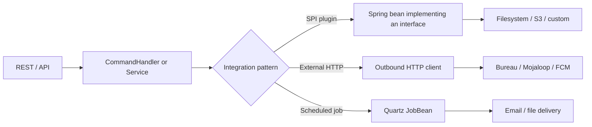
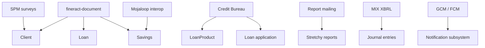
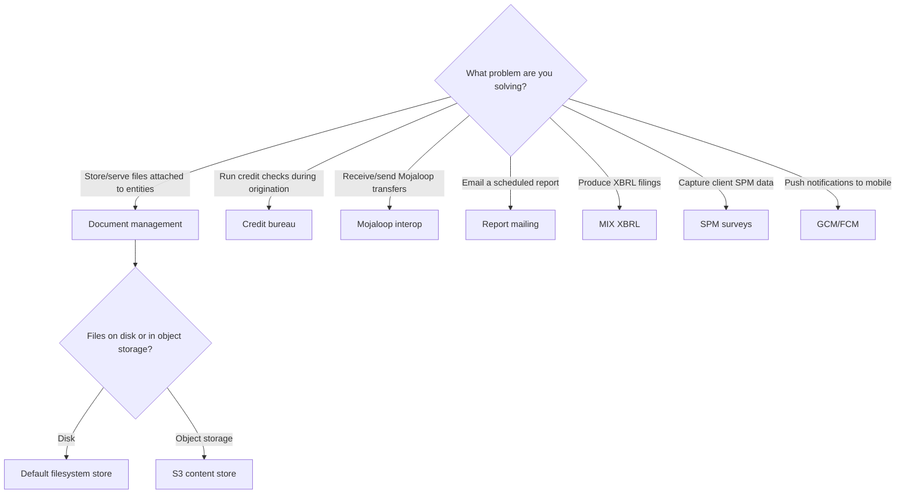

Apache Fineract is a core banking platform, but a real deployment never stands alone. Borrowers want their loan agreements stored somewhere durable, regulators want XBRL filings, treasury wants Mojaloop interop, ops wants Monday-morning portfolio reports in their inbox, and product wants to push payment-due notifications to a mobile app. Every one of those touches a different external system, and Apache Fineract ships modules that expose well-defined seams for each. This page is the index — pick the integration you care about and dive in.

## What lives under "integrations"

The modules grouped in this section share one trait: they bridge the Apache Fineract core to something outside its own database. They are not portfolio mechanics (those live under loan/savings/accounting), they are not generic infrastructure (caching, transactions, security). They are I/O at the edges of the platform.

| Integration | Module | Purpose |
| --- | --- | --- |
| Document management | `fineract-document` | Attach files/images to clients, loans, savings via REST |
| S3 content store | `fineract-document` | Plug AWS S3 (or compatible) in behind the document API |
| Credit bureau | `fineract-provider` | Pull credit reports during loan origination |
| Mojaloop interop | `fineract-provider` | ALS-style account lookup, quote, transfer flow |
| Report mailing | `fineract-provider` | Run a stock report on a schedule and email the output |
| MIX XBRL | `fineract-mix` | Generate MIX Market XBRL filings from portfolio data |
| SPM surveys | `fineract-provider` | Social-Performance-Management surveys and scorecards |
| GCM / FCM | `fineract-provider` | Mobile push notification dispatch wiring |

Each integration is feature-flagged or wired only when its dependencies are present, which means an Apache Fineract deployment can ship a focused surface without dragging unused subsystems in.

## How integrations are wired in

Every integration here follows one of three patterns. Knowing which pattern a module uses tells you how to extend it.

- **SPI plugin** — a Spring interface (`ContentStoreService` for documents) with multiple implementations, chosen by configuration. New providers drop in as additional `@Service` beans.
- **External HTTP** — outbound calls to a third party (credit bureaus, Mojaloop, FCM). Endpoint and credentials come from `c_external_service` rows or `fineract.*` properties.
- **Scheduled job** — a Quartz job class (`EXECUTE_REPORT_MAILING`, MIX builders) that wakes on a cron and runs the integration end-to-end.

## Reading order

If you are new to this section, the natural reading order is:

<CardGroup cols={2}>
  <Card title="Document management" icon="folder-open" href="/integrations/document-management">
    The fineract-document module — file uploads dispatched via ContentRepository SPI.
  </Card>
  <Card title="S3 content store" icon="aws" href="/integrations/s3-content-store">
    The S3 implementation of that SPI, configured by fineract.content.s3.* properties.
  </Card>
  <Card title="Credit bureau" icon="id-card" href="/integrations/credit-bureau">
    CreditBureau, OrganisationCreditBureau, LoanProductCreditBureauMapping.
  </Card>
  <Card title="Mojaloop interop" icon="network-wired" href="/integrations/interoperation-mojaloop">
    InteropApiResource — parties, quotes, transfers on top of savings accounts.
  </Card>
  <Card title="Report mailing" icon="envelope" href="/integrations/report-mailing-job">
    ReportMailingJob — attach a stock report to email recipients on a cron.
  </Card>
  <Card title="MIX XBRL" icon="chart-line" href="/integrations/mix-xbrl">
    fineract-mix — XBRL taxonomy, namespaces, MixReportXBRLBuilder.
  </Card>
  <Card title="SPM surveys" icon="clipboard-list" href="/integrations/spm-surveys">
    Survey, Question, Scorecard for Social Performance Management.
  </Card>
  <Card title="GCM / FCM" icon="bell" href="/integrations/gcm-fcm">
    The push-notification wiring under infrastructure/gcm.
  </Card>
</CardGroup>

## What each integration touches in core

The diagram is incomplete on purpose: every integration also leans on the security model (so calls authenticate as real users), the multi-tenant data source routing, and the command handler envelope when it mutates state. Those are not redrawn here — see the runtime and security sections.

## Feature flags and conditional wiring

Most integrations are either always-on (document management, SPM, MIX) or guarded by a Spring `@ConditionalOnProperty` so they do nothing unless explicitly enabled. The two biggest examples:

- `fineract.content.s3.enabled=true` switches the document store from local filesystem to S3 — see [S3 content store](/integrations/s3-content-store).
- Mojaloop interop is exposed under `/v1/interoperation` only when the `InteropService` bean is wired — typically alongside an external Mojaloop ALS configuration.

The investor module (asset externalization to outside investors) is also wired conditionally; it shares many architectural ideas with the integrations here but lives in its own section.

<CardGroup cols={2}>
  <Card title="Investor module overview" icon="hand-holding-dollar" href="/investor/overview">
    Asset externalization — transfer loans out to external owners with a dedicated COB step.
  </Card>
  <Card title="Investor COB business steps" icon="gears" href="/investor/investor-cob">
    LoanAccountOwnerTransferBusinessStep and its companion check step.
  </Card>
</CardGroup>

## Versioning and stability

The integrations vary in maturity. Document management and S3 content store are first-class and used by every default deployment. Credit bureau and Mojaloop interop are stable APIs but their concrete adapters tend to be tenant-specific. MIX XBRL has a stable schema but a small consumer base. Report mailing and SPM are stable. GCM/FCM exists more as a wire-up scaffold than a working push-out-of-the-box delivery pipeline — read the [GCM / FCM page](/integrations/gcm-fcm) before relying on it.

When you depend on one of these in production, pin the Apache Fineract version, snapshot the relevant `c_external_service` rows, and write a smoke test that exercises the integration end-to-end on each upgrade.

## Why these and not others

Apache Fineract is a banking platform, so the obvious question is "where is the payment-gateway integration? Where is the card-processor adapter?". The answer: those are deliberately *not* in core. The platform's stance is that payment rails are deployment-specific (one rail per region, with bespoke message shapes), and modelling them in core would generate either an unwieldy union of every rail's quirks or a lowest-common-denominator that nobody can use. The integrations that *are* in core are either:

- **Generic enough to be country-agnostic** (document storage, push notifications, scheduled email reports).
- **Standards-based** (Mojaloop, XBRL).
- **Universal compliance touchpoints** (credit bureau lookup, SPM).

Payment-rail integration is left to deployments — usually via custom HTTP adapters that call the platform's savings transaction or loan disbursement endpoints.

## A common architectural pattern

Every integration in this section follows three architectural rules, and you will recognise them in every page that follows. Understanding them once makes each page faster to read.

### Rule 1: The platform never blocks on the network

External services fail. Apache Fineract treats every outbound call as a potential failure path and isolates it so the failure does not cascade. Concrete examples:

- The document subsystem stores the bytes through the SPI; if the backend fails, the JPA transaction rolls back the metadata row before returning. Partial uploads do not produce orphan rows.
- The credit bureau adapter is called inside a separate transaction from the loan-application command. Bureau failures do not roll back the application; they record a "report not available" state.
- The Mojaloop interop endpoints implement two-phase commit so a switch-side timeout can retry without double-spending.
- The report mailing job records errors in a run-history row and lets the next cron tick try again.

### Rule 2: External configuration lives in tenant-rotatable storage where possible

Almost every integration takes some piece of configuration from `c_external_service` (key/value rows scoped to a named service group) or from a domain-specific configuration table (`m_creditbureau_configuration`, `m_report_mailing_job`, etc.). The exceptions are the S3 content store (Spring properties) and the SMTP transport (Spring properties). Configuration that lives in the database can be rotated without a redeploy; configuration that lives in properties requires the deploy pipeline.

### Rule 3: Side effects observable, mutations auditable

State-mutating operations go through the standard command pipeline so they leave audit rows in `m_portfolio_command_source`. Read-only operations do not. That keeps the audit table focused on changes that matter.

## Operational concerns common to every integration

Although each module solves a different external problem, they share five concerns you should think through *before* turning any of them on.

### Credentials

External services need credentials. Apache Fineract stores them in three places depending on the integration:

| Storage | Used by |
| --- | --- |
| Spring property files | Document store (S3 bucket and credentials) |
| `c_external_service` rows | GCM/FCM endpoints, mail server, generic external APIs |
| `m_creditbureau_configuration` rows | Per-bureau credentials, scoped to organisation credit bureau |

For production, treat the property-based credentials as immutable per-deployment (rotation requires redeploy) and the database-backed ones as runtime-rotatable.

### Multi-tenancy

Most integrations are tenant-scoped by virtue of the database isolation Apache Fineract provides — credit-bureau configurations, report-mailing jobs, SPM surveys all live in the tenant schema. The exceptions are the few that read from Spring properties (the S3 content store endpoint and credentials, the default mail SMTP host). For these, decide upfront whether your tenants share or each get their own.

### Auditing

External calls that mutate state (registering an alias on Mojaloop, sending a notification, pulling a credit report and being charged) should leave an audit row. The platform's command-sourcing layer takes care of that for any change that goes through the command pipeline; for outbound side-effects without a command (a fired notification), the integration is responsible for its own audit table.

### Retry and idempotency

Network failures happen. Each integration ships its own retry policy:

- The S3 content store relies on AWS SDK's default retry logic.
- The credit bureau adapter is expected to handle bureau-specific retry on transient 5xx.
- The report mailing job's "next run" calculation will pick up failed runs on the next cron tick — failures are visible in the run-history table.
- Mojaloop's two-phase commit gives idempotency for free; the platform's PREPARE/COMMIT/REJECT actions are idempotent on a given transfer code.

### Observability

Wire every integration into your metrics and logs. The platform emits structured logs on each adapter call; integrations that call external HTTPS endpoints should also emit a histogram of response times.

## Where to next

Pick whichever integration you actually need, or start at [document management](/integrations/document-management) if you want to see the cleanest example of how Apache Fineract isolates an external system behind a SPI.

If you came here from the [investor](/investor/overview) section because you wanted to know whether asset externalization is "an integration" in the sense this page uses — the answer is no: it is a fully internal mechanism. But it shares the same architectural patterns described above (Spring beans wired by feature flag, command pipeline, COB-driven completion), so reading this page first gives useful context.

## Cross-module composition

Some integrations compose well with others. The most common pairings:

| Pair | Useful because |
| --- | --- |
| Document management + S3 | Ship attachments off the application VMs |
| Credit bureau + report mailing | Daily exposure report emailed to risk officers |
| SPM surveys + report mailing | Periodic social-performance dashboards |
| Mojaloop interop + GCM/FCM | Push notification on inbound transfer commit |
| MIX XBRL + report mailing | Quarterly XBRL filing emailed to finance |

None of these compositions need any wiring beyond enabling both modules — the integrations are independent, and the platform's event bus and command pipeline give the touchpoints to compose at.

## How to know which integration you need

A short decision tree:

If your problem does not fit any of these branches, it is likely not an "integration" in the sense this section uses. Custom integrations are usually built as either:

- A Spring bean that hooks the business-event bus (for outbound side effects).
- A custom JAX-RS resource that calls a `WritePlatformService` (for inbound integration).
- A custom Quartz job (for scheduled actions).

These are all covered in the runtime / extensibility sections, not here.

## A note on the term "integration"

Throughout this section "integration" is used loosely to mean "modules that talk to systems outside Apache Fineract or produce outputs for external consumption". Some of these are inbound (Mojaloop interop, document upload), some are outbound (report mailing, GCM push), and a few do both (credit bureau pulls a report then stores it). The grouping is editorial: it gathers pages that share an architectural pattern, not a strict taxonomy.

If you came here looking for "how Apache Fineract integrates with a specific third party", treat this section as the starting point but expect the last mile to be deployment-specific code outside the upstream tree.

## Reference summary

| Section page | Source module | Conditional flag |
| --- | --- | --- |
| [Document management](/integrations/document-management) | `fineract-document` | Always wired |
| [S3 content store](/integrations/s3-content-store) | `fineract-document` | `fineract.content.s3.enabled=true` |
| [Credit bureau](/integrations/credit-bureau) | `fineract-provider` (`infrastructure/creditbureau`) | Always wired; adapters extra |
| [Mojaloop interop](/integrations/interoperation-mojaloop) | `fineract-provider` (`interoperation`) | Wired when `InteropService` available |
| [Report mailing](/integrations/report-mailing-job) | `fineract-provider` (`infrastructure/reportmailingjob`) | Always wired |
| [MIX XBRL](/integrations/mix-xbrl) | `fineract-mix` | Always wired when module on classpath |
| [SPM surveys](/integrations/spm-surveys) | `fineract-provider` (`spm`) | Always wired |
| [GCM / FCM](/integrations/gcm-fcm) | `fineract-provider` (`infrastructure/gcm`) | Scaffolding only |
