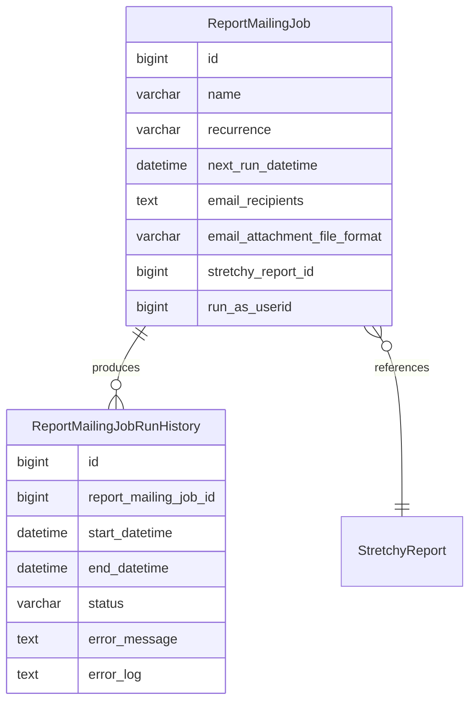
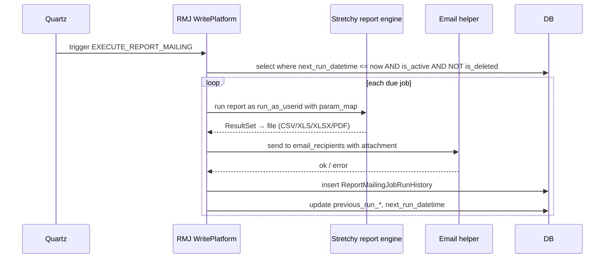

Apache Fineract carries a generic "run a stretchy report on a schedule and email the result to a list of recipients" mechanism — the report mailing job. It exists because operations teams want the Monday-morning portfolio summary in their inbox as a CSV/PDF/XLSX, without anyone logging into Apache Fineract. This page covers the entity, the REST API, the scheduler integration, and the run history.

## Module layout

`fineract-provider/src/main/java/org/apache/fineract/infrastructure/reportmailingjob/`:

| Package | Role |
| --- | --- |
| `api/` | Two JAX-RS resources — for jobs and for run history |
| `data/` | Read-side DTOs |
| `domain/` | `ReportMailingJob`, `ReportMailingJobRunHistory`, related enums |
| `handler/` | Command handlers for create/update/delete |
| `helper/` | Email helpers, CSV/XLS rendering helpers |
| `service/` | Read- and write-platform services, the scheduled-task implementation |
| `util/` | Constants and small utilities |
| `validation/` | Request-shape validators |
| `exception/` | `ReportMailingJobNotFoundException`, `RecipientNotFoundException` |
| `ReportMailingJobConstants.java` | Resource/endpoint names, permission strings |

## The `ReportMailingJob` entity

The entity is mapped to `m_report_mailing_job`. Its key fields are:

| Column | Meaning |
| --- | --- |
| `name` | Human-friendly job name (also the email subject default) |
| `description` | Free text |
| `start_datetime` | When the job first becomes eligible |
| `recurrence` | Recurrence rule (`FREQ=WEEKLY;BYDAY=MO;BYHOUR=8;BYMINUTE=0;BYSECOND=0`) |
| `stretchy_report_id` | The stock report whose output is emailed |
| `stretchy_report_param_map` | JSON map of parameter values to pass to the report |
| `email_recipients` | Comma-separated list of recipient email addresses |
| `email_subject` | Subject template |
| `email_message` | Body template |
| `email_attachment_file_format` | `CSV`, `XLS`, `XLSX`, `PDF` |
| `is_active` | Soft on/off switch |
| `is_deleted` | Soft delete flag |
| `run_as_userid` | The user identity the report query runs as |
| `previous_run_datetime` | Last successful execution timestamp |
| `next_run_datetime` | Computed next eligible time |
| `previous_run_status` | `success`, `error`, `did not run` |
| `previous_run_error_log` | Stack trace on failure |
| `previous_run_error_message` | Short error summary |
| `number_of_runs` | Lifetime counter |

The recurrence is the same RRULE-style expression used by the rest of the scheduler subsystem; `next_run_datetime` is precomputed so the scheduler scan is a simple `WHERE next_run_datetime <= now`.

## The `ReportMailingJobRunHistory` entity

Each execution writes a row to `m_report_mailing_job_run_history`. The run-history rows are immutable and the basis for the read-only audit endpoint. Fields include the start and end timestamps, the result status, an excerpt of the email body, and any error captured. The run-history table is the place to mine if you want to debug "why didn't I get an email this morning".

## REST API

### `ReportMailingJobApiResource`

Path: `/v1/reportmailingjobs`.

| Method | Path | Purpose |
| --- | --- | --- |
| `POST` | `` | Create a new job |
| `PUT` | `/{entityId}` | Update a job (recurrence, recipients, …) |
| `DELETE` | `/{entityId}` | Soft delete |
| `GET` | `/{entityId}` | Read a job |
| `GET` | `` | List with paging |
| `GET` | `/template` | Pull the data needed to build the create form (available reports, file formats, …) |

### `ReportMailingJobRunHistoryApiResource`

Path: `/v1/reportmailingjobrunhistory`. Read-only:

| Method | Path | Purpose |
| --- | --- | --- |
| `GET` | `` | List run-history rows, filtered by job id and date range |

Both resources sit behind the standard permission system: `READ_REPORT_MAILING_JOB`, `CREATE_REPORT_MAILING_JOB`, `UPDATE_REPORT_MAILING_JOB`, `DELETE_REPORT_MAILING_JOB`, `READ_REPORT_MAILING_JOB_RUN_HISTORY`.

## The `EXECUTE_REPORT_MAILING` scheduled job

The scheduler fires a Quartz job that scans `m_report_mailing_job` for rows whose `next_run_datetime` has passed. The default cron in the bundled job definition is once per minute. The job class lives in `service/` and invokes `ReportMailingJobWritePlatformService.executeReportMailingJobs()`.

The "run as" mechanism is important: the report query runs under the identity of `run_as_userid`, so the row-level access (data scopes, office-hierarchy filters) applies as if that user had pulled the report from the UI. Use a dedicated service account for shared scheduled reports.

## Execution sequence per job

1. **Load and lock.** The scheduler reads the eligible job rows in a short transaction.
2. **Render the report.** The stretchy report engine executes the underlying SQL with the supplied parameter map. The output is materialised in memory, then converted to the configured file format.
3. **Build the email.** Subject and body are taken from the entity. The attachment is the rendered file.
4. **Send.** The platform's email helper (which sits on top of the configured external email service) dispatches the message.
5. **Record.** A `ReportMailingJobRunHistory` row is written with the outcome. The job's `previous_run_*` columns are updated and `next_run_datetime` is recomputed from the recurrence.
6. **Commit.** All of step 5 happens in the same transaction so a partial state is impossible.

## File formats

`EmailAttachmentFileFormat` ships four values:

| Format | Notes |
| --- | --- |
| `CSV` | Simplest, smallest; round-trips into spreadsheets cleanly |
| `XLS` | Legacy Excel; rarely needed unless a downstream tool requires it |
| `XLSX` | Modern Excel; supports larger row counts |
| `PDF` | Rendered through the stretchy reporting PDF engine |

The CSV and XLSX paths are streaming-friendly; PDF goes through a heavier rendering step. Avoid PDF for very large result sets.

## Email delivery

The email transport is whatever Apache Fineract is configured to use globally — SMTP via the `c_external_service` rows or Spring properties. The report mailing job does not own its own transport; it sits on top of the platform-wide email helper. If outbound email is broken (bad credentials, blocked SMTP), every job will fail with the same root cause; the run history captures that for triage.

## Recipients

The `email_recipients` column is a comma-separated string. The platform splits on commas and trims whitespace. There is no recipient-list entity — recipients are job-local. For shared recipient lists, manage them outside (a mailing list address that fans out at the SMTP layer).

## Configuration knobs

The job-system-level knobs that affect this integration:

| Knob | Effect |
| --- | --- |
| `JobName.EXECUTE_REPORT_MAILING` cron | How often the scheduler scans (default: every minute) |
| `fineract.email.*` | Outbound SMTP transport configuration |
| Stretchy report timeout | Indirectly caps long-running queries |

## Error handling

Failures during run materialise as a `ReportMailingJobRunHistory` row with `status = error`, `error_message` set, and a truncated stack trace in `error_log`. The job's `previous_run_status` and `previous_run_error_message` are also updated. `next_run_datetime` still advances — failures do not block subsequent runs unless the job is manually deactivated.

A typical triage path:

1. Pull recent run history for the job: `GET /v1/reportmailingjobrunhistory?reportMailingJobId={id}`.
2. Inspect the error message and the run timestamps.
3. Run the underlying report manually as `run_as_userid` to reproduce — failures are usually in the report SQL or the email transport.

## When to use what

- A daily ops portfolio summary → report mailing job.
- A one-off ad-hoc report → run the report directly through the reports API; do not create a job.
- A monthly XBRL filing → that lives in the [MIX XBRL module](/integrations/mix-xbrl), not here.
- A webhook on every loan disbursement → use the business event bus, not the report mailing job.

## Recurrence syntax

The recurrence column accepts a subset of iCalendar's RRULE:

| Token | Meaning |
| --- | --- |
| `FREQ=DAILY` | Daily |
| `FREQ=WEEKLY` | Weekly |
| `FREQ=MONTHLY` | Monthly |
| `BYDAY=MO,TU,WE,TH,FR` | Restrict to weekdays |
| `BYHOUR=8` | Run at 08:00 |
| `BYMINUTE=0` | Top of the hour |
| `BYSECOND=0` | On second 0 |
| `INTERVAL=2` | Skip one period (every other week) |

The platform's recurrence resolver computes `next_run_datetime` from `previous_run_datetime` (or `start_datetime` for the first run) by applying the rule. Edits to the recurrence column take effect on the next scheduler tick.

## Permission model

The mailing-job endpoints require dedicated permissions: `CREATE_REPORTMAILINGJOB`, `READ_REPORTMAILINGJOB`, `UPDATE_REPORTMAILINGJOB`, `DELETE_REPORTMAILINGJOB`, plus `READ_REPORTMAILINGJOBRUNHISTORY`. The `run_as_userid` mechanism means the *job* runs the report under a configured user identity; the *caller* who creates the job needs only the mailing-job permissions, not the report-execution permissions for the underlying report. That separation lets a small admin team configure jobs that pull data only a service account can see, without granting them direct access to the data.

## Failure storms

When SMTP is down, every due job will fail on its next tick. Without any throttling that means a sudden burst of error rows in the run-history table — useful diagnostic data, but operationally noisy. Consider an alarm on the rate of `previous_run_status='error'` rows rather than on individual failures.

## Edit semantics

`PUT /v1/reportmailingjobs/{id}` accepts a partial payload — supply only the fields you want to change. Changing the recurrence triggers a recompute of `next_run_datetime`; changing the recipients or subject affects only future runs. Changing the report id is allowed but is essentially a different job at that point; consider creating a fresh job instead.

## Soft delete

`DELETE /v1/reportmailingjobs/{id}` sets `is_deleted=true` rather than removing the row, so the run history stays joinable and the audit trail intact. There is no API to undelete; if you need to restore a deleted job, write a small SQL fix-up.

## Templates

`GET /v1/reportmailingjobs/template` returns the form template: the available stretchy reports (filtered to those the caller can run), the file format options, and the available recipient hint format. The web UI uses this to render the create dialog without hard-coding choices.

## Email helper internals

`ReportMailingJobEmailHelper` (in `helper/`) wraps the generic email service with three additions:

1. Attachment building from the rendered report bytes (sets correct MIME by file format).
2. Subject and body templating with a small variable substitution (`{previous_run_status}`, etc.).
3. Recipient parsing that strips and validates each email address.

Failures bubble up to the write-platform service which captures them as run-history rows.

## Composition with other report endpoints

The same report engine drives the synchronous `/v1/runreports/{name}` endpoint. The mailing job is a thin async layer on top: same SQL, same parameter map, different delivery mechanism. If you can run a report manually, the mailing job can run it on a schedule.

## Where to next

- [Overview](/integrations/overview) — pick the next integration.
- The stretchy reports subsystem is documented in the core reporting section; that is the engine the mailing job depends on.

<CardGroup cols={2}>
  <Card title="Integrations overview" icon="map" href="/integrations/overview">
    Back to the index.
  </Card>
  <Card title="MIX XBRL" icon="chart-line" href="/integrations/mix-xbrl">
    A different shape of scheduled reporting integration.
  </Card>
</CardGroup>
