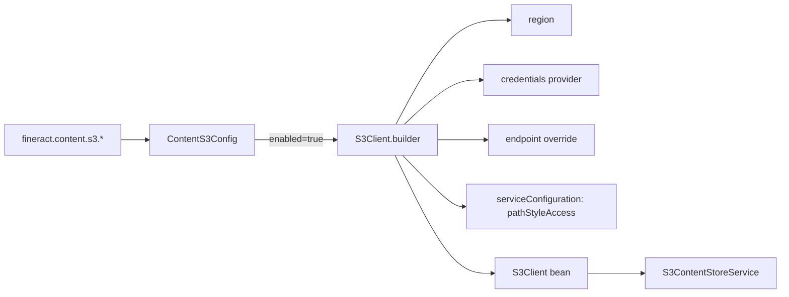
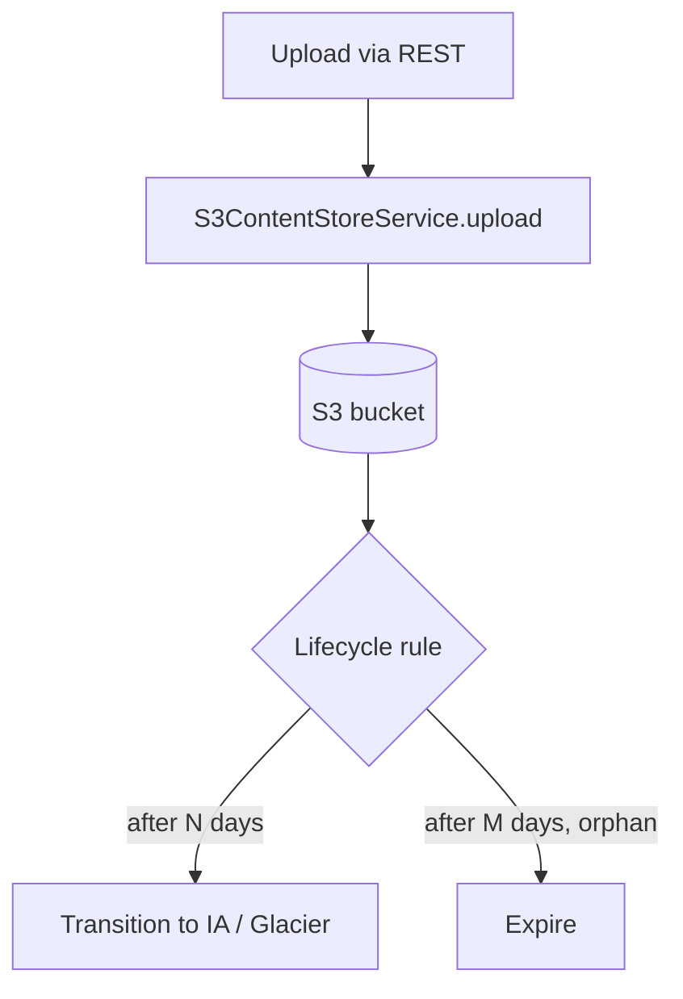

When an Apache Fineract deployment outgrows a single VM with a local data directory, the natural escape hatch for document storage is object storage. `S3ContentStoreService` is the implementation of the `ContentStoreService` SPI that writes attachments to AWS S3 — or anything that speaks the S3 API, like MinIO, Ceph RGW, or DigitalOcean Spaces. This page describes how to turn it on, what it depends on, and how the upload/download path actually works.

## Where it lives

The class is `org.apache.fineract.infrastructure.contentstore.service.S3ContentStoreService` in the `fineract-document` module. Its Spring wiring is conditional:

```java
@Slf4j
@RequiredArgsConstructor
@Service
@ConditionalOnProperty(name = "fineract.content.s3.enabled", havingValue = "true")
public class S3ContentStoreService implements ContentStoreService {
    private final S3Client s3Client;
    private final ContentPathSanitizer pathSanitizer;
    private final DefaultDownloadContentPolicy downloadContentPolicy;
    private final DefaultPreUploadContentPolicy preUploadContentPolicy;
    private final DefaultPostUploadContentPolicy postUploadContentPolicy;
    private final DefaultDeleteContentPolicy deleteContentPolicy;
    private final ContentDetectorManager contentDetectorManager;
    private final FineractProperties properties;
}
```

The `S3Client` is the AWS SDK v2 client; Apache Fineract uses `software.amazon.awssdk.services.s3.S3Client` rather than the older v1 `AmazonS3`. The bean is constructed by `ContentS3Config` from the `fineract.content.s3.*` properties.

## Configuration properties

The S3 settings sit under `fineract.content.s3.*` and are bound to `FineractContentS3Properties`:

```java
public static class FineractContentS3Properties {
    private Boolean enabled;
    private String  bucketName;
    private String  accessKey;
    private String  secretKey;
    private String  region;
    private String  endpoint;
    private Boolean pathStyleAddressingEnabled;
}
```

| Property | Required? | Notes |
| --- | --- | --- |
| `fineract.content.s3.enabled` | Yes | Set to `true` to switch the document store to S3 |
| `fineract.content.s3.bucket-name` | Yes | Target bucket; the platform will not create it |
| `fineract.content.s3.region` | Yes for AWS | Standard AWS region code (`us-east-1`, `eu-west-1`, …) |
| `fineract.content.s3.endpoint` | Only for S3-compatible | Override endpoint URL (e.g. `https://minio.internal:9000`) |
| `fineract.content.s3.path-style-addressing-enabled` | Optional | Set `true` for MinIO and most non-AWS implementations |
| `fineract.content.s3.access-key` | Optional | Static credentials; if omitted, the default AWS credential chain is used |
| `fineract.content.s3.secret-key` | Optional | Pair with `access-key` |

The default credential provider chain (instance metadata, environment, profile) is preferred when running on EC2/EKS/Fargate. Avoid baking credentials into properties files outside controlled-secrets pipelines.

```yaml
fineract:
  content:
    s3:
      enabled: true
      bucket-name: fineract-prod-attachments
      region: eu-west-1
      path-style-addressing-enabled: false
```

## The `S3Client` bean

`ContentS3Config` (Spring `@Configuration`) constructs the `S3Client` from the properties above. The shape is roughly:



If `accessKey` and `secretKey` are both set, a `StaticCredentialsProvider` is used. Otherwise, the SDK default chain runs. `path-style-addressing-enabled=true` switches from virtual-hosted style (`bucket.s3.region.amazonaws.com`) to path style (`endpoint/bucket/...`); this matters for MinIO and Ceph because they cannot do virtual-hosted style without a DNS wildcard.

## Upload path

The upload method follows the contract every `ContentStoreService` exposes:

```java
@Override
public String upload(String path, InputStream is, String mimeType) {
    requireNonNull(path, "Path missing");
    requireNonNull(is, "Data missing");
    // ... sanitise, run pre-upload policies, putObject, run post-upload policies
}
```

The interesting parts are the sanitiser and the SDK call. Apache Fineract always sanitises the path first because the caller-supplied component (the parent entity id, the original file name) is otherwise free text from a multipart upload:

```java
final var safePath = pathSanitizer.sanitize(path);
```

After sanitisation the bytes are streamed to S3 with `PutObjectRequest`:

```java
s3Client.putObject(
    PutObjectRequest.builder()
        .bucket(properties.getContent().getS3().getBucketName())
        .key(safePath)
        .contentType(mimeType)
        .build(),
    RequestBody.fromContentProvider(ContentStreamProvider.fromInputStream(is), mimeType));
```

The method returns `safePath` — the string the caller will persist into `m_document.location`. Note that the bucket name is **not** part of the location; it is read from properties at download time too, which means switching the bucket name is a one-way operation: previously uploaded rows will not be re-locatable.

## Download path

`download(path)` is a straight `GetObjectRequest`:

```java
return s3Client
    .getObject(GetObjectRequest.builder()
        .bucket(properties.getContent().getS3().getBucketName())
        .key(safePath).build(),
        ResponseTransformer.toBytes())
    .asInputStream();
```

The `ResponseTransformer.toBytes()` materialises the entire object in memory before returning an `InputStream`. For Apache Fineract's typical content (KYC photos, signed PDFs, a few MB) this is fine. If your deployment stores large objects through this path, watch heap usage on download — there is no streaming `GetObject` in the shipped implementation.

Any SDK exception is wrapped in `ContentStoreException` so the upper layers see a single failure type regardless of backend.

## Delete path

`delete(path)` runs the `DefaultDeleteContentPolicy` and then issues a `DeleteObjectRequest`. Deletes are idempotent on S3 (deleting a key that does not exist is not an error), which matches how callers use it during compensating actions in the upload pipeline.

## Policies that still run

All four `DefaultXxxContentPolicy` beans are injected into the S3 service, identical to the filesystem implementation. Switching backends does not change what an upload is allowed to be:

- Pre-upload: MIME allow-list, regex allow-list, size cap.
- Post-upload: file detector, hash post-condition.
- Download: any caller-side checks the policy enforces (e.g. soft-delete tombstones).
- Delete: pre-delete check.

This consistency is intentional — flipping `fineract.content.s3.enabled` must not relax any of the protections that the filesystem store enforced.

## Object layout in the bucket

Apache Fineract does not create per-tenant prefixes or any other special structure automatically; the path is whatever the caller (the document write-platform service) constructed. In practice that means keys like:

```
clients/{clientId}/documents/{filename}
loans/{loanId}/documents/{filename}
clients/{clientId}/images/{filename}
```

If you run a multi-tenant deployment with one bucket per tenant, set the bucket name from your tenant configuration plumbing, not from a single static property. If you run one bucket for all tenants, prefix the path with a tenant identifier in your custom write-platform service wrapper to keep buckets browsable.

## Lifecycle and retention

The platform does not set object metadata for lifecycle policies. To expire orphaned uploads or move cold attachments to Glacier, configure S3 lifecycle rules on the bucket directly. Use prefix selectors that match the entity paths your tenants actually upload to.



## Encryption

Server-side encryption is configured on the bucket and is transparent to Apache Fineract. The platform does not set `x-amz-server-side-encryption` headers explicitly; rely on default bucket encryption (`AES256` or `aws:kms`). If you use SSE-KMS, ensure the IAM identity the `S3Client` runs under has `kms:Encrypt`, `kms:Decrypt`, and `kms:GenerateDataKey` for the relevant key.

Client-side encryption is not supported by the shipped service; if you need it, implement a wrapper `ContentStoreService` bean that encrypts the input stream before delegating to the S3 implementation.

## Switching from filesystem to S3 mid-life

There is no migration utility in the platform. The high-level recipe is:

1. Spin up an S3-enabled instance pointing at an empty bucket.
2. Sync the existing filesystem root into the bucket preserving relative paths (`aws s3 sync` or `mc mirror`).
3. Verify a few `m_document.location` strings resolve to objects.
4. Cut traffic over.

Once cut over, old rows are served from S3 as long as the keys match. If your filesystem root contained tenant subfolders or other shapes the S3 store does not replicate, normalise the paths during sync.

## Compatibility matrix

| Service | Works | Notes |
| --- | --- | --- |
| AWS S3 | Yes | Virtual-hosted addressing, default chain credentials |
| MinIO | Yes | `path-style-addressing-enabled=true`, set `endpoint` |
| Ceph RGW | Yes | Same as MinIO, watch for region quirks |
| Cloudflare R2 | Yes | Set `endpoint`, use static credentials |
| Backblaze B2 | Mixed | Use B2's S3-compatible endpoint, path-style on |
| Google Cloud Storage | No | GCS's S3 compatibility is limited; use a different store |

## Operational tips

- Pin the AWS SDK v2 version via the Apache Fineract Gradle modules; do not drag in v1 alongside.
- Monitor 5xx rates from S3 — `S3ContentStoreService` does not retry beyond what the SDK does by default.
- For very large deployments, shard buckets by tenant rather than relying on one giant bucket per region.

## Permissions on the bucket

The IAM identity used to access S3 needs a small, focused permission set:

| Action | Why |
| --- | --- |
| `s3:GetObject` | Download attachments |
| `s3:PutObject` | Upload attachments |
| `s3:DeleteObject` | Delete attachments |
| `s3:ListBucket` | Optional — required only if your custom code lists prefixes |

The `s3:ListBucket` is *not* needed for the shipped service to work. Apache Fineract only ever knows about specific keys; it never enumerates the bucket.

A tight policy looks like:

```json
{
  "Version": "2012-10-17",
  "Statement": [
    {
      "Effect": "Allow",
      "Action": ["s3:GetObject", "s3:PutObject", "s3:DeleteObject"],
      "Resource": "arn:aws:s3:::fineract-prod-attachments/*"
    }
  ]
}
```

Avoid wildcards on `Resource` — confine to the single bucket your tenant uses.

## Object headers

The shipped `putObject` call sets only `contentType`. It does not set:

- `Content-Encoding`
- `Cache-Control`
- `x-amz-tagging`
- Custom `x-amz-meta-*` metadata

If you want any of these (for example, to tag attachments with the parent entity type so a Lambda processor can route them), wrap the service and add the header on the request build. The shipped code is intentionally minimal.

## Cost shape

The cost shape on S3 is dominated by storage and `PutObject` calls for typical Apache Fineract loads. With a few thousand uploads per day at ~500 KB average:

| Driver | Approximate share |
| --- | --- |
| Storage | 30–60 % |
| `PutObject` requests | 20–40 % |
| `GetObject` requests | 10–20 % |
| Data transfer out (only if downloads cross AZ/region) | 0–30 % |

The biggest avoidable cost is data transfer out: keep the Apache Fineract VMs and the bucket in the same region, ideally the same AZ for VPC endpoints.

## Backups

S3 itself is durable, but it is not a backup. If a tenant operator deletes a `m_document` row and the platform issues `delete(location)`, the object is gone. Mitigations:

| Approach | Notes |
| --- | --- |
| Enable bucket versioning | Recoverable for the version-retention window |
| Lifecycle: move noncurrent versions to Glacier Deep Archive | Cheap retention of every prior state |
| Cross-region replication | DR for the whole bucket |
| MFA-delete | Prevents accidental deletion of objects |

Most production deployments enable versioning + Glacier Deep Archive on noncurrent versions; that gives "undelete" capability without a noticeable cost increase.

## Diagnosing failures

Common failure modes and where to look:

| Symptom | Likely cause |
| --- | --- |
| `ContentStoreException` on every upload | Bucket name wrong or IAM denied |
| `ContentStoreException` only on download | Object exists in DB row but S3 deleted/moved |
| Slow uploads | Cross-region traffic, no VPC endpoint |
| Random 5xx | S3 throttling at extremely high request rates |
| 403 specifically | Credentials present but lacking permission |

The SDK logs the underlying AWS error code; enable DEBUG logging on `software.amazon.awssdk` when debugging.

## Where to next

- [Document management module](/integrations/document-management) — the front half of the system, REST and entity-side.
- The credit bureau and report mailing pages show two integrations that are *not* SPI-pluggable in the same way.

<CardGroup cols={2}>
  <Card title="Document management" icon="folder-open" href="/integrations/document-management">
    The REST and entity side of the document subsystem.
  </Card>
  <Card title="Integrations overview" icon="map" href="/integrations/overview">
    Back to the index.
  </Card>
</CardGroup>
