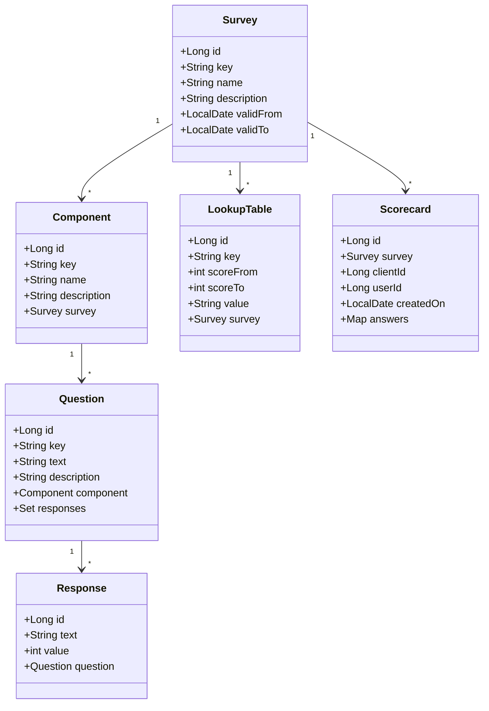
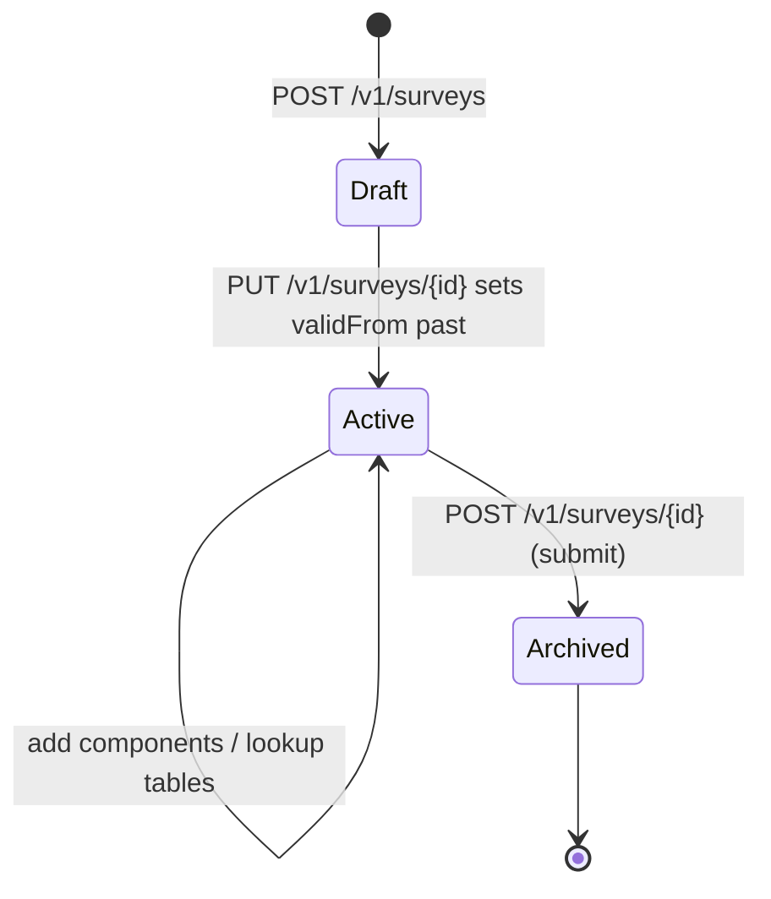
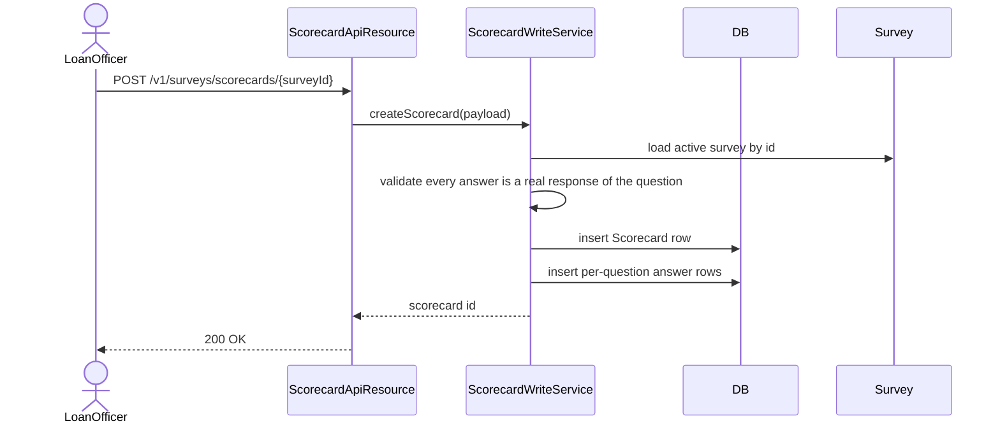
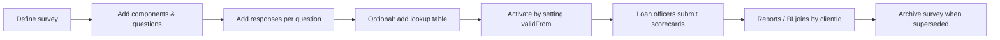

Social Performance Management (SPM) is the discipline of measuring outcomes that go beyond financial performance — poverty status of clients, education outcomes, household impact. Apache Fineract carries a lightweight SPM surveys module that lets a tenant define surveys, ask the questions of clients, and record the scores. It is intentionally simple: a generic survey engine that any SPM tool (PPI, USAID-PAT, custom impact questionnaires) can be encoded in.

## Module layout

`fineract-provider/src/main/java/org/apache/fineract/spm/`:

| Package | Role |
| --- | --- |
| `api/` | Three JAX-RS resources — `SpmApiResource`, `LookupTableApiResource`, `ScorecardApiResource` |
| `data/` | Read-side DTOs |
| `domain/` | Entities: `Survey`, `Component`, `Question`, `Response`, `LookupTable`, `Scorecard` |
| `exception/` | Module-specific exceptions |
| `service/` | Read/write platform services for each entity |

## Domain model

### `Survey`

The top-level questionnaire. `key` is a stable identifier (`PPI_INDIA`, `IMPACT_2024_Q1`), used by integrations. `validFrom`/`validTo` enforce roll-over from one survey version to another so old surveys do not show up in delivery once a successor is live.

### `Component`

A section of the survey. Surveys group questions by component (e.g. "Household", "Income", "Education"), and the scorecard analysis can roll up by component.

### `Question` and `Response`

A `Question` belongs to a component; each question has a fixed list of `Response` rows, each carrying a text and an integer score value. Surveys are encoded as closed-form choices — there is no free-text answer slot in the model. That keeps scoring deterministic.

### `LookupTable`

A score band table — a row says "for scores between `scoreFrom` and `scoreTo`, the result is `value`" (e.g. likelihood of being below the poverty line). Each lookup table is scoped to one survey.

### `Scorecard`

A submitted instance of a survey — one row per `(clientId, userId, createdOn)` tuple. The answers are persisted as a map of question id to chosen response.

## REST surface

### `SpmApiResource`

Path: `/v1/surveys`.

| Method | Path | Purpose |
| --- | --- | --- |
| `GET` | `` | List surveys |
| `GET` | `/{id}` | Fetch a survey with its components, questions, responses |
| `POST` | `` | Create a survey |
| `PUT` | `/{id}` | Update a survey |
| `POST` | `/{id}` | Submit a survey (validates, soft-archives) |

The `POST /{id}` (without subpath) submit form deactivates the old definition once a replacement is in place — Apache Fineract treats survey definitions as semi-immutable to keep historical scorecards meaningful.

### `LookupTableApiResource`

Path: `/v1/surveys/{surveyId}/lookuptables`.

| Method | Path | Purpose |
| --- | --- | --- |
| `GET` | `` | List the score-band table for a survey |
| `GET` | `/{key}` | Fetch a specific lookup row by key |
| `POST` | `` | Create a lookup row |

### `ScorecardApiResource`

Path: `/v1/surveys/scorecards`.

| Method | Path | Purpose |
| --- | --- | --- |
| `GET` | `/{surveyId}` | List scorecards for a survey |
| `POST` | `/{surveyId}` | Submit a scorecard (answers) |
| `GET` | `/{surveyId}/clients/{clientId}` | List scorecards for a (survey, client) |
| `GET` | `/clients/{clientId}` | List all scorecards for a client across surveys |

## Survey lifecycle

Once a survey transitions to Archived (because a new version superseded it), existing scorecards still resolve fine — they reference the immutable id. New scorecards cannot be created against an Archived survey, but reads still work.

## Submitting a scorecard

The validator is strict: every question in the survey must have an answer, and each answer must reference a `Response` row that belongs to that `Question`. Partial scorecards are rejected.

## Scoring and lookup

Scoring is on read, not on write. The `Scorecard` row stores the chosen `Response` per question, and computation goes:

1. Sum the `Response.value` for each chosen response.
2. Optionally sum per `Component` to expose component-level subscores.
3. Look the total score up in the survey's `LookupTable` to produce the categorical result.

Persisting the total in the row would be a denormalisation; the platform recomputes on demand to keep the scorecard correct if a `Response.value` changes later (though see below — typically that does not happen because surveys are archived rather than mutated).

## Use cases

| Survey | Encoding pattern |
| --- | --- |
| Progress out of Poverty Index (PPI) | One component per country variant; ten questions; ten responses each with weighted scores; lookup table from score to "likelihood below \$X/day" |
| Client satisfaction | One component; 5–10 Likert questions; no lookup table (raw scores reported) |
| Loan-purpose declaration | One question per disbursement; tracked via scorecards for portfolio segmentation |
| Impact follow-up | Same survey re-used at intake and 12 months; both scorecards on the client allow before/after |

## Integration with the rest of Apache Fineract

The scorecards are keyed by `clientId` — they tie back to the standard client entity. From there, downstream analytics can join scorecards to portfolio facts, loan products, branches, etc. There is no built-in BI dashboard; the platform simply makes the data available.

The submission endpoints are protected by SPM-specific permissions: `READ_SURVEY`, `CREATE_SURVEY`, `UPDATE_SURVEY`, `CREATE_SCORECARD`, `READ_SCORECARD`.

## Survey validation

`SurveyValidator` runs at create/update time:

- Survey key is required and unique.
- Each component must have at least one question.
- Each question must have at least two responses.
- `validFrom` must be before `validTo` when both are set.
- Lookup tables, if present, must cover the full range of possible scores (`scoreFrom` of the first row is the minimum possible; `scoreTo` of the last row is the maximum possible) with no gaps and no overlaps.

These checks keep submitted scorecards interpretable.

## Practical workflow

## What it does not do

- It does not deliver surveys to mobile devices — the REST API is generic, surface a UI of your choice on top.
- It does not enforce frequency (every quarter, every loan disbursement); upstream callers schedule submissions.
- It does not score-derive client risk; combine SPM scores with portfolio facts in your analytics layer.

## Component-level scoring

Scoring per component (rather than just an overall total) is useful for tools like PPI where individual dimensions matter for reporting back to clients and donors. The platform's read service exposes per-component subtotals on the scorecard read endpoint, so a client can show "education score: 12 / 20" alongside the overall.

Implementation-wise the per-component subtotal is computed by joining the chosen `Response` rows back to their `Question` and grouping by `Component`. There is no precomputed cache; the join is cheap relative to the scorecard's small size.

## Audit and immutability

Submitted scorecards are immutable. There is no `PUT /v1/surveys/scorecards/{id}`; if an answer needs correcting, the user submits a fresh scorecard and the analytics layer picks the latest by `createdOn`. This is intentional — scorecards capture state at a moment in time and rewriting history would undermine longitudinal analysis.

Surveys are *semi*-immutable: you can add components, questions, and responses while active, but you cannot delete existing questions or change response values. The validator enforces this on update. To replace a survey wholesale, create a new one with a different `key`.

## Bulk-loading surveys

The PPI tooling pattern is to author the entire survey as JSON (top-level survey + components + questions + responses + lookup-table) and POST it in one shot. The `POST /v1/surveys` endpoint accepts the nested structure and creates everything in one transaction. This makes survey definitions version-controllable as files in a repo separate from the running deployment.

## Integration with loan-application capture

A common deployment pattern: the loan-application UI prompts for an SPM scorecard during capture, and the loan-application post-create hook automatically attaches the scorecard to the application via `clientId`. Apache Fineract does not enforce this — the SPM module is intentionally decoupled from origination — but the linkage is straightforward at the data layer.

## SPM-specific permissions

| Permission | Scope |
| --- | --- |
| `READ_SURVEY` | Read survey definitions |
| `CREATE_SURVEY` | Create new surveys |
| `UPDATE_SURVEY` | Add components/questions or activate |
| `READ_SCORECARD` | Read submitted scorecards |
| `CREATE_SCORECARD` | Submit a new scorecard |
| `READ_LOOKUP_TABLE` | Read score-band tables |
| `CREATE_LOOKUP_TABLE` | Add lookup rows |

## Reporting against scorecards

The data is queryable through Apache Fineract's standard reporting subsystem. Useful query shapes:

| Query | Use |
| --- | --- |
| Average score by branch | Portfolio segmentation |
| Score distribution per survey question | Identify outlier responses |
| Repeat-client score change over time | Impact measurement |
| Lookup-result frequency | Poverty-tier composition |

The scorecard table joins cleanly to client, group, and loan via `clientId`, so cross-tabulating SPM with portfolio facts is a single SQL away.

## Where to next

- [Report mailing](/integrations/report-mailing-job) — pair with SPM to email portfolio-segmented SPM scorecards.
- The client domain pages (in the portfolio section) explain how SPM scorecards join back to the rest of the model.

<CardGroup cols={2}>
  <Card title="Integrations overview" icon="map" href="/integrations/overview">
    Back to the index.
  </Card>
  <Card title="Report mailing" icon="envelope" href="/integrations/report-mailing-job">
    Schedule periodic SPM scorecard reports out to email recipients.
  </Card>
</CardGroup>
