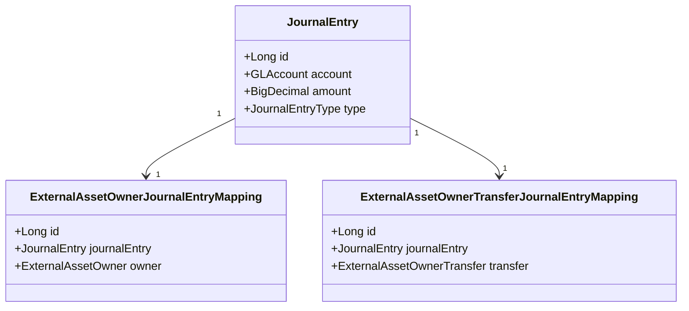
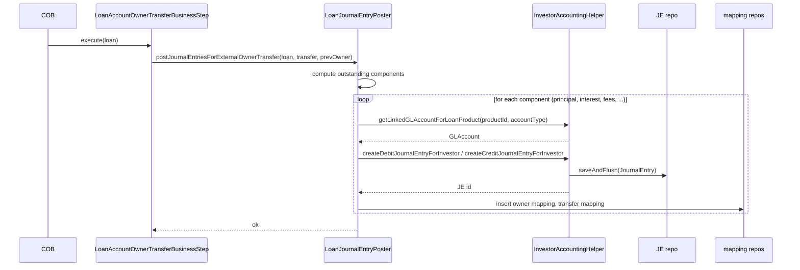

When an Apache Fineract deployment sells a loan to an external investor, the books need to reflect that the loan is no longer the originator's asset. This page describes the GL accounts involved, the entries posted at activation and buyback, and the helper class that builds them.

## The accounting question

Before the sale, the originator owns a loan receivable. The asset sits on `LOAN_PORTFOLIO` (and the various accrued components — `INTEREST_RECEIVABLE`, `FEES_RECEIVABLE`, `PENALTIES_RECEIVABLE`). At sale, the originator must:

1. Derecognise the loan-receivable asset and all accrued sub-components.
2. Recognise the cash (or the investor's IOU) as the offset.
3. Maintain enough trail that subsequent repayments hit the investor's books, not the originator's.

`fineract-investor` does the first two with one composite journal entry; the third is achieved by the active-mapping table that subsequent loan transactions consult.

## The bridging GL account: `ASSET_TRANSFER`

Apache Fineract treats the asset-transfer cash leg as a "financial activity" — a tenant-organisation-level GL account, not a per-product mapping. The relevant enum value is `AccountingConstants.FinancialActivity.ASSET_TRANSFER`. A tenant maps a real GL account to this activity through the standard financial activity accounts CRUD; the investor module then resolves it on every transfer:

```java
// AccountingServiceImpl
financialActivityAccountRepository.findByFinancialActivityTypeWithNotFoundDetection(
    AccountingConstants.FinancialActivity.ASSET_TRANSFER.getValue());
```

Conceptually, this account is the bridge between "the loan was just removed from our books" and "cash hits our bank tomorrow". For most deployments it is set to a clearing GL account; treasury reconciles it manually against the wire that the investor sent.

## The product-mapped GL accounts

The per-product accounting mapping (the same one the rest of loan accounting uses) supplies the asset/income accounts on the loan side. The relevant entries from `AccrualAccountsForLoan`:

| Mapping | Apparent role |
| --- | --- |
| `LOAN_PORTFOLIO` | The principal-receivable account |
| `INTEREST_RECEIVABLE` | Accrued interest receivable |
| `FEES_RECEIVABLE` | Accrued fees receivable |
| `PENALTIES_RECEIVABLE` | Accrued penalties receivable |
| `INCOME_FROM_CHARGE_OFF_INTEREST` | Used when charged-off loans transfer |
| `CHARGE_OFF_EXPENSE` / `CHARGE_OFF_FRAUD_EXPENSE` | Used when charge-off accounts come into play |

`InvestorAccountingHelper.getLinkedGLAccountForLoanProduct` is the resolver. It first checks whether the requested account is an organisation-level activity (returns the financial-activity account), otherwise it looks up the product-to-account mapping:

```java
public GLAccount getLinkedGLAccountForLoanProduct(final Long loanProductId, final int accountMappingTypeId) {
    GLAccount glAccount;
    if (isOrganizationAccount(accountMappingTypeId)) {
        FinancialActivityAccount financialActivityAccount = financialActivityAccountRepository
            .findByFinancialActivityTypeWithNotFoundDetection(accountMappingTypeId);
        glAccount = financialActivityAccount.getGlAccount();
    } else {
        ProductToGLAccountMapping accountMapping = accountMappingRepository.findCoreProductToFinAccountMapping(
            loanProductId, PortfolioProductType.LOAN.getValue(), accountMappingTypeId);
        if (accountMapping == null) {
            throw new ProductToGLAccountMappingNotFoundException(...);
        }
        glAccount = accountMapping.getGlAccount();
    }
    return glAccount;
}
```

The same resolver works for both ends of the entry — the asset being moved off the books *and* the bridging account.

## The shape of the entry on sale

At sale activation, the entry derecognises every component of the receivable and credits the bridging account by the same total. Conceptually (for a simple loan with principal outstanding only):

| Account | Debit | Credit |
| --- | --- | --- |
| `ASSET_TRANSFER` (financial activity) | principal | |
| `LOAN_PORTFOLIO` (per-product mapping) | | principal |

For a loan with accrued interest and fees the entry expands:

| Account | Debit | Credit |
| --- | --- | --- |
| `ASSET_TRANSFER` | total | |
| `LOAN_PORTFOLIO` | | principal |
| `INTEREST_RECEIVABLE` | | accrued interest |
| `FEES_RECEIVABLE` | | accrued fees |
| `PENALTIES_RECEIVABLE` | | accrued penalties |

Charge-off variants substitute the relevant charge-off accounts on the credit side. The `InvestorAccountingHelper.createDebitJournalEntryForInvestor` and `createCreditJournalEntryForInvestor` methods do the per-line work; the orchestrating call from the COB step is `LoanJournalEntryPoster.postJournalEntriesForExternalOwnerTransfer(loan, transfer, previousOwner)`.

## The shape of the entry on buyback

Buyback reverses the polarity. The receivable comes back onto the originator's books at the *outstanding* values at buyback time (which may be smaller than the sale-time values because the investor has been receiving repayments):

| Account | Debit | Credit |
| --- | --- | --- |
| `LOAN_PORTFOLIO` | outstanding principal | |
| `INTEREST_RECEIVABLE` | outstanding interest | |
| `FEES_RECEIVABLE` | outstanding fees | |
| `ASSET_TRANSFER` | | total |

The call signature passes `null` as the previous-owner argument to indicate "ownership is returning to the originator":

```java
loanJournalEntryPoster.postJournalEntriesForExternalOwnerTransfer(loan, buybackTransfer, null);
```

The accounting helper interprets `null` as the originator and uses the `ASSET_TRANSFER` account on the credit side.

## The `InvestorAccountingHelper` core methods

```java
private JournalEntry createCreditJournalEntryForInvestor(Office office, String currencyCode, GLAccount account,
        Long loanId, Long transactionId, LocalDate transactionDate, BigDecimal amount) {
    final String modifiedTransactionId = INVESTOR_TRANSFER_IDENTIFIER + transactionId;
    final JournalEntry je = JournalEntry.createNew(office, null, account, currencyCode, modifiedTransactionId,
        false /* manualEntry */, transactionDate, JournalEntryType.CREDIT, amount, null,
        PortfolioProductType.LOAN.getValue(), loanId, null, null, null, null, null);
    return glJournalEntryRepository.saveAndFlush(je);
}
```

Two design choices:

- The transaction id on the JE is prefixed with `INVESTOR_TRANSFER_IDENTIFIER` to mark these entries as investor-driven and keep them distinguishable in the GL from normal loan-transaction entries.
- `manualEntry = false` — they are system-generated; the audit trail goes back to the COB step.

A sibling pair (`createDebitJournalEntryOrReversalForInvestor`, `createCreditJournalEntryOrReversalForInvestor`) allows reversal entries to be built in one call by flipping the `DEBIT` / `CREDIT` direction based on an `isReversalOrder` boolean. This is used when correcting a transfer.

## The owner-side mapping

Two mapping tables tie GL rows back to investor ownership:



- `ExternalAssetOwnerJournalEntryMapping` links a single JE to the owner who caused it.
- `ExternalAssetOwnerTransferJournalEntryMapping` links it to the specific transfer.

These mappings are what power the two read endpoints:

| Endpoint | Returns |
| --- | --- |
| `GET /v1/external-asset-owners/transfers/{transferId}/journal-entries` | All JEs tied to one transfer |
| `GET /v1/external-asset-owners/owners/external-id/{ownerExternalId}/journal-entries` | All JEs ever tied to an owner |

For reconciliation against the investor's books, the owner-scoped endpoint is the canonical source of truth.

## End-to-end posting flow



The outstanding-components computation uses `ExternalAssetOwnerTransferOutstandingInterestCalculation` for the interest leg; principal and fees come from the loan's own accrual state.

## Reversals

There is no API for "reverse a posted transfer journal entry" — the reversal happens implicitly. When a buyback completes against an active transfer, the buyback entry has the opposite signs of the sale entry. The pair of entries net to zero on the bridging account and net to the right values on the receivable accounts.

For cancellation of an already-active sale (rare, operator-driven), use the buyback path with same-day settlement; the framework will treat it as a sell + buyback chain.

## Multi-currency

Apache Fineract's GL is currency-scoped; investor accounting inherits that. All entries for one loan share the loan's currency code. There is no automatic FX conversion — if a tenant runs multi-currency, the investor's books and the originator's books must agree on currency for that loan.

## Per-product variants

The accounting mapping (which GL account is `LOAN_PORTFOLIO`) is per loan product. Different loan products can map to different real-world GL accounts; the investor module reads whichever account is mapped at the time of the entry. That means switching product mappings *after* a sale will not retroactively change the historical entries.

## Charge-off interaction

If a loan was charged off and is later sold (or bought back), the helper uses the charge-off variants of the accrual accounts:

- `INCOME_FROM_CHARGE_OFF_INTEREST` instead of `INTEREST_RECEIVABLE`.
- `CHARGE_OFF_EXPENSE` / `CHARGE_OFF_FRAUD_EXPENSE` for the principal leg, depending on the charge-off reason.

This way the transfer respects the post-charge-off ledger structure rather than reopening the regular receivable accounts.

## Operational guidance

- Map the `ASSET_TRANSFER` financial activity to a real clearing account before turning the module on. Failing to do so will throw on the first sale, since the helper requires it.
- Reconcile the clearing account daily against treasury wires.
- Pull `GET /v1/external-asset-owners/owners/external-id/{ownerExternalId}/journal-entries` periodically and send it to the investor as their statement of ownership-related activity.
- Do not edit transfer JEs manually — they are tied to mapping rows that downstream queries depend on.

## Tracing an investor JE back to its origin

Three data structures make a single JE traceable to the activity that produced it:

1. The `transaction_id` column on `JournalEntry` is prefixed with `INVESTOR_TRANSFER_IDENTIFIER` (a constant in `InvestorAccountingHelper`). That marks the JE as investor-driven without needing a separate column.
2. `ExternalAssetOwnerTransferJournalEntryMapping` provides the join to the originating transfer row, which in turn knows its settlement date, owner, loan, and effective interval.
3. `ExternalAssetOwnerJournalEntryMapping` provides the cheaper join straight to the owner without going through the transfer.

A typical audit query starts from the journal entry id, joins through the transfer mapping to find the owner, and then walks to the transfer details for the snapshot of the loan state. The whole chain is one SQL with three joins.

## Sample SQL: "show me everything one investor has done"

```sql
SELECT t.id              AS transfer_id,
       t.settlement_date,
       t.status,
       t.purchase_price_ratio,
       je.id             AS journal_entry_id,
       je.transaction_date,
       je.type_enum,
       je.amount,
       a.gl_code
FROM   m_external_asset_owner o
JOIN   m_external_asset_owner_transfer t
       ON t.owner_id = o.id
JOIN   m_external_asset_owner_transfer_journal_entry_mapping m
       ON m.transfer_id = t.id
JOIN   acc_gl_journal_entry je
       ON je.id = m.journal_entry_id
JOIN   acc_gl_account a
       ON a.id = je.account_id
WHERE  o.external_id = ?
ORDER  BY je.transaction_date, je.id;
```

This is the kind of report you would email the investor as a monthly statement. Apache Fineract's stretchy reports plus the report mailing job can wrap it cleanly.

## Common pitfalls

- **Forgetting to map `ASSET_TRANSFER`.** The first sale will throw with a clear error — but only if you try a sale. Set up the mapping during initial configuration.
- **Mixing per-product mappings between products that transfer to the same investor.** That is fine for the platform, but reconciliation downstream gets harder. Consider standardising mappings across transferable products.
- **Manually editing the GL after a transfer.** The mapping rows tie the JE to the transfer; manual deletes of the JE leave the mapping orphaned and break the read endpoints.

## Where to next

- [Transfer loan workflow](/investor/transfer-loan) — the user-facing side of the same flow.
- [Investor COB business step](/investor/investor-cob) — the daily pipeline that calls into this accounting layer.
- [Overview](/investor/overview) — module structure at a glance.

<CardGroup cols={2}>
  <Card title="Transfer loan workflow" icon="arrow-right-arrow-left" href="/investor/transfer-loan">
    The status state machine and API surface.
  </Card>
  <Card title="Investor COB" icon="gears" href="/investor/investor-cob">
    Where the journal entries are actually posted.
  </Card>
</CardGroup>
