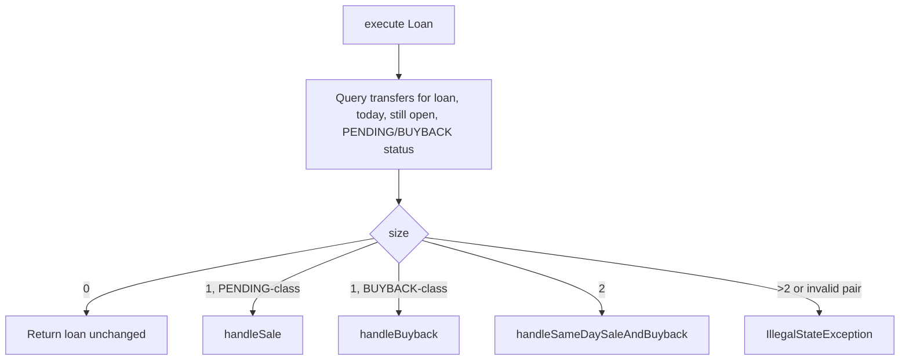
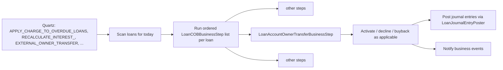

The COB (Close of Business) pipeline of Apache Fineract walks every loan once per business day and runs an ordered list of `LoanCOBBusinessStep` beans. The investor module contributes one such step, `LoanAccountOwnerTransferBusinessStep`, which is responsible for completing any pending sale or buyback on its settlement date. This page reads through the step's source, the conditions it checks, and the events it fires.

## Class declaration

`fineract-investor/src/main/java/org/apache/fineract/investor/cob/loan/LoanAccountOwnerTransferBusinessStep.java`:

```java
@Component
@RequiredArgsConstructor
@Slf4j
@Conditional(InvestorModuleIsEnabledCondition.class)
public class LoanAccountOwnerTransferBusinessStep implements LoanCOBBusinessStep {

    public static final LocalDate FUTURE_DATE_9999_12_31 = LocalDate.of(9999, 12, 31);
    public static final List<ExternalTransferStatus> PENDING_STATUSES =
        List.of(ExternalTransferStatus.PENDING_INTERMEDIATE, ExternalTransferStatus.PENDING);
    public static final List<ExternalTransferStatus> BUYBACK_STATUSES =
        List.of(ExternalTransferStatus.BUYBACK_INTERMEDIATE, ExternalTransferStatus.BUYBACK);

    private final ExternalAssetOwnerTransferRepository externalAssetOwnerTransferRepository;
    private final ExternalAssetOwnerTransferLoanMappingRepository externalAssetOwnerTransferLoanMappingRepository;
    private final LoanJournalEntryPoster loanJournalEntryPoster;
    private final BusinessEventNotifierService businessEventNotifierService;
    private final LoanTransferabilityService loanTransferabilityService;
    private final DelayedSettlementAttributeService delayedSettlementAttributeService;
    private final ExternalAssetOwnerTransferOutstandingInterestCalculation externalAssetOwnerTransferOutstandingInterestCalculation;
    // ...
}
```

`@Conditional(InvestorModuleIsEnabledCondition.class)` means it does not get wired at all unless `fineract.module.investor.enabled=true`. When wired, the COB step registry picks it up automatically.

## A note on naming

In some references this step is paired with a "check" companion (`CheckLoanAccountReadyForOwnerTransferBusinessStep`). In upstream Apache Fineract the readiness check is embedded inside `LoanAccountOwnerTransferBusinessStep` itself — there is a `LoanTransferabilityService` injected for exactly that purpose, and there is no separately registered "check" business step class. Treat `LoanAccountOwnerTransferBusinessStep` as the single business step that both checks and applies the transfer; the check is a delegated service call inside it.

## The `execute(Loan)` method

```java
@Override
public Loan execute(Loan loan) {
    Long loanId = loan.getId();
    LocalDate settlementDate = DateUtils.getBusinessLocalDate();

    List<ExternalAssetOwnerTransfer> transferDataList = externalAssetOwnerTransferRepository.findAll(
        (root, query, cb) -> cb.and(
            cb.equal(root.get("loanId"), loanId),
            cb.equal(root.get("settlementDate"), settlementDate),
            root.get("status").in(
                Stream.concat(PENDING_STATUSES.stream(), BUYBACK_STATUSES.stream()).toList()),
            cb.greaterThanOrEqualTo(root.get("effectiveDateTo"), FUTURE_DATE_9999_12_31)),
        Sort.by(Sort.Direction.ASC, "id"));
    int size = transferDataList.size();

    if (size == 2) {
        // expected: PENDING followed by BUYBACK (same-day sell-and-buyback)
        handleSameDaySaleAndBuyback(...)
    } else if (size == 1) {
        ExternalAssetOwnerTransfer transfer = transferDataList.get(0);
        if (PENDING_STATUSES.contains(transfer.getStatus())) {
            handleSale(loan, settlementDate, transfer);
        } else if (BUYBACK_STATUSES.contains(transfer.getStatus())) {
            handleBuyback(loan, settlementDate, transfer);
        }
    }
    return loan;
}
```

Three observations:

1. The query is loan-scoped and date-scoped — only transfers whose `settlement_date` is today are eligible. Future transfers wait their turn.
2. The pending and buyback "intermediate" statuses are included, which keeps multi-leg chains in scope.
3. `effective_date_to >= 9999-12-31` filters to *still-open* rows; anything already expired is ignored.

## The branches



### `handleSale`

```java
private void handleSale(Loan loan, LocalDate settlementDate, ExternalAssetOwnerTransfer externalAssetOwnerTransfer) {
    ExternalAssetOwnerTransfer newExternalAssetOwnerTransfer =
        sellAssetOrDecline(loan, settlementDate, externalAssetOwnerTransfer);

    businessEventNotifierService.notifyPostBusinessEvent(
        new LoanOwnershipTransferBusinessEvent(newExternalAssetOwnerTransfer, loan));
    if (!ExternalTransferStatus.DECLINED.equals(newExternalAssetOwnerTransfer.getStatus())) {
        businessEventNotifierService.notifyPostBusinessEvent(new LoanAccountSnapshotBusinessEvent(loan));
    }
}
```

`sellAssetOrDecline` is where transferability is checked:

```java
private ExternalAssetOwnerTransfer sellAssetOrDecline(Loan loan, LocalDate settlementDate,
        ExternalAssetOwnerTransfer externalAssetOwnerTransfer) {
    if (!loanTransferabilityService.isTransferable(loan, externalAssetOwnerTransfer)) {
        ExternalTransferSubStatus declinedSubStatus = loanTransferabilityService.getDeclinedSubStatus(loan);
        return declinePendingEntry(loan, settlementDate, externalAssetOwnerTransfer, declinedSubStatus);
    }
    ExternalAssetOwnerTransfer newTransfer = sellAsset(loan, settlementDate, externalAssetOwnerTransfer);
    createActiveMapping(loan.getId(), newTransfer);
    newTransfer.setExternalAssetOwnerTransferDetails(createAssetOwnerTransferDetails(loan, newTransfer));
    return newTransfer;
}
```

If the loan is not transferable, the row flips to `DECLINED` with the sub-status the transferability service returned (typically `BALANCE_ZERO` or `BALANCE_NEGATIVE`). If it is transferable, the row is activated, an active mapping is created, the transfer-details snapshot is recorded, and `sellAsset` posts the journal entries via `LoanJournalEntryPoster.postJournalEntriesForExternalOwnerTransfer(...)`.

### `handleBuyback`

```java
private void handleBuyback(Loan loan, LocalDate settlementDate,
        ExternalAssetOwnerTransfer buybackExternalAssetOwnerTransfer) {
    ExternalTransferStatus expectedActiveStatus = determineExpectedActiveStatus(buybackExternalAssetOwnerTransfer);

    Optional<ExternalAssetOwnerTransfer> optActive = externalAssetOwnerTransferRepository
        .findOne((root, query, cb) -> cb.and(
            cb.equal(root.get("loanId"), loan.getId()),
            cb.equal(root.get("owner"), buybackExternalAssetOwnerTransfer.getOwner()),
            cb.equal(root.get("status"), expectedActiveStatus),
            cb.equal(root.get("effectiveDateTo"), FUTURE_DATE_9999_12_31)));

    ExternalAssetOwnerTransfer result;
    if (!optActive.isPresent()) {
        result = createNewEntryAndExpireOldEntry(settlementDate, buybackExternalAssetOwnerTransfer,
            ExternalTransferStatus.CANCELLED, ExternalTransferSubStatus.UNSOLD, settlementDate, settlementDate);
    } else {
        result = buybackAsset(loan, settlementDate, buybackExternalAssetOwnerTransfer, optActive.get());
    }
    businessEventNotifierService.notifyPostBusinessEvent(new LoanOwnershipTransferBusinessEvent(result, loan));
    businessEventNotifierService.notifyPostBusinessEvent(new LoanAccountSnapshotBusinessEvent(loan));
}
```

The decision tree:

- No matching ACTIVE row for this loan and owner → the buyback is illegal (the originator never sold to that investor). The buyback row is cancelled with sub-status `UNSOLD`.
- A matching ACTIVE row exists → both rows are expired (`effective_date_to = today`), the active mapping is deleted, and the journal entries for the buyback are posted.

### `buybackAsset`

```java
private ExternalAssetOwnerTransfer buybackAsset(Loan loan, LocalDate settlementDate,
        ExternalAssetOwnerTransfer buyback, ExternalAssetOwnerTransfer active) {
    active.setEffectiveDateTo(settlementDate);
    buyback.setEffectiveDateTo(settlementDate);
    buyback.setExternalAssetOwnerTransferDetails(createAssetOwnerTransferDetails(loan, buyback));
    externalAssetOwnerTransferRepository.save(active);
    buyback = externalAssetOwnerTransferRepository.save(buyback);
    externalAssetOwnerTransferLoanMappingRepository.deleteByLoanIdAndOwnerTransfer(loan.getId(), active);
    loanJournalEntryPoster.postJournalEntriesForExternalOwnerTransfer(loan, buyback, null);
    return buyback;
}
```

Note the `null` last argument to `postJournalEntriesForExternalOwnerTransfer` — on buyback there is no "previous owner" being established as the new owner (ownership is returning to the originator). The accounting helper treats `null` as "back to originator" and uses the ASSET_TRANSFER financial activity account on the credit side.

### `handleSameDaySaleAndBuyback`

When the query returns two rows on the same settlement date — first `PENDING`, then `BUYBACK` — both transactions are processed atomically. The pending sale is activated and immediately bought back, and both rows end up with `effective_date_to = today` and sub-status `SAMEDAY_TRANSFERS`. Net effect: a no-op on ownership but a complete paper trail.

If the delayed settlement attribute is enabled on the loan product, this branch is illegal — the step throws an `IllegalStateException` rather than silently doing the wrong thing.

## Same-day chain check

```java
if (delayedSettlementAttributeService.isEnabled(loan.getLoanProduct().getId())) {
    throw new IllegalStateException(String.format(
        "Delayed Settlement enabled, but found 2 transfers of statuses: %s and %s",
        firstTransferStatus, secondTransferStatus));
}
if (!ExternalTransferStatus.PENDING.equals(firstTransferStatus)
        || !ExternalTransferStatus.BUYBACK.equals(secondTransferStatus)) {
    throw new IllegalStateException(...);
}
```

Two guards: delayed settlement implies single-step chains only; the ordering must be `(PENDING, BUYBACK)`. Anything else means an upstream bug or a corrupted data state.

## Events fired

For each non-no-op execution the step fires:

- `LoanOwnershipTransferBusinessEvent(transfer, loan)` — always.
- `LoanAccountSnapshotBusinessEvent(loan)` — when ownership actually changed (sale activated or buyback completed). The snapshot event is what downstream BI ingests to capture the post-state of the loan.

Subscribers (notifications, custom listeners) hook off these events to drive integrations.

## Where the step sits in the COB pipeline



The ordering with other COB steps matters: ownership flips should generally happen after the loan's daily balance is settled but before downstream reporting steps. The exact ordering is configurable per deployment via the COB business-step configuration mechanism.

## Failure mode

The step is transactional within its execution per loan. If `LoanJournalEntryPoster.postJournalEntriesForExternalOwnerTransfer` throws, the surrounding transaction rolls back; the transfer stays `PENDING` for that loan, and the COB job logs the failure. Reprocessing the loan on a subsequent COB run will pick it up again, since the settlement date now matches "today" until the row is processed.

## What the step does not do

- It does not initiate transfers — that is the API's job. The step only completes pending intents on their settlement date.
- It does not validate the *price* — `purchasePriceRatio` is taken from the row as-is. Pricing policy belongs upstream.
- It does not settle cash. The cash leg of the deal is handled outside Apache Fineract (treasury operation, manual wire), with the GL accounts for `ASSET_TRANSFER` as the bridging account.

## Test coverage

`LoanAccountOwnerTransferBusinessStepTest` (in `fineract-investor/src/test/`) covers the major branches:

| Scenario | Asserts |
| --- | --- |
| Single PENDING, transferable | Status → ACTIVE, JE posted, mapping created |
| Single PENDING, not transferable (balance zero) | Status → DECLINED with sub-status |
| Single BUYBACK matching ACTIVE | Both expire on today, mapping deleted, JE posted |
| Single BUYBACK with no active row | Buyback row → CANCELLED with sub-status UNSOLD |
| Two rows (PENDING + BUYBACK) same-day | Net no-op with SAMEDAY_TRANSFERS sub-status |
| Two rows with delayed settlement enabled | `IllegalStateException` |
| Two rows with unexpected statuses | `IllegalStateException` |

The test verifies in particular that `loanJournalEntryPoster.postJournalEntriesForExternalOwnerTransfer` is called with the expected arguments on each path — that is the contract the accounting layer depends on.

## Ordering relative to other COB steps

The COB pipeline runs an ordered list of `LoanCOBBusinessStep` beans per loan. The ordering matters because:

- Interest accrual should run *before* ownership transfer, so the receivable being moved off the books includes today's accrued interest.
- Charge-off should run *before* ownership transfer if a charge-off is happening on the same day, so the transfer uses the post-charge-off mapping.
- Reporting / snapshot steps should run *after* ownership transfer so they see the new owner.

The exact ordering is configured per deployment via the COB business-step configuration mechanism. The default ordering for Apache Fineract puts the investor step late in the chain.

## Why a single business step rather than a separate check

You might expect a pattern like "check step → action step", and several Apache Fineract subsystems do split this way. The investor module deliberately keeps both halves in one bean because:

- The transferability check and the action share the same query (the PENDING-or-BUYBACK fetch for today's settlement date). Re-running the query in a separate bean would duplicate work.
- The decision to decline (DECLINED sub-status) is itself an action — it writes a row. Splitting check from action would make that action homeless.
- The same-day sale+buyback chain interleaves check and action across two rows; cleanly separating them is awkward.

## Configuration knobs

| Property | Effect |
| --- | --- |
| `fineract.module.investor.enabled` | Whether the step is wired at all |
| Loan product attribute `SETTLEMENT_MODEL=DELAYED` | Disallow same-day chains for the product |
| COB business-step config | Position the step in the per-loan execution order |

There are no scheduler-level cron knobs specific to this step — it inherits the COB job's cron.

## Where to next

- [Transfer loan workflow](/investor/transfer-loan) — the API side of the same flow.
- [Investor accounting](/investor/investor-accounting) — the journal entries this step writes via `LoanJournalEntryPoster`.

<CardGroup cols={2}>
  <Card title="Transfer loan workflow" icon="arrow-right-arrow-left" href="/investor/transfer-loan">
    The user-facing side.
  </Card>
  <Card title="Investor accounting" icon="file-invoice-dollar" href="/investor/investor-accounting">
    The GL side of the same flow.
  </Card>
</CardGroup>
