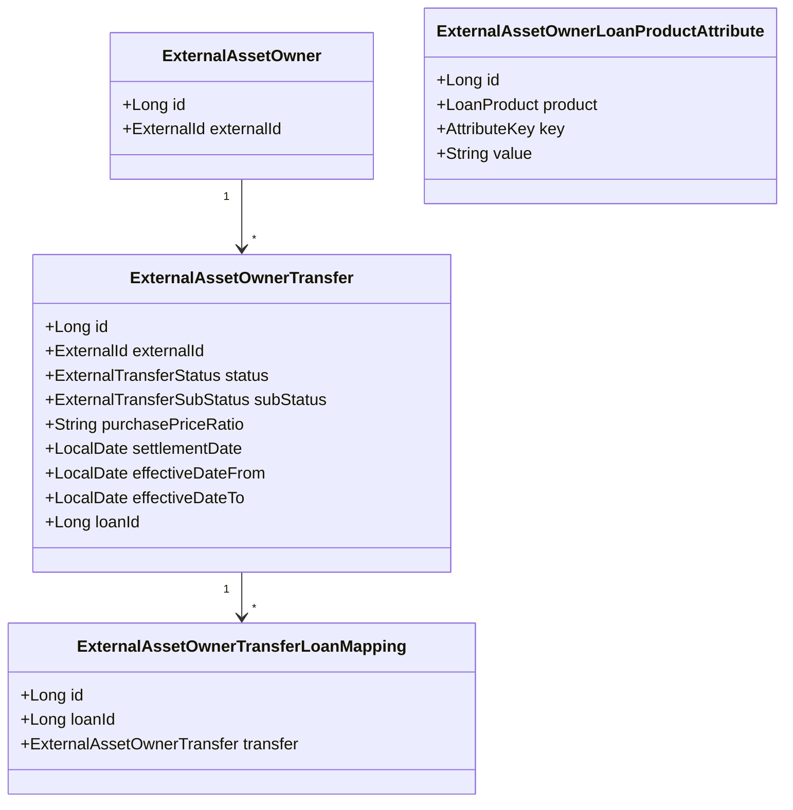
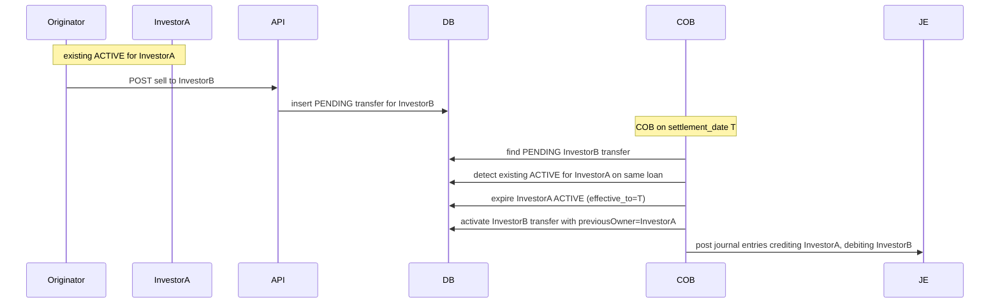

`fineract-investor` is the Apache Fineract module that lets a lender sell originated loans to outside investors and later buy them back. It is "asset externalization" in industry language: the loan stays serviced by the originator, but the economic owner becomes an external party. The platform tracks transfers, owns the same-day-settlement semantics, and posts the journal entries that derecognise the loan receivable from the originator's books and book it on the investor's.

## When you need this module

You need `fineract-investor` if any of the following are true for a deployment:

- Loans are originated and then sold to a separate balance-sheet (parent bank, securitisation vehicle, peer-to-peer marketplace).
- A funding partner is on the hook for repayments and needs to see them post directly against their receivable.
- Regulators require derecognition of sold portfolio from the originator's loan-portfolio account.

If your lender simply owns everything it originates, you can leave the module switched off — it is feature-flagged.

## Module layout

`fineract-investor/src/main/java/org/apache/fineract/investor/`:

| Package | Role |
| --- | --- |
| `api/` | The two main JAX-RS resources plus the search delegate |
| `accounting/` | Investor-specific journal-entry helpers |
| `cob/` | The COB business step that completes pending transfers |
| `config/` | Feature flag (`InvestorModuleIsEnabledCondition`) and transferability service wiring |
| `data/` | Status enums, request/response DTOs |
| `domain/` | JPA entities (`ExternalAssetOwner`, `ExternalAssetOwnerTransfer`, mappings) |
| `enricher/` | Loan/transaction read-model enrichers that surface ownership info on existing DTOs |
| `exception/` | Module-specific exceptions |
| `internal/` | Module-private wiring |
| `serialization/` | Command JSON deserialisers |
| `service/` | Read/write platform services, accounting service, transferability service |

## Key concepts



- **`ExternalAssetOwner`** — the investor. Identified by a globally unique `externalId`. Tenant-supplied; the platform doesn't synthesise it.
- **`ExternalAssetOwnerTransfer`** — a single sale or buyback. Carries a status (PENDING → ACTIVE / DECLINED → BUYBACK → CANCELLED) and a settlement date.
- **`ExternalAssetOwnerTransferLoanMapping`** — the active link between a loan and its current owner. There is one active mapping per loan at any time; the COB step swaps it on settlement day.
- **`ExternalAssetOwnerLoanProductAttribute`** — per-product knobs (delayed settlement mode, transferability rules). Keyed by `AttributeKey`.

## Feature flag

The entire module is wired conditionally:

```java
public class InvestorModuleIsEnabledCondition extends PropertiesCondition {
    @Override
    protected boolean matches(FineractProperties properties) {
        return properties.getModule().getInvestor().isEnabled();
    }
}
```

Every Spring bean in `fineract-investor` carries `@Conditional(InvestorModuleIsEnabledCondition.class)`, so unless `fineract.module.investor.enabled=true` the module contributes no beans, no COB step, no endpoints. Turning it on requires nothing more than the property — the migrations create the tables idempotently.

## The big picture

```mermaid
flowchart TD
    A[Loan origination] --> B[Loan disbursed]
    B --> C[POST /v1/external-asset-owners/transfers/loans/{loanId}]
    C --> D[ExternalAssetOwnerTransfer PENDING]
    D --> COB{COB on settlement_date}
    COB -->|transferable| ACT[ACTIVE + new ownership mapping + JE posted]
    COB -->|not transferable| DEC[DECLINED]
    ACT --> SVC[Daily servicing continues — repayments etc.]
    SVC --> BB[POST buyback]
    BB --> BP[Transfer BUYBACK]
    BP --> COB2{COB on buyback settlement}
    COB2 --> BBA[Original transfer expired; loan ownership reverts]
```

The crucial property of this design is that "ownership changes" never happen synchronously during the API call. The API call only registers an *intent* (a PENDING / BUYBACK transfer row). The COB business step is the only thing that switches actual ownership and posts the journal entries — that means same-day sale + same-day buyback can be handled atomically (the COB step recognises both rows and short-circuits to a clean state).

## Status state machine at a glance

The detailed state machine lives on the [transfer loan page](/investor/transfer-loan). At a glance:

| Status | Stage |
| --- | --- |
| `PENDING` | Sale registered, settlement date in future |
| `PENDING_INTERMEDIATE` | Same-day intermediate ownership during transfer chain |
| `ACTIVE` | Loan owned by investor |
| `ACTIVE_INTERMEDIATE` | Same-day intermediate active state |
| `DECLINED` | COB found the loan not transferable on settlement day |
| `BUYBACK` | Buyback registered, settlement date in future |
| `BUYBACK_INTERMEDIATE` | Same-day intermediate buyback state |
| `CANCELLED` | Transfer cancelled before activation |

Sub-statuses (`BALANCE_ZERO`, `BALANCE_NEGATIVE`, `SAMEDAY_TRANSFERS`, `USER_REQUESTED`, `UNSOLD`) explain *why* the status changed.

## REST surface

The main entry point is `ExternalAssetOwnersApiResource` at `/v1/external-asset-owners`. The shape:

| Method | Path | Purpose |
| --- | --- | --- |
| `POST` | `/transfers/loans/{loanId}` | Sell a loan to an investor |
| `POST` | `/transfers/loans/external-id/{loanExternalId}` | Same, by external loan id |
| `POST` | `/transfers/{id}` | Apply a command to a pending transfer (cancel, etc.) |
| `POST` | `/transfers/external-id/{externalId}` | Same, by external transfer id |
| `GET` | `/transfers` | List transfers |
| `GET` | `/transfers/active-transfer` | Find the active transfer for a loan |
| `GET` | `/transfers/{transferId}/journal-entries` | List the GL entries for one transfer |
| `GET` | `/owners/external-id/{ownerExternalId}/journal-entries` | List entries by owner |
| `POST` | `/search` | Search across transfers |
| `POST` | `` / `GET` `` | Create / list external owners |

`ExternalAssetOwnerLoanProductAttributesApiResource` complements with per-product attribute CRUD.

## How ownership shows up elsewhere

The `enricher/` package contributes V1-API enrichers that decorate existing read DTOs (loan account, charge, transaction, transaction adjustment) with the current `externalOwnerExternalId`. That means the standard loan-detail endpoints already show the active owner when the module is enabled — no client needs special integration to see who owns a given loan today.

## Where to next

<CardGroup cols={2}>
  <Card title="Transfer loan to investor" icon="arrow-right-arrow-left" href="/investor/transfer-loan">
    The status state machine, transfer-loan API, and what a cancellation looks like.
  </Card>
  <Card title="Investor COB business step" icon="gears" href="/investor/investor-cob">
    LoanAccountOwnerTransferBusinessStep — how the COB pipeline completes a transfer.
  </Card>
  <Card title="Investor accounting" icon="file-invoice-dollar" href="/investor/investor-accounting">
    GL entries posted on activation and buyback; ASSET_TRANSFER financial activity.
  </Card>
  <Card title="Integrations overview" icon="puzzle-piece" href="/integrations/overview">
    Sibling section — external integrations beyond asset externalization.
  </Card>
</CardGroup>

## Per-product attributes

`ExternalAssetOwnerLoanProductAttribute` lets a tenant attach knobs to a loan product that affect how transfers behave. The current `AttributeKey` enum supports the **settlement model** attribute, with values `DELAYED` or `IMMEDIATE`. When `DELAYED` is set:

- The platform expects a single transfer event per settlement date — no same-day sale-and-buyback chains.
- The COB step throws if it finds an illegal same-day pair, surfacing the misuse rather than silently doing the wrong thing.

The attributes API (`/v1/external-asset-owner-attributes/loan-products/{loanProductId}`) provides CRUD over these rows. Conventionally a tenant sets the attribute once at product configuration and rarely touches it again.

## Sale, buyback, and intermediate transfers

A simple sale-and-hold relationship is the easy case: one PENDING, then ACTIVE, then eventually a BUYBACK row that closes it out. The more interesting case is a chain of investors — investor A sells to investor B on day T. The investor module models that with a *previous owner* concept on the activation step:



The accounting layer treats the prior owner as the credit side rather than the originator's `ASSET_TRANSFER` account. The mechanics live in [investor accounting](/investor/investor-accounting).

## Read-side enrichers

`LoanAccountDataV1Enricher` and its siblings add the current ownership info to existing V1 read DTOs:

| Enricher | Decorates |
| --- | --- |
| `LoanAccountDataV1Enricher` | Loan read DTO with `externalOwnerExternalId` |
| `LoanChargeDataV1Enricher` | Loan-charge DTO with `externalOwnerExternalId` |
| `LoanTransactionDataV1Enricher` | Transaction DTO with `externalOwnerExternalId` |
| `LoanTransactionAdjustmentDataV1Enricher` | Adjustment DTO with `externalOwnerExternalId` |

Each enricher is a Spring bean conditionally registered when the investor module is enabled, hooking into the V1 API serialization layer. The effect is that consumers of the existing loan endpoints see "who owns this right now" automatically — no integration work is required on their side.

## Search

`api/search/ExternalAssetOwnersSearchApi.java` exposes `POST /v1/external-asset-owners/search` for richer queries — filter by owner, loan, status, settlement date range. The search uses a separate Specification-based repository (`SearchingExternalAssetOwnerRepository`) so list endpoints can stay cheap and structured search can scale independently.

## Operational reminders

- Always map the `ASSET_TRANSFER` financial activity to a real GL account before turning the module on.
- Reconcile the active mapping table against the investor's reports periodically — at minimum once a month.
- Treat transfer rows as historical evidence: do not delete them, even cancelled ones.

## Business events emitted

The module emits two business events through the platform's `BusinessEventNotifierService`:

| Event | When | Payload |
| --- | --- | --- |
| `LoanOwnershipTransferBusinessEvent` | After a sale activates, a sale is declined, a buyback completes, or a buyback is cancelled | `(ExternalAssetOwnerTransfer, Loan)` |
| `LoanAccountSnapshotBusinessEvent` | When ownership actually flips (sale activates, buyback completes) | `(Loan)` |

Subscribers can use these to push notifications to the investor, sync to a downstream BI store, or kick off a treasury workflow. The events fire inside the same transaction as the state change, so a listener that throws will roll back the transfer — useful for hard pre-conditions, dangerous for soft side effects.

## Configuration property

The single property that gates the module is:

```yaml
fineract:
  module:
    investor:
      enabled: true
```

Set to `false` (or unset) and `InvestorModuleIsEnabledCondition` returns false, all the module's beans drop out of the context, the COB step is not registered, and the endpoints are not exposed. Migration history tables for the investor module exist regardless — turning the flag off does not roll back the schema.

## Where the data lives

| Table | Used for |
| --- | --- |
| `m_external_asset_owner` | Investor catalogue |
| `m_external_asset_owner_transfer` | Transfer rows (PENDING/ACTIVE/...) |
| `m_external_asset_owner_transfer_details` | Snapshot of loan state at activation |
| `m_external_asset_owner_transfer_loan_mapping` | Active ownership join |
| `m_external_asset_owner_loan_product_attributes` | Per-product attributes |
| `m_external_asset_owner_journal_entry_mapping` | Owner ↔ GL journal entry |
| `m_external_asset_owner_transfer_journal_entry_mapping` | Transfer ↔ GL journal entry |

All seven tables share the same `m_` prefix as the rest of Apache Fineract's portfolio schema. Migration scripts live in `fineract-investor/src/main/resources/db/changelog` and are applied at boot through Liquibase the same way every other Apache Fineract migration is.
