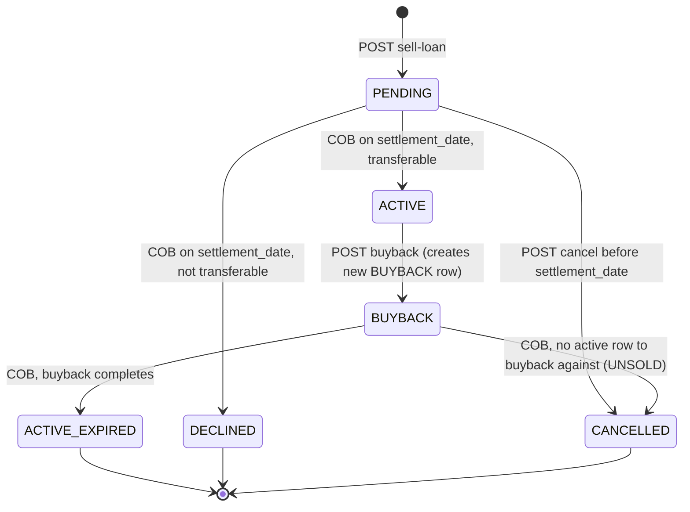
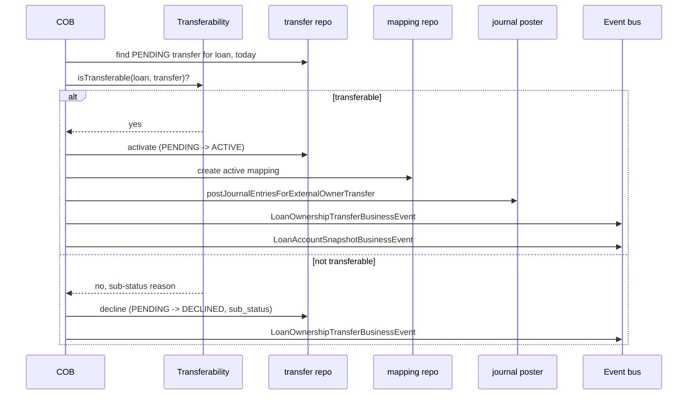
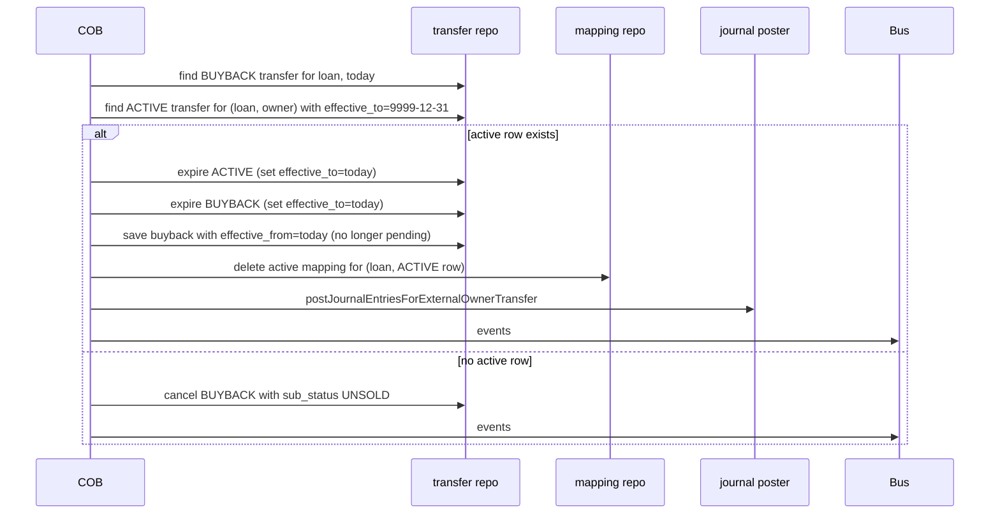

This page is about the `ExternalAssetOwnerTransfer` entity and the flow that takes a freshly originated loan, registers an intent to sell it to an external investor, and — through the COB pipeline of Apache Fineract — flips ownership on the settlement date. The model is deliberately split between "intent" (a row created by the API call) and "effect" (state changes applied by the COB step), which is what lets it cope cleanly with same-day buyback chains and multi-leg deals.

## The `ExternalAssetOwnerTransfer` entity

Defined in `org.apache.fineract.investor.domain.ExternalAssetOwnerTransfer`, mapped to `m_external_asset_owner_transfer`. The key fields:

```java
@Entity
@Table(name = "m_external_asset_owner_transfer")
public class ExternalAssetOwnerTransfer extends AbstractAuditableWithUTCDateTimeCustom<Long> {

    @ManyToOne @JoinColumn(name = "owner_id", nullable = false)
    private ExternalAssetOwner owner;

    @OneToOne(mappedBy = "externalAssetOwnerTransfer", cascade = CascadeType.ALL)
    private ExternalAssetOwnerTransferDetails externalAssetOwnerTransferDetails;

    @Column(name = "external_id", length = 100, nullable = false)
    private ExternalId externalId;

    @Column(name = "status", length = 50, nullable = false)
    @Enumerated(EnumType.STRING)
    private ExternalTransferStatus status;

    @Column(name = "sub_status", length = 50)
    @Enumerated(EnumType.STRING)
    private ExternalTransferSubStatus subStatus;

    @Column(name = "purchase_price_ratio", length = 50, nullable = false)
    private String purchasePriceRatio;

    @Column(name = "settlement_date", nullable = false)
    private LocalDate settlementDate;

    @Column(name = "effective_date_from", nullable = false)
    private LocalDate effectiveDateFrom;

    @Column(name = "effective_date_to", nullable = false)
    private LocalDate effectiveDateTo;

    @Column(name = "loan_id", nullable = false)
    private Long loanId;

    @Column(name = "external_loan_id", length = 100)
    private ExternalId externalLoanId;
}
```

A few things to note:

- `purchasePriceRatio` is a string (not a `BigDecimal`) because pricing in the real world is sometimes an expression (`100/95`, `0.97`) and the platform preserves the input form. The accounting side parses it when it needs a number.
- `effectiveDateTo` defaults to `9999-12-31` (the platform's "no upper bound" sentinel). The COB step uses that sentinel to find the *currently active* row for a loan.
- `externalId` is the caller-supplied identifier — the caller's bookkeeping reference.
- `loanId` is denormalised onto the transfer row (rather than relying on the mapping table) so queries on settlement day are a single index lookup.

## Status enum

`ExternalTransferStatus` defines the lifecycle:

```java
public enum ExternalTransferStatus {
    ACTIVE,
    ACTIVE_INTERMEDIATE,
    DECLINED,
    PENDING,
    PENDING_INTERMEDIATE,
    BUYBACK,
    BUYBACK_INTERMEDIATE,
    CANCELLED
}
```

And `ExternalTransferSubStatus`:

```java
public enum ExternalTransferSubStatus {
    BALANCE_ZERO,
    BALANCE_NEGATIVE,
    SAMEDAY_TRANSFERS,
    USER_REQUESTED,
    UNSOLD
}
```

Sub-status explains *why* a transition occurred. `BALANCE_ZERO` and `BALANCE_NEGATIVE` are reasons the transferability service declines; `SAMEDAY_TRANSFERS` is the marker on intermediate rows; `USER_REQUESTED` is the reason on operator-driven cancellations; `UNSOLD` is set when a buyback completes against no active ownership row (the originator never actually sold the loan to that investor).

## The lifecycle in detail



The `_INTERMEDIATE` states are an internal mechanism for same-day chains (sell-and-buyback on the same date). The user-visible lifecycle does not include them; they are transient.

## Sell-loan API

```
POST /v1/external-asset-owners/transfers/loans/{loanId}
```

Body:

```json
{
  "transferExternalId": "TRF-2024-0001",
  "ownerExternalId": "INV-ACME",
  "settlementDate": "15 March 2024",
  "purchasePriceRatio": "0.97",
  "dateFormat": "dd MMMM yyyy",
  "locale": "en"
}
```

What happens:

1. The handler validates the request.
2. The loan is loaded and inspected to confirm it can be considered for transfer (the loan must exist, not be already closed).
3. A new `ExternalAssetOwnerTransfer` row is created with `status = PENDING`, `effectiveDateFrom = settlementDate`, `effectiveDateTo = 9999-12-31`.
4. A `LoanOwnershipTransferBusinessEvent` is fired so listeners (notifications, downstream BI) can pick it up.

The API call does **not** post journal entries and does **not** create the active-ownership mapping. Those are the COB step's responsibility.

The sibling endpoint `POST /v1/external-asset-owners/transfers/loans/external-id/{loanExternalId}` is the same with the loan keyed by its external id.

## Buyback API

A buyback is the same endpoint shape, with `transferType=BUYBACK` in the payload. It creates a new transfer row in `BUYBACK` status pointing at the same loan and the same owner — the COB step matches it against the currently-active ACTIVE row and expires the chain.

## Cancellation API

```
POST /v1/external-asset-owners/transfers/{id}?command=cancel
```

`cancel` is only legal while the transfer is `PENDING` or `BUYBACK`. The transfer transitions to `CANCELLED` with `subStatus = USER_REQUESTED`. The active mapping (if any) is untouched.

## Active mapping table

`ExternalAssetOwnerTransferLoanMapping` records who currently owns a given loan:

| Column | Meaning |
| --- | --- |
| `loan_id` | The loan |
| `owner_transfer_id` | The transfer row that established this ownership |

A row exists only while a loan is owned by an external investor; the COB step inserts it when a transfer activates and deletes it when buyback completes.

## What the COB step looks for

On COB, the step runs against every loan and queries the transfer table with a settlement-date filter:

```java
List<ExternalAssetOwnerTransfer> transferDataList = externalAssetOwnerTransferRepository.findAll(
    (root, query, cb) -> cb.and(
        cb.equal(root.get("loanId"), loanId),
        cb.equal(root.get("settlementDate"), settlementDate),
        root.get("status").in(Stream.concat(PENDING_STATUSES.stream(), BUYBACK_STATUSES.stream()).toList()),
        cb.greaterThanOrEqualTo(root.get("effectiveDateTo"), FUTURE_DATE_9999_12_31)),
    Sort.by(Sort.Direction.ASC, "id"));
```

There are three possible shapes the result list takes:

| Result size | Meaning | Action |
| --- | --- | --- |
| `0` | Nothing to do today | Skip |
| `1, PENDING-class status` | A single sale to activate | `handleSale` |
| `1, BUYBACK-class status` | A single buyback to apply | `handleBuyback` |
| `2 (PENDING + BUYBACK)` | Same-day sell-and-buyback | `handleSameDaySaleAndBuyback` |

Any other shape is an illegal state and throws.

## Sale flow on COB



The transferability service (`LoanTransferabilityService`) is the policy: it inspects loan balance, status, attributes, and the per-product `ExternalAssetOwnerLoanProductAttribute` to decide whether the sale can complete. The default implementation declines on zero or negative balance.

## Buyback flow on COB



The `UNSOLD` branch is the protection against malformed sequences (a buyback registered for a loan that was never actually sold).

## Same-day sale + buyback

When the COB finds both a `PENDING` and a `BUYBACK` row for the same loan on the same settlement date, `handleSameDaySaleAndBuyback` runs. The platform expires the sale and the buyback in one transaction, marking them with the `SAMEDAY_TRANSFERS` sub-status, and the net effect on the loan's ownership is zero. (If the delayed settlement attribute is enabled on the product, this state is illegal and the step throws — same-day chains and delayed settlement are mutually exclusive.)

## Effective dating

`effectiveDateFrom` and `effectiveDateTo` form an interval. The active row is the one whose interval contains "today" — which during normal operation means `effectiveDateTo = 9999-12-31`. Expiry is by setting `effectiveDateTo` to the actual end date, which keeps the row queryable as a historical record.

The interval is what lets a single owner-transfer history be reconstructed for a loan, point-in-time, after the fact.

## Per-product attributes

`ExternalAssetOwnerLoanProductAttribute` rows store per-product knobs that affect transferability. The most common is the *delayed settlement* attribute — a tenant-configurable amount of time the platform waits between intent and the actual ownership flip. When enabled, the COB step will reject the illegal "two transfers same day" condition above with an `IllegalStateException`.

## Validation and exceptions

The shipped exceptions:

| Exception | Trigger |
| --- | --- |
| `ExternalAssetOwnerNotFoundException` | Owner externalId not found |
| `ExternalAssetOwnerDuplicateException` | Owner externalId already exists |
| `ExternalAssetOwnerInitiateTransferException` | Transfer pre-conditions failed at API time |
| `ExternalAssetOwnerTransferNotFoundException` | Transfer id not found |
| `ExternalAssetOwnerLoanProductAttributeNotFoundException` | Per-product attribute not configured |
| `ExternalAssetOwnerLoanProductAttributeAlreadyExistsException` | Duplicate attribute create |
| `ExternalAssetOwnerLoanProductAttributesException` | General attribute validation |

## Reading transfers

`GET /v1/external-asset-owners/transfers/active-transfer?loanId=...` is the cheapest "who owns this loan right now" call. `GET /v1/external-asset-owners/transfers?loanId=...` returns the full history.

The investor read enrichers (`LoanAccountDataV1Enricher`, etc.) automatically add `currentOwnerExternalId` to the standard loan read DTOs, so most clients do not need to call the investor endpoints to know about ownership at all.

## Where to next

- [Investor COB business step](/investor/investor-cob) — the COB integration in detail.
- [Investor accounting](/investor/investor-accounting) — the journal entries posted on activation and buyback.
