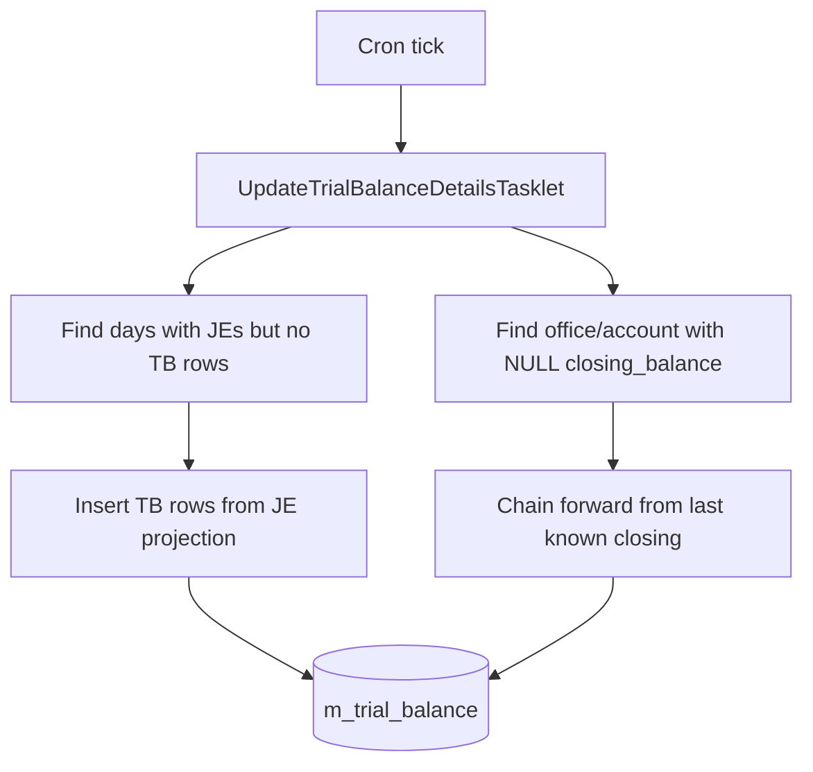
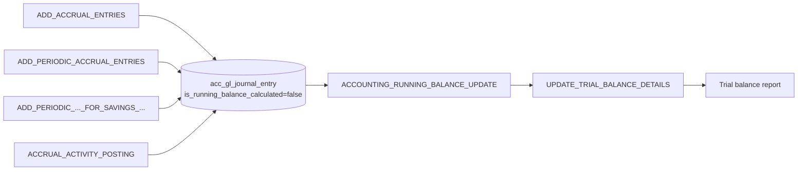

Apache Fineract keeps its general ledger consistent through a handful of accounting-focused scheduled jobs that backfill periodic accruals, maintain the daily trial balance and refresh the per-account running balance column. They run on top of the loan/savings posting jobs and so are usually the last to fire in the nightly chain. This page walks each one. For the schedule-centric view, see the [Tasklet catalog](/jobs/tasklets-catalog); for the GL model and how journal entries are produced, see [Accounting jobs](/accounting/accounting-jobs).

## `ACCOUNTING_RUNNING_BALANCE_UPDATE`

**Tasklet:** `fineract-provider/src/main/java/org/apache/fineract/accounting/jobs/accountrunningbalanceupdate/AccountRunningBalanceUpdateTasklet.java`

A one-liner that delegates to a domain service:

```java
@Slf4j
@RequiredArgsConstructor
public class AccountRunningBalanceUpdateTasklet implements Tasklet {

    private final JournalEntryRunningBalanceUpdateService journalEntryRunningBalanceUpdateService;

    @Override
    public RepeatStatus execute(StepContribution contribution, ChunkContext chunkContext) throws Exception {
        journalEntryRunningBalanceUpdateService.updateRunningBalance();
        return RepeatStatus.FINISHED;
    }
}
```

`updateRunningBalance()` walks every `acc_gl_account` flagged with `is_running_balance_calculated = true` and, for each office, recomputes the running balance per GL account from the earliest unbalanced journal entry onwards. Journal entries each carry `office_running_balance`, `organization_running_balance` and `is_running_balance_calculated` columns; the job is what keeps them current.

The job is idempotent: running it twice in a row produces the same numbers, and a partial run that fails halfway is picked up where it left off because the earliest-unbalanced cursor is queried fresh each invocation.

**Tables written:** `acc_gl_journal_entry` (`office_running_balance`, `organization_running_balance`, `is_running_balance_calculated`).

## `UPDATE_TRIAL_BALANCE_DETAILS`

**Tasklet:** `fineract-accounting/src/main/java/org/apache/fineract/accounting/glaccount/jobs/updatetrialbalancedetails/UpdateTrialBalanceDetailsTasklet.java`

The `m_trial_balance` table stores per-office, per-GL-account, per-day debit/credit totals that the trial-balance report reads. The job fills two kinds of gap:

1. Days for which journal entries exist but no `m_trial_balance` rows.
2. `closing_balance` values that have not yet been chained forward from the previous day.

The tasklet body:

```java
public RepeatStatus execute(StepContribution contribution, ChunkContext chunkContext) throws Exception {
    final JdbcTemplate jdbcTemplate =
        new JdbcTemplate(dataSourceServiceFactory.determineDataSourceService().retrieveDataSource());
    processTrialBalanceGaps(jdbcTemplate);
    updateClosingBalances(jdbcTemplate);
    return RepeatStatus.FINISHED;
}
```

### `processTrialBalanceGaps`

```java
private void processTrialBalanceGaps(JdbcTemplate jdbcTemplate) {
    LocalDate maxCreatedDate = trialBalanceRepository.findMaxCreatedDate();
    LocalDate baselineDate = maxCreatedDate != null ? maxCreatedDate : LocalDate.of(2010, 1, 1);
    List<LocalDate> tbGaps = journalEntryRepository.findTransactionDatesAfter(baselineDate);
    for (LocalDate tbGap : tbGaps) {
        if (DateUtils.getExactDifferenceInDays(tbGap, DateUtils.getBusinessLocalDate()) < 1) {
            continue;
        }
        insertTrialBalanceForDate(tbGap);
    }
}
```

The fallback baseline of `2010-01-01` is what makes a brand-new install with no previous trial balance simply backfill from the start of history. The `< 1 day` skip means the **current** business day is never trial-balanced — only the past, because today's totals could still mutate.

`insertTrialBalanceForDate` issues a `SELECT office_id, gl_account_id, SUM(amount * sign), entry_date, transaction_date FROM acc_gl_journal_entry WHERE ...` projection, maps each row to a `TrialBalance` entity and saves them in bulk via `trialBalanceRepositoryWrapper.save(trialBalances)`.

### `updateClosingBalances`

```java
private void updateClosingBalanceForAccount(JdbcTemplate jdbcTemplate, Long officeId, Long accountId) {
    BigDecimal closingBalance = getPreviousClosingBalance(officeId, accountId);
    List<TrialBalance> tbRows = trialBalanceRepositoryWrapper.findNewByOfficeAndAccount(officeId, accountId);
    updateTrialBalanceRows(tbRows, closingBalance);
}

private void updateTrialBalanceRows(List<TrialBalance> tbRows, BigDecimal initialClosingBalance) {
    BigDecimal closingBalance = initialClosingBalance;
    for (TrialBalance row : tbRows) {
        if (closingBalance != null) {
            closingBalance = closingBalance.add(row.getAmount());
        }
        row.setClosingBalance(closingBalance);
    }
}
```

For each `(office, account)` pair that has rows with `closing_balance IS NULL`, the algorithm fetches the last known closing balance, then walks the new rows in date order, chaining `closing_balance = previous + amount`.



**Tables written:** `m_trial_balance` (insert + closing balance backfill).

## `ADD_PERIODIC_ACCRUAL_ENTRIES`

Covered in detail in [Loan jobs deep-dive](/jobs/loan-jobs-deep-dive#add_periodic_accrual_entries) — listed here because the accounting team owns the periodic-accrual ledger entries. The relevant points from an accounting perspective:

- Produces one `m_loan_transaction` per loan per period with `transaction_type = ACCRUAL (10)`.
- Produces matching `acc_gl_journal_entry` rows for the income GL account (Interest Income, Fee Income, Penalty Income) and the receivable account.
- The journal entries are flagged `is_running_balance_calculated = false` so the running-balance job picks them up afterwards.

## `ADD_PERIODIC_ACCRUAL_ENTRIES_FOR_LOANS_WITH_INCOME_POSTED_AS_TRANSACTIONS`

**Tasklet:** `fineract-provider/src/main/java/org/apache/fineract/portfolio/loanaccount/jobs/addperiodicaccrualentriesforloanswithincomepostedastransactions/AddPeriodicAccrualEntriesForLoansTasklet.java`

A specialised path for products configured with **income-posted-as-transaction** semantics: instead of one running income figure, the GL records each instalment's interest, fee and penalty as separate journal entries on the day the accrual rolls forward. This is what some regulators require for granular income reporting.

The algorithm is parallel to `ADD_PERIODIC_ACCRUAL_ENTRIES`, with the difference that the produced transaction carries sub-amounts per income type rather than a single rolled-up amount.

## `ACCRUAL_ACTIVITY_POSTING`

**Tasklet:** `fineract-provider/src/main/java/org/apache/fineract/portfolio/loanaccount/jobs/accrualactivityposting/AccrualActivityPostingTasklet.java`

For products with `accrual_activity_posting_enabled = true`, this writes one `m_loan_transaction` of type `ACCRUAL_ACTIVITY` per loan per day, encapsulating the day's accrual activity in a single row that the reporting layer can sum without unrolling. The journal entries are still produced per income GL account but the loan-side transaction stays compact. See [loan-accrual-activity](/loan/loan-accrual-activity).

## `UPDATE_LOAN_PAID_IN_ADVANCE`

A historical job, now folded into the COB pipeline on modern installs. When enabled, it walks active loans, computes `paid_in_advance_amount = sum(repayment_transactions.amount) - sum(due_installments_to_date.amount)`, and persists the result on `m_loan` so the loan detail UI can display it without recomputation. New deployments do not schedule it; it remains in `JobName` for backward compatibility.

## Dependencies and ordering



The hard ordering rule: any job that produces journal entries (every accrual, every customer-side posting and every transfer) must run **before** `ACCOUNTING_RUNNING_BALANCE_UPDATE`, which must run **before** `UPDATE_TRIAL_BALANCE_DETAILS`. Operators typically schedule the chain like this:

| Time | Job |
|------|-----|
| 22:00–01:00 | All accrual + posting + dormant jobs |
| 01:30 | `ACCOUNTING_RUNNING_BALANCE_UPDATE` |
| 02:00 | `UPDATE_TRIAL_BALANCE_DETAILS` |
| 02:30 | `JOURNAL_ENTRY_AGGREGATION` (see [Dirty jobs](/jobs/dirty-jobs-and-aggregation)) |

Skipping the running-balance job for a day will leave the trial balance job correct (it queries journal entries directly), but operator drill-downs on a single GL account will see stale `running_balance` numbers.

## Idempotency

| Job | Idempotent? | Why |
|-----|-------------|-----|
| `ACCOUNTING_RUNNING_BALANCE_UPDATE` | Yes | Cursor is "earliest unbalanced" — running twice does nothing on the second pass. |
| `UPDATE_TRIAL_BALANCE_DETAILS` | Yes | Filters by missing `m_trial_balance` rows / null `closing_balance`. |
| `ADD_PERIODIC_ACCRUAL_ENTRIES` | Yes | Loan `accrued_till` watermark prevents double-posting. |
| `ACCRUAL_ACTIVITY_POSTING` | Yes | One row per loan per day, enforced by composite unique index. |

This means **manual re-runs are safe**. If an operator notices a gap, they can re-run the affected job through the [Scheduler API](/jobs/scheduler-api) without rolling back anything else.

## Failure semantics

- Tasklets that wrap a domain service (running balance, periodic accrual) propagate `MultiException` from per-account loops into a `JobExecutionException`. The Spring Batch run status reflects the failure but the survivors are committed.
- `UPDATE_TRIAL_BALANCE_DETAILS` runs everything in a single tasklet-level transaction. A SQL failure mid-way rolls back; the next run reprocesses cleanly thanks to the cursor.

## Manual rebuild scenarios

Operators occasionally need to rebuild the accounting summary tables from scratch — typically after a chart-of-accounts migration or after manually backfilling historical journal entries. The procedure:

1. **Truncate** the targets. For trial balance: `DELETE FROM m_trial_balance`. For running balances: `UPDATE acc_gl_journal_entry SET is_running_balance_calculated = false, office_running_balance = NULL, organization_running_balance = NULL`.
2. **Re-run** `ACCOUNTING_RUNNING_BALANCE_UPDATE` through `POST /v1/jobs/{id}?command=executeJob`. Watch the run history; on a large database this may take many minutes.
3. **Re-run** `UPDATE_TRIAL_BALANCE_DETAILS`. Because of the `2010-01-01` baseline fallback, it will backfill every day with journal entry activity.
4. **Reconcile** with the trial balance report (`/v1/runreports/TrialBalanceReport`) to confirm the totals match the source journal entries for a known date.

Because all three jobs are idempotent, the worst case of a partial rebuild is "run them again". There is no risk of double-posting.

## Configuration knobs that affect these jobs

| Config | Where set | Effect |
|--------|-----------|--------|
| `acc_gl_account.is_running_balance_calculated` | `m_gl_account` row | If `false`, the running-balance job skips this account; useful for accounts you never report on. |
| `m_product_loan.accounting_type` | Loan product | Determines which accrual job is responsible for the product. `CASH` means no accrual is needed at all. |
| `m_savings_product.accounting_type` | Savings product | Same logic on the savings side. |
| `account_moves_out_of_npa_only_on_arrears_completion` | Loan product | Read by `UPDATE_NPA` (see [Dirty jobs](/jobs/dirty-jobs-and-aggregation#update_npa-—-non-performing-asset-classification)). |
| `enable_accounting` | `m_organisation_currency` | When `false`, all accounting jobs no-op against the tenant. |

## Logging surface

Each accounting tasklet logs a single line per run at INFO with the affected record count. For example:

```
2024-04-12T02:00:01Z INFO  default: Records affected by updateTrialBalanceDetails: 3517
2024-04-12T01:30:01Z INFO  default: Records affected by updateRunningBalance: 18420
```

Use these as health-check signals — a sudden drop to zero usually means an upstream posting job did not run.

## Performance characteristics

- `ACCOUNTING_RUNNING_BALANCE_UPDATE` is **O(unbalanced entries × accounts per office)**. On a database with millions of historical journal entries but only a small daily delta, the job is fast because the cursor advances past the already-balanced rows.
- `UPDATE_TRIAL_BALANCE_DETAILS` is **O(gap days × offices × accounts)** for the insert pass and **O(unchained rows)** for the closing-balance pass. A multi-week gap (e.g. after a vacation downtime) takes proportionally longer than a one-day catch-up.
- `ADD_PERIODIC_ACCRUAL_ENTRIES` is **O(active loans with accrual deltas)**. It is the slowest of the three because it loads `Loan` aggregates.

Tenants with very large books typically push `ACCOUNTING_RUNNING_BALANCE_UPDATE` and `UPDATE_TRIAL_BALANCE_DETAILS` into their own `scheduler_group` so they do not block the early-morning customer-facing jobs.

## Reading the trial balance after a run

A common operator request: "show me the closing balance for GL account X at office Y on date Z". The query that answers it directly:

```sql
SELECT closing_balance
FROM m_trial_balance
WHERE office_id = :officeId
  AND gl_account_id = :glAccountId
  AND entry_date = :date
ORDER BY id DESC
LIMIT 1;
```

If the trial-balance job has not run yet for that date, `closing_balance` will be NULL. Run `UPDATE_TRIAL_BALANCE_DETAILS` and re-query.

For the report-style "all accounts at one office for a date" view, the trial balance report (`TrialBalanceReport` in `m_report`) already does the joins and the rollup.

## Failure modes you might see

| Symptom | Likely cause |
|---------|--------------|
| `closing_balance IS NULL` for the latest row | `UPDATE_TRIAL_BALANCE_DETAILS` has not run since the row was inserted. |
| Today's TB row exists but yesterday's does not | The job's "skip current day" guard prevented it from inserting today's row on the run that processed yesterday. Run again tomorrow. |
| Running balance is far off from sum of journal entries | The running balance job was skipped for many days, then re-run; check it completed without exception. |
| Periodic accrual transactions missing for a loan | The loan's `accrued_till` watermark is set further than its actual accruals (manual mutation). Reset and re-run. |

## Cross-references

<CardGroup cols={2}>
  <Card title="Accounting jobs (data view)" href="/accounting/accounting-jobs">Tables, GL flows and journal entry shapes.</Card>
  <Card title="Loan jobs deep dive" href="/jobs/loan-jobs-deep-dive">Where the accrual transactions come from.</Card>
  <Card title="Savings jobs deep dive" href="/jobs/savings-jobs-deep-dive">Customer-side jobs that feed the journal.</Card>
  <Card title="Dirty / aggregation" href="/jobs/dirty-jobs-and-aggregation">Journal entry aggregation and NPA flagging.</Card>
</CardGroup>
