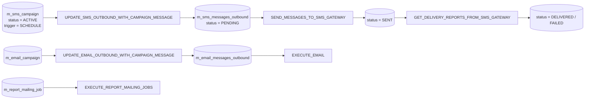
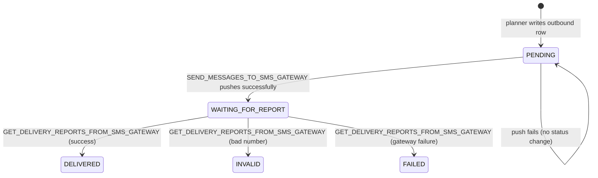

Apache Fineract ships an "outbound communications" pipeline with two halves: a planner that turns active campaigns into pending messages, and a dispatcher that pushes those messages to the gateway and updates their status. Both halves are batch jobs. The set is rounded off by a delivery-report poller, the email tasklet that walks the email inbox table, and the report mailing job that attaches stretchy reports to scheduled emails. This page walks each one.

## Pipeline overview



## `UPDATE_SMS_OUTBOUND_WITH_CAMPAIGN_MESSAGE`

**Tasklet:** `fineract-provider/src/main/java/org/apache/fineract/infrastructure/campaigns/jobs/updatesmsoutboundwithcampaignmessage/UpdateSmsOutboundWithCampaignMessageTasklet.java`

The planner for SMS. It walks every campaign whose `trigger_type = SCHEDULE` and `status = ACTIVE`, and, for each one whose `next_trigger_date` is in the past, generates outbound rows and rolls the trigger date forward:

```java
public RepeatStatus execute(StepContribution contribution, ChunkContext chunkContext) throws Exception {
    final Collection<SmsCampaign> smsCampaignDataCollection = smsCampaignRepository
        .findByTriggerTypeAndStatus(SmsCampaignTriggerType.SCHEDULE.getValue(),
                                    SmsCampaignStatus.ACTIVE.getValue());
    if (!CollectionUtils.isEmpty(smsCampaignDataCollection)) {
        for (SmsCampaign smsCampaign : smsCampaignDataCollection) {
            LocalDateTime tenantDateNow = DateUtils.getLocalDateTimeOfTenant();
            LocalDateTime nextTriggerDate = smsCampaign.getNextTriggerDate();
            if (DateUtils.isBefore(nextTriggerDate, tenantDateNow)) {
                smsCampaignWritePlatformService.insertDirectCampaignIntoSmsOutboundTable(smsCampaign);
                updateTriggerDates(smsCampaign.getId());
            }
        }
    }
    return RepeatStatus.FINISHED;
}
```

`updateTriggerDates(...)` shifts `last_trigger_date` to the current trigger and computes the next one through `CalendarUtils.getNextRecurringDate(recurrence, ...)`. If the calendar math somehow lands a date in the past (catch-up scenario after a long downtime), the method advances again to the next future date — so we never emit duplicate "missed" runs.

**Tables written:** `m_sms_messages_outbound` (PENDING rows), `m_sms_campaign` (`last_trigger_date`, `next_trigger_date`).

### Recurrence

The campaign's `recurrence` column is a calendar string compatible with `CalendarUtils.getNextRecurringDate` — daily, weekly, monthly etc. The same helper is used by group meeting calendars, so SMS campaigns can piggy-back on existing recurrence definitions.

## `SEND_MESSAGES_TO_SMS_GATEWAY`

**Tasklet:** `fineract-provider/src/main/java/org/apache/fineract/infrastructure/campaigns/jobs/sendmessagetosmsgateway/SendMessageToSmsGatewayTasklet.java`

The dispatcher. It pages through `m_sms_messages_outbound` rows in status `PENDING` and pushes each batch to the configured SMS gateway over HTTP:

```java
public RepeatStatus execute(StepContribution contribution, ChunkContext chunkContext) throws Exception {
    int pageLimit = 200;
    int page = 0;
    int totalRecords;
    do {
        PageRequest pageRequest = PageRequest.of(0, pageLimit);
        org.springframework.data.domain.Page<SmsMessage> pendingMessages = smsMessageRepository
            .findByStatusType(SmsMessageStatusType.PENDING.getValue(), pageRequest);
        ...
        // batch HTTP POST through restTemplate.exchange(...)
    } while (page < ...);
    return RepeatStatus.FINISHED;
}
```

Key points:

- Page size is **fixed at 200** in the source — tweak the constant in the tasklet itself if you need different. There is no job parameter for it.
- Uses the shared `ThreadPoolTaskExecutor` to parallelise per-batch HTTP calls.
- HTTP target and credentials come from `SmsConfigUtils.getSmsGatewayConfig()` which reads `c_external_service_properties` for `SMS_GATEWAY_PROVIDER`.
- On a successful push the messages flip to `WAITING_FOR_REPORT (200)`; on connection failure the batch's rows stay `PENDING` and the next cron tick retries them.
- `NotificationSenderService` also routes through here when in-app notifications are configured.

**Tables written:** `m_sms_messages_outbound` (`status_enum`, `submittedon_date`, `submitted_to_gateway_date`).

## `GET_DELIVERY_REPORTS_FROM_SMS_GATEWAY`

**Tasklet:** `fineract-provider/.../infrastructure/campaigns/jobs/getdeliveryreportsfromsmsgateway/GetDeliveryReportsFromSmsGatewayTasklet.java`

The mirror of the dispatcher. It polls the SMS gateway for delivery reports on messages currently in `WAITING_FOR_REPORT (200)` status and rolls them forward to `DELIVERED (300)`, `INVALID (400)` or `FAILED (500)` based on the gateway's response. The gateway is queried by `external_id`, so the tasklet is idempotent — re-running mid-day picks up reports that arrived since the previous fire.

**Tables written:** `m_sms_messages_outbound` (`status_enum`, `delivered_on_date`, `delivery_error_message`).

## `UPDATE_EMAIL_OUTBOUND_WITH_CAMPAIGN_MESSAGE`

**Tasklet:** `fineract-provider/.../infrastructure/campaigns/jobs/updateemailoutboundwithcampaignmessage/UpdateEmailOutboundWithCampaignMessageTasklet.java`

The email-side planner, mirroring the SMS one. For each active scheduled `EmailCampaign`, it computes whether the next trigger date has arrived, and if so writes rows into `m_email_messages` in `PENDING` state with the rendered subject/body. The trigger date is then rolled forward via `CalendarUtils`.

**Tables written:** `m_email_messages` (PENDING rows), `m_email_campaign` (`last_trigger_date`, `next_trigger_date`).

## `EXECUTE_EMAIL`

**Tasklet:** `fineract-provider/.../infrastructure/campaigns/jobs/executeemail/ExecuteEmailTasklet.java`

The email-side dispatcher. Substantial in size because it also handles **stretchy report attachments**. Header:

```java
@Slf4j
@RequiredArgsConstructor
public class ExecuteEmailTasklet implements Tasklet {

    private final EmailMessageRepository emailMessageRepository;
    private final EmailCampaignRepository emailCampaignRepository;
    private final LoanRepository loanRepository;
    private final SavingsAccountRepository savingsAccountRepository;
    private final EmailMessageJobEmailService emailMessageJobEmailService;
    private final ReadReportingService readReportingService;
    private final ReportMailingJobValidator reportMailingJobValidator;
    private final FineractProperties fineractProperties;

    @Override
    public RepeatStatus execute(StepContribution contribution, ChunkContext chunkContext) throws Exception {
        if (IPv4Helper.applicationIsNotRunningOnLocalMachine()) {
            final List<EmailMessage> emailMessages = emailMessageRepository
                .findByStatusType(EmailMessageStatusType.PENDING.getValue());
            for (final EmailMessage emailMessage : emailMessages) {
                ...
            }
        }
        return RepeatStatus.FINISHED;
    }
}
```

The `IPv4Helper.applicationIsNotRunningOnLocalMachine()` guard is the historical safeguard against sending real emails from a developer laptop. Mostly redundant in production.

For each PENDING email:

1. Pull the linked `EmailCampaign` so we know the attachment format and the stretchy-report parameter map.
2. Decide between three attachment modes based on the parameter keys:
   - `selectLoan` / `loanId` → run the report once per open loan of the client and attach each result.
   - `savingId` → run the report once per active savings of the client.
   - Neither → run the report once with client-level parameters.
3. Build an `EmailMessageWithAttachmentData` carrying the message text and the attachment files.
4. Send through `EmailMessageJobEmailService.sendEmailWithAttachment(...)`.
5. On success mark `SENT`, on failure mark `FAILED` and record the error.

Excerpt:

```java
try {
    emailMessageJobEmailService.sendEmailWithAttachment(emailMessageWithAttachmentData);
    emailMessage.setStatusType(EmailMessageStatusType.SENT.getValue());
    emailMessageRepository.save(emailMessage);
} catch (Exception e) {
    emailMessage.setErrorMessage(e.getMessage());
    emailMessage.setStatusType(EmailMessageStatusType.FAILED.getValue());
    emailMessageRepository.save(emailMessage);
}
```

Failures are persisted per message — the loop keeps going and a single bad SMTP attempt does not poison the rest.

**Tables written:** `m_email_messages` (`status_enum`, `error_message`).

## `EXECUTE_REPORT_MAILING_JOBS`

**Tasklet:** `fineract-provider/src/main/java/org/apache/fineract/infrastructure/campaigns/jobs/executereportmailingjobs/ExecuteReportMailingJobsTasklet.java`

A different mechanism than email campaigns: instead of one row per recipient, a `ReportMailingJob` row says "every Monday at 09:00, run report X with parameters Y and email it to address Z". The tasklet body iterates `reportMailingJobRepository.findByIsActiveTrueAndIsDeletedFalse()` and for each one whose `next_run_date` has passed:

1. Resolves the stretchy report through `ReadReportingService`.
2. Runs the report via the appropriate `ReportingProcessService` (table-based, pentaho, etc.) and pulls back the bytes.
3. Wraps them in a `ReportMailingJobEmailData` with the email address, subject and body.
4. Sends through `ReportMailingJobEmailService.sendEmail(...)`.
5. Persists a `ReportMailingJobRunHistory` row with `RUNNING_STATUS = SUCCESS` or `FAILURE`.
6. Updates `last_run_date` and computes `next_run_date` from `recurrence` via `CalendarUtils`.

**Tables written:** `m_report_mailing_job` (`last_run_date`, `next_run_date`, `previous_run_status`), `m_report_mailing_job_run_history`.

## Cadence and operator considerations

| Job | Typical cadence | Why |
|-----|-----------------|-----|
| `UPDATE_SMS_OUTBOUND_WITH_CAMPAIGN_MESSAGE` | Every 5–15 minutes | Plan messages close to send time so customer data is fresh. |
| `SEND_MESSAGES_TO_SMS_GATEWAY` | Every 1–5 minutes | Push as soon as PENDING rows exist. |
| `GET_DELIVERY_REPORTS_FROM_SMS_GATEWAY` | Every 5–10 minutes | Reports trail behind sends by minutes. |
| `UPDATE_EMAIL_OUTBOUND_WITH_CAMPAIGN_MESSAGE` | Every 5–15 minutes | Same logic as SMS planner. |
| `EXECUTE_EMAIL` | Every 5–15 minutes | Stretchy report generation is slow; spread the load. |
| `EXECUTE_REPORT_MAILING_JOBS` | Every 15 minutes — 1 hour | Most report mailing jobs run daily anyway. |

A common deployment puts the SMS and email pipeline jobs on a dedicated `scheduler_group` so a stuck SMS gateway cannot back-pressure interest posting. See [Scheduler service](/jobs/scheduler-service#naming-a-scheduler) for how grouping works.

## Failure isolation

| Failure | Behaviour |
|---------|-----------|
| Single bad recipient address | Email/SMS marked `FAILED`; loop continues. |
| Gateway connection refused | Entire batch stays `PENDING`; retried next tick. |
| Stretchy report SQL error | Email marked `FAILED` with the SQL message; campaign keeps producing more rows on its own cadence. |
| Disk full while writing attachment | Email marked `FAILED`; admin sees the error log. |

The pattern across the campaign jobs is **per-item resilience**: even though the tasklet body looks like a flat for-loop, every iteration handles its own exceptions and never aborts the run.

## Security and tenant context

All campaign jobs run in the tenant context propagated by Quartz via the `JobDataMap` `tenantIdentifier` entry. The dispatcher tasklets use the tenant identifier when calling external services (the SMS gateway is multi-tenant on the server side, so it needs the identifier to route the message correctly).

`SendMessageToSmsGatewayTasklet` explicitly captures and reapplies the context inside any spawned `Callable`:

```java
final String tenantIdentifier = ThreadLocalContextUtil.getTenant().getTenantIdentifier();
```

If you write a similar campaign-style job, copy this pattern — failing to do so will route messages under the wrong tenant.

## Message status lifecycle



Email uses a simpler lifecycle (PENDING → SENT / FAILED) because most SMTP services do not push delivery receipts back.

## Adding a new campaign trigger type

The `SmsCampaignTriggerType` enum (`SCHEDULE`, `DIRECT`, `TRIGGERED`) is the closed list of campaign trigger types. `UPDATE_SMS_OUTBOUND_WITH_CAMPAIGN_MESSAGE` only walks `SCHEDULE` campaigns. To add a new schedule pattern:

1. Add a value to `SmsCampaignTriggerType` if the existing recurrence logic does not fit.
2. Implement an alternative `getNextRecurringDate` strategy if needed.
3. The tasklet body does not need to change — it only filters by `trigger_type == SCHEDULE`, leaving event-driven campaigns to fire through `BusinessEventListener` infrastructure instead.

The `TRIGGERED` campaign type is what powers "send SMS on client activation, loan disbursement, etc." flows — those campaigns react to `BusinessEvent`s synchronously through `SmsCampaignWritePlatformService.insertDirectCampaignIntoSmsOutboundTable(...)` and never depend on the scheduler.

## Stretchy report attachments — how the parameters work

`ExecuteEmailTasklet` looks at the campaign's `stretchy_report_param_map` (a JSON blob) and decides what to attach. The supported "magic" keys are:

| Key | Meaning |
|-----|---------|
| `selectLoan` | Generate one attachment per open loan of the client, named with the loan id. |
| `loanId` | Same as `selectLoan` but uses a different parameter name in the report. |
| `savingId` | Generate one attachment per active savings account of the client. |
| Anything else | Treat as a client-level parameter — generate exactly one attachment per email. |

The placeholder substitution happens in `replaceStretchyParamsWithActualClientParams` which swaps in the client's id, display name, office id, etc. The substituted values are then passed to `readReportingService.retrieveReportRunner(...)` which produces the CSV/PDF/XLSX bytes.

## Capacity planning

A few rules of thumb:

| Tenant size | SMS volume / day | Recommended | Notes |
|-------------|------------------|-------------|-------|
| Up to ~5k | ~500 | Default cadence is fine | Single shared scheduler group. |
| 5k–50k | ~5,000 | Dedicated scheduler group for campaign jobs | Avoid blocking interest posting. |
| 50k+ | 50k+ | Same + bump `pageLimit` in `SendMessageToSmsGatewayTasklet` | Consider scaling out by node id. |

The email pipeline is usually less stressed than SMS because the per-message cost (stretchy report generation) is larger, so the volume tends to be lower.

## Cross-references

<CardGroup cols={2}>
  <Card title="Tasklet catalog" href="/jobs/tasklets-catalog">Index of every campaign tasklet.</Card>
  <Card title="Scheduler service" href="/jobs/scheduler-service">Scheduler groups and how to isolate campaign jobs.</Card>
  <Card title="Notification core" href="/core/notification-core">In-app notifications dispatched alongside SMS.</Card>
  <Card title="Data queries" href="/core/data-queries">Stretchy reports backing email attachments.</Card>
</CardGroup>
