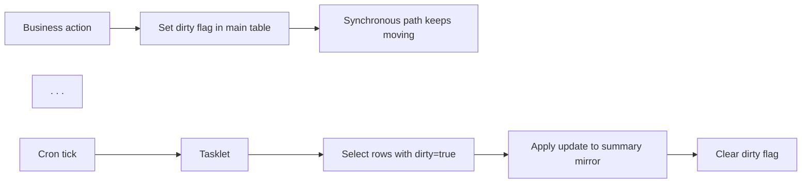
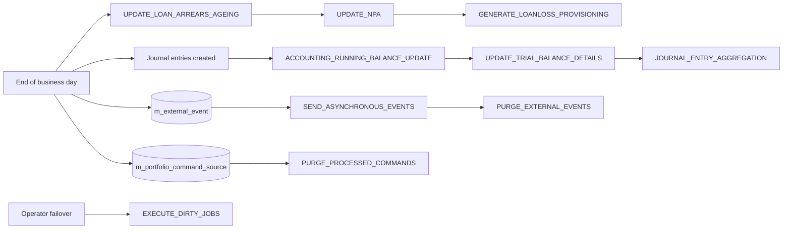

Some scheduled jobs in Apache Fineract do not move money or send messages — they exist purely to keep summary tables truthful and to recover from drift between the live tables and their denormalised mirrors. They include the **dirty job recovery** loop that re-runs jobs the framework couldn't finish on the wrong node, the **NPA flagger** that maintains `m_loan.is_npa`, the **journal entry aggregation** tracker, the **external-event purger** and the **processed-command purger**. This page collects them under the umbrella term *summary-table maintenance* because the underlying pattern is the same: a periodic sweep, an idempotent SQL update, and a flag bit that records what's already been done.

## Pattern: dirty-flag sweep



The job touches whatever the synchronous path optimistically deferred — running balances, NPA flags, summary rows, external event delivery — without blocking the user-facing transaction.

## `EXECUTE_DIRTY_JOBS` — recovery loop

**Tasklet:** `fineract-provider/src/main/java/org/apache/fineract/infrastructure/jobs/service/executealldirtyjobs/ExecuteAllDirtyJobsTasklet.java`

```java
@RequiredArgsConstructor
@Component
public class ExecuteAllDirtyJobsTasklet implements Tasklet {

    private final JobRegisterService jobRegisterService;
    private final ScheduledJobDetailRepository scheduledJobDetailsRepository;
    private final FineractProperties fineractProperties;

    @Override
    public RepeatStatus execute(StepContribution contribution, ChunkContext chunkContext) throws Exception {
        List<ScheduledJobDetail> jobDetails = scheduledJobDetailsRepository.findAllMismatchedJobs(true);

        for (ScheduledJobDetail scheduledJobDetail : jobDetails) {
            if (scheduledJobDetail.getNodeId().toString().equals(fineractProperties.getNodeId())) {
                jobRegisterService.executeJobWithParameters(scheduledJobDetail.getId(), null);
            }
        }
        return RepeatStatus.FINISHED;
    }
}
```

The recovery contract:

1. A previous run of any job either failed mid-stride (`StuckJobExecutorServiceImpl` flagged it) or was targeted at the wrong node id and refused with `JobNodeIdMismatchingException` (which sets `mismatched_job = true`).
2. `EXECUTE_DIRTY_JOBS` periodically re-runs every such row whose `node_id` now matches the current node — typically because the cluster failed over to this node.
3. Each successful re-run inside `JobRegisterService.executeJobWithParameters(...)` flips `mismatched_job = false`.

In effect, the dirty-jobs runner is the cluster's "catch-up" job. Operators typically schedule it every 5–10 minutes.

## `UPDATE_NPA` — non-performing asset classification

**Tasklet:** `fineract-provider/src/main/java/org/apache/fineract/infrastructure/jobs/service/updatenpa/UpdateNpaTasklet.java`

```java
@Slf4j
@RequiredArgsConstructor
public class UpdateNpaTasklet implements Tasklet {

    private final RoutingDataSourceServiceFactory dataSourceServiceFactory;
    private final DatabaseTypeResolver databaseTypeResolver;
    private final DatabaseSpecificSQLGenerator sqlGenerator;
    private final PlatformSecurityContext context;

    @Override
    public RepeatStatus execute(StepContribution contribution, ChunkContext chunkContext) throws Exception {
        AppUser user = context.getAuthenticatedUserIfPresent();
        final JdbcTemplate jdbcTemplate =
            new JdbcTemplate(dataSourceServiceFactory.determineDataSourceService().retrieveDataSource());
        // ... reset NPA, then set NPA ...
    }
}
```

Two SQL passes per tenant database.

### Pass 1 — clear the flag where applicable

```sql
-- conceptual; actual SQL is hand-built for MySQL/Postgres
UPDATE m_loan loan, (SELECT loan2.*
    FROM m_loan loan2
    LEFT JOIN m_loan_arrears_aging laa ON laa.loan_id = loan2.id
    INNER JOIN m_product_loan mpl
        ON mpl.id = loan2.product_id AND mpl.overdue_days_for_npa IS NOT NULL
    WHERE loan2.loan_status_id = 300
      AND (mpl.account_moves_out_of_npa_only_on_arrears_completion = false
           OR (mpl.account_moves_out_of_npa_only_on_arrears_completion = true
               AND laa.overdue_since_date_derived IS NULL))) sl
SET loan.is_npa = false,
    loan.last_modified_by = ?,
    loan.last_modified_on_utc = ?
WHERE loan.id = sl.id;
```

Reads: "for any active loan whose product has an NPA threshold configured, clear `is_npa` if either the product does **not** require full arrears completion or it does but the loan has no overdue items".

### Pass 2 — set the flag where applicable

```sql
UPDATE m_loan ml
SET ml.is_npa = true,
    ml.last_modified_by = ?,
    ml.last_modified_on_utc = ?
WHERE ml.id IN (
    SELECT loan.id
    FROM m_loan_arrears_aging laa
    INNER JOIN m_loan loan ON laa.loan_id = loan.id
    INNER JOIN m_product_loan mpl
        ON mpl.id = loan.product_id AND mpl.overdue_days_for_npa IS NOT NULL
    WHERE loan.loan_status_id = 300
      AND laa.overdue_since_date_derived <
          DATE_SUB(<business_date>, INTERVAL COALESCE(mpl.overdue_days_for_npa, 0) DAY)
    GROUP BY loan.id);
```

The `DatabaseSpecificSQLGenerator` produces the correct `DATE_SUB` / `current_date - interval` syntax for the active dialect. The `MySQL` branch in the tasklet special-cases the multi-table update.

**Tables written:** `m_loan` (`is_npa`, audit columns).

The job is idempotent: running it twice yields identical results. Operators typically schedule it nightly, after `UPDATE_LOAN_ARREARS_AGEING` (whose `m_loan_arrears_aging` rows the NPA query joins onto).

## `JOURNAL_ENTRY_AGGREGATION`

**Tasklet:** `fineract-provider/src/main/java/org/apache/fineract/infrastructure/jobs/service/aggregationjob/tasklet/JournalEntryAggregationTrackingTasklet.java`

This job is interesting because it is **part of a multi-step job** — the step shown here is the tracking step that follows the main aggregation step:

```java
public RepeatStatus execute(StepContribution contribution, @NonNull ChunkContext chunkContext) throws Exception {
    Optional<StepExecution> jobSummaryStepExecution = contribution.getStepExecution()
        .getJobExecution().getStepExecutions().stream()
        .filter(stepExecution -> stepExecution.getStepName()
            .equals(JournalEntryAggregationJobConstant.JOB_SUMMARY_STEP_NAME))
        .findFirst();
    long writeCount = jobSummaryStepExecution.map(StepExecution::getWriteCount).orElse(0L);

    if (writeCount > 0) {
        final JobExecution jobExecutionContext =
            chunkContext.getStepContext().getStepExecution().getJobExecution();
        final LocalDate aggregatedOnDateFrom = (LocalDate) jobExecutionContext.getExecutionContext()
            .get(JournalEntryAggregationJobConstant.AGGREGATED_ON_DATE_FROM);
        final LocalDate aggregatedOnDateTo = (LocalDate) jobExecutionContext.getExecutionContext()
            .get(JournalEntryAggregationJobConstant.AGGREGATED_ON_DATE_TO);
        JournalEntryAggregationTrackingData dto = JournalEntryAggregationTrackingData.builder()
            .submittedOnDate(ThreadLocalContextUtil.getBusinessDate())
            .aggregatedOnDateFrom(aggregatedOnDateFrom)
            .aggregatedOnDateTo(aggregatedOnDateTo)
            .jobExecutionId(contribution.getStepExecution().getJobExecution().getId())
            .build();
        journalEntryAggregationWriterService.insertJournalEntryTracking(dto);
    }
    return RepeatStatus.FINISHED;
}
```

Two important details:

1. The tasklet reads the **prior step's `writeCount`** from the job execution. Only when the upstream aggregation step wrote something does this step insert a tracking record. This is how Fineract avoids leaving "empty" tracking rows behind when the aggregation step had nothing to do.
2. It reads the date window from the **job execution context** (`AGGREGATED_ON_DATE_FROM`, `AGGREGATED_ON_DATE_TO`) — an example of cross-step communication through `ExecutionContext`.

**Tables written:** `m_journal_entry_aggregation_tracking` (one row per non-empty aggregation run).

## `SEND_ASYNCHRONOUS_EVENTS`

**Tasklet:** `fineract-core/src/main/java/org/apache/fineract/infrastructure/event/external/jobs/SendAsynchronousEventsTasklet.java`

The drain side of the external-event pipeline. Header:

```java
@Slf4j
@RequiredArgsConstructor
@Component
public class SendAsynchronousEventsTasklet implements Tasklet {

    private final FineractProperties fineractProperties;
    private final ExternalEventRepository repository;
    private final ExternalEventProducer eventProducer;
    private final MessageFactory messageFactory;
    private final ByteBufferConverter byteBufferConverter;
    private final ConfigurationDomainService configurationDomainService;
    private final TransactionTemplate transactionTemplate;
    @Qualifier(TaskExecutorConstant.EVENT_MARKS_AS_SENT_EXECUTOR_BEAN_NAME)
    private final ThreadPoolTaskExecutor threadPoolTaskExecutor;

    @Override
    public RepeatStatus execute(StepContribution contribution, ChunkContext chunkContext) {
        try {
            if (isDownstreamChannelEnabled()) {
                List<ExternalEventView> events = getQueuedEventsBatch();
                ...
            }
        } catch (...) { ... }
        return RepeatStatus.FINISHED;
    }
}
```

Algorithm:

1. Bail out early when the downstream channel is disabled (`isDownstreamChannelEnabled()` reads `c_configuration`).
2. Page through `m_external_event` rows in `QUEUED` (i.e. unsent) status.
3. Serialise each event through `MessageFactory.createMessage(...)` into an Avro `MessageV1`, then to bytes via `ByteBufferConverter`.
4. Publish through `ExternalEventProducer.sendEvent(...)` — implementations exist for ActiveMQ, JMS and Kafka.
5. After successful publish, mark the batch `SENT` in a fresh transaction managed by `TransactionTemplate`. The mark-as-sent uses a separate `ThreadPoolTaskExecutor` so a slow publisher does not stall the next batch.

**Tables written:** `m_external_event` (`status` → `SENT`, `sent_at`).

See [External events](/core/external-events) for the model and downstream channels.

## `PURGE_EXTERNAL_EVENTS`

**Tasklet:** `fineract-core/src/main/java/org/apache/fineract/infrastructure/event/external/jobs/PurgeExternalEventsTasklet.java`

```java
@Slf4j
@AllArgsConstructor
@Component
public class PurgeExternalEventsTasklet implements Tasklet {

    private final ExternalEventRepository repository;
    private final ConfigurationDomainService configurationDomainService;

    @Override
    public RepeatStatus execute(StepContribution contribution, ChunkContext chunkContext) {
        try {
            Long numberOfDaysForPurgeCriteria = configurationDomainService.retrieveExternalEventsPurgeDaysCriteria();
            LocalDate dateForPurgeCriteria = DateUtils.getBusinessLocalDate().minusDays(numberOfDaysForPurgeCriteria);
            repository.deleteOlderEventsWithSentStatus(ExternalEventStatus.SENT, dateForPurgeCriteria);
        } catch (Exception e) {
            log.error("Error occurred while purging external events: ", e);
        }
        return RepeatStatus.FINISHED;
    }
}
```

Simple but important. It only deletes events in `SENT` status older than the retention window — anything still `QUEUED` or `FAILED` survives so an operator can investigate.

The retention window comes from `c_configuration.external_events_purge_days`. Setting it to 0 turns the table into a real-time queue (zero retention); setting it to 90 keeps three months of delivered events for audit.

**Tables written:** `m_external_event` (delete).

## `PURGE_PROCESSED_COMMANDS`

**Tasklet:** `fineract-core/src/main/java/org/apache/fineract/commands/jobs/PurgeProcessedCommandsTasklet.java`

```java
@Slf4j
@AllArgsConstructor
@Component
public class PurgeProcessedCommandsTasklet implements Tasklet {

    private final CommandSourceRepository repository;
    private final ConfigurationDomainService configurationDomainService;

    @Override
    public RepeatStatus execute(StepContribution contribution, ChunkContext chunkContext) {
        try {
            Long numberOfDaysForPurgeCriteria =
                configurationDomainService.retrieveProcessedCommandsPurgeDaysCriteria();
            OffsetDateTime dateForPurgeCriteria =
                DateUtils.getAuditOffsetDateTime().minusDays(numberOfDaysForPurgeCriteria);
            repository.deleteOlderEventsWithStatus(
                CommandProcessingResultType.PROCESSED.getValue(),
                dateForPurgeCriteria);
        } catch (Exception e) {
            log.error("Error occurred while purging processed commands: ", e);
        }
        return RepeatStatus.FINISHED;
    }
}
```

Same shape as `PURGE_EXTERNAL_EVENTS`, but it walks `m_portfolio_command_source` rows whose status is `PROCESSED`. `AWAITING_APPROVAL`, `UNDER_PROCESSING` and error states are never deleted. Retention comes from `c_configuration.processed_commands_purge_days`.

**Tables written:** `m_portfolio_command_source` (delete).

## `GENERATE_LOANLOSS_PROVISIONING`

Covered structurally in [Loan jobs deep-dive](/jobs/loan-jobs-deep-dive#generate_loanloss_provisioning) — listed here because it is a quintessential summary-table writer:

- Reads from `m_loan`, `m_loan_arrears_aging` and `m_provisioning_criteria`.
- Writes per-loan, per-bracket rows into `m_loan_loss_provisioning` once per run.
- Posts journal entries if accounting is enabled.

The summary table is queried by regulatory reports; the job ensures the table is at most one cron-tick out of date.

## Cadence

| Job | Typical cadence | Sequencing note |
|-----|-----------------|-----------------|
| `EXECUTE_DIRTY_JOBS` | Every 5–10 min | Recovers anything left in `mismatched_job = true`. |
| `UPDATE_NPA` | Daily after arrears ageing | Joins onto `m_loan_arrears_aging`. |
| `JOURNAL_ENTRY_AGGREGATION` | Daily after trial balance | Reads journal entries — must run last. |
| `SEND_ASYNCHRONOUS_EVENTS` | Every 30s – 5min | Continuous drain. |
| `PURGE_EXTERNAL_EVENTS` | Daily, off-peak | Only deletes SENT rows older than threshold. |
| `PURGE_PROCESSED_COMMANDS` | Daily, off-peak | Same shape. |
| `GENERATE_LOANLOSS_PROVISIONING` | Monthly / quarterly per regulator | Schedule to match the regulator's expectation. |

## Maintenance flow at a glance



## Cross-references

<CardGroup cols={2}>
  <Card title="Loan jobs deep dive" href="/jobs/loan-jobs-deep-dive">Where loan arrears ageing comes from.</Card>
  <Card title="Accounting jobs deep dive" href="/jobs/accounting-jobs-deep-dive">Trial balance and running balance.</Card>
  <Card title="External events" href="/core/external-events">SEND_ASYNCHRONOUS_EVENTS and PURGE_EXTERNAL_EVENTS data model.</Card>
  <Card title="Commands framework" href="/core/commands-framework">PURGE_PROCESSED_COMMANDS' source table.</Card>
  <Card title="Scheduler service" href="/jobs/scheduler-service">Multi-node node id semantics consumed by EXECUTE_DIRTY_JOBS.</Card>
</CardGroup>
