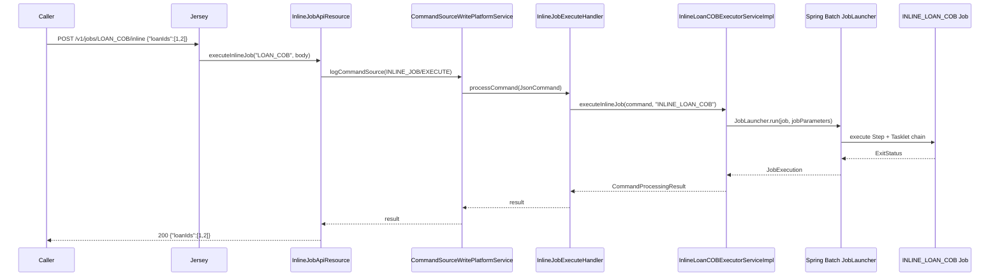
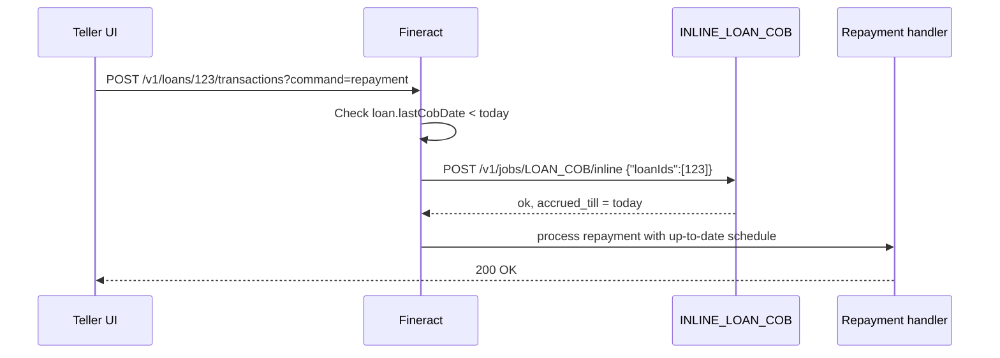

Apache Fineract treats most batch work as **asynchronous** — Quartz fires, a tasklet runs, the caller never blocks. Some operations, however, cannot wait for the next cron tick: a manual loan repayment that requires Close-of-Business processing first, or a backfill that must complete before a downstream API call returns. For those, Fineract exposes the **inline job API**: `POST /v1/jobs/{jobName}/inline` runs a Spring Batch job in-thread and returns its result synchronously. This page documents the resource, the handler, the executor service layer and the whitelist of jobs that can be triggered this way.

## The resource — `InlineJobApiResource`

Source: `fineract-provider/src/main/java/org/apache/fineract/infrastructure/jobs/api/InlineJobApiResource.java`. The class is small enough to quote in full:

```java
@Path("/v1/jobs")
@Component
@Tag(name = "Inline Job", description = "")
@RequiredArgsConstructor
public class InlineJobApiResource {

    private final PortfolioCommandSourceWritePlatformService commandWritePlatformService;
    private final DefaultToApiJsonSerializer<LoanIdsResponseDTO> serializer;

    @POST
    @Path("{jobName}/inline")
    @Consumes({ MediaType.APPLICATION_JSON })
    @Produces({ MediaType.APPLICATION_JSON })
    @Operation(summary = "Starts an inline Job", description = "Starts an inline Job")
    public String executeInlineJob(
            @PathParam("jobName") final String jobName,
            final String jsonRequestBody) {

        final CommandWrapper commandRequest =
            new CommandWrapperBuilder().executeInlineJob(jobName).withJson(jsonRequestBody).build();
        CommandProcessingResult result =
            commandWritePlatformService.logCommandSource(commandRequest);
        return serializer.serialize(result);
    }
}
```

A request like

```http
POST /v1/jobs/LOAN_COB/inline
Content-Type: application/json

{ "loanIds": [101, 102, 103] }
```

builds a `CommandWrapper` whose entity is `INLINE_JOB` and whose action is `EXECUTE`, then logs it through the command framework. The resource itself does no business logic — it stays a thin HTTP shim.

## Command framework dispatch

`CommandWrapperBuilder.executeInlineJob(jobName)` (in `fineract-core/commands/service`) writes:

```java
return new CommandWrapper(...,
    "EXECUTE",          // action
    "INLINE_JOB",       // entity
    null,               // entityId
    jobName,            // jobName carried alongside
    null, null, null, null, null);
```

`PortfolioCommandSourceWritePlatformService` looks up the handler annotated `@CommandType(entity = "INLINE_JOB", action = "EXECUTE")` and invokes it.

## The handler — `InlineJobExecuteHandler`

```java
@RequiredArgsConstructor
@Service
@CommandType(entity = "INLINE_JOB", action = "EXECUTE")
public class InlineJobExecuteHandler implements NewCommandSourceHandler {

    private final ApplicationContext applicationContext;

    @Override
    public CommandProcessingResult processCommand(JsonCommand command) {
        InlineJobType inlineJobType = InlineJobType.getInlineJobType(command.getJobName());
        try {
            InlineExecutorService inlineJobExecutorService =
                applicationContext.getBean(inlineJobType.getExecutorServiceClass());
            return inlineJobExecutorService.executeInlineJob(command, inlineJobType.getInlineJobName());
        } catch (NoSuchBeanDefinitionException e) {
            throw new JobIsNotFoundOrNotEnabledException(e, inlineJobType.getInlineJobName());
        }
    }
}
```

Three things happen here:

1. The string from the path parameter is mapped to a strongly-typed `InlineJobType` enum value.
2. The Spring `ApplicationContext` is asked for the bean of the executor class wired into that enum value.
3. Control transfers to the executor service, which runs the job and returns a `CommandProcessingResult`.

If no bean for that executor is registered (because the module is not on the classpath, e.g. working-capital loan in a community build), the handler raises `JobIsNotFoundOrNotEnabledException`, which surfaces as a clean `404` to the caller.

## The whitelist — `InlineJobType`

```java
@RequiredArgsConstructor
public enum InlineJobType {

    LOAN_COB("LOAN_COB", "INLINE_LOAN_COB", InlineLoanCOBExecutorServiceImpl.class),
    WC_LOAN_COB("WC_LOAN_COB", "INLINE_WORKING_CAPITAL_LOAN_COB",
        InlineWorkingCapitalLoanCOBExecutorServiceImpl.class);

    private final String jobName;
    @Getter private final String inlineJobName;
    @Getter private final Class<? extends InlineExecutorService> executorServiceClass;

    public static InlineJobType getInlineJobType(String jobName) {
        Optional<InlineJobType> optionalInlineJobType = Arrays.stream(InlineJobType.values())
                .filter(t -> jobName.equals(t.jobName)).findAny();
        return optionalInlineJobType.orElseThrow(() ->
            new IllegalArgumentException("Inline Job is not found by job name: " + jobName));
    }
}
```

`InlineJobType` is the **closed list** of jobs that can be invoked inline. There are intentionally only two:

| Inline job name (path param) | Spring Batch job name | Executor service |
|------------------------------|-----------------------|------------------|
| `LOAN_COB` | `INLINE_LOAN_COB` | `InlineLoanCOBExecutorServiceImpl` |
| `WC_LOAN_COB` | `INLINE_WORKING_CAPITAL_LOAN_COB` | `InlineWorkingCapitalLoanCOBExecutorServiceImpl` |

Note the two different names: the path parameter is the human-friendly handle, while the second string is the Spring Batch `Job` bean name that `JobLocator.getJob(name)` resolves. The inline COB job is a separate Spring Batch `Job` from the scheduled `LOAN_COB`, with a different parameter set and a different step chain (it does not need the lock-and-unlock dance because it operates on an explicit set of loan ids).

## The executor service contract — `InlineExecutorService`

```java
public interface InlineExecutorService<T> {

    CommandProcessingResult executeInlineJob(JsonCommand command, String jobName);

    void execute(List<T> elements, String jobName);

    default void execute(T element, String jobName) {
        execute(Collections.singletonList(element), jobName);
    }
}
```

Two methods. `executeInlineJob` is the REST entry point — it parses the JSON body, builds `JobParameters`, and delegates to `execute(List<T>, String)`. The second method is the in-process API: domain services that already know the loan ids invoke it directly, skipping JSON entirely.

### `InlineLoanCOBExecutorServiceImpl` walkthrough

The Loan COB executor (under `fineract-provider/src/main/java/org/apache/fineract/cob/service/`) implements the two methods like so:

1. Validates the JSON `loanIds` payload via `JobParameterDataParser`.
2. Builds a `JobParameters` map containing `loanIds=...`, `business-date=<from ThreadLocal>` and a fresh `RunId`.
3. Resolves the Spring Batch `Job` named `INLINE_LOAN_COB` via `JobLocator`.
4. Calls `JobLauncher.run(job, jobParameters)` — this **blocks** the calling thread.
5. Returns a `CommandProcessingResult` containing the resolved loan ids.

The inline launch uses the same `JobLauncher` Spring bean as the cron path but runs it on the **caller's thread** by virtue of `SimpleJobLauncher` being configured with a `SyncTaskExecutor`. The cron path, by contrast, uses Quartz worker threads.

## End-to-end sequence



The entire pipeline runs on the HTTP thread. If the job takes 30 seconds, the HTTP call takes 30 seconds. This is intentional: the caller wants a guarantee that the work is done before it makes the next decision.

## When to use inline vs scheduled

| Scenario | Endpoint | Why |
|----------|----------|-----|
| Customer-facing loan repayment | `POST /v1/jobs/LOAN_COB/inline` first | Ensures the loan is "COB-current" before the repayment commits. |
| Operator backfill of one loan | `POST /v1/jobs/LOAN_COB/inline` | Targets a specific loan id rather than the whole portfolio. |
| Working capital loan ad-hoc charge | `POST /v1/jobs/WC_LOAN_COB/inline` | Same pattern, working-capital module. |
| Nightly portfolio-wide processing | `POST /v1/jobs/{id}?command=executeJob` | Asynchronous, runs on Quartz worker threads, does not block the API. |
| Operator-triggered SMS campaign | `POST /v1/jobs/{id}?command=executeJob` | Long-running, fire-and-forget. |

## Failure semantics

- **Validation errors** (unknown `jobName`, bad JSON body) → `400` from the command framework with a `JobIsNotFoundOrNotEnabledException` envelope.
- **Spring Batch step failure** → `500` with the underlying exception serialised through `PlatformExceptionMapper`. The standard `BATCH_JOB_EXECUTION` table still records the failure.
- **Transactional rollback** — because the call is synchronous, the surrounding `@Transactional` on the command handler rolls back. The audit row in `m_portfolio_command_source` is still written (it lives in its own transaction).
- **Audit** — every inline launch lands in `m_portfolio_command_source` with `entity_name = INLINE_JOB`, `action_name = EXECUTE`, and the JSON body intact, making the call retrievable through `GET /v1/audits`.

## Adding a new inline job

The bar is low and intentional:

1. Add a new enum value to `InlineJobType` with the path-friendly handle, the Spring Batch `Job` bean name, and the executor service class.
2. Implement an executor service bean implementing `InlineExecutorService<T>`.
3. Register a Spring Batch `Job` bean with that name (see [Job registry](/jobs/job-registry)).

Because the registry is enum-based, the inline API stays safe: random `JobName` values cannot be invoked inline by mistake. Only jobs deliberately designed to support the synchronous launch pattern are reachable.

## Worked example: a teller-driven loan repayment

A common scenario where inline COB is required:



Without the inline COB call, the repayment would land on an accrual schedule that does not reflect today's interest accrual, producing a slightly-off principal-vs-interest split.

The Mifos X web client orchestrates this automatically: it calls inline COB before any "money-moving" loan action when the loan is detected as not COB-current.

## Per-call audit

Every inline call is preserved in `m_portfolio_command_source`. The relevant columns:

| Column | Value |
|--------|-------|
| `action_name` | `EXECUTE` |
| `entity_name` | `INLINE_JOB` |
| `subresource_id` | The Spring Batch `JobExecution.id` |
| `command_as_json` | The request body verbatim |
| `created_date` | Timestamp of the call |
| `maker_id` | The authenticated user |

Querying this table is the easiest way to reconstruct who triggered an inline run and what payload they sent.

## Comparison with the cron and ad-hoc paths

| Path | Sync? | Audit row | Scheduler involvement | Use case |
|------|-------|-----------|------------------------|----------|
| `POST /v1/jobs/{jobName}/inline` | Yes | Yes (`INLINE_JOB/EXECUTE`) | None | Customer-facing pre-flight (Loan COB before repayment). |
| `POST /v1/jobs/{id}?command=executeJob` | No | Yes (`SCHEDULER_JOB/EXECUTE`) | Quartz `executeJob(...)` | Operator-triggered ad-hoc run of a scheduled job. |
| Quartz cron tick | No | Yes (`ScheduledJobRunHistory`) | Full Quartz fire | Production scheduled run. |

The inline path is the only one that **blocks the caller** and the only one that **does not go through Quartz at all**.

## Cross-references

<CardGroup cols={2}>
  <Card title="Scheduler API" href="/jobs/scheduler-api">/v1/scheduler and /v1/jobs for the asynchronous path.</Card>
  <Card title="Scheduler service" href="/jobs/scheduler-service">Quartz wiring used by the cron path.</Card>
  <Card title="Loan COB" href="/loan/loan-arrears-aging">Why inline LOAN_COB exists — keeping loans current before user actions.</Card>
  <Card title="Job registry" href="/jobs/job-registry">How a Spring Batch Job becomes resolvable through JobLocator.</Card>
</CardGroup>
