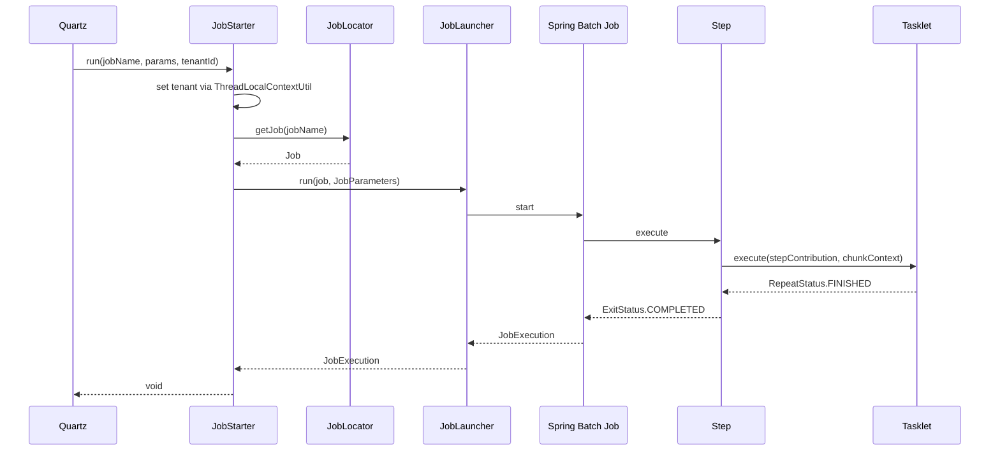

Every scheduled job in Apache Fineract follows the same three-class recipe: a `Tasklet` doing the work, a `*Config` class wiring it into a Spring Batch `Job` and `Step`, and an enum value in `JobName` keying it all together. At runtime, `JobLauncher` (the standard Spring Batch entry point) is what actually starts the `Job` — and `JobLocator` is what lets Quartz and the inline API find it by name. This page is the reference for that recipe.

## The recipe in one diagram

```mermaid
flowchart TB
    Enum[JobName.UPDATE_NPA] --> Config[UpdateNpaConfig]
    Config -->|@Bean| Step[Step: name = UPDATE_NPA]
    Config -->|@Bean| Job[Job: name = UPDATE_NPA]
    Step --> Tasklet[UpdateNpaTasklet]
    Tasklet -.-> JdbcTemplate
    Tasklet -.-> Repos[Repositories]
    Job --> Registry[JobRegistry]
    Registry --> Locator[JobLocator]
    Locator --> Starter[JobStarter.run]
    Starter --> Launcher[JobLauncher.run]
    Launcher --> Step
```

## 1. The Tasklet

A tasklet is a Spring `@Component` implementing `org.springframework.batch.core.step.tasklet.Tasklet`:

```java
@Slf4j
@RequiredArgsConstructor
public class UpdateNpaTasklet implements Tasklet {

    private final RoutingDataSourceServiceFactory dataSourceServiceFactory;
    private final DatabaseTypeResolver databaseTypeResolver;
    private final DatabaseSpecificSQLGenerator sqlGenerator;
    private final PlatformSecurityContext context;

    @Override
    public RepeatStatus execute(StepContribution contribution, ChunkContext chunkContext) throws Exception {
        // ... do the work ...
        return RepeatStatus.FINISHED;
    }
}
```

The signature is the same for every job: `execute(StepContribution, ChunkContext)` returns `RepeatStatus.FINISHED` for a one-shot run, or `RepeatStatus.CONTINUABLE` to be invoked again inside the step (used by chunked work in the COB jobs, see `ApplyLoanLockTasklet`).

`chunkContext.getStepContext().getJobParameters()` exposes the per-execution parameters as a `Map<String, Object>`. Integer-typed parameters are stored as strings on the way in (`JobParametersBuilder.addString(...)`), and tasklets `Integer.parseInt(...)` them on the way out.

## 2. The `*Config` class

Each job ships its own `@Configuration`. The smallest realistic example is `PurgeProcessedCommandsConfig`:

```java
@Configuration
public class PurgeProcessedCommandsConfig {

    @Autowired private JobRepository jobRepository;
    @Autowired private PlatformTransactionManager transactionManager;
    @Autowired private PurgeProcessedCommandsTasklet tasklet;

    @Bean
    protected Step purgeProcessedCommandsStep() {
        return new StepBuilder(StepName.PURGE_PROCESSED_COMMANDS_STEP.name(), jobRepository)
                .tasklet(tasklet, transactionManager)
                .build();
    }

    @Bean
    public Job purgeProcessedCommandsJob() {
        return new JobBuilder(JobName.PURGE_PROCESSED_COMMANDS.name(), jobRepository)
                .start(purgeProcessedCommandsStep())
                .incrementer(new RunIdIncrementer())
                .build();
    }
}
```

Four moving parts deserve attention:

- **`JobRepository`** — the Spring Batch metadata store, autowired from `BatchJobsConfiguration` in `fineract-core`. Backed by the `BATCH_JOB_*` and `BATCH_STEP_*` tables.
- **`PlatformTransactionManager`** — wraps each tasklet invocation in a transaction. The tasklet body does **not** call `commit`; it just runs and `StepBuilder.tasklet(tasklet, txManager)` does the rest.
- **`StepBuilder(name, jobRepository).tasklet(tasklet, txManager).build()`** — produces a `Step` whose name is the canonical `StepName` enum value. Step names are observable in the `BATCH_STEP_EXECUTION` table and the operator UI.
- **`JobBuilder(name, jobRepository).start(step).incrementer(new RunIdIncrementer()).build()`** — produces a `Job` whose name is exactly `JobName.PURGE_PROCESSED_COMMANDS.name()`. The incrementer means each launch gets a fresh `RunId=N+1` so Spring Batch sees it as a new `JobInstance`.

### Variant: tasklet not eligible for component scanning

When the tasklet is **not** marked `@Component` (for example because it needs hand-passed dependencies), the config also exposes the tasklet as a bean. `UpdateNpaConfig` is the canonical example:

```java
@Configuration
public class UpdateNpaConfig {
    @Autowired private JobRepository jobRepository;
    @Autowired private PlatformTransactionManager transactionManager;
    @Autowired private RoutingDataSourceServiceFactory dataSourceServiceFactory;
    @Autowired private DatabaseTypeResolver databaseTypeResolver;
    @Autowired private DatabaseSpecificSQLGenerator sqlGenerator;
    @Autowired private PlatformSecurityContext platformSecurityContext;

    @Bean
    protected Step updateNpaStep() {
        return new StepBuilder(JobName.UPDATE_NPA.name(), jobRepository)
                .tasklet(updateNpaTasklet(), transactionManager)
                .build();
    }

    @Bean
    public Job updateNpaJob() {
        return new JobBuilder(JobName.UPDATE_NPA.name(), jobRepository)
                .start(updateNpaStep())
                .incrementer(new RunIdIncrementer())
                .build();
    }

    @Bean
    public UpdateNpaTasklet updateNpaTasklet() {
        return new UpdateNpaTasklet(dataSourceServiceFactory, databaseTypeResolver,
                sqlGenerator, platformSecurityContext);
    }
}
```

Note that the **step name** and **job name** are both `JobName.UPDATE_NPA.name()` because there is exactly one step. Multi-step jobs (the COB job for example) use distinct `StepName` values.

## 3. Multi-step jobs

The Loan COB job is the most elaborate registration in the codebase:

- Step 1: `ApplyLoanLockTasklet` — lock the loan rows being processed.
- Step 2: A chunked `ItemReader` + `ItemProcessor` + `ItemWriter` triple that runs the COB business logic.
- Step 3: `UnlockProcessedLoansTasklet` — release locks.
- Step 4 (cleanup): `StayedLockedLoansTasklet` — pick up loans still stuck behind a lock after the run.

A `LoanCOBConfig` class chains them with `.start(step1).next(step2).next(step3).next(step4)` on the `JobBuilder`. The same `Job` is registered for the cron-driven `LOAN_COB` and (after parameter customisation) the inline `INLINE_LOAN_COB`.

## 4. `RunIdIncrementer` — why every job has one

Spring Batch identifies a `JobInstance` by the tuple `(jobName, JobParameters)`. Without an incrementer, two launches with the same parameters resolve to the same instance, and the second one throws `JobInstanceAlreadyCompleteException`. `RunIdIncrementer` injects a fresh `run.id` value into every launch, so each becomes a distinct instance. Every config class in the repository uses it.

## 5. Step naming and the `StepName` enum

`fineract-core/src/main/java/org/apache/fineract/infrastructure/jobs/service/StepName.java` lists canonical step names. Some examples:

| Step name | Owning job |
|-----------|------------|
| `PURGE_PROCESSED_COMMANDS_STEP` | `PURGE_PROCESSED_COMMANDS` |
| `PURGE_EXTERNAL_EVENTS_STEP` | `PURGE_EXTERNAL_EVENTS` |
| `SEND_ASYNCHRONOUS_EVENTS_STEP` | `SEND_ASYNCHRONOUS_EVENTS` |
| `APPLY_LOAN_LOCK` / `LOAN_COB_BUSINESS_STEP` / `UNLOCK_LOAN_LOCK` | `LOAN_COB` |
| `INCREASE_BUSINESS_DATE_BY_1_DAY_STEP` | `INCREASE_BUSINESS_DATE_BY_1_DAY` |

For single-step jobs the step name is the same as the job name (see `UpdateNpaConfig`).

## 6. Bean registration — how Spring Batch finds the Job

Spring Batch wires beans into a registry through `JobRegistryBeanPostProcessor`, registered in `fineract-core` under `ScheduledJobRunnerConfig`:

```java
@Bean
public JobRegistryBeanPostProcessor jobRegistryBeanPostProcessor(JobRegistry jobRegistry) {
    JobRegistryBeanPostProcessor postProcessor = new JobRegistryBeanPostProcessor();
    postProcessor.setJobRegistry(jobRegistry);
    return postProcessor;
}
```

The post-processor walks all `Job` beans at application startup and registers them with the `JobRegistry` by their `getName()`. The `JobLocator` (which `JobRegistry` implements) then resolves names back to `Job` instances:

```java
@Autowired private JobLocator jobLocator;

Job job = jobLocator.getJob(JobName.UPDATE_NPA.name());
```

## 7. How a job actually launches



`JobStarter.run(...)` is the method invoked reflectively by Quartz's `MethodInvokingJobDetailFactoryBean`. It pulls the tenant identifier from the `JobDataMap`, restores it onto the thread, parses parameters, then defers to `JobLauncher`.

## 8. Custom job parameters

Some jobs accept inputs beyond the standard `run.id`. The flow is:

1. Defaults live in `m_job_parameter` keyed by job id.
2. Per-execution overrides arrive through the JSON body of `POST /v1/jobs/{id}?command=executeJob` or `POST /v1/jobs/{jobName}/inline`.
3. `JobParameterDataParser.parseExecution(json)` decodes them into `Set<JobParameterDTO>`.
4. `JobRegisterServiceImpl.createJobDetail(...)` merges defaults + overrides and adds them to the Quartz `JobDataMap`.
5. `JobStarter` lifts entries from the data map into a `JobParametersBuilder`, calling `addString`, `addLong` or `addDate` as appropriate.

Inside the tasklet the values are reachable via:

```java
String batchSizeStr = (String) chunkContext.getStepContext().getJobParameters().get("batch-size");
int batchSize = Integer.parseInt(batchSizeStr);
```

See `PostInterestForSavingTasklet` for the canonical pattern, which reads `thread-pool-size` and `batch-size` from job parameters and sizes its executor accordingly.

## 9. Per-tasklet transactional behaviour

Each tasklet is invoked inside a transaction managed by the `PlatformTransactionManager` passed to `StepBuilder.tasklet(...)`. Three patterns appear across the codebase:

| Pattern | Used by | Notes |
|---------|---------|-------|
| Single Tx for the whole tasklet | `UpdateNpaTasklet`, `PurgeExternalEventsTasklet`, `UpdateTrialBalanceDetailsTasklet` | Tasklet runs SQL and finishes; if it throws, everything rolls back. |
| Self-managed Tx per item | `ApplyHolidaysToLoansTasklet` | Tasklet calls a `@Transactional` service per loan so one bad loan does not poison the batch. |
| Async fan-out across `ThreadPoolTaskExecutor` | `PostInterestForSavingTasklet` | Tasklet submits `Callable<T>`s; each callable opens its own Tx via service injection. |

Pick whichever pattern matches your retry semantics.

## 10. A new job, end to end

To add `MY_NEW_JOB` to Apache Fineract:

1. **`JobName.java`** — append `MY_NEW_JOB("My New Job");`.
2. **Optionally `StepName.java`** — only if multi-step.
3. **`MyNewJobTasklet`** — implements `Tasklet`, does the work.
4. **`MyNewJobConfig`** — `@Configuration` with `@Bean` for `Step` and `Job`.
5. **DB migration** — Liquibase changeset inserting into `m_scheduler_job_detail` (id, display name, cron expression, group, active flag, node id, short name).
6. **Permissions** — Liquibase changeset adding `EXECUTE_MY_NEW_JOB` if you want the executeJob endpoint to be gated.
7. **Test** — a `@SpringBatchTest` integration test instantiating the `Job`, launching it with a `JobLauncherTestUtils`, asserting the side effects.

The framework requires no further wiring: `JobRegistryBeanPostProcessor` discovers the new `Job` bean automatically.

## Tasklet inventory by config

Some of the highest-traffic job configurations and their location:

| Config | Location | Job(s) |
|--------|----------|--------|
| `PurgeProcessedCommandsConfig` | `fineract-core` | `PURGE_PROCESSED_COMMANDS` |
| `PurgeExternalEventsConfig` | `fineract-core` | `PURGE_EXTERNAL_EVENTS` |
| `SendAsynchronousEventsConfig` | `fineract-core` | `SEND_ASYNCHRONOUS_EVENTS` |
| `UpdateNpaConfig` | `fineract-provider` | `UPDATE_NPA` |
| `ExecuteAllDirtyJobsConfig` | `fineract-provider` | `EXECUTE_DIRTY_JOBS` |
| `JournalEntryAggregationConfig` | `fineract-provider` | `JOURNAL_ENTRY_AGGREGATION` |
| `IncreaseBusinessDateBy1DayConfig` | `fineract-provider` | `INCREASE_BUSINESS_DATE_BY_1_DAY` |
| `IncreaseCobDateBy1DayConfig` | `fineract-provider` | `INCREASE_COB_DATE_BY_1_DAY` |
| `UpdateTrialBalanceDetailsConfig` | `fineract-accounting` | `UPDATE_TRIAL_BALANCE_DETAILS` |
| `AddPeriodicAccrualEntriesConfig` | `fineract-loan` | `ADD_PERIODIC_ACCRUAL_ENTRIES` |
| `UpdateLoanArrearsAgeingConfig` | `fineract-loan` | `UPDATE_LOAN_ARREARS_AGEING` |
| `SetLoanDelinquencyTagsConfig` | `fineract-loan` | `LOAN_DELINQUENCY_CLASSIFICATION` |

A complete catalogue with file paths is on the [Tasklet catalog](/jobs/tasklets-catalog) page.

## Cross-references

<CardGroup cols={2}>
  <Card title="Tasklet catalog" href="/jobs/tasklets-catalog">Every *Tasklet.java in Fineract with its JobName.</Card>
  <Card title="Scheduler service" href="/jobs/scheduler-service">How JobRegisterServiceImpl wires the Job into Quartz.</Card>
  <Card title="Spring Batch integration" href="/core/spring-batch-integration">Lower-level framework configuration.</Card>
  <Card title="Inline jobs" href="/jobs/inline-job-api">Alternative path for synchronous execution.</Card>
</CardGroup>
