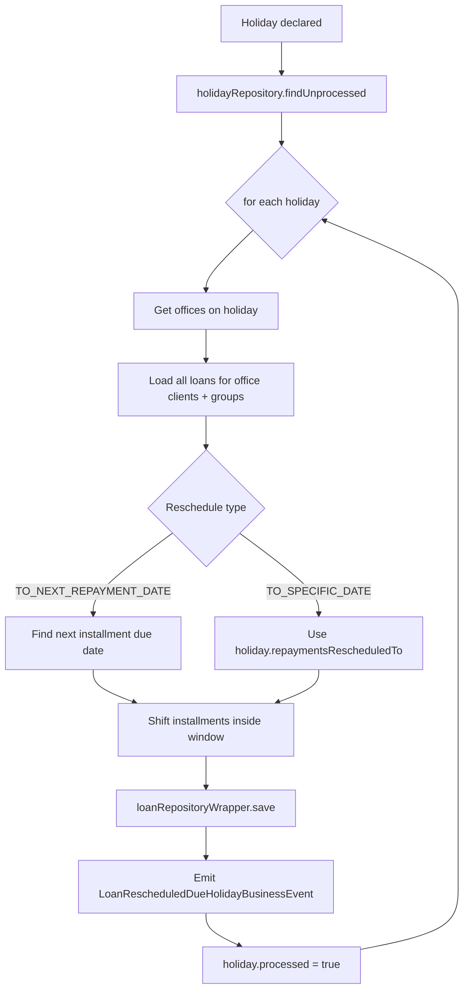
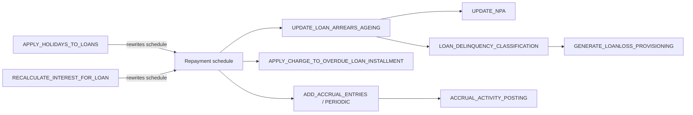

The loan portfolio is where Apache Fineract earns most of its batch budget. Interest accrues nightly, arrears bucket counters roll forward by one day, holidays declared today must be pushed into tomorrow's repayment schedules, and any product configured with `interestRecalculationEnabled` re-runs its compounding equation across the active loan book. This page goes one tasklet at a time, explains the algorithm, points at the helper services and the tables it touches, and tells you what business events it emits.

For the schedule-centric view of these jobs (cadence, JobName enum value, brief side effects), see the [Tasklet catalog](/jobs/tasklets-catalog).

## `ADD_ACCRUAL_ENTRIES` — bulk loan accrual

**Tasklet:** `fineract-provider/src/main/java/org/apache/fineract/portfolio/loanaccount/jobs/addaccrualentries/AddAccrualEntriesTasklet.java`

The body is small because the work is delegated to a domain service:

```java
@Override
public RepeatStatus execute(final StepContribution contribution, final ChunkContext chunkContext) throws Exception {
    try {
        addAccruals(DateUtils.getBusinessLocalDate());
    } catch (MultiException e) {
        throw new JobExecutionException(e);
    }
    return RepeatStatus.FINISHED;
}

private void addAccruals(final LocalDate tillDate) throws MultiException {
    loanAccrualsProcessingService.addAccruals(tillDate);
}
```

`LoanAccrualsProcessingService.addAccruals(tillDate)` walks every loan whose product is configured with `ACCRUAL_PERIODIC` or `ACCRUAL_UPFRONT` accounting and posts the missing accrual transactions up to `tillDate`. `MultiException` carries one cause per failed loan so a single bad loan does not poison the run; failed loans surface in the JobExecution's exit description.

**Tables written:** `m_loan_transaction` (transaction type `ACCRUAL`), `acc_gl_journal_entry`, `m_loan` (`accrued_till` watermark).

## `ADD_PERIODIC_ACCRUAL_ENTRIES` — periodic-only accrual

**Tasklet:** `fineract-loan/.../portfolio/loanaccount/jobs/addperiodicaccrualentries/AddPeriodicAccrualEntriesTasklet.java`

Identical shape to `ADD_ACCRUAL_ENTRIES` but the delegated method is `addPeriodicAccruals(tillDate)`:

```java
@Override
public RepeatStatus execute(StepContribution contribution, ChunkContext chunkContext) throws Exception {
    try {
        addPeriodicAccruals(DateUtils.getBusinessLocalDate());
    } catch (MultiException e) {
        throw new JobExecutionException(e);
    }
    return RepeatStatus.FINISHED;
}
```

Two jobs exist because the **periodic** path materialises accruals **per instalment due date** (used when the GL needs distinct entries per period for reporting), whereas the **upfront** path materialises them at disbursement and only catches stragglers nightly.

## `APPLY_HOLIDAYS_TO_LOANS`

**Tasklet:** `fineract-provider/.../portfolio/loanaccount/jobs/applyholidaystoloans/ApplyHolidaysToLoansTasklet.java`

This is the canonical example of the "discover-then-mutate" pattern. The header is short:

```java
final boolean isHolidayEnabled = configurationDomainService.isRescheduleRepaymentsOnHolidaysEnabled();
if (!isHolidayEnabled) {
    return RepeatStatus.FINISHED;
}
final Collection<LoanStatus> loanStatuses = new ArrayList<>(
    Arrays.asList(LoanStatus.SUBMITTED_AND_PENDING_APPROVAL, LoanStatus.APPROVED, LoanStatus.ACTIVE));
final List<Holiday> holidays = holidayRepository.findUnprocessed();
```

Then for each unprocessed `Holiday`:

1. Collect the offices the holiday applies to and gather all loans for clients **or** groups in those offices whose status is `SUBMITTED_AND_PENDING_APPROVAL`, `APPROVED` or `ACTIVE`.
2. Per loan, decide the target reschedule date:
   - `RescheduleType.RESCHEDULE_TO_NEXT_REPAYMENT_DATE` → look ahead for the next instalment due date.
   - `RescheduleType.RESCHEDULE_TO_SPECIFIC_DATE` → use `holiday.getRepaymentsRescheduledTo()`.
3. Walk the `LoanRepaymentScheduleInstallment` list and push the due dates of any instalment falling in the holiday window forward to the adjusted date.
4. Persist via `loanRepositoryWrapper.save(loans)`.
5. Emit `LoanRescheduledDueHolidayBusinessEvent` per loan so listeners can rebuild downstream views.
6. Mark the holiday `processed = true`.



**Tables written:** `m_loan_repayment_schedule` (due-date column), `m_holiday` (`processed`), `m_loan` (`audit` columns).

**Event emitted:** `LoanRescheduledDueHolidayBusinessEvent` per loan.

## `UPDATE_LOAN_ARREARS_AGEING`

**Tasklet:** `fineract-loan/.../portfolio/loanaccount/jobs/updateloanarrearsageing/UpdateLoanArrearsAgeingTasklet.java`

The tasklet is a one-liner — the real algorithm lives in `LoanArrearsAgeingUpdateHandler`:

```java
@Override
public RepeatStatus execute(StepContribution contribution, ChunkContext chunkContext) throws Exception {
    loanArrearsAgeingUpdateHandler.updateLoanArrearsAgeingDetailsForAllLoans();
    return RepeatStatus.FINISHED;
}
```

`updateLoanArrearsAgeingDetailsForAllLoans()` truncates `m_loan_arrears_aging`, then issues a single big aggregating `INSERT ... SELECT` that, for every active loan with at least one overdue instalment, computes:

- `principal_overdue_derived`, `interest_overdue_derived`, `fee_charges_overdue_derived`, `penalty_charges_overdue_derived`, `total_overdue_derived`
- `overdue_since_date_derived` = earliest unpaid instalment due date

The denormalised `m_loan_arrears_aging` row is what powers the arrears report, the loan list filters, and the eventual NPA flag.

**Tables written:** `m_loan_arrears_aging` (full reload).

See [loan-arrears-aging](/loan/loan-arrears-aging) for the data model.

## `RECALCULATE_INTEREST_FOR_LOAN`

**Tasklet:** `fineract-provider/.../portfolio/loanaccount/jobs/recalculateinterestforloan/RecalculateInterestForLoanTasklet.java`

The only loan-side tasklet that consumes custom job parameters. The execute method:

```java
public RepeatStatus execute(StepContribution contribution, ChunkContext chunkContext) throws Exception {
    Map<String, JobParameter<?>> jobParameters =
        chunkContext.getStepContext().getStepExecution().getJobParameters().getParameters();
    if (!jobParameters.isEmpty()) {
        final String officeId = (String) jobParameters.get("officeId").getValue();
        Long officeIdLong = Long.valueOf(officeId);
        final OfficeData office = officeReadPlatformService.retrieveOffice(officeIdLong);
        if (office == null) {
            throw new OfficeNotFoundException(officeIdLong);
        }
        final int threadPoolSize = Integer.parseInt((String) jobParameters.get("thread-pool-size").getValue());
        final int batchSize = Integer.parseInt((String) jobParameters.get("batch-size").getValue());
        recalculateInterest(office, threadPoolSize, batchSize);
    } else {
        Collection<Long> loanIds = loanReadPlatformService.fetchLoansForInterestRecalculation();
        // ... fall back to single-threaded sequential path ...
    }
    return RepeatStatus.FINISHED;
}
```

Two execution modes:

| Mode | Trigger | Behaviour |
|------|---------|-----------|
| **Parameterised** | `officeId`, `thread-pool-size`, `batch-size` in JobParameters | Recursively descends the office hierarchy and fans out `RecalculateInterestPoster` callables across the shared `ThreadPoolTaskExecutor`. |
| **Default** | No parameters | Reads `LoanReadPlatformService.fetchLoansForInterestRecalculation()` and processes each loan sequentially. |

In both cases the actual recalculation lands on `LoanWritePlatformService.recalculateInterest(loanId)`, which materialises a fresh repayment schedule using the loan's current interest model and writes adjustment transactions where instalment amounts change.

**Tables written:** `m_loan_repayment_schedule` (regenerated), `m_loan_transaction` (`ADJUSTMENT`), `m_loan` (`expected_maturity_date`, `summary` columns).

## `APPLY_CHARGE_TO_OVERDUE_LOAN_INSTALLMENT`

**Tasklet:** `fineract-provider/.../portfolio/loanaccount/jobs/applychargetooverdueloaninstallment/ApplyChargeToOverdueLoanInstallmentTasklet.java`

Walks `m_loan_repayment_schedule` rows that are overdue beyond the product's `gracePeriodForOverdue` and applies the configured overdue-penalty `LoanCharge` once per cycle. Idempotency lives in `m_loan_overdue_installment_charge` which tracks which (instalment, charge) pairs have already been charged.

**Tables written:** `m_loan_charge`, `m_loan_overdue_installment_charge`, `m_loan_repayment_schedule` (penalty columns).

## `ACCRUAL_ACTIVITY_POSTING`

**Tasklet:** `fineract-provider/.../portfolio/loanaccount/jobs/accrualactivityposting/AccrualActivityPostingTasklet.java`

Posts `ACCRUAL_ACTIVITY` transactions for products that have opted into the activity-style accrual ledger (every accrual touches a single transaction with sub-amounts per income type, rather than one transaction per income type). Used by reporters who need the day-by-day income breakdown without joining onto `m_loan_transaction` repeatedly. See [loan-accrual-activity](/loan/loan-accrual-activity) for the data model.

## `LOAN_DELINQUENCY_CLASSIFICATION`

**Tasklet:** `fineract-loan/.../portfolio/loanaccount/jobs/setloandelinquencytags/SetLoanDelinquencyTagsTasklet.java`

For every active loan, computes the current delinquency bucket from `m_delinquency_bucket` + `m_delinquency_range`, compares it against the last recorded value in `m_loan_delinquency_tag_history`, and writes a fresh tag-history row when the bucket changes. The tag history feeds the provisioning report and the delinquency dashboard. Cross-link: [loan-delinquency](/loan/loan-delinquency).

## `GENERATE_LOANLOSS_PROVISIONING`

**Tasklet:** `fineract-provider/.../portfolio/loanaccount/jobs/generateloanlossprovisioning/GenerateLoanlossProvisioningTasklet.java`

Walks every `m_provisioning_criteria` row, applies its bracket thresholds to the loan book, computes a provisioning amount per loan per bracket, writes a `m_loan_loss_provisioning` row, and — if accounting is enabled — posts the corresponding journal entries against the provisioning expense and provisioning liability GL accounts.

## `TRANSFER_FEE_CHARGE_FOR_LOANS`

**Tasklet:** `fineract-provider/.../portfolio/loanaccount/jobs/transferfeechargeforloans/TransferFeeChargeForLoansTasklet.java`

Implements the "loan fees from linked savings" pattern. For every active loan with `m_loan.linked_savings_account_id`, the tasklet looks at unpaid fee charges due today, debits the savings account by the total via an `AccountTransferDetails` row, and credits the loan ledger. Used by microfinance institutions that prefer to collect monthly fees as an automatic sweep from the borrower's compulsory savings.

## Job interaction graph



The ordering matters: arrears ageing must run after any schedule rewrite (holiday or interest recalculation) but before NPA classification and overdue charges. The recommended cron schedule reflects that — holidays at 00:00, recalculate at 00:30, arrears ageing at 01:00, NPA at 01:30, delinquency at 02:00.

## Concurrency and locking

`LOAN_COB` is the umbrella COB job for loans and the only one to acquire row-level locks (`m_loan.locked_by_cob = true`) before processing. The single-purpose jobs above do **not** lock loans; they rely on transactional reads being eventually consistent with COB. The expected schedule places COB before the cleanup jobs so they observe a stable post-COB state. See [LOAN_COB](/jobs/tasklets-catalog#multi-step-jobs).

## Failure semantics

Most loan jobs use a `MultiException` pattern: each loan is processed inside its own transaction; per-loan failures are collected, the run completes for the survivors, and a `JobExecutionException` wraps the collected errors so they end up in the run history's error log. `APPLY_HOLIDAYS_TO_LOANS` is an exception — it commits everything together so a single bad loan rolls back the whole holiday application; operators are expected to fix the data and re-run.

## EXECUTE_STANDING_INSTRUCTIONS

**Tasklet:** `fineract-provider/src/main/java/org/apache/fineract/portfolio/account/jobs/executestandinginstructions/ExecuteStandingInstructionsTasklet.java`

Walks every active `AccountTransferStandingInstruction` row whose `valid_from <= business_date < valid_till` and whose `next_run_date == business_date`. Each row is essentially a recurring transfer description (from-account, to-account, amount or amount-formula, recurrence). The tasklet hands each due row to `AccountTransfersWritePlatformService.transferFunds(...)` and rolls the `next_run_date` forward by `recurrence_period_in_days`.

Failures are recorded per instruction in `m_account_transfer_standing_instructions_history` so an operator can retry a single one without affecting the rest.

**Tables written:** `m_account_transfer_standing_instructions` (`next_run_date`), `m_account_transfer_standing_instructions_history` (one row per execution), `m_loan_transaction` and `m_savings_account_transaction` (the actual transfers).

## Per-loan exception handling

Every loan-side tasklet that loops in Java rather than in a single SQL statement follows the **collect-then-fail** pattern:

```java
List<Throwable> exceptions = new ArrayList<>();
for (Loan loan : loans) {
    try {
        process(loan);
    } catch (RuntimeException e) {
        exceptions.add(e);
        log.error("processing failed for loan {}", loan.getId(), e);
    }
}
if (!exceptions.isEmpty()) {
    throw new JobExecutionException(exceptions);
}
```

This makes two operational guarantees:

1. **No single loan poisons the run.** A corrupt schedule or an invalid GL mapping on one loan does not prevent processing of the next 50,000.
2. **The run is still marked failed in the run history.** Operators see a non-empty `error_message` and can audit which loans failed.

The pattern is uniform across `PAY_DUE_SAVINGS_CHARGES`, `TRANSFER_INTEREST_TO_SAVINGS`, `EXECUTE_STANDING_INSTRUCTIONS` and most others. The exceptions are the bulk-SQL tasklets (`UPDATE_LOAN_ARREARS_AGEING`, `UPDATE_NPA`) which either fully succeed or fully fail.

## Tuning tips

| Job | Knob | Effect |
|-----|------|--------|
| `RECALCULATE_INTEREST_FOR_LOAN` | `officeId`, `thread-pool-size`, `batch-size` job parameters | Switch from sequential to parallel processing scoped to one office. |
| `APPLY_HOLIDAYS_TO_LOANS` | `m_holiday.processed` | Mark a holiday processed manually to skip it (useful for accidental holidays). |
| `ADD_PERIODIC_ACCRUAL_ENTRIES` | `m_loan.accrued_till` | Reset a loan's watermark to re-accrue from a given date — only do this if you understand the accounting implications. |
| `APPLY_CHARGE_TO_OVERDUE_LOAN_INSTALLMENT` | `m_product_loan.grace_period_for_overdue` | Increase to delay penalty application. |

## Cross-references

<CardGroup cols={2}>
  <Card title="Savings jobs deep dive" href="/jobs/savings-jobs-deep-dive">Sister jobs on the savings book.</Card>
  <Card title="Accounting jobs deep dive" href="/jobs/accounting-jobs-deep-dive">Trial balance, running balance.</Card>
  <Card title="Loan arrears ageing" href="/loan/loan-arrears-aging">Data model for m_loan_arrears_aging.</Card>
  <Card title="Loan accrual activity" href="/loan/loan-accrual-activity">ACCRUAL_ACTIVITY transactions.</Card>
  <Card title="Loan delinquency" href="/loan/loan-delinquency">Buckets and ranges.</Card>
  <Card title="Loan transactions" href="/loan/loan-transactions">Transaction-type catalog.</Card>
</CardGroup>
