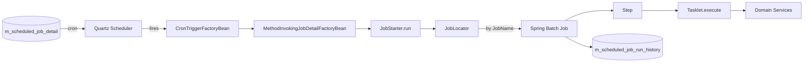
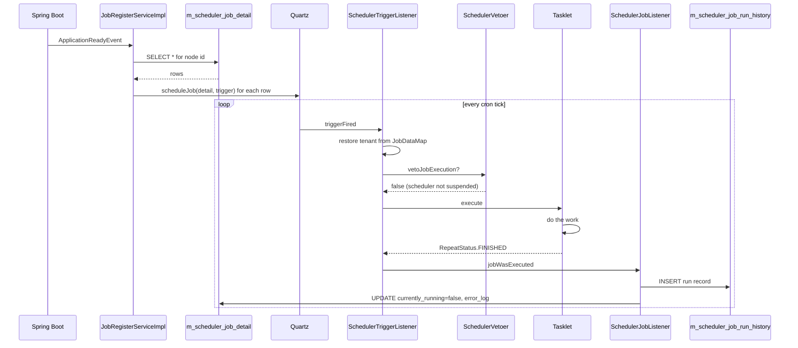

Apache Fineract drives every batch workload — interest postings, accruals, NPA classification, holiday rescheduling, dormancy sweeps, SMS/email dispatch, COB advancement, dirty-job recovery and external-event drain — through a single scheduled-job framework that sits on top of **Spring Batch** for execution and **Quartz** for triggering. This page is the entry point: it walks the moving pieces, names the enum that gates every job, and links out to deep-dives for every category.

## What a "scheduled job" actually is in Fineract

Every job in Apache Fineract is the same triple of artifacts:

1. **A `JobName` enum value** in `fineract-core/src/main/java/org/apache/fineract/infrastructure/jobs/service/JobName.java` — the canonical, ordinal-stable identifier the framework uses everywhere.
2. **A Spring Batch `Job` bean** registered by a `*Config` class (for example `PurgeProcessedCommandsConfig`, `UpdateNpaConfig`) — composed of one or more `Step`s, each running a `Tasklet`.
3. **A `m_scheduled_job_detail` row** in the tenant database — supplying the cron expression, group, node binding, retry policy and active flag that Quartz uses to fire the job.

A single Quartz trigger fires a `MethodInvokingJobDetailFactoryBean` that calls `JobStarter.run(...)`, which in turn locates the Spring Batch `Job` by `JobName` and launches it through the `JobLauncher`. The result is recorded as a `ScheduledJobRunHistory` row.

## The `JobName` enum

`JobName` is the central registry. Every value pairs an upper-snake-case identifier with the display name used by the UI and the `m_scheduled_job_detail.display_name` column. New jobs **append** values; ordinals are part of the on-disk identity, so nothing is ever removed or renamed in place.

| Enum value | Display name |
|------------|--------------|
| `UPDATE_LOAN_ARREARS_AGEING` | Update Loan Arrears Ageing |
| `APPLY_ANNUAL_FEE_FOR_SAVINGS` | Apply Annual Fee For Savings |
| `APPLY_HOLIDAYS_TO_LOANS` | Apply Holidays To Loans |
| `POST_INTEREST_FOR_SAVINGS` | Post Interest For Savings |
| `TRANSFER_FEE_CHARGE_FOR_LOANS` | Transfer Fee For Loans From Savings |
| `ACCOUNTING_RUNNING_BALANCE_UPDATE` | Update Accounting Running Balances |
| `PAY_DUE_SAVINGS_CHARGES` | Pay Due Savings Charges |
| `APPLY_CHARGE_TO_OVERDUE_LOAN_INSTALLMENT` | Apply penalty to overdue loans |
| `EXECUTE_STANDING_INSTRUCTIONS` | Execute Standing Instruction |
| `ADD_ACCRUAL_ENTRIES` | Add Accrual Transactions |
| `UPDATE_NPA` | Update Non Performing Assets |
| `UPDATE_DEPOSITS_ACCOUNT_MATURITY_DETAILS` | Update Deposit Accounts Maturity details |
| `TRANSFER_INTEREST_TO_SAVINGS` | Transfer Interest To Savings |
| `ADD_PERIODIC_ACCRUAL_ENTRIES` | Add Periodic Accrual Transactions |
| `RECALCULATE_INTEREST_FOR_LOAN` | Recalculate Interest For Loans |
| `GENERATE_RD_SCEHDULE` | Generate Mandatory Savings Schedule |
| `GENERATE_LOANLOSS_PROVISIONING` | Generate Loan Loss Provisioning |
| `POST_DIVIDENTS_FOR_SHARES` | Post Dividends For Shares |
| `UPDATE_SAVINGS_DORMANT_ACCOUNTS` | Update Savings Dormant Accounts |
| `ADD_PERIODIC_ACCRUAL_ENTRIES_FOR_LOANS_WITH_INCOME_POSTED_AS_TRANSACTIONS` | Add Accrual Transactions For Loans With Income Posted As Transactions |
| `EXECUTE_REPORT_MAILING_JOBS` | Execute Report Mailing Jobs |
| `UPDATE_SMS_OUTBOUND_WITH_CAMPAIGN_MESSAGE` | Update SMS Outbound with Campaign Message |
| `SEND_MESSAGES_TO_SMS_GATEWAY` | Send Messages to SMS Gateway |
| `GET_DELIVERY_REPORTS_FROM_SMS_GATEWAY` | Get Delivery Reports from SMS Gateway |
| `GENERATE_ADHOC_CLIENT_SCHEDULE` | Generate AdhocClient Schedule |
| `UPDATE_EMAIL_OUTBOUND_WITH_CAMPAIGN_MESSAGE` | Update Email Outbound with campaign message |
| `EXECUTE_EMAIL` | Execute Email |
| `UPDATE_TRIAL_BALANCE_DETAILS` | Update Trial Balance Details |
| `EXECUTE_DIRTY_JOBS` | Execute All Dirty Jobs |
| `INCREASE_BUSINESS_DATE_BY_1_DAY` | Increase Business Date by 1 day |
| `INCREASE_COB_DATE_BY_1_DAY` | Increase COB Date by 1 day |
| `LOAN_COB` | Loan COB |
| `LOAN_DELINQUENCY_CLASSIFICATION` | Loan Delinquency Classification |
| `SEND_ASYNCHRONOUS_EVENTS` | Send Asynchronous Events |
| `PURGE_EXTERNAL_EVENTS` | Purge External Events |
| `PURGE_PROCESSED_COMMANDS` | Purge Processed Commands |
| `ACCRUAL_ACTIVITY_POSTING` | Accrual Activity Posting |
| `ADD_PERIODIC_ACCRUAL_ENTRIES_FOR_SAVINGS_WITH_INCOME_POSTED_AS_TRANSACTIONS` | Add Accrual Transactions For Savings |
| `JOURNAL_ENTRY_AGGREGATION` | Journal Entry Aggregation |
| `WORKING_CAPITAL_LOAN_COB_JOB` | Working Capital Loan COB |

`JobName.toString()` returns the display name, so it is safe to use in log statements and event payloads.

## Components of the framework

<CardGroup cols={2}>
  <Card title="Scheduler service" icon="gear" href="/jobs/scheduler-service">
    JobRegisterServiceImpl, SchedularWritePlatformService, Quartz factory wiring.
  </Card>
  <Card title="Scheduler REST API" icon="server" href="/jobs/scheduler-api">
    /v1/scheduler and /v1/jobs — start/stop, list, run, update cron.
  </Card>
  <Card title="Inline job API" icon="play" href="/jobs/inline-job-api">
    /v1/jobs/{jobName}/inline — synchronous trigger used by COB catch-up.
  </Card>
  <Card title="Job registry" icon="puzzle-piece" href="/jobs/job-registry">
    The @Configuration pattern that turns a Tasklet into a Spring Batch Job.
  </Card>
  <Card title="Tasklet catalog" icon="list" href="/jobs/tasklets-catalog">
    Every *Tasklet.java in the repo, paired with its JobName.
  </Card>
  <Card title="Loan jobs deep dive" icon="hand-holding-dollar" href="/jobs/loan-jobs-deep-dive">
    Holidays, accruals, arrears ageing, interest recalculation.
  </Card>
  <Card title="Savings jobs deep dive" icon="piggy-bank" href="/jobs/savings-jobs-deep-dive">
    Interest posting, dormancy, fee transfer, RD schedule generation.
  </Card>
  <Card title="Accounting jobs deep dive" icon="calculator" href="/jobs/accounting-jobs-deep-dive">
    Periodic accruals, trial balance maintenance, running balances.
  </Card>
  <Card title="Campaign jobs" icon="envelope" href="/jobs/campaign-jobs">
    SMS gateway, email dispatch, report mailing, outbound buffers.
  </Card>
  <Card title="Dirty / aggregation" icon="broom" href="/jobs/dirty-jobs-and-aggregation">
    Mismatched-job recovery, external-event purge, NPA flagging, journal aggregation.
  </Card>
</CardGroup>

## Scheduler service in one paragraph

`JobRegisterServiceImpl` (in `fineract-provider`) is the singleton that owns a `Map<String, Scheduler>` — one Quartz scheduler per tenant (and per scheduler-group when a group is set). On platform startup, `JobRegisterServiceImpl.loadAllJobs()` walks every `ScheduledJobDetail` row, builds a Quartz `JobDetail` whose `targetMethod` is `JobStarter.run`, attaches a `CronTrigger` from the row's `cron_expression`, and schedules the job. The same instance also exposes `pauseScheduler()`, `startScheduler()`, `rescheduleJob(jobId)`, `executeJobWithParameters(jobId, params)` and `stopAllSchedulers()`. The `SchedulerJobListener` and `SchedulerTriggerListener` are attached so every fire records a `ScheduledJobRunHistory` row.

## Registration pattern in one paragraph

A new job is a thin choreography:

1. Add a constant to `JobName`.
2. Create a `*Tasklet` class implementing `org.springframework.batch.core.step.tasklet.Tasklet` and returning `RepeatStatus.FINISHED` from `execute(...)`.
3. Add a `*Config` `@Configuration` class that builds a single-step `Job` named `JobName.name()` via `JobBuilder` and `StepBuilder`, with `new RunIdIncrementer()` as the parameter incrementer.
4. Add a database changeset that inserts a row into `m_scheduler_job_detail` with the cron, group and active flag.

See [Job registry](/jobs/job-registry) for the full walkthrough, including how `JobLocator` resolves jobs at runtime.

## Retry and stuck-job handling

Each `ScheduledJobDetail` carries `currentlyRunning`, `errorLog`, `previousRunStatus` and `numberOfRetries` columns. A failed run sets `previousRunStatus = 'FAILURE'` and bumps a counter; the job is automatically retried on the next cron tick unless the retry counter hits the configured ceiling. A separate guardian — `StuckJobExecutorServiceImpl` with its `StuckJobListener` — periodically scans for jobs whose `currentlyRunning` flag has been stuck `true` longer than the deadline, marks them as misfired, and re-launches the next eligible run when the scheduler is unpaused. See `StuckJobExecutorService` and `SchedulerStopListener` in `fineract-provider`.

## Monitoring surfaces

- `GET /v1/scheduler` → `{active: true|false}` from `JobRegisterService.isSchedulerRunning()`.
- `GET /v1/jobs` and `GET /v1/jobs/{id}` → `JobDetailData` listing cron, next run, last status.
- `GET /v1/jobs/{id}/runhistory` → paginated `JobDetailHistoryData` from `m_scheduled_job_run_history`.
- Each Spring Batch step also lands in the standard `BATCH_JOB_EXECUTION` and `BATCH_STEP_EXECUTION` tables managed by the framework.
- Business events (`*BusinessEvent`) and external events (`*ExternalEvent`) are emitted from inside many tasklets — they are the realtime equivalents of the historical batch tables.

## Where to read on for more

<CardGroup cols={2}>
  <Card title="Jobs domain (core)" href="/core/jobs-domain">
    `ScheduledJobDetail`, `ScheduledJobRunHistory`, `JobParameter`, `SchedulerDetail` JPA entities.
  </Card>
  <Card title="Spring Batch integration" href="/core/spring-batch-integration">
    `ScheduledJobRunnerConfig`, `JobLauncher`, `JobRepository`, `PlatformTransactionManager`.
  </Card>
  <Card title="External events" href="/core/external-events">
    The async pipeline that `SEND_ASYNCHRONOUS_EVENTS` and `PURGE_EXTERNAL_EVENTS` keep in shape.
  </Card>
  <Card title="Commands framework" href="/core/commands-framework">
    The `PURGE_PROCESSED_COMMANDS` job is what keeps that table from growing forever.
  </Card>
</CardGroup>

## Conventions worth memorising

- A tasklet **never** opens or commits the outer transaction itself. The `PlatformTransactionManager` configured on the `Step` does that; the tasklet code runs inside it.
- Every tasklet retrieves the business date through `DateUtils.getBusinessLocalDate()` rather than `LocalDate.now()` — Fineract's clock is independent of the wall clock and is itself advanced by `INCREASE_BUSINESS_DATE_BY_1_DAY`.
- Tasklets that need multi-tenant safety pull the tenant from `ThreadLocalContextUtil.getTenant()`. Quartz injects the tenant id through the `JobDataMap` under the `tenantIdentifier` key (`SchedulerServiceConstants.TENANT_IDENTIFIER`).
- Job parameters land in `chunkContext.getStepContext().getJobParameters()` as a `Map<String, Object>`; integer parameters like `thread-pool-size` and `batch-size` are stored as strings and `Integer.parseInt`-ed inside the tasklet — see `PostInterestForSavingTasklet` for the canonical pattern.
- Long-running tasklets that fan out across a thread pool reach for the shared `ThreadPoolTaskExecutor` qualified by `TaskExecutorConstant.CONFIGURABLE_TASK_EXECUTOR_BEAN_NAME`. They must **never** instantiate their own `ExecutorService` because that breaks tenant context propagation.

Everything else in this section is a zoom-in on one piece of the picture above.

## Cron expression cheat-sheet

`m_scheduler_job_detail.cron_expression` uses standard Quartz cron syntax with **seven fields**: seconds, minutes, hours, day-of-month, month, day-of-week, year (optional). A handful of canonical entries the platform ships with:

| Cron expression | Meaning |
|-----------------|---------|
| `0 0 22 1/1 * ? *` | Every day at 22:00 |
| `0 0 1 1/1 * ? *` | Every day at 01:00 |
| `0 0 0 1 * ? *` | First day of every month at midnight |
| `0 0/5 * * * ? *` | Every 5 minutes |
| `0 0 22 ? * MON-FRI *` | 22:00 weekdays only |
| `0 30 1 ? * *` | 01:30 every day |

Quartz interprets the time zone configured on the `SchedulerFactoryBean`, which Fineract sets to the tenant's local time zone via `FineractPlatformTenant.getTimezoneId()`. So `0 0 22 1/1 * ? *` actually fires at 22:00 *in the tenant's time zone*.

## What runs at COB

The dedicated COB pipeline is its own family of jobs (`LOAN_COB`, `WORKING_CAPITAL_LOAN_COB_JOB`, `INCREASE_BUSINESS_DATE_BY_1_DAY`, `INCREASE_COB_DATE_BY_1_DAY`) that the orchestrator wires together with a "lock → process → unlock → advance" choreography. The lock dance avoids races between in-flight customer transactions and end-of-day processing. The relevant tasklets in this chain — `ApplyLoanLockTasklet`, `UnlockProcessedLoansTasklet`, `StayedLockedLoansTasklet`, `ApplyCommonLockTasklet`, `ResetContextTasklet`, `IncreaseBusinessDateBy1DayTasklet`, `IncreaseCobDateBy1DayTasklet` — are catalogued in [Tasklet catalog](/jobs/tasklets-catalog#multi-step-jobs).

## Observability checklist

When something looks wrong with a scheduled job, the standard places to look:

1. **`GET /v1/scheduler`** — is the scheduler suspended platform-wide?
2. **`GET /v1/jobs/{id}`** — is the job marked `active`? Does `next_run_time` advance? Does `currently_running` stay `true`?
3. **`GET /v1/jobs/{id}/runhistory?offset=0&limit=10`** — what was the last run's `status` and `error_message`?
4. **`m_scheduler_job_detail.error_log`** — full stack trace from the most recent failure to schedule.
5. **`BATCH_JOB_EXECUTION` / `BATCH_STEP_EXECUTION`** — Spring Batch's metadata; useful when run history alone is missing context.
6. **External events** — for jobs that emit them, the absence of `*ExternalEvent` rows is a quick smoke test that the tasklet body ran.
7. **Application logs** — every tasklet is `@Slf4j`; INFO/WARN/ERROR lines are emitted on every iteration boundary.

Combining these signals is usually enough to pinpoint whether the issue is "did not fire", "fired but did nothing", "fired but failed mid-loop" or "fired and succeeded, but downstream did not consume".

## A note on naming

A few `JobName` values are mis-spelled at the source level (`GENERATE_RD_SCEHDULE`, `POST_DIVIDENTS_FOR_SHARES`). These are **never** corrected in place because the enum name is the persisted identity in `m_scheduler_job_detail.name`. Renaming would orphan operator scripts and Grafana dashboards. New jobs are spelled correctly from the start; old ones live with their typos.

## Job lifecycle in one frame

## Glossary inside this section

| Term | Meaning |
|------|---------|
| **Tasklet** | A Spring Batch `Tasklet` implementation — the `execute(StepContribution, ChunkContext)` body. |
| **Step** | A Spring Batch unit composed of one Tasklet (or, for chunked jobs, an ItemReader+Processor+Writer triple). |
| **Job** | A Spring Batch unit composed of one or more Steps. Each Job has a unique name matching a `JobName` enum value. |
| **JobDetail** | A Quartz concept — the metadata Quartz uses to fire a Job through `JobStarter.run`. |
| **Trigger** | A Quartz concept — when to fire. Fineract uses `CronTrigger` exclusively. |
| **Scheduler** | A Quartz instance owning trigger evaluation and a worker pool. Fineract creates one per tenant + group. |
| **ScheduledJobDetail** | Fineract's JPA entity that backs the cron / active flag / node binding. |
| **Dirty job** | A `ScheduledJobDetail` row with `mismatched_job = true`, awaiting catch-up. |
| **Inline job** | A Spring Batch Job launched synchronously through `/v1/jobs/{jobName}/inline`. |
| **Short name** | The compact identifier used in `m_scheduler_job_detail.short_name` (e.g. `SA_PINT`) — a stable handle independent of the row id. |

Everything else in this section is a zoom-in on one piece of the picture above.
