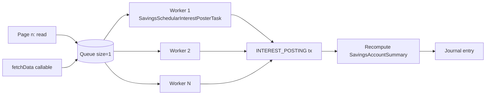
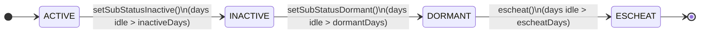

Apache Fineract's savings subsystem is the largest user of the scheduled-job framework after the loan subsystem. Interest posting alone touches every active savings, fixed-deposit and recurring-deposit account in a tenant. This page walks each savings tasklet, explains how it computes its work set, the side effects, and where it sits relative to its peers. For the schedule-centric view see the [Tasklet catalog](/jobs/tasklets-catalog); for the data model see the [Savings jobs](/savings/savings-jobs) page.

## `POST_INTEREST_FOR_SAVINGS`

**Tasklet:** `fineract-provider/src/main/java/org/apache/fineract/portfolio/savings/jobs/postinterestforsavings/PostInterestForSavingTasklet.java`

The most performance-critical savings job. It posts interest on every `ACTIVE` savings (including the deposit subtypes) by parallelising the work across a configurable thread pool. The shape:

```java
@RequiredArgsConstructor
@Slf4j
@Component
public class PostInterestForSavingTasklet implements Tasklet {

    private static final int QUEUE_SIZE = 1;

    private final SavingsAccountReadPlatformService savingAccountReadPlatformService;
    private final ConfigurationDomainService configurationDomainService;
    private final ApplicationContext applicationContext;
    @Qualifier(TaskExecutorConstant.CONFIGURABLE_TASK_EXECUTOR_BEAN_NAME)
    private final ThreadPoolTaskExecutor taskExecutor;
}
```

### Algorithm

1. Read `thread-pool-size` and `batch-size` from `chunkContext.getStepContext().getJobParameters()`.
2. Size the shared `ThreadPoolTaskExecutor` for this run (`setCorePoolSize`, `setMaxPoolSize`).
3. Compute `pageSize = batchSize * threadPoolSize` — one page worth of work at a time.
4. Read the first page of active savings via `savingAccountReadPlatformService.retrieveAllSavingsDataForInterestPosting(...)`.
5. Push the page onto an in-memory `Queue<List<SavingsAccountData>>` and start the producer/consumer pump:
   - A `fetchData` `Callable` prefetches the next page into the queue while workers process the current one.
   - For each batch slice, build a `SavingsSchedularInterestPosterTask` (a prototype-scoped Spring bean) and submit it.
6. Workers call `SavingsAccount.calculateInterestUsing(...)` and `SavingsAccount.postInterest(...)`, which materialise `SavingsAccountTransaction` rows of type `INTEREST_POSTING (3)`.
7. After processing, dequeue, advance `maxSavingsIdInList`, and loop until the queue drains.

Excerpt of the producer code:

```java
Callable<Void> fetchData = () -> {
    try {
        ThreadLocalContextUtil.init(context);
        Long maxId = maxSavingsIdInList;
        ...
        while (queue.size() <= QUEUE_SIZE) {
            List<SavingsAccountData> savingsAccountDataList = Collections.synchronizedList(
                this.savingAccountReadPlatformService.retrieveAllSavingsDataForInterestPosting(
                    backdatedTxnsAllowedTill, pageSize, ACTIVE.getValue(), maxId));
            if (savingsAccountDataList.isEmpty()) {
                break;
            }
            maxId = savingsAccountDataList.get(savingsAccountDataList.size() - 1).getId();
            queue.add(savingsAccountDataList);
        }
        return null;
    } finally {
        ThreadLocalContextUtil.reset();
    }
};
```

Key takeaways:

- The tasklet **uses the shared `ThreadPoolTaskExecutor`** keyed by `TaskExecutorConstant.CONFIGURABLE_TASK_EXECUTOR_BEAN_NAME`; it does not allocate its own.
- Tenant context is propagated explicitly with `ThreadLocalContextUtil.init(context)` inside each callable, then reset in `finally`. Forgetting this breaks multi-tenant routing.
- Pages overlap so a slow worker thread is masked by the prefetcher.
- Batches are kept stable: if a batch boundary lands in the middle of two rows sharing the same id (very rare, only happens on table mutation during read), the boundary is shifted forward.

**Tables written:** `m_savings_account_transaction` (type `INTEREST_POSTING (3)`), `m_savings_account` (summary columns + `interest_posted_till_date`), `acc_gl_journal_entry`.



## `PAY_DUE_SAVINGS_CHARGES`

**Tasklet:** `fineract-provider/.../portfolio/savings/jobs/payduesavingscharges/PayDueSavingsChargesTasklet.java`

```java
public RepeatStatus execute(StepContribution contribution, ChunkContext chunkContext) throws Exception {
    final Collection<SavingsAccountAnnualFeeData> chargesDueData =
        savingsAccountChargeReadPlatformService.retrieveChargesWithDue();
    List<Throwable> exceptions = new ArrayList<>();
    for (final SavingsAccountAnnualFeeData ref : chargesDueData) {
        try {
            savingsAccountWritePlatformService.applyChargeDue(ref.getId(), ref.getAccountId());
        } catch (final PlatformApiDataValidationException | RuntimeException e) {
            exceptions.add(e);
            // log
        }
    }
    if (!exceptions.isEmpty()) {
        throw new JobExecutionException(exceptions);
    }
    return RepeatStatus.FINISHED;
}
```

The algorithm:

1. `retrieveChargesWithDue()` returns every `SavingsAccountCharge` whose `due_date == business date`.
2. For each row, `applyChargeDue(chargeId, accountId)` runs in its own transaction, debits the savings account (`PAY_CHARGE (7)`), and rolls the next due date forward by the charge's recurrence.
3. Per-charge failures are collected and surfaced as a `JobExecutionException` after the loop, never blocking the rest.

**Tables written:** `m_savings_account_transaction` (`PAY_CHARGE (7)`), `m_savings_account_charge` (`due_date`), `m_savings_account_charge_paid_by`.

## `APPLY_ANNUAL_FEE_FOR_SAVINGS`

A historical specialisation of the charges path that only walks `ANNUAL_FEE (5)` charges. Same `applyChargeDue` flow as above. It exists separately because the annual-fee rollover used to have different recurrence math; modern installs typically schedule both jobs but configure only one of them as active per tenant.

## `TRANSFER_INTEREST_TO_SAVINGS`

**Tasklet:** `fineract-provider/.../portfolio/savings/jobs/transferinteresttosavings/TransferInterestToSavingsTasklet.java`

```java
public RepeatStatus execute(StepContribution contribution, ChunkContext chunkContext) throws Exception {
    List<Throwable> errors = new ArrayList<>();
    Collection<AccountTransferDTO> accountTransferData =
        depositAccountReadPlatformService.retrieveDataForInterestTransfer();
    for (AccountTransferDTO dto : accountTransferData) {
        try {
            accountTransfersWritePlatformService.transferFunds(dto);
        } catch (PlatformApiDataValidationException | InsufficientAccountBalanceException e) {
            errors.add(e);
        }
    }
    if (!errors.isEmpty()) throw new JobExecutionException(errors);
    return RepeatStatus.FINISHED;
}
```

For FD/RD accounts with `transferInterestToLinkedAccount = true`, `retrieveDataForInterestTransfer()` returns a pre-built `AccountTransferDTO` for the latest unposted-but-payable interest, naming the source deposit account and the linked savings as destination. `AccountTransfersWritePlatformService.transferFunds(dto)` handles the actual debit/credit pair and the `m_account_transfer_transaction` audit row.

**Tables written:** `m_savings_account_transaction` (one debit + one credit), `m_account_transfer_transaction`.

## `TRANSFER_FEE_CHARGE_FOR_LOANS`

Discussed in [Loan jobs deep-dive](/jobs/loan-jobs-deep-dive#transfer_fee_charge_for_loans) — it lives under savings code but moves money *out of* a savings account into a loan ledger, so it's listed here for completeness.

## `GENERATE_RD_SCEHDULE` — Recurring deposit schedule top-up

**Tasklet:** `fineract-provider/.../portfolio/savings/jobs/generaterdschedule/GenerateRdScheduleTasklet.java`

```java
public RepeatStatus execute(StepContribution contribution, ChunkContext chunkContext) throws Exception {
    final JdbcTemplate jdbcTemplate =
        new JdbcTemplate(dataSourceServiceFactory.determineDataSourceService().retrieveDataSource());
    final Collection<Map<String, Object>> scheduleDetails =
        depositAccountReadPlatformService.retriveDataForRDScheduleCreation();
    String insertSql = "INSERT INTO m_mandatory_savings_schedule (..." + ") VALUES (?, ?, ?, ?, ?, ?, ?)";
    List<Object[]> params = new ArrayList<>();
    Long userId = securityContext.authenticatedUser().getId();
    for (Map<String, Object> details : scheduleDetails) {
        Long count = (Long) details.get("futureInstallments");
        ...
        while (count < DepositAccountUtils.GENERATE_MINIMUM_NUMBER_OF_FUTURE_INSTALMENTS) {
            count++;
            installmentNumber++;
            lastDepositDate = DepositAccountUtils.calculateNextDepositDate(lastDepositDate, recurrence);
            params.add(new Object[] { savingsId, lastDepositDate, installmentNumber, amount, false, ... });
        }
    }
    jdbcTemplate.batchUpdate(insertSql, params);
    return RepeatStatus.FINISHED;
}
```

The goal: every active recurring deposit account should always have at least `GENERATE_MINIMUM_NUMBER_OF_FUTURE_INSTALMENTS` future-dated rows in `m_mandatory_savings_schedule`. The tasklet uses a batched `INSERT` so a tenant with thousands of RD accounts can be topped up in a single round-trip per page. The misspelled enum value `GENERATE_RD_SCEHDULE` is preserved because changing it would orphan operator scripts.

**Tables written:** `m_mandatory_savings_schedule` (append).

## `UPDATE_DEPOSITS_ACCOUNT_MATURITY_DETAILS`

**Tasklet:** `fineract-provider/.../portfolio/savings/jobs/updatedepositsaccountmaturitydetails/UpdateDepositsAccountMaturityDetailsTasklet.java`

For every FD/RD account whose `maturity_date <= business date`, calls `depositAccountWritePlatformService.updateMaturityDetails(id, type)`. That method:

1. Posts a final interest transaction up to maturity.
2. Updates the account status to `MATURED`.
3. Executes `DepositAccountOnClosureType`: either reinvest (open a new term deposit), transfer to linked savings, or leave unallocated.

```java
for (final DepositAccountData depositAccount : depositAccounts) {
    try {
        final DepositAccountType type = DepositAccountType.fromInt(
            depositAccount.getDepositType().getId().intValue());
        depositAccountWritePlatformService.updateMaturityDetails(depositAccount.getId(), type);
    } catch (final PlatformApiDataValidationException e) { /* log */ }
}
```

**Tables written:** `m_savings_account` (status + maturity columns), `m_savings_account_transaction` (final interest + reinvest debit/credit if applicable), `m_deposit_account_recurring_detail`.

## `UPDATE_SAVINGS_DORMANT_ACCOUNTS`

**Tasklet:** `fineract-provider/.../portfolio/savings/jobs/updatesavingsdormantaccounts/UpdateSavingsDormantAccountsTasklet.java`

A three-pass sweep that promotes accounts through the dormancy lifecycle:

```java
LocalDate tenantLocalDate = DateUtils.getBusinessLocalDate();

List<Long> savingsPendingInactive =
    savingAccountReadPlatformService.retrieveSavingsIdsPendingInactive(tenantLocalDate);
for (Long id : savingsPendingInactive) {
    savingsAccountWritePlatformService.setSubStatusInactive(id);
}

List<Long> savingsPendingDormant =
    savingAccountReadPlatformService.retrieveSavingsIdsPendingDormant(tenantLocalDate);
for (Long id : savingsPendingDormant) {
    savingsAccountWritePlatformService.setSubStatusDormant(id);
}

List<Long> savingsPendingEscheat =
    savingAccountReadPlatformService.retrieveSavingsIdsPendingEscheat(tenantLocalDate);
for (Long id : savingsPendingEscheat) {
    savingsAccountWritePlatformService.escheat(id);
}
```



Thresholds come from the savings **product** (`m_savings_product` columns `days_to_inactive`, `days_to_dormancy`, `days_to_escheat`). Escheat closes the account and posts a `WITHDRAW (2)` for the residual balance into the escheat liability GL account.

**Tables written:** `m_savings_account` (`sub_status_enum`), `m_savings_account_transaction` (`WITHDRAW (2)` on escheat).

## `ADD_PERIODIC_ACCRUAL_ENTRIES_FOR_SAVINGS_WITH_INCOME_POSTED_AS_TRANSACTIONS`

**Tasklet:** `fineract-provider/.../portfolio/savings/jobs/addaccrualtransactionforsavings/AddAccrualTransactionForSavingsTasklet.java`

The savings-side counterpart of the loan accrual job. For products whose accounting type is `ACCRUAL_PERIODIC`, it walks active savings accounts and posts `ACCRUAL (10)` transactions so the income hits the general ledger ahead of the periodic posting on the customer side.

## Cadence ordering

```mermaid
flowchart LR
    A[PAY_DUE_SAVINGS_CHARGES] --> B[APPLY_ANNUAL_FEE_FOR_SAVINGS]
    B --> C[GENERATE_RD_SCEHDULE]
    C --> D[POST_INTEREST_FOR_SAVINGS]
    D --> E[TRANSFER_INTEREST_TO_SAVINGS]
    E --> F[UPDATE_DEPOSITS_ACCOUNT_MATURITY_DETAILS]
    F --> G[UPDATE_SAVINGS_DORMANT_ACCOUNTS]
    G --> H[ADD_PERIODIC_ACCRUAL_ENTRIES_FOR_SAVINGS]
```



The recommended schedule:

| Time | Job | Why this order |
|------|-----|----------------|
| 22:00 | `PAY_DUE_SAVINGS_CHARGES` | Charges first so balances reflect the deductions before interest is calculated. |
| 22:10 | `APPLY_ANNUAL_FEE_FOR_SAVINGS` | Same reason, specialised path. |
| 22:30 | `GENERATE_RD_SCEHDULE` | Ensures the schedule horizon is healthy before maturity/interest decisions reference it. |
| 23:00 | `POST_INTEREST_FOR_SAVINGS` | The marquee job; runs late so post-charge balances are correct. |
| 23:30 | `TRANSFER_INTEREST_TO_SAVINGS` | After interest is posted, sweep it to the linked savings. |
| 00:00 | `UPDATE_DEPOSITS_ACCOUNT_MATURITY_DETAILS` | After business date rolls. |
| 00:30 | `UPDATE_SAVINGS_DORMANT_ACCOUNTS` | After everything that could re-activate a dormant account. |
| 01:00 | `ADD_PERIODIC_ACCRUAL_ENTRIES_FOR_SAVINGS` | After all customer-side activity. |

## Operator knobs

- `POST_INTEREST_FOR_SAVINGS` takes **`thread-pool-size`** and **`batch-size`** as job parameters. Sensible defaults are 4 / 500 for a typical mid-size tenant; large tenants push these to 8 / 1000 once they've verified the shared `ThreadPoolTaskExecutor` does not starve other jobs.
- The savings repository's `retrievePivotDateConfig` toggles whether **backdated transactions** participate in interest posting (`fineract.savings.pivotDate`). When `false`, the read service ignores any transaction whose date is before the account's `interest_calculated_from_date`.
- `UPDATE_SAVINGS_DORMANT_ACCOUNTS` honours per-product thresholds. Setting all three to 0 on a product disables the sweep for that product.

## Cross-references

<CardGroup cols={2}>
  <Card title="Savings jobs (entity view)" href="/savings/savings-jobs">Per-job entity model and column-level outcomes.</Card>
  <Card title="Loan jobs deep dive" href="/jobs/loan-jobs-deep-dive">Sister jobs on the loan book.</Card>
  <Card title="Accounting jobs deep dive" href="/jobs/accounting-jobs-deep-dive">GL-side jobs that depend on these.</Card>
  <Card title="Tasklet catalog" href="/jobs/tasklets-catalog">Index of every *Tasklet.java in Fineract.</Card>
</CardGroup>
