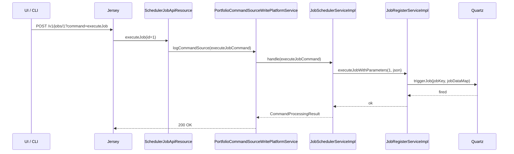

The two REST resources `SchedulerApiResource` (under `/v1/scheduler`) and `SchedulerJobApiResource` (under `/v1/jobs`) are the operator front door to Apache Fineract's batch infrastructure. They cover everything a UI or a Helm-driven CronJob needs: pausing the platform-wide scheduler, listing every registered job, running one on demand, fetching run history, and reconfiguring cron expressions on the fly. This page maps the endpoints to source code and explains the permission model.

## `/v1/scheduler` — the platform switch

Source: `fineract-provider/src/main/java/org/apache/fineract/infrastructure/jobs/api/SchedulerApiResource.java`.

The resource is small on purpose: it controls the global scheduler suspension flag stored on the `m_scheduler_detail` singleton row.

```java
@Path("/v1/scheduler")
@Component
@Tag(name = "Scheduler", description = "")
public class SchedulerApiResource {
    private final PlatformSecurityContext context;
    private final JobRegisterService jobRegisterService;
    private final ToApiJsonSerializer<SchedulerDetailData> toApiJsonSerializer;
    private final ApiRequestParameterHelper apiRequestParameterHelper;
}
```

### Endpoints

| Method | Path | Operation | Permission |
|--------|------|-----------|------------|
| `GET` | `/v1/scheduler` | Retrieve scheduler status | `READ_SCHEDULER` (resource `SCHEDULER`) |
| `POST` | `/v1/scheduler?command=start` | Resume Quartz triggers | `ALL_FUNCTIONS` or `UPDATE_SCHEDULER` |
| `POST` | `/v1/scheduler?command=stop` | Suspend Quartz triggers | `ALL_FUNCTIONS` or `UPDATE_SCHEDULER` |

### `GET /v1/scheduler`

```java
public String retrieveStatus(@Context final UriInfo uriInfo) {
    context.authenticatedUser().validateHasReadPermission(SchedulerJobApiConstants.SCHEDULER_RESOURCE_NAME);
    final boolean isSchedulerRunning = jobRegisterService.isSchedulerRunning();
    final SchedulerDetailData schedulerDetailData =
        new SchedulerDetailData().setActive(isSchedulerRunning);
    return toApiJsonSerializer.serialize(settings, schedulerDetailData,
        SchedulerJobApiConstants.SCHEDULER_DETAIL_RESPONSE_DATA_PARAMETERS);
}
```

Response body:

```json
{ "active": true }
```

`active` is `true` whenever `SchedulerDetail.suspended` is `false`. Suspending does not stop jobs that are already in flight — it only prevents the next cron fire.

### `POST /v1/scheduler?command=start` / `stop`

```java
public Response changeSchedulerStatus(
        @QueryParam(SchedulerJobApiConstants.COMMAND) final String commandParam) {
    final boolean hasNotPermission =
        context.authenticatedUser().hasNotPermissionForAnyOf("ALL_FUNCTIONS", "UPDATE_SCHEDULER");
    if (hasNotPermission) {
        throw new NoAuthorizationException("User has no authority to update scheduler status");
    }
    if (is(commandParam, SchedulerJobApiConstants.COMMAND_START_SCHEDULER)) {
        jobRegisterService.startScheduler();
        return Response.status(202).build();
    } else if (is(commandParam, SchedulerJobApiConstants.COMMAND_STOP_SCHEDULER)) {
        jobRegisterService.pauseScheduler();
        return Response.status(202).build();
    }
    throw new UnrecognizedQueryParamException(SchedulerJobApiConstants.COMMAND, commandParam);
}
```

A `202 Accepted` is returned because Quartz schedulers are eventually consistent: `pauseScheduler()` flips the flag immediately, but the next-trigger evaluation happens on Quartz's worker threads.

## `/v1/jobs` — the per-job control plane

Source: `fineract-provider/src/main/java/org/apache/fineract/infrastructure/jobs/api/SchedulerJobApiResource.java`.

```java
@Path("/v1/jobs")
@Produces({ MediaType.APPLICATION_JSON })
@Component
@RequiredArgsConstructor
@Tag(name = "SCHEDULER JOB", description = "Batch jobs (also known as cron jobs)...")
public class SchedulerJobApiResource {
    private final SchedulerJobRunnerReadService schedulerJobRunnerReadService;
    private final JobRegisterService jobRegisterService;
    private final ApiRequestParameterHelper apiRequestParameterHelper;
    private final ToApiJsonSerializer<JobDetailData> toApiJsonSerializer;
    private final ToApiJsonSerializer<JobDetailHistoryData> jobHistoryToApiJsonSerializer;
    private final PortfolioCommandSourceWritePlatformService commandsSourceWritePlatformService;
    private final PlatformSecurityContext context;
    private final FineractProperties fineractProperties;
    private final SqlValidator sqlValidator;
}
```

Every operation is available **twice** — once keyed by numeric `{jobId}` and once by `short-name/{shortName}`. The short-name path lets infrastructure code reference jobs without knowing the row id, which differs per tenant.

### Listing

```http
GET /v1/jobs
```

Calls `schedulerJobRunnerReadService.findAllJobDetails()` and returns an array of `JobDetailData` records:

```json
[
  {
    "jobId": 1,
    "displayName": "Update loan Summary",
    "shortName": "LN_SUMM",
    "cronExpression": "0 0 22 1/1 * ? *",
    "active": true,
    "currentlyRunning": false,
    "lastRunHistory": { "status": "success", "errorMessage": null, ... },
    "nextRunTime": "2024-04-12T22:00:00Z",
    "nodeId": "1"
  }
]
```

### Single job

```http
GET /v1/jobs/{jobId}
GET /v1/jobs/short-name/{shortName}
```

Both ultimately call `retrieveOne(idType, value, uriInfo)` which uses `IdTypeResolver` to decide whether to look up by id or `short_name`. Short names are tokens like `SA_PINT` (Savings — post interest), `LN_NPA` (Loan — NPA flag), etc.

### Run history

```http
GET /v1/jobs/{jobId}/runhistory?offset=0&limit=200&orderBy=...&sortOrder=...
GET /v1/jobs/short-name/{shortName}/runhistory
```

Paginated rows from `m_scheduler_job_run_history` deserialised into `JobDetailHistoryData`. The relevant slice from the resource:

```java
public String retrieveHistory(@Context final UriInfo uriInfo,
        @PathParam(SchedulerJobApiConstants.JOB_ID) final Long jobId,
        @QueryParam("offset") final Integer offset,
        @QueryParam("limit") final Integer limit,
        @QueryParam("orderBy") final String orderBy,
        @QueryParam("sortOrder") final String sortOrder) {
    return retrieveHistory(IdTypeResolver.resolveDefault(),
            Objects.toString(jobId, null), offset, limit, orderBy, sortOrder, uriInfo);
}
```

`sqlValidator` is applied to `orderBy` and `sortOrder` to keep dynamic SQL safe.

### Manual execution

```http
POST /v1/jobs/{jobId}?command=executeJob
POST /v1/jobs/short-name/{shortName}?command=executeJob
```

The body is an optional JSON document describing per-run job parameters. The resource routes the call through the **command framework** rather than directly to the scheduler:

```java
public Response executeJob(@PathParam(JOB_ID) final Long jobId,
        @QueryParam(COMMAND) final String commandParam,
        final String jsonRequestBody) {
    return executeJob(IdTypeResolver.resolveDefault(), Objects.toString(jobId, null),
            commandParam, jsonRequestBody);
}
```

Routing through the command framework gives every manual execution an audit row in `m_portfolio_command_source` and the standard maker–checker workflow if it is enabled for `EXECUTE_SCHEDULER_JOB`.

The actual launch happens in `JobSchedulerServiceImpl.executeJob(...)`, which in turn calls `JobRegisterServiceImpl.executeJobWithParameters(jobId, json)`.

### Updating a job

```http
PUT /v1/jobs/{jobId}
PUT /v1/jobs/short-name/{shortName}
```

Body shape (from `SchedulerJobApiResourceSwagger.PutJobsJobIDRequest`):

```json
{
  "displayName": "Update Loan Arrears Ageing",
  "cronExpression": "0 0 1 1/1 * ? *",
  "active": true
}
```

The handler invokes the `UPDATE_SCHEDULER_JOB` command which delegates to `JobSchedulerServiceImpl.updateJobDetail`. When the cron expression or `active` flag changes, `JobRegisterServiceImpl.rescheduleJob(jobId)` deletes the old trigger and reinstalls a new one in the same Quartz scheduler.

## Permissions

| Permission code | Granted on |
|-----------------|------------|
| `READ_SCHEDULER` | `GET /v1/scheduler`, `GET /v1/jobs`, `GET /v1/jobs/{id}`, `GET /v1/jobs/short-name/{shortName}`, `GET /v1/jobs/{id}/runhistory` |
| `UPDATE_SCHEDULER` | `POST /v1/scheduler?command=...` |
| `EXECUTE_SCHEDULER_JOB` | `POST /v1/jobs/{id}?command=executeJob` |
| `UPDATE_SCHEDULER_JOB` | `PUT /v1/jobs/{id}` |
| `ALL_FUNCTIONS` | Acts as a superuser bypass for every check above |

The two write permissions are dispatched through `PortfolioCommandSourceWritePlatformService`, so they participate in maker–checker if enabled at the tenant level.

## End-to-end flow



## Response data shapes

`JobDetailData` (from `org.apache.fineract.infrastructure.jobs.data`):

| Field | Source |
|-------|--------|
| `jobId` | `ScheduledJobDetail.id` |
| `displayName` | `ScheduledJobDetail.jobName` |
| `shortName` | `ScheduledJobDetail.shortName` |
| `cronExpression` | `ScheduledJobDetail.cronExpression` |
| `active` | `ScheduledJobDetail.activeSchedular` |
| `currentlyRunning` | `ScheduledJobDetail.currentlyRunning` |
| `lastRunHistory` | Joined latest row from `m_scheduler_job_run_history` |
| `nextRunTime` | `ScheduledJobDetail.nextRunTime` (computed by Quartz at schedule time) |
| `nodeId` | `ScheduledJobDetail.nodeId` |

`JobDetailHistoryData` is one row per `ScheduledJobRunHistory`:

| Field | Source |
|-------|--------|
| `version` | Monotonic incrementing version |
| `jobRunStartTime`, `jobRunEndTime` | Set by `SchedulerJobListener` |
| `status` | `success` / `fail` |
| `jobRunErrorMessage` | First line of the stack trace |
| `triggerType` | `cron` / `application` / `inline` |
| `jobRunErrorLog` | Full stack trace |

## Idempotency and concurrency

- `currently_running` is updated within the same transaction as the run history write, so two simultaneous launches of the same job (one cron, one manual) cannot both flip it.
- `RunIdIncrementer` on every `JobBuilder` means that each launch gets a new `JobInstance` in Spring Batch's metadata tables, preventing the "job instance already exists" error.
- Quartz `executeJob` uses the existing scheduler when present; otherwise it creates a per-run temp scheduler so manual executions never block the cron path.

## Cross-references

<CardGroup cols={2}>
  <Card title="Inline jobs" href="/jobs/inline-job-api">/v1/jobs/&#123;jobName&#125;/inline — the synchronous trigger that runs Spring Batch in-thread.</Card>
  <Card title="Scheduler service" href="/jobs/scheduler-service">JobRegisterServiceImpl internals.</Card>
  <Card title="Jobs domain" href="/core/jobs-domain">JPA entities behind every response.</Card>
  <Card title="Commands framework" href="/core/commands-framework">Audit and maker–checker plumbing for execute/update.</Card>
</CardGroup>

## Curl examples

```bash
# Status
curl -u mifos:password -H 'Fineract-Platform-TenantId: default' \
    https://fineract.example/fineract-provider/api/v1/scheduler

# Pause
curl -u mifos:password -H 'Fineract-Platform-TenantId: default' -X POST \
    'https://fineract.example/fineract-provider/api/v1/scheduler?command=stop'

# List jobs
curl -u mifos:password -H 'Fineract-Platform-TenantId: default' \
    https://fineract.example/fineract-provider/api/v1/jobs

# Run job 7 manually with parameters
curl -u mifos:password -H 'Fineract-Platform-TenantId: default' \
    -H 'Content-Type: application/json' -X POST \
    'https://fineract.example/fineract-provider/api/v1/jobs/7?command=executeJob' \
    -d '{"businessDate":"2024-04-12"}'

# Update cron
curl -u mifos:password -H 'Fineract-Platform-TenantId: default' \
    -H 'Content-Type: application/json' -X PUT \
    https://fineract.example/fineract-provider/api/v1/jobs/7 \
    -d '{"cronExpression":"0 30 22 1/1 * ? *","active":true}'

# Run history
curl -u mifos:password -H 'Fineract-Platform-TenantId: default' \
    'https://fineract.example/fineract-provider/api/v1/jobs/short-name/SA_PINT/runhistory?offset=0&limit=20'
```
