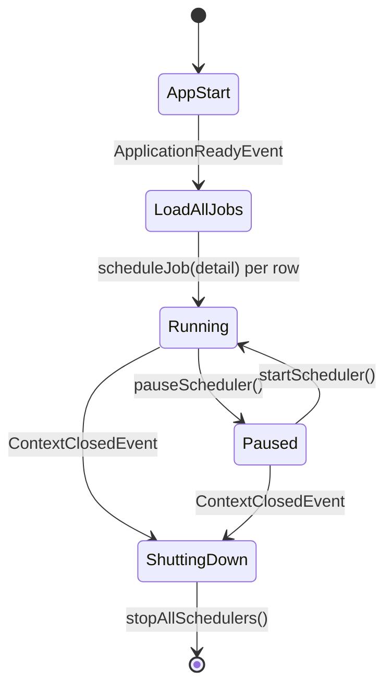
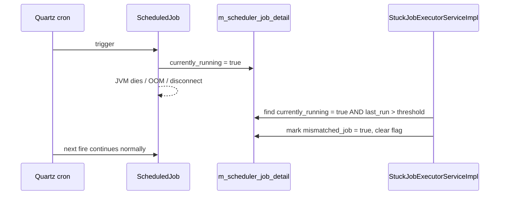

The runtime brain behind every scheduled batch run in Apache Fineract is `JobRegisterServiceImpl`. It owns the per-tenant Quartz schedulers, translates `ScheduledJobDetail` rows into `JobDetail` + `CronTrigger` pairs, and reconciles the scheduler with the database when an operator pauses, resumes or reschedules a job. This page walks the package, the lifecycle, the listeners, and the multi-tenant + multi-node concerns the service has to juggle.

## Package map

`fineract-provider/src/main/java/org/apache/fineract/infrastructure/jobs/service/`:

```
service/
├── InlineExecutorService.java               — inline (synchronous) job launcher
├── InlineJobExecuteHandler.java              — command handler for /inline
├── InlineJobType.java                        — whitelist of inline-runnable jobs
├── JobParameterDataParser.java               — JSON → Set<JobParameterDTO>
├── JobRegisterService.java                   — interface
├── JobRegisterServiceImpl.java               — Quartz orchestration
├── JobSchedulerServiceImpl.java              — start/stop/reschedule command handlers
├── JobStarter.java                           — method invoked by Quartz; calls JobLauncher
├── SchedularWritePlatformService.java        — JPA wrapper around m_scheduler_job_detail
├── SchedularWritePlatformServiceJpaRepositoryImpl.java
├── SchedulerJobListener.java                 — JobListener: writes run history
├── SchedulerJobRunnerReadServiceImpl.java    — read side for the API
├── SchedulerServiceConstants.java
├── SchedulerStopListener.java                — TriggerListener: tears down temp schedulers
├── SchedulerTriggerListener.java             — TriggerListener: tenant + audit hook
├── SchedulerVetoer.java                      — vetoes job firing when conditions fail
├── StuckJobExecutorService.java
├── StuckJobExecutorServiceImpl.java          — recovers jobs stuck currentlyRunning=true
├── StuckJobListener.java
├── aggregationjob/                           — Journal Entry Aggregation tasklets
├── executealldirtyjobs/                      — Execute All Dirty Jobs tasklet
├── increasedateby1day/                       — Business and COB date advancement
├── jobname/                                  — JobNameService and JobNameData provider
├── jobparameterprovider/                     — Custom job parameter resolvers
└── updatenpa/                                — UPDATE_NPA job + tasklet
```

`fineract-core` complements this with the data layer: `JobName`, `StepName`, `JobParameterDTO`, `ScheduledJobDetail` (the entity), `ScheduledJobRunHistory`, and the `SchedulerDetail` singleton row that records suspension state.

## `JobRegisterServiceImpl` at a glance

Class header (abridged):

```java
@Service
@Slf4j
public class JobRegisterServiceImpl
        implements JobRegisterService, ApplicationListener<ContextClosedEvent> {

    @Autowired private SchedularWritePlatformService schedularWritePlatformService;
    @Autowired private SchedulerJobListener schedulerJobListener;
    @Autowired private SchedulerTriggerListener globalSchedulerTriggerListener;
    @Autowired private FineractProperties fineractProperties;
    @Autowired private JobLocator jobLocator;
    @Autowired private JobStarter jobStarter;
    @Autowired private JobParameterDataParser dataParser;
    @Autowired private JobNameService jobNameService;

    private static final HashMap<String, Scheduler> SCHEDULERS = new HashMap<>(4);
    private static final String JOB_STARTER_METHOD_NAME = "run";
}
```

Two singletons are particularly important:

- `SCHEDULERS` — a static `Map<String, Scheduler>` keyed by tenant + group. There is one Quartz `Scheduler` per `(tenantId, schedulerGroup)` pair so groups can be sized independently.
- `JobLocator` — the Spring Batch registry that maps a `JobName.name()` string back to the live `Job` bean. Without it, Quartz would have no way to find the Spring Batch job to execute.

## Scheduler lifecycle



### Boot — `loadAllJobs()`

Triggered after Spring Boot is fully up, this iterates every `ScheduledJobDetail` for the current node:

```java
final List<ScheduledJobDetail> scheduledJobDetails =
    schedularWritePlatformService.retrieveAllJobs(fineractProperties.getNodeId());
for (final ScheduledJobDetail jobDetail : scheduledJobDetails) {
    scheduleJob(jobDetail);
}
```

`scheduleJob(detail)` builds a `JobDetail` and a `CronTrigger`, then drops them into the right `Scheduler` from the `SCHEDULERS` map (creating it on demand with `createScheduler(...)`).

### `scheduleJob` — the workhorse

```java
@Override
public void scheduleJob(final ScheduledJobDetail scheduledJobDetails) {
    try {
        final JobDetail jobDetail = createJobDetail(scheduledJobDetails, Collections.emptySet());
        scheduledJobDetails.setJobKey(getJobKeyAsString(jobDetail.getKey()));
        if (!scheduledJobDetails.isActiveSchedular()) {
            scheduledJobDetails.setNextRunTime(null);
            scheduledJobDetails.setCurrentlyRunning(false);
            return;
        }
        final Trigger trigger = createTrigger(scheduledJobDetails, jobDetail);
        final Scheduler scheduler = getScheduler(scheduledJobDetails);
        scheduler.scheduleJob(jobDetail, trigger);
        scheduledJobDetails.setNextRunTime(trigger.getNextFireTime());
        scheduledJobDetails.setErrorLog(null);
    } catch (final Exception throwable) {
        scheduledJobDetails.setNextRunTime(null);
        scheduledJobDetails.setErrorLog(getStackTraceAsString(throwable));
        log.warn("Could not schedule job: {}", scheduledJobDetails.getJobName(), throwable);
    }
    scheduledJobDetails.setCurrentlyRunning(false);
}
```

Note how every outcome — successful schedule, inactive job, exception — is persisted back onto the `ScheduledJobDetail` row. Operators see the result in `m_scheduler_job_detail.next_run_time` and `error_log`.

### `createJobDetail` — gluing Spring Batch to Quartz

The factory bean used here is `MethodInvokingJobDetailFactoryBean`. The trick is that Quartz cannot launch a Spring Batch `Job` directly; instead, it invokes `JobStarter.run(...)` reflectively. `JobStarter` then resolves the batch job through `JobLocator` and calls `JobLauncher.run`. The job class registered with Quartz is therefore a tiny shim — the heavy lifting lives in `JobStarter`.

`createTrigger` wraps a `CronTriggerFactoryBean`, feeding it `cronExpression`, the tenant time zone, and a misfire policy. The misfire policy is what fuels the "make up missed runs" knob exposed by `SchedulerDetail.executeInstructionForMisfiredJobs`.

### Pause / resume

```java
@Override
public void pauseScheduler() {
    final SchedulerDetail schedulerDetail = schedularWritePlatformService.retriveSchedulerDetail();
    if (!schedulerDetail.isSuspended()) {
        schedulerDetail.setSuspended(true);
        schedularWritePlatformService.updateSchedulerDetail(schedulerDetail);
    }
}
```

`pauseScheduler()` flips a single boolean on `SchedulerDetail`. The actual veto happens in `SchedulerVetoer.vetoJobExecution(...)`, which checks the suspended flag before each fire. This means an in-flight job is allowed to finish — only the next trigger is vetoed.

`startScheduler()` is symmetric, but it also walks every `ScheduledJobDetail` flagged as `triggerMisfired == true` and synthesises a make-up execution if `SchedulerDetail.executeInstructionForMisfiredJobs` is enabled. The relevant slice:

```java
if (jobDetail.isTriggerMisfired()) {
    if (jobDetail.isActiveSchedular()) {
        executeJob(jobDetail, SchedulerServiceConstants.TRIGGER_TYPE_CRON, Collections.emptySet());
        jobDetail.setMismatchedJob(false);
    }
    ...
}
```

### Manual execution — `executeJob(...)`

`executeJob(detail, triggerType, params)` is the path used by `POST /v1/jobs/{id}?command=executeJob`. It builds a fresh `JobDataMap` containing the trigger type (`APPLICATION` by default, `CRON` if the call came from the schedule itself), the tenant identifier, and any custom parameters. If the job's owning scheduler exists, the job is added and triggered immediately; otherwise a **temporary scheduler** is spun up just for this run:

```java
final String tempSchedulerName = "temp" + scheduledJobDetail.getId();
final Scheduler tempScheduler = createScheduler(tempSchedulerName, 1,
        schedulerJobListener, schedulerStopListener);
jobDataMap.put(SchedulerServiceConstants.SCHEDULER_NAME, tempSchedulerName);
SCHEDULERS.put(tempSchedulerName, tempScheduler);
tempScheduler.addJob(jobDetail, true);
tempScheduler.triggerJob(jobKey, jobDataMap);
```

The attached `SchedulerStopListener` shuts down the temp scheduler the moment the trigger completes, so manual runs don't leak Quartz threads.

### Shutdown — `ContextClosedEvent`

```java
@Override
public void onApplicationEvent(@SuppressWarnings("unused") ContextClosedEvent event) {
    stopAllSchedulers();
}
```

`ContextClosedEvent` is used (not `ContextStoppedEvent`) because a failed Spring Boot startup still triggers a `context.close()`. This guarantees Quartz threads never linger after a botched start.

## Naming a scheduler

```java
private String getSchedulerName(final ScheduledJobDetail scheduledJobDetail) {
    final StringBuilder sb = new StringBuilder(20);
    final FineractPlatformTenant tenant = ThreadLocalContextUtil.getTenant();
    sb.append(SchedulerServiceConstants.SCHEDULER).append(tenant.getId());
    if (scheduledJobDetail.getSchedulerGroup() > 0) {
        sb.append(SchedulerServiceConstants.SCHEDULER_GROUP).append(scheduledJobDetail.getSchedulerGroup());
    }
    return sb.toString();
}
```

The name is `scheduler<tenantId>[group<n>]`. Each scheduler gets its own thread pool sized via `SchedulerServiceConstants.DEFAULT_THREAD_COUNT` (ungrouped) or `GROUP_THREAD_COUNT` (grouped). Grouping is how operators isolate slow jobs (e.g. report mailing) from fast ones (purges) so a single misbehaving job does not block the scheduler.

## Listeners

Three listeners are attached to every `Scheduler` instance built by `JobRegisterServiceImpl`:

| Listener | Trigger | What it does |
|----------|---------|--------------|
| `SchedulerTriggerListener` | Before fire | Re-establishes the tenant context from `JobDataMap`, applies the audit user, vetoes if `SchedulerVetoer` says so. |
| `SchedulerJobListener` | After execute | Persists a `ScheduledJobRunHistory` row with start, end, status and error stack trace. |
| `SchedulerStopListener` | After temp trigger complete | Shuts down a one-off temp scheduler created by `executeJob(...)`. |

Together they ensure that every job run is observable, transactional and tenant-safe even when fired through an ad-hoc admin endpoint.

## Stuck-job watchdog



`StuckJobExecutorServiceImpl` runs on its own Spring `@Scheduled` cadence (independent of Quartz), looks for `currently_running == true` rows whose previous heartbeat is older than the configured deadline, clears the flag and marks the row `mismatchedJob = true`. The `EXECUTE_DIRTY_JOBS` job (see [Dirty jobs](/jobs/dirty-jobs-and-aggregation)) is what re-runs those marked rows.

## Multi-node deployments

Each `ScheduledJobDetail` row carries a `node_id` column:

- `node_id == "0"` — the job is free-floating and any node may pick it up.
- `node_id == "<n>"` — the job is pinned to the node whose `fineract.nodeId` matches.

If a job is triggered on the wrong node, `JobNodeIdMismatchingException` is raised and the row is flagged `mismatchedJob = true`. The dirty-jobs runner on the correct node then picks it up. The relevant guard in `JobRegisterServiceImpl.executeJobWithParameters`:

```java
if (nodeIdStored.equals(fineractProperties.getNodeId()) || nodeIdStored.equals("0")) {
    executeJob(scheduledJobDetail, null, jobParameterDTOSet);
} else {
    scheduledJobDetail.setMismatchedJob(true);
    schedularWritePlatformService.saveOrUpdate(scheduledJobDetail);
    throw new JobNodeIdMismatchingException(nodeIdStored, fineractProperties.getNodeId());
}
```

## Custom job parameters

Some jobs accept parameters: thread-pool size, batch size, the COB business date, the loan id range, etc. The flow is:

1. The REST caller posts JSON to `POST /v1/jobs/{id}?command=executeJob`.
2. `JobParameterDataParser.parseExecution(jobParametersJson)` turns it into a `Set<JobParameterDTO>`.
3. `JobRegisterServiceImpl.createJobDetail(...)` reads `CustomJobParameter` rows from the DB (the persisted defaults) and merges them with the request-time `Set<JobParameterDTO>`.
4. The merged map is added to the `JobDataMap`; `JobStarter` puts the entries into the Spring Batch `JobParametersBuilder` and launches.

The custom parameter side is described under [Job registry](/jobs/job-registry) and [Inline jobs](/jobs/inline-job-api).

## Where data lives

| Table | Purpose |
|-------|---------|
| `m_scheduler_detail` | Singleton row: suspended flag, misfire policy. |
| `m_scheduler_job_detail` | One row per job: cron, group, node, active, last result. |
| `m_scheduler_job_run_history` | Append-only run log. |
| `m_job_parameter` | Custom default parameters. |
| `m_custom_job_parameter` | Per-execution overrides recorded with the run. |
| `BATCH_JOB_*` / `BATCH_STEP_*` | Standard Spring Batch tables for execution context and metadata. |

## Cross-references

<CardGroup cols={2}>
  <Card title="Scheduler API" href="/jobs/scheduler-api">REST entrypoints for everything described here.</Card>
  <Card title="Inline jobs" href="/jobs/inline-job-api">Synchronous trigger path that skips Quartz.</Card>
  <Card title="Job registry" href="/jobs/job-registry">How a Tasklet becomes a Spring Batch Job.</Card>
  <Card title="Jobs domain (core)" href="/core/jobs-domain">JPA entities the service reads and writes.</Card>
</CardGroup>
