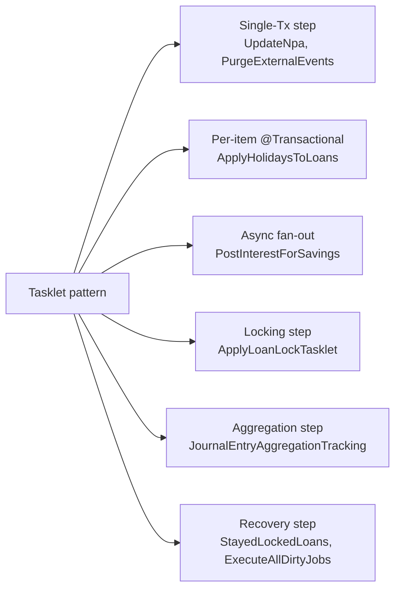

Apache Fineract has a fixed set of Spring Batch `Tasklet` implementations: each one corresponds to a step inside a registered `Job`, and each `Job` in turn is mapped to a value in the `JobName` enum. This page is the index. Every row gives you a file path, the `JobName` the tasklet runs under (or, for multi-step jobs, the parent job and the step's role), and a one-line summary of what the tasklet does at runtime. Use the search box of your editor against the file paths if you need to drill in.

## How to read this catalogue

- **JobName** — the enum value (in `JobName.java`) whose Spring Batch `Job` includes this tasklet. A single job may have multiple tasklets (e.g. `LOAN_COB` has five).
- **Module** — the Gradle sub-project the file lives in (`fineract-core`, `fineract-loan`, `fineract-provider`, etc.).
- **File** — repo-relative path. Click through in your IDE or via the apache/fineract source tree on GitHub.
- **Role** — single-step tasklets are marked **(step)**; multi-step tasklets are marked **(prep)**, **(body)**, **(cleanup)** or **(recovery)** so you can see where they sit in the chain.

## Top-level jobs and their tasklets

| JobName | Module | Tasklet file | Role |
|---------|--------|--------------|------|
| `PURGE_PROCESSED_COMMANDS` | fineract-core | `fineract-core/.../commands/jobs/PurgeProcessedCommandsTasklet.java` | (step) Deletes `m_portfolio_command_source` rows older than the retention window. |
| `PURGE_EXTERNAL_EVENTS` | fineract-core | `fineract-core/.../infrastructure/event/external/jobs/PurgeExternalEventsTasklet.java` | (step) Deletes `m_external_event` rows in `SENT` state older than the configured days. |
| `SEND_ASYNCHRONOUS_EVENTS` | fineract-core | `fineract-core/.../infrastructure/event/external/jobs/SendAsynchronousEventsTasklet.java` | (step) Drains pending external events to the configured downstream (message bus, etc.). |
| `UPDATE_LOAN_ARREARS_AGEING` | fineract-loan | `fineract-loan/.../portfolio/loanaccount/jobs/updateloanarrearsageing/UpdateLoanArrearsAgeingTasklet.java` | (step) Rebuilds `m_loan_arrears_aging` rows for every active loan. |
| `ADD_PERIODIC_ACCRUAL_ENTRIES` | fineract-loan | `fineract-loan/.../portfolio/loanaccount/jobs/addperiodicaccrualentries/AddPeriodicAccrualEntriesTasklet.java` | (step) Posts periodic accrual transactions via `LoanAccrualsProcessingService.addPeriodicAccruals(tillDate)`. |
| `LOAN_DELINQUENCY_CLASSIFICATION` | fineract-loan | `fineract-loan/.../portfolio/loanaccount/jobs/setloandelinquencytags/SetLoanDelinquencyTagsTasklet.java` | (step) Classifies loans against delinquency buckets and sets/removes `m_loan_delinquency_tag_history` rows. |
| `UPDATE_TRIAL_BALANCE_DETAILS` | fineract-accounting | `fineract-accounting/.../accounting/glaccount/jobs/updatetrialbalancedetails/UpdateTrialBalanceDetailsTasklet.java` | (step) Backfills `m_trial_balance` for days where journal entries exist but the daily totals are missing. |
| `ACCOUNTING_RUNNING_BALANCE_UPDATE` | fineract-provider | `fineract-provider/.../accounting/jobs/accountrunningbalanceupdate/AccountRunningBalanceUpdateTasklet.java` | (step) Materialises `running_balance` columns on every GL account. |
| `ADD_ACCRUAL_ENTRIES` | fineract-provider | `fineract-provider/.../portfolio/loanaccount/jobs/addaccrualentries/AddAccrualEntriesTasklet.java` | (step) Posts accrual transactions via `LoanAccrualsProcessingService.addAccruals(tillDate)`. |
| `ADD_PERIODIC_ACCRUAL_ENTRIES_FOR_LOANS_WITH_INCOME_POSTED_AS_TRANSACTIONS` | fineract-provider | `fineract-provider/.../portfolio/loanaccount/jobs/addperiodicaccrualentriesforloanswithincomepostedastransactions/AddPeriodicAccrualEntriesForLoansTasklet.java` | (step) Specialised periodic accrual path for products with `INCOME_POSTED_AS_TRANSACTION`. |
| `APPLY_CHARGE_TO_OVERDUE_LOAN_INSTALLMENT` | fineract-provider | `fineract-provider/.../portfolio/loanaccount/jobs/applychargetooverdueloaninstallment/ApplyChargeToOverdueLoanInstallmentTasklet.java` | (step) Walks overdue installments and applies the configured overdue penalty charge. |
| `APPLY_HOLIDAYS_TO_LOANS` | fineract-provider | `fineract-provider/.../portfolio/loanaccount/jobs/applyholidaystoloans/ApplyHolidaysToLoansTasklet.java` | (step) Reschedules loan installments that fall on a newly declared holiday. |
| `GENERATE_LOANLOSS_PROVISIONING` | fineract-provider | `fineract-provider/.../portfolio/loanaccount/jobs/generateloanlossprovisioning/GenerateLoanlossProvisioningTasklet.java` | (step) Computes provisioning amounts per `m_loan_provisioning_criteria` and writes `m_loan_loss_provisioning`. |
| `RECALCULATE_INTEREST_FOR_LOAN` | fineract-provider | `fineract-provider/.../portfolio/loanaccount/jobs/recalculateinterestforloan/RecalculateInterestForLoanTasklet.java` | (step) Triggers `recalculateInterest()` on loans whose product has interest recalculation enabled. |
| `TRANSFER_FEE_CHARGE_FOR_LOANS` | fineract-provider | `fineract-provider/.../portfolio/loanaccount/jobs/transferfeechargeforloans/TransferFeeChargeForLoansTasklet.java` | (step) Moves loan fees from the linked savings account into the loan ledger. |
| `ACCRUAL_ACTIVITY_POSTING` | fineract-provider | `fineract-provider/.../portfolio/loanaccount/jobs/accrualactivityposting/AccrualActivityPostingTasklet.java` | (step) Posts `ACCRUAL_ACTIVITY` transactions for loans whose product opts in. |
| `EXECUTE_STANDING_INSTRUCTIONS` | fineract-provider | `fineract-provider/.../portfolio/account/jobs/executestandinginstructions/ExecuteStandingInstructionsTasklet.java` | (step) Executes due `AccountTransferStandingInstruction` rows as account transfers. |
| `POST_INTEREST_FOR_SAVINGS` | fineract-provider | `fineract-provider/.../portfolio/savings/jobs/postinterestforsavings/PostInterestForSavingTasklet.java` | (step) Parallel-fans interest posting across active savings accounts. |
| `PAY_DUE_SAVINGS_CHARGES` | fineract-provider | `fineract-provider/.../portfolio/savings/jobs/payduesavingscharges/PayDueSavingsChargesTasklet.java` | (step) Pays savings charges whose `due_date == business date`. |
| `APPLY_ANNUAL_FEE_FOR_SAVINGS` | fineract-provider | `fineract-provider/.../portfolio/savings/jobs/applyannualfeeforsavings/ApplyAnnualFeeForSavingsTasklet.java` | (step) Posts the annual fee charge against eligible savings accounts. |
| `TRANSFER_INTEREST_TO_SAVINGS` | fineract-provider | `fineract-provider/.../portfolio/savings/jobs/transferinteresttosavings/TransferInterestToSavingsTasklet.java` | (step) Sweeps just-posted interest from FD/RD to the linked savings account. |
| `UPDATE_DEPOSITS_ACCOUNT_MATURITY_DETAILS` | fineract-provider | `fineract-provider/.../portfolio/savings/jobs/updatedepositsaccountmaturitydetails/UpdateDepositsAccountMaturityDetailsTasklet.java` | (step) Marks matured FD/RD accounts, posts final interest, executes maturity instructions. |
| `UPDATE_SAVINGS_DORMANT_ACCOUNTS` | fineract-provider | `fineract-provider/.../portfolio/savings/jobs/updatesavingsdormantaccounts/UpdateSavingsDormantAccountsTasklet.java` | (step) Sets `sub_status` to `INACTIVE`/`DORMANT`/`ESCHEAT` based on idle days. |
| `ADD_PERIODIC_ACCRUAL_ENTRIES_FOR_SAVINGS_WITH_INCOME_POSTED_AS_TRANSACTIONS` | fineract-provider | `fineract-provider/.../portfolio/savings/jobs/addaccrualtransactionforsavings/AddAccrualTransactionForSavingsTasklet.java` | (step) Accrual transactions for savings products with `ACCRUAL_PERIODIC`. |
| `GENERATE_RD_SCEHDULE` | fineract-provider | `fineract-provider/.../portfolio/savings/jobs/generaterdschedule/GenerateRdScheduleTasklet.java` | (step) Tops up the future installment horizon on recurring deposit accounts. |
| `GENERATE_ADHOC_CLIENT_SCHEDULE` | fineract-provider | `fineract-provider/.../portfolio/savings/jobs/generateadhocclientschhedule/GenerateAdhocClientScheduleTasklet.java` | (step) Generates ad-hoc client schedules for collection officers. |
| `POST_DIVIDENTS_FOR_SHARES` | fineract-provider | `fineract-provider/.../portfolio/shareaccounts/jobs/postdividentsforshares/PostDividentsForSharesTasklet.java` | (step) Posts declared share dividends to active shareholders. |
| `EXECUTE_EMAIL` | fineract-provider | `fineract-provider/.../infrastructure/campaigns/jobs/executeemail/ExecuteEmailTasklet.java` | (step) Sends pending `EmailMessage` rows through `EmailMessageJobEmailService`. |
| `EXECUTE_REPORT_MAILING_JOBS` | fineract-provider | `fineract-provider/.../infrastructure/campaigns/jobs/executereportmailingjobs/ExecuteReportMailingJobsTasklet.java` | (step) Generates report attachments and emails them per `m_report_mailing_job` rows. |
| `GET_DELIVERY_REPORTS_FROM_SMS_GATEWAY` | fineract-provider | `fineract-provider/.../infrastructure/campaigns/jobs/getdeliveryreportsfromsmsgateway/GetDeliveryReportsFromSmsGatewayTasklet.java` | (step) Polls the SMS gateway for delivery receipts and updates `m_sms_messages_outbound`. |
| `SEND_MESSAGES_TO_SMS_GATEWAY` | fineract-provider | `fineract-provider/.../infrastructure/campaigns/jobs/sendmessagetosmsgateway/SendMessageToSmsGatewayTasklet.java` | (step) Pushes PENDING SMS messages to the configured gateway. |
| `UPDATE_EMAIL_OUTBOUND_WITH_CAMPAIGN_MESSAGE` | fineract-provider | `fineract-provider/.../infrastructure/campaigns/jobs/updateemailoutboundwithcampaignmessage/UpdateEmailOutboundWithCampaignMessageTasklet.java` | (step) Builds outbound `EmailMessage` rows from active email campaigns. |
| `UPDATE_SMS_OUTBOUND_WITH_CAMPAIGN_MESSAGE` | fineract-provider | `fineract-provider/.../infrastructure/campaigns/jobs/updatesmsoutboundwithcampaignmessage/UpdateSmsOutboundWithCampaignMessageTasklet.java` | (step) Builds outbound `SmsMessage` rows from active SMS campaigns. |
| `JOURNAL_ENTRY_AGGREGATION` | fineract-provider | `fineract-provider/.../infrastructure/jobs/service/aggregationjob/tasklet/JournalEntryAggregationTrackingTasklet.java` | (step) Tracks journal entries needing aggregation in `m_journal_entry_aggregation_tracking`. |
| `EXECUTE_DIRTY_JOBS` | fineract-provider | `fineract-provider/.../infrastructure/jobs/service/executealldirtyjobs/ExecuteAllDirtyJobsTasklet.java` | (step) Re-runs jobs flagged `mismatched_job = true` whose node id matches. |
| `INCREASE_BUSINESS_DATE_BY_1_DAY` | fineract-provider | `fineract-provider/.../infrastructure/jobs/service/increasedateby1day/increasebusinessdateby1day/IncreaseBusinessDateBy1DayTasklet.java` | (step) Advances the tenant's business date by one day. |
| `INCREASE_COB_DATE_BY_1_DAY` | fineract-provider | `fineract-provider/.../infrastructure/jobs/service/increasedateby1day/increasecobdateby1day/IncreaseCobDateBy1DayTasklet.java` | (step) Advances the tenant's COB date by one day. |
| `UPDATE_NPA` | fineract-provider | `fineract-provider/.../infrastructure/jobs/service/updatenpa/UpdateNpaTasklet.java` | (step) Flags / unflags `m_loan.is_npa` based on overdue days vs product threshold. |

## Multi-step jobs

### `LOAN_COB`

The Close-of-Business job for loans is the most complex job in the platform. Its tasklets:

| Module | Tasklet file | Role |
|--------|--------------|------|
| fineract-cob | `fineract-cob/.../cob/common/InitialisationTasklet.java` | (prep) Sets up shared context for the run. |
| fineract-cob | `fineract-cob/.../cob/tasklet/ApplyCommonLockTasklet.java` | (prep) Acquires a common COB lock to serialise concurrent runs. |
| fineract-provider | `fineract-provider/.../cob/loan/ApplyLoanLockTasklet.java` | (prep) Per-batch, locks the loans the chunk will process. |
| fineract-provider | `fineract-provider/.../cob/loan/InlineLoanCOBBuildExecutionContextTasklet.java` | (prep, inline only) Builds the execution context for inline COB calls. |
| fineract-provider | `fineract-provider/.../cob/loan/ResolveLoanCOBCustomJobParametersTasklet.java` | (prep) Resolves `loanIds` / `business-date` / step parameters. |
| fineract-provider | `fineract-provider/.../cob/loan/UnlockProcessedLoansTasklet.java` | (cleanup) Releases locks on the loans the chunk processed. |
| fineract-cob | `fineract-cob/.../cob/tasklet/UnlockProcessedAccountsTasklet.java` | (cleanup) Releases shared account locks. |
| fineract-provider | `fineract-provider/.../cob/loan/StayedLockedLoansTasklet.java` | (recovery) Picks up loans still locked from a previous broken run. |
| fineract-cob | `fineract-cob/.../cob/common/ResetContextTasklet.java` | (cleanup) Tears down shared context at end of run. |

### `WORKING_CAPITAL_LOAN_COB_JOB`

Mirror tasklets for the working-capital loan product:

| Module | Tasklet file | Role |
|--------|--------------|------|
| fineract-working-capital-loan | `fineract-working-capital-loan/.../cob/workingcapitalloan/ApplyWorkingCapitalLoanLockTasklet.java` | (prep) Acquires locks on the working-capital loans being processed. |
| fineract-working-capital-loan | `fineract-working-capital-loan/.../cob/workingcapitalloan/WorkingCapitalLoanCOBCustomJobParametersResolverTasklet.java` | (prep) Resolves custom job parameters specific to working-capital loans. |
| fineract-working-capital-loan | `fineract-working-capital-loan/.../cob/workingcapitalloan/UnlockProcessedWorkingCapitalLoansTasklet.java` | (cleanup) Releases locks on processed working-capital loans. |

## Roll-up by module

| Module | Tasklet count |
|--------|---------------|
| `fineract-core` | 3 |
| `fineract-cob` | 4 |
| `fineract-loan` | 3 |
| `fineract-accounting` | 1 |
| `fineract-provider` | 27 |
| `fineract-working-capital-loan` | 3 |
| `custom/acme/loan/job` | 1 (sample `AcmeNoopJobTasklet`) |

`fineract-provider` dominates because most jobs predate the modular split. New jobs increasingly land in `fineract-loan`, `fineract-cob` or a dedicated module instead.

## Patterns to spot



When reading a new tasklet, ask which of those six categories it falls into. The vast majority are in one of the first three.

## Field reference: every tasklet has the same shape

Every class in the tables above is an `@Component`-scanned (or config-instantiated) Java class with this signature:

```java
public class ExampleTasklet implements org.springframework.batch.core.step.tasklet.Tasklet {
    @Override
    public RepeatStatus execute(StepContribution contribution, ChunkContext chunkContext) throws Exception {
        // body
        return RepeatStatus.FINISHED;
    }
}
```

The variations across the catalogue are limited to:

- **Constructor dependencies** — domain repositories, write platform services, the `RoutingDataSourceServiceFactory`, the `PlatformSecurityContext`, the shared `ThreadPoolTaskExecutor`. Every tasklet uses Lombok's `@RequiredArgsConstructor` for these.
- **What it reads from `chunkContext`** — usually the job parameter map; the COB-style tasklets also read the execution context (`StepExecution.getExecutionContext()`) for cross-step state.
- **What it writes** — see the column above.

This means a brand-new tasklet is rarely more than ~50 lines of code; the heavy lifting goes into the domain service it delegates to.

## Counting active vs deprecated

Of the ~50 tasklet files in the table above, the following two are **deprecated or sample-only** and should not be scheduled in production:

- `custom/acme/loan/job/src/main/java/com/acme/fineract/loan/job/AcmeNoopJobTasklet.java` — example for the **custom module** pattern; not registered in core distributions.
- `InlineLoanCOBBuildExecutionContextTasklet.java` — only invoked by the inline COB job, not the cron-driven COB.

Everything else corresponds to a job that some operator out there is scheduling. The exact number of "active" jobs depends on the modules enabled (working-capital, dividend posting, accrual activity) — a vanilla community build registers approximately 39 active jobs.

## Where the boundary between modules lives

```mermaid
flowchart LR
    Core[fineract-core] -->|JobName, StepName, ScheduledJobDetail| Provider
    COB[fineract-cob] -->|Common COB tasklets| Provider
    Loan[fineract-loan] -->|Loan tasklets| Provider
    Acc[fineract-accounting] -->|Trial balance tasklet| Provider
    WC[fineract-working-capital-loan] -->|WC COB tasklets| Provider
    Provider[fineract-provider] -->|@Configuration classes| Boot[Boot the platform]
```

`fineract-core` owns the enum + domain types so every module can refer to a `JobName` value without circular dependencies. `fineract-provider` is where the older bulk of tasklets still lives, but new work is intentionally landing in the leaf modules.

## Dependencies a typical tasklet pulls in

Tasklets vary widely in their dependency surface; here are the patterns repeated across the catalogue:

| Dependency | Used by tasklets that... |
|------------|--------------------------|
| `RoutingDataSourceServiceFactory` | Run hand-built SQL directly (`UpdateNpa`, `UpdateTrialBalanceDetails`, `GenerateRdSchedule`). |
| `DatabaseTypeResolver` + `DatabaseSpecificSQLGenerator` | Run dialect-different SQL (`UpdateNpa`). |
| `PlatformSecurityContext` | Need to attribute writes to a user (`UpdateNpa`, `GenerateRdSchedule`). |
| `ThreadPoolTaskExecutor` qualified `CONFIGURABLE_TASK_EXECUTOR_BEAN_NAME` | Fan out across worker threads (`PostInterestForSavings`, `RecalculateInterestForLoan`, `SendMessageToSmsGateway`). |
| Domain `Repository` wrappers | Read aggregate roots and call `save(...)` (`ApplyHolidaysToLoans`, `UpdateSavingsDormantAccounts`). |
| `BusinessEventNotifierService` | Emit business events (`ApplyHolidaysToLoans`, `LoanCOB`-side tasklets). |
| `ConfigurationDomainService` | Honour feature toggles (`PurgeExternalEvents`, `ApplyHolidaysToLoans`). |
| `ApplicationContext` | Resolve prototype-scoped helper beans per batch (`PostInterestForSavings`, `RecalculateInterestForLoan`). |

A new tasklet usually composes 3–5 of these — anything more is a code smell suggesting the business logic should be extracted into a domain service.

## Step + JobName mapping table

For the curious, the canonical mapping between the `JobName` enum value and the tasklet that runs:

| JobName | Single-step? | Tasklet |
|---------|--------------|---------|
| `UPDATE_LOAN_ARREARS_AGEING` | yes | `UpdateLoanArrearsAgeingTasklet` |
| `APPLY_ANNUAL_FEE_FOR_SAVINGS` | yes | `ApplyAnnualFeeForSavingsTasklet` |
| `APPLY_HOLIDAYS_TO_LOANS` | yes | `ApplyHolidaysToLoansTasklet` |
| `POST_INTEREST_FOR_SAVINGS` | yes | `PostInterestForSavingTasklet` |
| `TRANSFER_FEE_CHARGE_FOR_LOANS` | yes | `TransferFeeChargeForLoansTasklet` |
| `ACCOUNTING_RUNNING_BALANCE_UPDATE` | yes | `AccountRunningBalanceUpdateTasklet` |
| `PAY_DUE_SAVINGS_CHARGES` | yes | `PayDueSavingsChargesTasklet` |
| `APPLY_CHARGE_TO_OVERDUE_LOAN_INSTALLMENT` | yes | `ApplyChargeToOverdueLoanInstallmentTasklet` |
| `EXECUTE_STANDING_INSTRUCTIONS` | yes | `ExecuteStandingInstructionsTasklet` |
| `ADD_ACCRUAL_ENTRIES` | yes | `AddAccrualEntriesTasklet` |
| `UPDATE_NPA` | yes | `UpdateNpaTasklet` |
| `UPDATE_DEPOSITS_ACCOUNT_MATURITY_DETAILS` | yes | `UpdateDepositsAccountMaturityDetailsTasklet` |
| `TRANSFER_INTEREST_TO_SAVINGS` | yes | `TransferInterestToSavingsTasklet` |
| `ADD_PERIODIC_ACCRUAL_ENTRIES` | yes | `AddPeriodicAccrualEntriesTasklet` |
| `RECALCULATE_INTEREST_FOR_LOAN` | yes | `RecalculateInterestForLoanTasklet` |
| `GENERATE_RD_SCEHDULE` | yes | `GenerateRdScheduleTasklet` |
| `GENERATE_LOANLOSS_PROVISIONING` | yes | `GenerateLoanlossProvisioningTasklet` |
| `POST_DIVIDENTS_FOR_SHARES` | yes | `PostDividentsForSharesTasklet` |
| `UPDATE_SAVINGS_DORMANT_ACCOUNTS` | yes | `UpdateSavingsDormantAccountsTasklet` |
| `UPDATE_TRIAL_BALANCE_DETAILS` | yes | `UpdateTrialBalanceDetailsTasklet` |
| `EXECUTE_DIRTY_JOBS` | yes | `ExecuteAllDirtyJobsTasklet` |
| `INCREASE_BUSINESS_DATE_BY_1_DAY` | yes | `IncreaseBusinessDateBy1DayTasklet` |
| `INCREASE_COB_DATE_BY_1_DAY` | yes | `IncreaseCobDateBy1DayTasklet` |
| `LOAN_COB` | no, multi-step | `ApplyLoanLockTasklet` + chunked step + `UnlockProcessedLoansTasklet` + `StayedLockedLoansTasklet` |
| `LOAN_DELINQUENCY_CLASSIFICATION` | yes | `SetLoanDelinquencyTagsTasklet` |
| `SEND_ASYNCHRONOUS_EVENTS` | yes | `SendAsynchronousEventsTasklet` |
| `PURGE_EXTERNAL_EVENTS` | yes | `PurgeExternalEventsTasklet` |
| `PURGE_PROCESSED_COMMANDS` | yes | `PurgeProcessedCommandsTasklet` |
| `ACCRUAL_ACTIVITY_POSTING` | yes | `AccrualActivityPostingTasklet` |
| `JOURNAL_ENTRY_AGGREGATION` | no, multi-step | aggregation step + `JournalEntryAggregationTrackingTasklet` |
| `WORKING_CAPITAL_LOAN_COB_JOB` | no, multi-step | mirror of `LOAN_COB` for working capital |

## Trigger source for each tasklet

The mapping between trigger source (cron, manual, inline) and tasklet:

| Trigger source | Tasklets reachable |
|----------------|---------------------|
| Quartz cron | Every tasklet whose `ScheduledJobDetail.activeSchedular = true` |
| `POST /v1/jobs/{id}?command=executeJob` | Same set as cron — operator simply pre-empts the next trigger |
| `POST /v1/jobs/{jobName}/inline` | Only `LOAN_COB` and `WC_LOAN_COB` (see [Inline jobs](/jobs/inline-job-api)) |
| `EXECUTE_DIRTY_JOBS` re-launch | Anything previously flagged `mismatched_job = true` |
| Business event listener | Some campaign tasklets — see [Campaign jobs](/jobs/campaign-jobs#adding-a-new-campaign-trigger-type) |

## Quick decoder ring: from JobName to tasklet

For finding the file that implements a given JobName when you only have a stack trace or a job id:

1. Open `JobName.java`. Find the enum value.
2. Search the codebase for a `*Config.java` whose `JobBuilder(...)` uses that name.
3. The `tasklet(...)` call inside the config's step bean tells you the tasklet class.
4. Open the tasklet's `execute(...)`.

For example, `JobName.UPDATE_TRIAL_BALANCE_DETAILS` → `UpdateTrialBalanceDetailsConfig` → `updateTrialBalanceDetailsTasklet()` → `UpdateTrialBalanceDetailsTasklet`.

The structural symmetry (config name === tasklet name === module path) means the search is usually a one-shot grep.

## Cross-references

<CardGroup cols={2}>
  <Card title="Loan jobs deep dive" href="/jobs/loan-jobs-deep-dive">Detailed treatment of the loan-side rows above.</Card>
  <Card title="Savings jobs deep dive" href="/jobs/savings-jobs-deep-dive">Detailed treatment of the savings-side rows above.</Card>
  <Card title="Accounting jobs deep dive" href="/jobs/accounting-jobs-deep-dive">Trial balance, periodic accrual and running balance.</Card>
  <Card title="Campaign jobs" href="/jobs/campaign-jobs">SMS, email and report mailing rows.</Card>
  <Card title="Dirty & aggregation" href="/jobs/dirty-jobs-and-aggregation">EXECUTE_DIRTY_JOBS, JOURNAL_ENTRY_AGGREGATION, UPDATE_NPA, PURGE_EXTERNAL_EVENTS.</Card>
  <Card title="Job registry" href="/jobs/job-registry">How each tasklet becomes a Spring Batch Job bean.</Card>
</CardGroup>

When you contribute a new tasklet, mirror the package layout (`fineract-<module>/.../jobs/<short-name>/<Name>Tasklet.java`) and add a one-row entry to this catalogue alongside the implementation PR.
