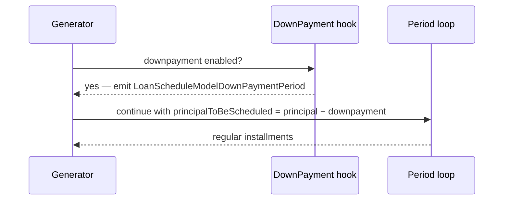

The classic Apache Fineract schedule engine lives in `fineract-loan` under `org.apache.fineract.portfolio.loanaccount.loanschedule.domain`. Two concrete generators extend `AbstractCumulativeLoanScheduleGenerator`: `CumulativeDecliningBalanceInterestLoanScheduleGenerator` (declining-balance EMI, by far the most common in microfinance products) and `CumulativeFlatInterestLoanScheduleGenerator` (flat interest, common in legacy MFI portfolios). They are called "cumulative" because each iteration accumulates principal, interest, fees and penalties on a running `LoanScheduleParams` rather than building each row independently.

This page covers the shared `AbstractCumulativeLoanScheduleGenerator` algorithm — the inputs it consumes, the period-by-period loop it runs, and how it interacts with holidays, downpayments and term variations.

## Where it sits

<CardGroup cols={2}>
  <Card title="fineract-loan module" icon="folder">
    `portfolio/loanaccount/loanschedule/domain/AbstractCumulativeLoanScheduleGenerator.java`
  </Card>
  <Card title="Implements" icon="diagram-project">
    `LoanScheduleGenerator` — `generate`, `rescheduleNextInstallments`, `calculatePrepaymentAmount`, `calculateOutstandingAmounts`
  </Card>
  <Card title="Selected by" icon="filter">
    `LoanScheduleGeneratorFactory` based on `InterestMethod` (DECLINING_BALANCE / FLAT) and `LoanScheduleType.CUMULATIVE`
  </Card>
  <Card title="Output" icon="table">
    `LoanScheduleModel` — list of `LoanScheduleModelPeriod` rows persisted as `LoanRepaymentScheduleInstallment`
  </Card>
</CardGroup>

The progressive engine in `fineract-progressive-loan` is the modern alternative; see the [Progressive loan engine](/loan/loan-repayment-schedule) page for the contrast.

## Inputs: LoanApplicationTerms

Every generator call takes a `LoanApplicationTerms` value object that snapshots the loan-product configuration plus per-loan overrides at the moment of generation.

| Field group | Purpose |
| --- | --- |
| `principal`, `currency` | Money to be amortised |
| `interestMethod` | DECLINING_BALANCE or FLAT — chooses the concrete subclass |
| `interestCalculationPeriodMethod` | DAILY or SAME_AS_REPAYMENT_PERIOD — basis for interest accrual |
| `daysInMonthType`, `daysInYearType` | 30 / actual conventions used by `PaymentPeriodsInOneYearCalculator` |
| `repaymentEvery`, `repaymentPeriodFrequencyType` | e.g. every 1 MONTH, every 2 WEEKS |
| `numberOfRepayments` | Term length |
| `amortizationMethod` | EQUAL_INSTALLMENTS or EQUAL_PRINCIPAL |
| `graceOnPrincipal`, `graceOnInterest`, `graceOnInterestCharged` | Grace counters |
| `disbursementDatas` | Multi-disbursement tranche list |
| `loanTermVariations` | Mid-term rate/EMI/due-date changes |
| `downPaymentDetails` | Flag and percentage for tranche downpayments |
| `holidayDetailDTO` | Holiday list, working-days config, reschedule strategy |

`LoanApplicationTerms.assembleFrom(...)` is built in `LoanScheduleAssembler` before the generator is invoked.

## Top-level flow

```mermaid
flowchart TD
  A[generate&#40;mc, terms, charges, holidayDetailDTO&#41;] --> B[Compute last due date<br/>and last-date variation]
  B --> C[Sum chargesDueAtTimeOfDisbursement]
  C --> D[Build LoanScheduleParams<br/>periodStartDate, principal, mc]
  D --> E[Optional downpayment period<br/>at disbursement date]
  E --> F{For each<br/>repayment period}
  F -->|next| G[Apply holiday adjustment]
  G --> H[Compute principal &amp; interest<br/>via concrete subclass]
  H --> I[Apply charges &amp; penalties<br/>for the period]
  I --> J[Accumulate totals,<br/>append LoanScheduleModelPeriod]
  J --> F
  F -->|done| K[Return LoanScheduleModel]
```



The abstract base owns the loop; the subclasses only implement the per-period principal/interest math through hooks like `calculatePrincipalInterestComponentsForPeriod`.

## Interest method hook

```java
protected abstract PrincipalInterest calculatePrincipalInterestComponentsForPeriod(
    PaymentPeriodsInOneYearCalculator calculator,
    double interestCalculationGraceOnRepaymentPeriodFraction,
    Money totalCumulativePrincipal, Money totalCumulativeInterest,
    Money totalInterestDueForLoan, Money cumulatingInterestPaymentDueToGrace,
    Money outstandingBalance, LoanApplicationTerms loanApplicationTerms,
    int periodNumber, MathContext mc, ...);
```

<Tabs>
  <Tab title="Declining balance">
    `CumulativeDecliningBalanceInterestLoanScheduleGenerator` computes interest on the outstanding principal at the start of each period using the per-period rate from `LoanApplicationTerms.periodicInterestRate(...)`. Principal for the period is then `EMI − interest`, where the EMI itself is solved by `FinanicalFunctions.pmt(...)` over the remaining term. Grace on interest and grace on principal are honoured by zeroing the relevant component and shifting it forward.
  </Tab>
  <Tab title="Flat interest">
    `CumulativeFlatInterestLoanScheduleGenerator` computes total interest up-front: `principal × rate × term`, then divides equally across the non-grace periods. Principal is divided equally (EQUAL_PRINCIPAL) or back-solved so each EMI is equal (EQUAL_INSTALLMENTS). Flat schedules ignore changes to the outstanding balance — interest is fixed by the original disbursement.
  </Tab>
</Tabs>

`PaymentPeriodsInOneYearCalculator` converts the nominal annual rate into a per-period rate using the daysInYear / daysInMonth conventions chosen on the product.

## LoanScheduleParams — the running state

The generator never builds a period in isolation; it carries a `LoanScheduleParams` accumulator. Important fields:

| Field | Role |
| --- | --- |
| `periodStartDate`, `actualRepaymentDate` | Where the next period begins / ends |
| `outstandingBalance`, `outstandingBalanceAsPerRest` | Principal for declining-balance interest math |
| `totalCumulativePrincipal`, `totalCumulativeInterest` | Used to detect last-period rounding adjustment |
| `principalToBeScheduled` | Disbursed-to-date for multi-tranche |
| `instalmentNumber` | 1-based counter persisted into the installment row |
| `compoundingDateVariations`, `latePaymentMap` | Inputs to interest recalculation |
| `recalculationDetails` | Transactions replayed for recalculation runs |

`LoanScheduleParams.createLoanScheduleParams(...)` seeds the loop; partial-update paths reuse an existing one when recalculating from a mid-term checkpoint.

## Holidays and working-days

Before each period the generator asks `ScheduledDateGenerator` to adjust the due date through `HolidayDetailDTO`. Three reschedule strategies are honoured via `RepaymentRescheduleType`:

<AccordionGroup>
  <Accordion title="MOVE_TO_NEXT_WORKING_DAY">
    Shift the due date forward until a working day is found. Interest continues to accrue across the holiday.
  </Accordion>
  <Accordion title="MOVE_TO_NEXT_REPAYMENT_MEETING_DATE">
    Shift to the next calendar-driven meeting date (used by joint-liability groups with `CalendarInstance`).
  </Accordion>
  <Accordion title="MOVE_TO_PREVIOUS_WORKING_DAY">
    Bring the due date backwards. The previous period is shortened.
  </Accordion>
</AccordionGroup>

`AdjustedDateDetailsDTO` carries the original and adjusted dates so downstream rounding and interest math can decide whether to compress or extend the accrual window.

## Downpayment periods

When the product enables downpayment, the generator inserts a synthetic `LoanScheduleModelDownPaymentPeriod` on the disbursement date before the normal periods. Its principal is `disbursedAmount × downPaymentPercentage`, interest is zero, and it is flagged so the transaction processor recognises it and does not allocate interest to it.



For multi-disbursement loans each tranche can emit its own downpayment period at the tranche date.

## Multi-disbursement and term variations

`LoanApplicationTerms.getDisbursementDatas()` holds a list of expected tranches. The generator visits them in date order: at each tranche date it increases `outstandingBalance`, adds disbursement charges, and continues the loop. `MultiDisbursementEmiAmountException` and `MultiDisbursementOutstandingAmoutException` guard against EMI / balance mismatches at the end of the schedule.

`LoanTermVariations` are mid-term overrides:

| Variation | Effect |
| --- | --- |
| `INTEREST_RATE` | Change the periodic rate from a given installment |
| `EMI_AMOUNT` | Pin a fixed EMI from a given installment |
| `PRINCIPAL_AMOUNT` | Adjust outstanding principal mid-term |
| `DUE_DATE` | Move a specific installment's due date |
| `GRACE_ON_INTEREST` | Insert additional grace periods |

The generator consumes `LoanTermVariationParams` via `fetchLoanTermDueDateVariationsData` and feeds them into the loop.

## Interest recalculation hook

When the product is configured with interest recalculation, the generator runs in two passes:

<Steps>
  <Step title="First pass — proposed schedule">
    Build a tentative `LoanScheduleModel` ignoring repayments. This becomes the baseline.
  </Step>
  <Step title="Replay transactions">
    `RecalculationDetail` objects (real `LoanTransaction` rows) are walked through the `LoanRepaymentScheduleTransactionProcessor` against the tentative schedule.
  </Step>
  <Step title="Second pass — adjusted schedule">
    For each period, `LoanInterestRecalcualtionAdditionalDetails` records the actual accrued interest after early/late payments; the generator emits the final `LoanScheduleModel` with revised interest figures.
  </Step>
</Steps>

`compoundingDateVariations` and `latePaymentMap` thread the running compounding amounts so that capitalised interest survives across periods.

## Outputs

The model returned from `generate(...)`:

| Object | Meaning |
| --- | --- |
| `LoanScheduleModel.periods` | Ordered list of `LoanScheduleModelPeriod` — disbursement, downpayment, and repayment rows |
| `LoanScheduleModel.totalRepaymentExpected` | Sum of principal + interest + charges across all periods |
| `LoanScheduleModel.totalOutstanding` | Outstanding at generation time |
| `LoanScheduleModel.loanTermInDays` | First-to-last due-date span |

`LoanScheduleAssembler` converts the model to `LoanRepaymentScheduleInstallment` entities; the original model is preserved in `LoanRepaymentScheduleHistory` when a reschedule rewrites the schedule.

## Prepayment and outstanding math

Beyond `generate`, the generator exposes two read-only entry points consumed by the API:

<CardGroup cols={2}>
  <Card title="calculatePrepaymentAmount" icon="calculator">
    Computes the amount needed to settle the loan on an `onDate`. Walks the schedule, accruing interest only up to `onDate`, and returns the cash sum the customer must pay.
  </Card>
  <Card title="calculateOutstandingAmounts" icon="scale-balanced">
    Returns an `OutstandingAmountsDTO` split by principal, interest, fees, penalties — used by the loan summary providers and reporting.
  </Card>
</CardGroup>

Both reuse the same period loop but with `loanTransactionRepository` filtering so accrual stops at the requested date.

## When the cumulative engine is reused

The cumulative engine is still the default for many products, but the progressive engine is now preferred for:

<Note>
Multi-disbursement loans with interest recalculation, advance-payment allocation rules, and loans that need the new emi-rounding-per-installment behaviour. Switch by setting `LoanScheduleType.PROGRESSIVE` on the product.
</Note>

The cumulative generator remains the canonical implementation for FLAT interest and for declining-balance loans where backwards-compatible schedule output is required.

## Subclass responsibilities

The abstract base owns the period loop and most of the persistence-shaping logic. Subclasses customise three small surfaces:

| Hook | Purpose | Declining balance | Flat |
| --- | --- | --- | --- |
| `calculatePrincipalInterestComponentsForPeriod` | Per-period principal &amp; interest split | EMI minus interest on outstanding | Equal slice of pre-computed total |
| `getPrincipalForPeriod` | Override the principal computation if amortisation is EQUAL_PRINCIPAL | divides remaining principal equally | n/a |
| `getInterestForPeriod` | Compute interest for the period from the running outstanding balance | rate × outstanding × periodFraction | total / periods |

Both shipped subclasses are small — the heavy lifting (charge bucketing, holiday adjustment, downpayment emission, term variation application, totals accumulation) is shared in the abstract parent.

## Error conditions

The generator raises specific exceptions when the inputs make a valid schedule impossible:

| Exception | Cause |
| --- | --- |
| `MultiDisbursementEmiAmountException` | Multi-disbursement loan whose tranches do not amortise cleanly to the requested EMI |
| `MultiDisbursementOutstandingAmoutException` | Last installment leaves residual outstanding due to rounding or wrong tranche dates |
| `ScheduleDateException` | Adjusted due dates collide or fall out of range after holiday processing |

These are translated to API errors by `LoanScheduleAssembler` callers; the schedule is never half-persisted.

## Related pages

<CardGroup cols={2}>
  <Card title="Repayment schedule" icon="list-ol" href="/loan/loan-repayment-schedule">
    The installment entity and persistence shape produced here.
  </Card>
  <Card title="Transaction processors" icon="arrow-right-arrow-left" href="/loan/loan-transaction-processors">
    How repayments are split against the periods this generator emits.
  </Card>
  <Card title="Loan product" icon="box" href="/loan/loan-product">
    Where `InterestMethod` and `LoanScheduleType` are configured.
  </Card>
  <Card title="Reschedule" icon="calendar-days" href="/loan/loan-reschedule">
    How term variations feed the generator on approval.
  </Card>
</CardGroup>
