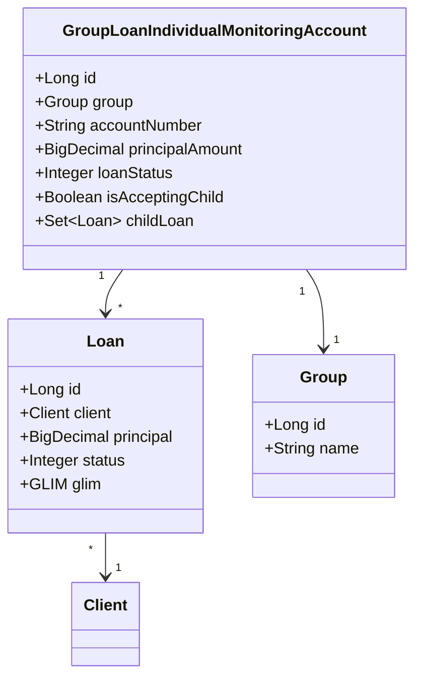
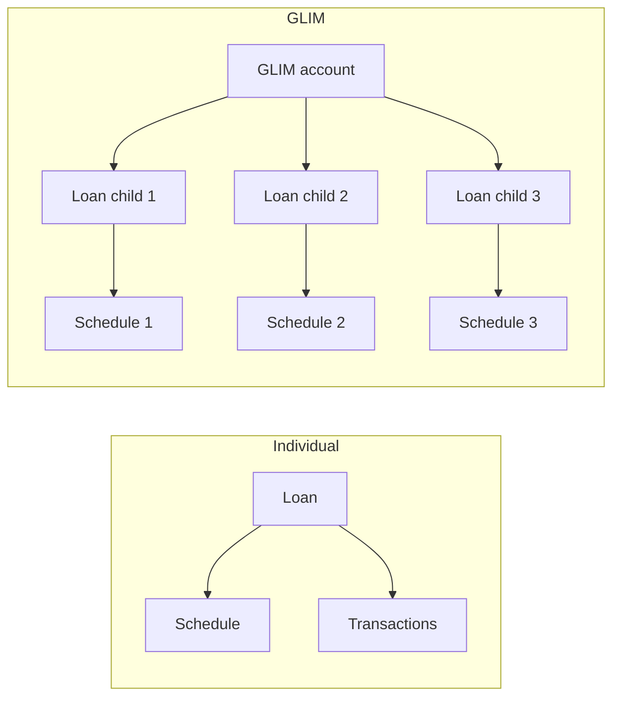

Group Loan Individual Monitoring — GLIM — is the pattern Apache Fineract uses for joint-liability lending where the loan is **legally** held by the group but the system still has to track each member's share of principal, interest and repayments. Money is disbursed, repaid and reported at the group level (one bank wire, one repayment receipt) yet every member sees their own outstanding balance, can be tagged delinquent independently and contributes their slice to the group's bulk repayment.

This page covers the GLIM data model in `fineract-loan`, the split logic for repayments, and the workflow handlers that mirror the regular loan lifecycle.

## Where it lives

<CardGroup cols={2}>
  <Card title="Aggregate entity" icon="users">
    `org.apache.fineract.portfolio.loanaccount.domain.GroupLoanIndividualMonitoringAccount` — the group-level GLIM account, mapped to `glim_accounts`.
  </Card>
  <Card title="Per-member loans" icon="user">
    Each member's share is a regular `Loan` row with `glim_id` set to the GLIM account id. `Loan.glim` is a `@ManyToOne` back-reference.
  </Card>
  <Card title="API & data" icon="code">
    `GroupLoanIndividualMonitoringAccountData` for read DTOs; bulk endpoints under `/loans/glimAccount/{id}` and `/groups/{id}/glimAccounts`.
  </Card>
  <Card title="Handlers" icon="bolt">
    The `GLIMLOAN` entity handlers in `fineract-loan/.../loanaccount/handler/` mirror the per-loan handlers for the bulk flows.
  </Card>
</CardGroup>

## The GLIM account entity

```java
@Entity
@Table(name = "glim_accounts", uniqueConstraints = {
    @UniqueConstraint(columnNames = { "account_number" }, name = "FK_glim_id")
})
public class GroupLoanIndividualMonitoringAccount extends AbstractPersistableCustom<Long> {

    @ManyToOne
    @JoinColumn(name = "group_id", nullable = false)
    private Group group;

    @Column(name = "account_number", nullable = false)
    private String accountNumber;

    @Column(name = "principal_amount")
    private BigDecimal principalAmount;

    @Column(name = "child_accounts_count")
    private Long childAccountsCount;

    @Column(name = "accepting_child")
    private Boolean isAcceptingChild;

    @OneToMany(mappedBy = "glim")
    private Set<Loan> childLoan;

    @Column(name = "loan_status_id", nullable = false)
    private Integer loanStatus;

    @Column(name = "application_id", nullable = true)
    private BigDecimal applicationId;
}
```

| Column | Meaning |
| --- | --- |
| `group_id` | The joint-liability group this account belongs to |
| `account_number` | External-facing account number — what the bank wire references |
| `principal_amount` | Sum of children's principal (the umbrella amount) |
| `child_accounts_count` | Number of `Loan` rows linked through `glim_id` |
| `accepting_child` | When true, new applications can still be attached to this GLIM |
| `loan_status_id` | Aggregate status (Submitted, Approved, Active, Closed, Rejected) |
| `application_id` | Logical application identifier when several GLIM accounts share a flow |

## Relationship to Loan

A GLIM is an aggregate over its children: each member's share is a fully-featured `Loan` row with its own schedule, transactions, charges and summary. The link is the `glim_id` FK on `m_loan`. The same `Loan` machinery — schedule generation, transaction processors, accrual jobs, delinquency tagging — keeps working unchanged on child loans, which is why GLIM did not require parallel implementations.



Each child `Loan` is bound to a specific `Client` — the member of the group — so per-member tracking is the natural consequence of the model.

## Bulk lifecycle handlers

The `GLIMLOAN` entity wraps five group-level operations. Each handler fans out to the per-child handler and ensures the aggregate stays consistent.

| Action | Handler |
| --- | --- |
| `APPROVE` | `GLIMLoanApplicationApprovalCommandHandler` |
| `REJECT` | `GLIMApplicationRejectionCommandHandler` |
| `DISBURSE` | `GlimLoanApplicationDisburseCommandHandler` |
| `UNDODISBURSAL` | `UndoGLIMLoanDisbursalCommandHandler` |
| `REPAYMENT` | `GLIMBulkRepaymentCommandHandler` |

A single API call to one of these endpoints will:

<Steps>
  <Step title="Validate the aggregate state">
    Confirm the GLIM account is in a status that allows the action (e.g. you can only disburse an approved GLIM).
  </Step>
  <Step title="Iterate children">
    Walk `childLoan` and apply the per-loan equivalent (`LoanApplicationApprovalCommandHandler`, `DisburseLoanCommandHandler`, `LoanRepaymentCommandHandler` etc.).
  </Step>
  <Step title="Recompute the aggregate">
    Refresh `principal_amount`, `child_accounts_count`, `loan_status_id` and `accepting_child` based on the child set.
  </Step>
  <Step title="Emit one rollup event">
    Raise a GLIM-level business event in addition to the per-child events so listeners can observe at the granularity they need.
  </Step>
</Steps>

## Bulk repayment split logic

The heart of GLIM is bulk repayment. The group hands over one payment that has to be allocated across members.

```mermaid
flowchart TD
  A[POST /loans/glimAccount/{id}/repayments<br/>amount = X] --> B[Validate request]
  B --> C{Caller supplied<br/>per-member split?}
  C -->|yes| D[Use supplied amounts]
  C -->|no| E[Pro-rate X across<br/>outstanding child principals]
  D --> F[For each child]
  E --> F
  F --> G[LoanRepaymentCommandHandler<br/>per child amount]
  G --> H[Update child schedule via<br/>transaction processor]
  H --> I[Recompute child summary]
  I --> J[Aggregate to GLIM summary]
```

Two split modes are supported in the API payload:

<Tabs>
  <Tab title="Explicit split">
    The request carries a per-member list of `{ clientId, transactionAmount }`. The handler sums them, confirms the total equals the parent amount, and posts one `REPAYMENT` per member through the regular processor.
  </Tab>
  <Tab title="Pro-rata split">
    The request carries only the total. The handler walks `childLoan`, sums outstanding principal, and allocates each member a share proportional to their outstanding. Rounding residual goes to the largest-outstanding member.
  </Tab>
</Tabs>

Because each child repayment runs through `LoanRepaymentScheduleTransactionProcessor`, all the per-loan rules — fee/penalty/interest/principal ordering, overpayment handling, delinquency clearance — apply independently to each member.

## Disbursement

A GLIM disbursement allocates the loan amount across children at the same time. Each child receives the principal recorded on its `Loan` row, schedules its installments, and posts its own `DISBURSEMENT` transaction. From an accounting perspective the journal entries are the sum of the per-child entries; from a banking perspective the disbursement is one transfer to the group account.

<Info>
GLIM supports both cash disbursement and disbursement to a linked savings account (`disburseToSavings` flag). When disbursing to savings, each child's portion still posts as a separate `LoanTransfer` so per-member reporting stays clean.
</Info>

## Approval rules

The bulk approval flow has a subtlety: approving the GLIM is not the same as approving every child. The approval handler:

- Confirms the parent application is in `Submitted` state.
- Approves each child `Loan` that is itself in `Submitted` state.
- Skips children that were already approved individually or rejected.
- Sets the GLIM `loanStatus` to `Approved` only when at least one child is approved; otherwise the parent stays in its prior state.

Rejection is the mirror: the handler can reject the GLIM as a whole or, with a payload that flags specific clients, reject only those children while leaving the rest pending.

## Reading GLIM accounts

`GroupLoanIndividualMonitoringAccountData` is the read DTO returned by the API. Typical fields:

| DTO field | Source |
| --- | --- |
| `id`, `accountNumber` | Aggregate identity |
| `groupId`, `groupName` | The owning group |
| `principalAmount` | Aggregate principal (sum of children) |
| `childAccountsCount` | `childLoan.size()` at read time |
| `loanStatus` | Aggregate status |
| `isAcceptingChild` | Whether new member shares can join |
| `clientMembers` | List of `{ clientId, loanId, principal, outstanding }` for each child |

The `/glimAccount/{id}` endpoint hydrates the children eagerly so the UI can render the per-member table without a second round trip.

## Closure

A GLIM account closes when every child loan closes (paid in full, written off, or rescheduled into a different product). The aggregator updates `loan_status_id` to `Closed` once all children are terminal; `is_accepting_child` is forced false to prevent further additions.

<Warning>
A child can be written off independently while the GLIM stays Active. In that case the written-off amount stops accruing but stays visible in the GLIM totals so the group's joint-liability picture is preserved.
</Warning>

## Why GLIM exists separately



GLIM is the **only** aggregate layer Fineract puts on top of plain loans. Group savings, group fixed deposits and joint-liability groups otherwise just use the regular per-client products; GLIM is needed because the loan in a joint-liability group is contractually one loan but must be tracked per-member for delinquency, savings, and collections.

## Reporting considerations

Most loan reports come in three flavours when GLIM is in scope:

| Report angle | Where to read |
| --- | --- |
| Aggregate / group view | `m_glim_accounts` joined to `m_loan` for totals; one row per GLIM account |
| Per-member view | `m_loan` filtered by `glim_id IS NOT NULL`; one row per member |
| Mixed portfolio view | Union of GLIM children and standalone loans (most PAR and arrears reports) |

The standard arrears, delinquency and PAR jobs already operate on child loans, so a delinquent member shows up in the same reports as a delinquent standalone loan — no GLIM-specific report is needed for these.

## Related pages

<CardGroup cols={2}>
  <Card title="Handlers catalogue" icon="bolt" href="/loan/loan-handlers">
    The GLIMLOAN entity row that lists all five bulk handlers.
  </Card>
  <Card title="Domain model" icon="diagram-project" href="/loan/loan-domain-model">
    Where the `glim_id` FK on `Loan` is documented in the ERD.
  </Card>
  <Card title="Transactions" icon="receipt" href="/loan/loan-transactions">
    The per-child REPAYMENT and DISBURSEMENT rows that bulk operations produce.
  </Card>
  <Card title="Application lifecycle" icon="route" href="/loan/loan-application-lifecycle">
    The per-loan state machine that each child still goes through.
  </Card>
</CardGroup>
