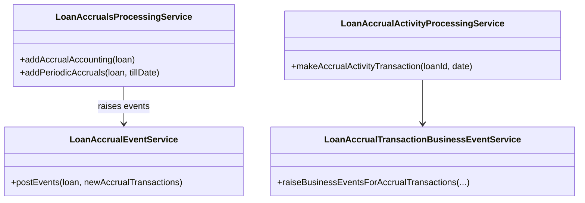
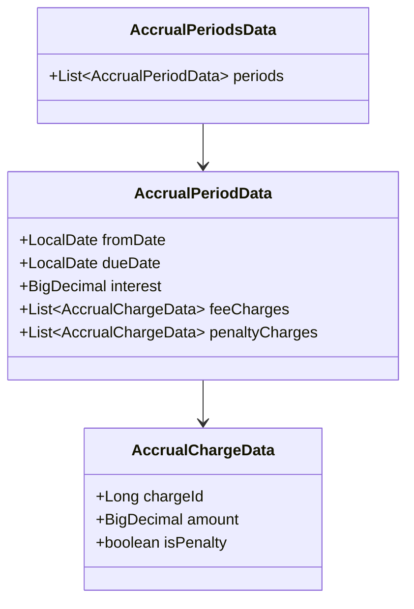
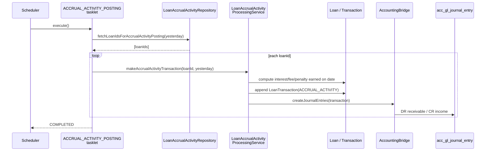

Apache Fineract recognises income on loans on an **accrual basis** by writing dedicated `LoanTransaction` rows of types `ACCRUAL` and `ACCRUAL_ACTIVITY` into `m_loan_transaction`. Each such row says: *"as of this business date, this much interest / fee / penalty has economically been earned on this loan, regardless of whether the borrower has paid it yet"*. The accounting bridge then translates these rows into general-ledger journal entries against the configured income and receivable accounts.

This page documents:

- the two flavours of accrual transaction (`ACCRUAL` and `ACCRUAL_ACTIVITY`),
- the services that compute and post them,
- the four scheduled jobs that drive periodic accruals,
- how the accounting bridge turns the transactions into journal entries.

## The two accrual transaction types

Both live in `LoanTransactionType`:

| `LoanTransactionType` | What it represents |
|-----------------------|--------------------|
| `ACCRUAL` | A single accrual event for an installment period — interest + fee + penalty that *belongs to that period*. Posted by `ADD_ACCRUAL_TRANSACTIONS` and `ADD_PERIODIC_ACCRUAL_TRANSACTIONS`. |
| `ACCRUAL_ACTIVITY` | A daily "what-accrued-yesterday" rollup for a loan — used by the newer per-day accrual model. Posted by `ACCRUAL_ACTIVITY_POSTING`. |

Each `LoanTransaction` row has dedicated columns for the interest, fee, and penalty portion (`interest_portion_derived`, `fee_charges_portion_derived`, `penalty_charges_portion_derived`). The principal portion is always zero on an accrual transaction — accrual does not move cash.

## The processing services



Two services do the work:

- **`LoanAccrualsProcessingService`** (implementation `LoanAccrualsProcessingServiceImpl`) — the original *period-based* accrual: it walks the repayment schedule and creates one `ACCRUAL` transaction per installment period up to a target date.
- **`LoanAccrualActivityProcessingService`** (implementation `LoanAccrualActivityProcessingServiceImpl`) — the newer *daily* accrual: each business day it computes how much was earned on the previous day and writes a single `ACCRUAL_ACTIVITY` transaction.

The two are not mutually exclusive — most installations use period-based accrual for interest and the daily ACCRUAL_ACTIVITY for income smoothing in IFRS-9 effective-interest models.

## The four scheduled jobs

Four loan-side batch jobs drive accruals. All live under `org.apache.fineract.portfolio.loanaccount.jobs.*`:

| Job (`JobName`) | Config / Tasklet | What it posts |
|-----------------|------------------|---------------|
| `ADD_ACCRUAL_ENTRIES` | `AddAccrualEntriesConfig` / `AddAccrualEntriesTasklet` | `ACCRUAL` transactions for installments whose due date has passed but have not yet been accrued |
| `ADD_PERIODIC_ACCRUAL_ENTRIES` | `AddPeriodicAccrualEntriesConfig` / `AddPeriodicAccrualEntriesTasklet` | `ACCRUAL` transactions on a periodic boundary (commonly month-end), based on the loan schedule |
| `ADD_PERIODIC_ACCRUAL_ENTRIES_FOR_LOANS_WITH_INCOME_POSTED_AS_TRANSACTIONS` | `AddPeriodicAccrualEntriesForLoansConfig` / `Tasklet` | Same as above but only for loans whose product has the "post income as transactions" flag |
| `ACCRUAL_ACTIVITY_POSTING` | `AccrualActivityPostingConfig` / `AccrualActivityPostingTasklet` | One `ACCRUAL_ACTIVITY` rollup per loan per business day |

### `AccrualActivityPostingTasklet` in detail

```java fineract-provider/.../jobs/accrualactivityposting/AccrualActivityPostingTasklet.java
@Component
public class AccrualActivityPostingTasklet implements Tasklet {

    private final LoanAccrualActivityProcessingService loanAccrualActivityProcessingService;
    private final LoanAccrualActivityRepository loanAccrualActivityRepository;

    @Override
    public RepeatStatus execute(StepContribution contribution, ChunkContext chunkContext) {
        final LocalDate yesterday = DateUtils.getBusinessLocalDate().minusDays(1);
        List<Throwable> errors = new ArrayList<>();
        Set<Long> loanAccounts = loanAccrualActivityRepository
            .fetchLoanIdsForAccrualActivityPosting(
                yesterday, LoanTransactionType.ACCRUAL_ACTIVITY, LoanStatus.ACTIVE);
        for (Long accountId : loanAccounts) {
            try {
                loanAccrualActivityProcessingService
                    .makeAccrualActivityTransaction(accountId, yesterday);
            } catch (Exception e) {
                log.error("Failed to add accrual activity transaction for loan {}", accountId, e);
                errors.add(e);
            }
        }
        if (!errors.isEmpty()) {
            throw new JobExecutionException(errors);
        }
        return RepeatStatus.FINISHED;
    }
}
```

Note how the repository **selects only loans without an ACCRUAL_ACTIVITY for yesterday** — the job is naturally idempotent.

## Data shapes

`AccrualPeriodData` and `AccrualPeriodsData` (in `org.apache.fineract.portfolio.loanaccount.data`) hold the per-period inputs to the calculation: start, end, principal-balance, applicable interest rate, fee accruals, penalty accruals. `AccrualChargeData` describes one charge accrued within a period.



The processing service is fed an `AccrualPeriodsData` for each loan, iterates the unaccrued periods, and emits one `LoanTransaction` of type `ACCRUAL` per period.

## The accounting bridge

`LoanTransaction(ACCRUAL)` rows do not move money in `m_savings_account_transaction` or anywhere else — they exist to drive journal entries. The bridge is the standard loan accounting service which, for each new transaction, looks up the loan product's account mappings and posts to `acc_gl_journal_entry`:

| `LoanTransactionType` | Debit | Credit |
|-----------------------|-------|--------|
| `ACCRUAL` (interest portion) | Interest Receivable | Interest Income |
| `ACCRUAL` (fee portion) | Fee Receivable | Fee Income |
| `ACCRUAL` (penalty portion) | Penalty Receivable | Penalty Income |
| `ACCRUAL_ACTIVITY` | (configurable per product, usually same as ACCRUAL) | (configurable) |

The accounts are picked from `acc_product_mapping` for the loan product. When the borrower later pays, the corresponding `REPAYMENT` transaction debits cash and credits the receivable accounts — the receivable balance falls to zero by the time the loan is fully repaid.

## Charge-off / reversal interaction

Once a loan is **charged off** (see [/loan/loan-charge-off](/loan/loan-transactions)), the periodic accrual jobs *stop* writing new accruals for that loan. The accrual posting service explicitly checks `loan.isChargedOff()` and skips charged-off accounts unless the product is configured to accrue post-charge-off as memo entries. Reversing a charge-off (`UNDO_CHARGE_OFF`) re-enables accrual.

`ACCRUAL` and `ACCRUAL_ACTIVITY` transactions are **reversible** like any other `LoanTransaction`: their `reversed` flag is set and the journal entries are offset. The accrual jobs detect a reversed accrual and re-post the period on the next run.

## Events and downstream

`LoanAccrualEventService` and `LoanAccrualTransactionBusinessEventService` raise:

- `LoanAccrualTransactionCreatedBusinessEvent` for each `ACCRUAL` row,
- `LoanAccrualAdjustmentTransactionBusinessEvent` for replays / corrections,
- `LoanAccrualActivityTransactionCreatedBusinessEvent` for `ACCRUAL_ACTIVITY` rows.

These let external income-recognition or sub-ledger systems mirror Fineract's accrual decisions without polling the transaction table.

## End-to-end sequence



## Operational considerations

- **Run order matters**: the daily Loan COB ([/cob/loan-cob-job](/cob/loan-cob-job)) must finish before `ACCRUAL_ACTIVITY_POSTING` so that any per-day balance changes (charge-off, write-off, COB-applied charges) are accounted for in the rollup.
- **Idempotency**: each loan can have at most one `ACCRUAL_ACTIVITY` transaction per date; the repository's selector prevents duplicates. Period-based `ACCRUAL` transactions use the installment due date as the deduplication key.
- **Catch-up runs**: if a job is missed for several days, the next run posts accruals for every uncovered period until current; nothing is lost.
- **Reversal of repayments**: when a repayment is reversed (`LoanAdjustTransactionBusinessEvent`), accruals stay in place but the receivable balance grows back up — which is exactly the desired GL effect.

<Note>
Despite the similar names, `LoanAccrualsProcessingService` (period-based) and `LoanAccrualActivityProcessingService` (daily) are distinct components and can both be enabled at the same time. The product config decides which transactions a particular loan receives.
</Note>

## Summary

Apache Fineract's accrual subsystem is a small set of jobs and services that translate "the schedule says this much interest should have been earned by *date*" into concrete `LoanTransaction` rows of type `ACCRUAL` or `ACCRUAL_ACTIVITY`. The accounting bridge then forwards those rows into the general ledger. Because the calculation is event- and date-driven and the writers are idempotent, the same code paths work for first-time post, catch-up, reversal, and reposting after a charge-off undo.
