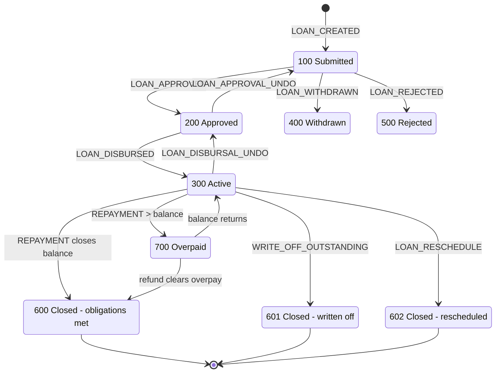
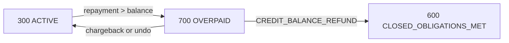

Every loan in Apache Fineract walks the same state machine: an application starts in `SUBMITTED_AND_PENDING_APPROVAL`, gets `APPROVED`, becomes `ACTIVE` after disbursement, and eventually closes (paid off, written off, rescheduled, or withdrawn). The `LoanLifecycleStateMachine` interface in `fineract-loan` is the contract every transition goes through, with a default Spring implementation choosing the next status from a `LoanEvent` enum.

## The status enum

Lives in `fineract-core` at `org.apache.fineract.portfolio.loanaccount.domain.LoanStatus`:

```java
public enum LoanStatus {
    INVALID(0,                                    "loanStatusType.invalid"),
    SUBMITTED_AND_PENDING_APPROVAL(100,           "loanStatusType.submitted.and.pending.approval"),
    APPROVED(200,                                 "loanStatusType.approved"),
    ACTIVE(300,                                   "loanStatusType.active"),
    TRANSFER_IN_PROGRESS(303,                     "loanStatusType.transfer.in.progress"),
    TRANSFER_ON_HOLD(304,                         "loanStatusType.transfer.on.hold"),
    WITHDRAWN_BY_CLIENT(400,                      "loanStatusType.withdrawn.by.client"),
    REJECTED(500,                                 "loanStatusType.rejected"),
    CLOSED_OBLIGATIONS_MET(600,                   "loanStatusType.closed.obligations.met"),
    CLOSED_WRITTEN_OFF(601,                       "loanStatusType.closed.written.off"),
    CLOSED_RESCHEDULE_OUTSTANDING_AMOUNT(602,     "loanStatusType.closed.reschedule.outstanding.amount"),
    OVERPAID(700,                                 "loanStatusType.overpaid");
}
```

### Status code reference

| Code | Constant | Description |
| --- | --- | --- |
| 100 | `SUBMITTED_AND_PENDING_APPROVAL` | Application created, awaiting reviewer |
| 200 | `APPROVED` | Approved, not yet disbursed |
| 300 | `ACTIVE` | Disbursed and accruing |
| 303 | `TRANSFER_IN_PROGRESS` | Branch-to-branch transfer initiated |
| 304 | `TRANSFER_ON_HOLD` | Awaiting destination office accept |
| 400 | `WITHDRAWN_BY_CLIENT` | Withdrawn before disbursement |
| 500 | `REJECTED` | Rejected by approver |
| 600 | `CLOSED_OBLIGATIONS_MET` | Paid off in full |
| 601 | `CLOSED_WRITTEN_OFF` | Written off |
| 602 | `CLOSED_RESCHEDULE_OUTSTANDING_AMOUNT` | Closed because rescheduled into a new loan |
| 700 | `OVERPAID` | Payments exceeded balance, awaiting refund |

<Warning>
  Note the gap: `ACTIVE` is **300**, not 200. The historical convention
  uses 100-multiples to distinguish application stages from operational
  stages.
</Warning>

## The state machine contract

```java
public interface LoanLifecycleStateMachine {

    LoanStatus dryTransition(LoanEvent loanEvent, Loan loan);

    void transition(LoanEvent loanEvent, Loan loan);

    /**
     * Determines the appropriate loan status based on the loan's current
     * financial condition. Designed to be called at the end of processing.
     *
     * For example overpaid → CLOSED_OBLIGATIONS_MET if overpayment is now
     * zero, or back to ACTIVE if there is still outstanding balance.
     */
    void determineAndTransition(Loan loan, LocalDate transactionDate);
}
```

The `dryTransition` flavour returns the *would-be* status without mutating the loan — useful for previews and validation. The `transition` flavour applies the change, records `LoanStatusChangeHistory`, and publishes a business event so listeners (accounting, notifications, COB) can react.

## LoanEvent triggers

`LoanEvent` enumerates the verbs the state machine understands. Representative entries:

| Event | From → To |
| --- | --- |
| `LOAN_CREATED` | `INVALID → SUBMITTED_AND_PENDING_APPROVAL` |
| `LOAN_APPROVED` | `100 → 200` |
| `LOAN_APPROVAL_UNDO` | `200 → 100` |
| `LOAN_REJECTED` | `100 → 500` |
| `LOAN_WITHDRAWN` | `100|200 → 400` |
| `LOAN_DISBURSED` | `200 → 300` |
| `LOAN_DISBURSAL_UNDO` | `300 → 200` |
| `REPAYMENT_OR_WAIVER` | may set `300 → 600` or `300 → 700` |
| `LOAN_CHARGE_PAYMENT` | `300 → 300/600` |
| `WRITE_OFF_OUTSTANDING` | `300 → 601` |
| `LOAN_RESCHEDULE` | `300 → 602` |

## Lifecycle overview



## Submit → approve → disburse path

<Steps>
  <Step title="Submit application">
    The REST resource `LoansApiResource` parses the JSON, validates it
    against `LoanApplicationCommandFromApiJsonHelper`, and calls
    `LoanApplicationWritePlatformService.submitApplication(...)`. The
    service builds a fresh `Loan`, snapshots product details into the
    embedded `LoanProductRelatedDetail`, sets status 100, and persists.
  </Step>
  <Step title="Approve">
    `LoanWritePlatformService.approveApplication(...)` resolves the
    loan via `LoanRepositoryWrapper`, validates approval date and
    approved-amount (potentially over-applied), then calls
    `stateMachine.transition(LOAN_APPROVED, loan)`. The loan's
    `approvedOnDate`, `approvedPrincipal`, and approver fields are set
    inside the mutator.
  </Step>
  <Step title="Disburse">
    `LoanWritePlatformService.disburseLoan(...)` creates a
    `DISBURSEMENT` transaction (type 1) against the configured payment
    detail, posts the journal entries via `JournalEntryWritePlatformService`,
    asks the schedule generator to regenerate the schedule from the
    actual disbursement date, then transitions to status 300 (`ACTIVE`).
  </Step>
  <Step title="Accrue and repay">
    Daily COB jobs append `ACCRUAL` (10) transactions; users post
    `REPAYMENT` (2) transactions which the transaction processor splits
    across installments.
  </Step>
  <Step title="Close">
    When the outstanding principal+interest+fees+penalties hit zero,
    `determineAndTransition` flips to `CLOSED_OBLIGATIONS_MET` (600).
  </Step>
</Steps>

## Withdrawal and rejection

Pre-disbursement the application can be withdrawn by the client (status 400) or rejected by the approver (status 500). Both terminal states record dates and user references on the `Loan` row and are no-go for any further transactions.

<Info>
  `WITHDRAWN_BY_CLIENT` and `REJECTED` are reachable *only* from
  `SUBMITTED_AND_PENDING_APPROVAL` or `APPROVED`. Once a loan is
  `ACTIVE`, withdrawal is no longer valid — the equivalent action is a
  full refund + close-as-rescheduled or write-off.
</Info>

## OVERPAID branch

`OVERPAID` (700) is special: it is not a terminal state. After a credit-balance refund clears the overpayment, `determineAndTransition` rewinds to `CLOSED_OBLIGATIONS_MET`; if a chargeback brings the balance positive again it returns to `ACTIVE`.



## Transfer states

`TRANSFER_IN_PROGRESS` (303) and `TRANSFER_ON_HOLD` (304) are entered when a loan is moved between offices. Until the destination office accepts the transfer no new operational transactions are allowed; the wrapper's `NON_CLOSED_LOAN_STATUSES` constant lists both so locking and search queries treat them as still-open.

## History trail

Every successful transition writes a row to `m_loan_status_change_history`:

```java
@Entity
@Table(name = "m_loan_status_change_history")
public class LoanStatusChangeHistory ... {
    @ManyToOne private Loan loan;
    @Enumerated(EnumType.STRING) private LoanStatus status;
    private LocalDate businessDate;
}
```

This gives auditors a chronological list independent of the timestamp columns on `Loan` itself, which only retain the most recent transition date per kind.

## Events published

<Accordion title="Business events fired by the state machine">
  - `LoanCreatedBusinessEvent`
  - `LoanApprovedBusinessEvent` / `LoanUndoApprovalBusinessEvent`
  - `LoanRejectedBusinessEvent`
  - `LoanWithdrawnByApplicantBusinessEvent`
  - `LoanDisbursalBusinessEvent` / `LoanUndoDisbursalBusinessEvent`
  - `LoanCloseBusinessEvent` / `LoanCloseAsRescheduleBusinessEvent`
  - `LoanWrittenOffBusinessEvent`
  - `LoanReassignBusinessEvent` (loan officer)
  - `LoanStatusChangedBusinessEvent` (catch-all)
</Accordion>

Listeners use these for external messaging, accounting reposts, and notification delivery.

## Related pages

<CardGroup cols={2}>
  <Card title="Loan model" icon="cube" href="/loan/loan-domain-model">
    The fields the state machine mutates.
  </Card>
  <Card title="Transactions" icon="receipt" href="/loan/loan-transactions">
    What gets appended on each transition.
  </Card>
  <Card title="Disbursement" icon="arrow-up" href="/loan/loan-disbursement">
    The detailed disburse path.
  </Card>
  <Card title="Reschedule" icon="rotate" href="/loan/loan-reschedule">
    The 602 close-as-rescheduled flow.
  </Card>
</CardGroup>
