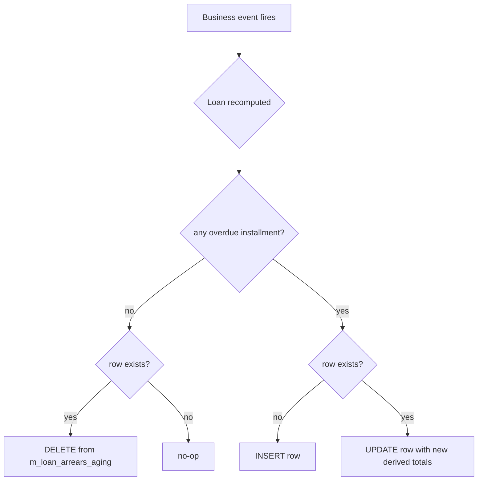
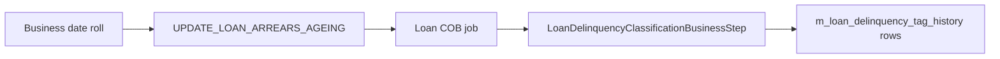

`m_loan_arrears_aging` is Apache Fineract's pre-aggregated **arrears summary table**: one row per loan with the total principal, interest, fee, and penalty overdue, plus the date of the earliest unpaid installment. Reports and the loan list screen do not recompute arrears on every page load — they read this table directly. Keeping it in sync with reality is the job of `LoanArrearsAgingService` and the nightly `UPDATE_LOAN_ARREARS_AGEING` batch.

This page documents:

- the shape of `m_loan_arrears_aging` and the matching `LoanArrearsAgingData` DTO,
- the full-table nightly refresh job,
- the **event-driven incremental updates** triggered by repayments, charge waivers, write-offs and disbursals,
- how arrears feed the delinquency-bucket / NPA classification described in [/loan/loan-delinquency](/loan/loan-delinquency).

## The `m_loan_arrears_aging` table

The arrears summary stores derived aggregates only — it is a *projection*, never the source of truth.

| Column | Meaning |
|--------|---------|
| `loan_id` | PK / FK to `m_loan` |
| `principal_overdue_derived` | Sum of principal portion of every installment whose due date is on or before today and that is unpaid |
| `interest_overdue_derived` | Same for interest |
| `fee_charges_overdue_derived` | Same for fee charges |
| `penalty_charges_overdue_derived` | Same for penalty charges |
| `total_overdue_derived` | Sum of the four columns above |
| `overdue_since_date_derived` | Due date of the **earliest** unpaid installment — defines the loan's "days past due" |

A loan with **zero overdue installments has no row** in this table. The "arrears" view is exactly the set of loans currently present.

## The `LoanArrearsAgingData` DTO

The same shape is exposed through reports and the read-platform service as `LoanArrearsAgingData`. The DTO is hydrated either by `SELECT *` from the table (the cheap path) or by recomputation on the fly when a single loan's view needs to be precise.

## Full-table refresh: UPDATE_LOAN_ARREARS_AGEING

The nightly job lives in `fineract-loan/.../jobs/updateloanarrearsageing/`:

```java fineract-loan/src/main/java/org/apache/fineract/portfolio/loanaccount/jobs/updateloanarrearsageing/UpdateLoanArrearsAgeingConfig.java
@Configuration
@RequiredArgsConstructor
public class UpdateLoanArrearsAgeingConfig {

    private final JobRepository jobRepository;
    private final PlatformTransactionManager transactionManager;
    private final LoanArrearsAgeingUpdateHandler updateLoanArrearsAgingService;

    @Bean
    public Job updateLoanArrearsAgeingJob() {
        return new JobBuilder(JobName.UPDATE_LOAN_ARREARS_AGEING.name(), jobRepository)
            .incrementer(new RunIdIncrementer())
            .start(updateLoanArrearsAgeingStep())
            .build();
    }

    @Bean
    public Step updateLoanArrearsAgeingStep() {
        return new StepBuilder(...)
            .tasklet(new UpdateLoanArrearsAgeingTasklet(updateLoanArrearsAgingService),
                     transactionManager).build();
    }
}
```

The tasklet does one thing — call the handler:

```java fineract-loan/.../UpdateLoanArrearsAgeingTasklet.java
public class UpdateLoanArrearsAgeingTasklet implements Tasklet {

    private final LoanArrearsAgeingUpdateHandler loanArrearsAgeingUpdateHandler;

    @Override
    public RepeatStatus execute(StepContribution contribution, ChunkContext chunkContext) {
        loanArrearsAgeingUpdateHandler.updateLoanArrearsAgeingDetailsForAllLoans();
        return RepeatStatus.FINISHED;
    }
}
```

`updateLoanArrearsAgeingDetailsForAllLoans()` is a SQL-heavy routine. The legacy implementation (`LoanArrearsAgingServiceImpl`) does it in three passes:

1. `DELETE FROM m_loan_arrears_aging` — clear the table.
2. Run a wide aggregate `INSERT … SELECT` over `m_loan_repayment_schedule` joined to `m_loan` that produces one row per loan with any unpaid installment whose due date `<=` today.
3. `UPDATE` re-derived columns where partial payments have shifted the unpaid portion.

The exact SQL is assembled in `createInsertStatements(...)`:

```java
insertStatementBuilder.append(
    "INSERT INTO m_loan_arrears_aging(loan_id,principal_overdue_derived,interest_overdue_derived,")
    .append(/* fee_charges_overdue_derived, penalty_charges_overdue_derived, total_overdue_derived,
              overdue_since_date_derived */);
```

A separate `UPDATE m_loan_arrears_aging SET principal_overdue_derived=…` statement fixes loans whose original-schedule view differs from the current schedule (when a reschedule has been applied).

### Why a full refresh?

Even with event-driven incremental updates, a nightly full refresh exists to:

- catch **time-based** transitions — yesterday's "due tomorrow" is today's "due today" — that no business event fires for;
- repair any divergence caused by manual SQL fixes, restores, or skipped events;
- guarantee that reports run against a deterministic snapshot taken at the start of each business day.

## Event-driven incremental updates

`LoanArrearsAgingServiceImpl` registers as a listener for almost every transaction that changes a loan's outstanding balance:

```java fineract-loan/.../LoanArrearsAgingServiceImpl.java
public void registerForNotification() {
    businessEventNotifierService.addPostBusinessEventListener(
        LoanRefundPostBusinessEvent.class, new RefundEventListener());
    businessEventNotifierService.addPostBusinessEventListener(
        LoanAdjustTransactionBusinessEvent.class, ...);
    businessEventNotifierService.addPostBusinessEventListener(
        LoanTransactionMakeRepaymentPostBusinessEvent.class, ...);
    businessEventNotifierService.addPostBusinessEventListener(
        LoanTransactionGoodwillCreditPostBusinessEvent.class, ...);
    businessEventNotifierService.addPostBusinessEventListener(
        LoanTransactionPayoutRefundPostBusinessEvent.class, ...);
    businessEventNotifierService.addPostBusinessEventListener(
        LoanUndoWrittenOffBusinessEvent.class, new UndoWrittenOffEventListener());
    businessEventNotifierService.addPostBusinessEventListener(
        LoanWaiveInterestBusinessEvent.class, new WaiveInterestEventListener());
    businessEventNotifierService.addPostBusinessEventListener(
        LoanAddChargeBusinessEvent.class, new AddChargeEventListener());
    businessEventNotifierService.addPostBusinessEventListener(
        LoanWaiveChargeBusinessEvent.class, new WaiveChargeEventListener());
    businessEventNotifierService.addPostBusinessEventListener(
        LoanChargePaymentPostBusinessEvent.class, ...);
    businessEventNotifierService.addPostBusinessEventListener(
        LoanApplyOverdueChargeBusinessEvent.class, ...);
    businessEventNotifierService.addPostBusinessEventListener(
        LoanDisbursalBusinessEvent.class, new DisbursementEventListener());
    businessEventNotifierService.addPostBusinessEventListener(
        LoanForeClosurePostBusinessEvent.class, ...);
    businessEventNotifierService.addPostBusinessEventListener(
        LoanBalanceChangedBusinessEvent.class, ...);
}
```

Each listener funnels into `updateLoanArrearsAgeingDetails(Loan loan)`:

```java
public void updateLoanArrearsAgeingDetails(final Loan loan) {
    int count = jdbcTemplate.queryForObject(
        "select count(mla.loan_id) from m_loan_arrears_aging mla where mla.loan_id =?",
        Integer.class, loan.getId());
    // ...
    if (loanHasNoArrearsNow()) {
        jdbcTemplate.update("DELETE FROM m_loan_arrears_aging WHERE loan_id=?", loan.getId());
    } else {
        // INSERT or UPDATE the row using calculateArrearsForLoan(loan)
    }
}
```

The decision tree:



This means the arrears table is *eventually consistent within one transaction* of any user action that affects overdue balances — there is no lag waiting for the nightly job.

### Original-schedule variant

For loans that use **original-schedule arrears** (a config flag), Fineract calls `updateLoanArrearsAgeingDetailsWithOriginalSchedule(Loan loan)` instead, which computes overdue against the schedule as it stood at disbursal — not the current rescheduled version. This is required by some regulators that treat reschedules as forbearance and disallow them from "resetting the clock".

## Per-loan calculation

The core math is in `calculateArrearsForLoan(Loan loan)`:

1. Iterate `loan.getRepaymentScheduleInstallments()`.
2. For each installment whose `dueDate <= businessLocalDate`:
   - sum `principalOutstanding`, `interestOutstanding`, `feeChargesOutstanding`, `penaltyChargesOutstanding`.
3. `overdueSinceDate = MIN(dueDate of installments contributing to overdue)`.

The `LoanArrearsData` returned holds these four sums plus the earliest due date, ready to be flattened into a row.

## Relationship to delinquency classification

`m_loan_arrears_aging` answers **"how much is overdue, since when?"**. The delinquency subsystem answers **"what bucket / range does that put the loan in?"** by reading the same `overdue_since_date_derived` value and mapping the resulting days-past-due to a `DelinquencyRange`. See [/loan/loan-delinquency](/loan/loan-delinquency).

The two are run in **separate steps** of the daily Loan COB chain ([/cob/loan-cob-job](/cob/loan-cob-job)):



`m_loan_arrears_aging` is read by the delinquency classification step to decide which loans need re-bucketing.

## Operational notes

- **Idempotent**: the full refresh job clears and rebuilds; re-running it produces the same result.
- **Locks**: the `DELETE … / INSERT …` pattern can lock `m_loan_arrears_aging` briefly; in busy tenants this is acceptable because the table is small (only loans with arrears appear).
- **Performance**: the per-loan listener path runs in the same transaction as the originating transaction. A misbehaving event (e.g. a slow loan recompute) therefore extends repayment latency. Most installations rely on the listeners for correctness and use the nightly job as a safety net.
- **Reporting**: the standard "Aging of Loans" report joins `m_loan_arrears_aging` against `m_loan`, `m_client`, and the loan officer history to attribute arrears to the correct owner.

<Note>
The job name in `JobName` is `UPDATE_LOAN_ARREARS_AGEING` with display label `"Update Loan Arrears Ageing"`. It is the only loan-side job that **must** run before delinquency classification each business day.
</Note>

## Summary

`m_loan_arrears_aging` is the pivot point between the repayment schedule (truth) and the rest of the system (reports, delinquency, dashboards). Two converging paths — synchronous event listeners and a nightly full refresh — keep that pivot accurate, while the per-loan helpers (`updateLoanArrearsAgeingDetails`, `calculateArrearsForLoan`) provide the building blocks both paths share.
