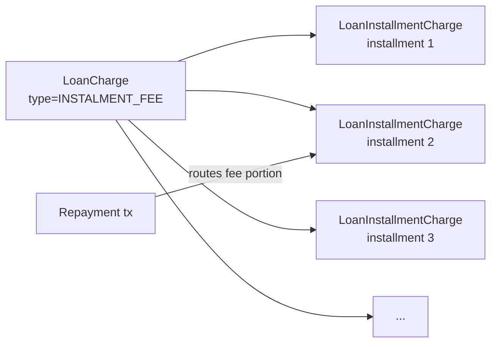
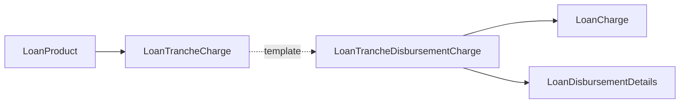

Charges in Apache Fineract are how fees, penalties, taxes and one-off adjustments attach to a loan. The `LoanCharge` entity copies a global `Charge` template onto a specific loan, then optionally splits across installments (`LoanInstallmentCharge`) or tranches (`LoanTrancheCharge`). Charges drive their own postings, can be waived, are calculated either as a flat amount or as a percentage of one of several bases, and obey a "charge time" enum that decides when they hit the schedule.

## Source layout

`fineract-loan/src/main/java/org/apache/fineract/portfolio/loanaccount/domain/`:

| File | Purpose |
| --- | --- |
| `LoanCharge.java` | Per-loan charge instance, `m_loan_charge` |
| `LoanInstallmentCharge.java` | Per-installment split of a `LoanCharge` |
| `LoanTrancheCharge.java` | Charge that fires only on a tranche disbursal |
| `LoanTrancheDisbursementCharge.java` | Link between a tranche and its applied charge |
| `LoanChargePaidBy.java` | Maps a transaction to one or more charges |
| `LoanChargeTaxDetails.java` | Tax components on a charge |
| `LoanChargeRepository.java` | Spring Data repo |
| `LoanChargeEffectiveDueDateComparator.java` | Ordering helper for "next due" calc |
| `LoanOverdueInstallmentCharge.java` | Auto-applied overdue penalty linkage |
| `LoanChargeOffBehaviour.java` | What happens to charges after charge-off |

## Entity shell

```java
@Setter @Getter @Entity
@Table(name = "m_loan_charge",
       uniqueConstraints = { @UniqueConstraint(columnNames = "external_id", name = "external_id") })
public class LoanCharge extends AbstractAuditableWithUTCDateTimeCustom<Long> {

    @ManyToOne(optional = false) @JoinColumn(name = "loan_id",   nullable = false) private Loan loan;
    @ManyToOne(optional = false) @JoinColumn(name = "charge_id", nullable = false) private Charge charge;

    @Column(name = "charge_time_enum", nullable = false) private Integer chargeTime;
    @Column(name = "submitted_on_date")                  private LocalDate submittedOnDate;
    @Column(name = "due_for_collection_as_of_date")      private LocalDate dueDate;
    ...
}
```

## Core columns

| Column | Type | Meaning |
| --- | --- | --- |
| `charge_id` | FK | The global `Charge` template |
| `charge_time_enum` | int | When the charge is due — see below |
| `charge_calculation_enum` | int | How the amount is derived — see below |
| `charge_payment_mode_enum` | int | Regular vs account-transfer |
| `amount` | money | The face amount or percentage |
| `amount_percentage_appliedTo` | money | Base the percentage applied to |
| `amount_paid_derived` | money | Paid so far |
| `amount_waived_derived` | money | Waived so far |
| `amount_writtenoff_derived` | money | Written off so far |
| `amount_outstanding_derived` | money | Remaining |
| `due_for_collection_as_of_date` | date | Due date |
| `is_penalty` | bool | Penalty vs ordinary fee |
| `is_paid_derived` | bool | Convenience flag |
| `waived` / `is_active` | bool | State flags |
| `min_cap` / `max_cap` | money | Bounds applied to percentage results |
| `external_id` | unique | Optional client identifier |

## Charge time types

Comes from the platform-wide `ChargeTimeType` enum (`fineract-core`). Values used for loans:

| Code | ChargeTimeType | Behaviour on the loan |
| --- | --- | --- |
| 1 | `DISBURSEMENT` | Due on actual disbursal |
| 2 | `SPECIFIED_DUE_DATE` | Due on a user-supplied date |
| 3 | `INSTALMENT_FEE` | Split across every installment |
| 4 | `OVERDUE_INSTALLMENT` | Auto-applied when an installment goes overdue |
| 5 | `TRANCHE_DISBURSEMENT` | Per-tranche disbursal fee |

<Tip>
  `INSTALMENT_FEE` is the value that triggers `LoanInstallmentCharge`
  rows; every other charge time keeps a single `LoanCharge` row only.
</Tip>

## Charge calculation types

From `ChargeCalculationType`:

| Code | Calculation | Base |
| --- | --- | --- |
| 1 | `FLAT` | Literal amount |
| 2 | `PERCENT_OF_AMOUNT` | Principal |
| 3 | `PERCENT_OF_AMOUNT_AND_INTEREST` | Principal + interest |
| 4 | `PERCENT_OF_INTEREST` | Interest |
| 5 | `PERCENT_OF_DISBURSEMENT_AMOUNT` | Tranche/loan disbursement |
| 6 | `PERCENT_OF_TOTAL_OUTSTANDING_PRINCIPAL` | Live outstanding (recalc-aware) |

`min_cap` and `max_cap` bound the resulting amount for percentage variants — e.g. "1% of principal, min 5, max 100".

## Per-installment splits

```java
@OneToMany(mappedBy = "loancharge", cascade = CascadeType.ALL, orphanRemoval = true)
private Set<LoanInstallmentCharge> loanInstallmentCharge;
```

For `INSTALMENT_FEE` charges the engine builds one `LoanInstallmentCharge` per `LoanRepaymentScheduleInstallment`, each with its own paid/waived/outstanding columns and `due_date` matching the installment. The schedule processor then attributes a repayment's fee portion to the right installment's split.



## Tranche charges

For multi-disburse products the global charge can be configured as `TRANCHE_DISBURSEMENT`. The product-level template is stored in `LoanTrancheCharge`; once a specific tranche is added, `LoanTrancheDisbursementCharge` records the actual `LoanDisbursementDetails` → `LoanCharge` link so the engine knows which tranche fired the fee.



## Overdue installment charges

`LoanOverdueInstallmentCharge` ties an auto-generated penalty to the installment that triggered it. A daily job evaluates products with overdue charges configured, finds installments past their grace period, and applies a `LoanCharge` of time `OVERDUE_INSTALLMENT`. The link row preserves auditability so you can see "this penalty was raised by installment #5 going 7 days overdue".

## Waivers

Two operations exist:

<Tabs>
  <Tab title="WAIVE_CHARGES (tx 9)">
    Waives one or more charges in full or partially. Generates a
    `LoanTransaction(WAIVE_CHARGES)` with `feeChargesPortion` /
    `penaltyChargesPortion` set, and bumps the charge's
    `amount_waived_derived` / `amount_outstanding_derived` columns. No
    journal cash movement — only the income-vs-loss accounts move.
  </Tab>
  <Tab title="CHARGE_PAYMENT (tx 17)">
    Pays a specific charge from cash. Creates a normal payment with
    `LoanChargePaidBy` rows attributing the cash to charges.
  </Tab>
  <Tab title="CHARGE_ADJUSTMENT (tx 26)">
    Reverses a previously paid charge by issuing a same-amount
    counter-transaction that re-opens the charge.
  </Tab>
  <Tab title="CHARGE_REFUND (tx 24)">
    Pushes cash back out to the borrower when a paid charge needs to
    be undone after the fact, leaving the schedule untouched.
  </Tab>
</Tabs>

## ChargePaidBy linkage

```java
@OneToMany(mappedBy = "loanCharge", cascade = CascadeType.ALL, orphanRemoval = true)
private Set<LoanChargePaidBy> loanChargePaidBySet;
```

`LoanChargePaidBy` rows live in `m_loan_charge_paid_by` and let several transactions attribute money to the same charge over time. This is how a single fee can be settled across multiple repayments.

<ParamField path="loanTransaction" type="LoanTransaction">
  The transaction that paid into this charge.
</ParamField>
<ParamField path="loanCharge" type="LoanCharge">
  The charge being settled.
</ParamField>
<ParamField path="amount" type="BigDecimal">
  Cash attributed in this transaction.
</ParamField>
<ParamField path="installmentNumber" type="Integer">
  Which installment slot for installment-fee splits.
</ParamField>

## Tax components

`LoanChargeTaxDetails` decomposes a charge into one or more tax buckets driven by the `Tax` configuration. The charge entity tracks `amountOrPercentage` totals while the tax-detail rows carry the per-component splits for journal posting.

## Off behaviour

`LoanProduct.loanChargeOffBehaviour` enumerates how charges interact with charge-off:

```java
public enum LoanChargeOffBehaviour {
    REGULAR,                       // continue to accrue
    ZERO_INTEREST,                 // suppress interest, fees behave normally
    ACCELERATE_MATURITY            // all charges become immediately due
}
```

## Status fields and derived totals

`isPaid()`, `isWaived()`, `isActive()`, `getAmountOutstanding()` are the methods downstream services call to decide payment routing. They read from the `*_derived` columns which the schedule processor keeps in sync — never from a recomputation on the fly.

<Warning>
  Mutating `amountPaid` / `amountWaived` directly without going through
  the processor will desynchronise the per-installment splits and the
  loan summary. Always go via `Loan.makeRepayment` / `Loan.waiveCharge`
  helpers.
</Warning>

## Related pages

<CardGroup cols={2}>
  <Card title="Loan model" icon="cube" href="/loan/loan-domain-model">
    The aggregate owns the `charges` collection.
  </Card>
  <Card title="Transactions" icon="receipt" href="/loan/loan-transactions">
    `WAIVE_CHARGES`, `CHARGE_PAYMENT`, `CHARGE_ADJUSTMENT`.
  </Card>
  <Card title="Schedule" icon="calendar-days" href="/loan/loan-repayment-schedule">
    Per-installment fee/penalty columns live here.
  </Card>
  <Card title="Disbursement" icon="arrow-up" href="/loan/loan-disbursement">
    How tranche charges fire on a tranche disburse.
  </Card>
</CardGroup>
