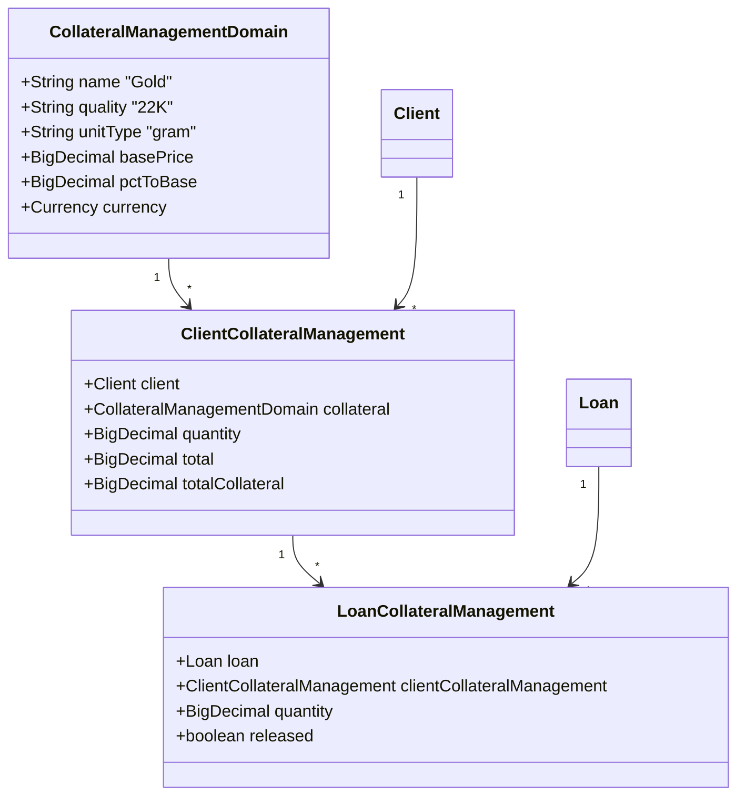
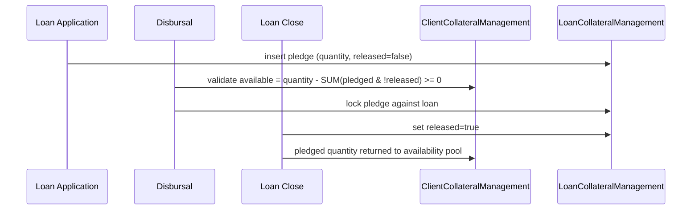

Apache Fineract has **two coexisting collateral models** because the original *legacy* design proved too thin to support real-world collateral lifecycle management. New tenants are expected to use the **Collateral Management** model; the legacy `LoanCollateral` table is retained for backward compatibility and may be removed in a future major version.

This page documents:

- the legacy `LoanCollateral` entity,
- the new triad `CollateralManagementDomain` → `ClientCollateralManagement` → `LoanCollateralManagement`,
- how a collateral is pledged on disbursal and released on close,
- the read and write APIs.

## Why two models?

The legacy model collapsed everything into one row per pledged item — value, description, currency — with no notion of a *reusable catalogue* of asset types, no quality assessment, and no link from the client's inventory of assets to multiple loans. The new model splits the concept into three:



Read top-down:

- **`CollateralManagementDomain`** — a *catalogue* of pledgeable asset types (gold, land, vehicles…), each with a name, quality grade, unit type, base price, and an LTV-style `pct_to_base`.
- **`ClientCollateralManagement`** — a *client's inventory* of one such asset (e.g. client #42 owns 100 g of gold). Independent of any loan.
- **`LoanCollateralManagement`** — a *loan's pledge* of part of that inventory (e.g. 60 g of client #42's gold is pledged against loan #99).

The same client inventory row can back several loans simultaneously, with quantities tracked per pledge and a release flag toggled when the loan closes.

## Catalogue: `CollateralManagementDomain`

```java fineract-loan/.../collateralmanagement/domain/CollateralManagementDomain.java
@Entity
@Table(name = "m_collateral_management")
public class CollateralManagementDomain extends AbstractPersistableCustom<Long> {

    @Column(name = "name", length = 20)        private String name;
    @Column(name = "quality", nullable = false, length = 40) private String quality;
    @Column(name = "base_price", nullable = false, scale = 5, precision = 20)
    private BigDecimal basePrice;
    @Column(name = "unit_type", nullable = false, length = 10) private String unitType;
    @Column(name = "pct_to_base", nullable = false, scale = 5, precision = 20)
    private BigDecimal pctToBase;
}
```

The fields:

| Column | Meaning |
|--------|---------|
| `name` | Free-text asset type (`Gold`, `Land`, `Vehicle`) |
| `quality` | Quality grade (`22K`, `Title-A`) — distinguishes variants of the same asset type |
| `unit_type` | Unit of measure (`gram`, `acre`, `unit`) |
| `base_price` | Reference price per unit |
| `pct_to_base` | Loan-to-value cap (e.g. `0.70` means lender accepts 70 % of base value) |

Catalogue rows are managed through the *Collateral Management API* (`/v1/collateral-management`) and are tenant-wide.

## Client inventory: `ClientCollateralManagement`

```java fineract-loan/.../collateralmanagement/domain/ClientCollateralManagement.java
@Entity
@Table(name = "m_client_collateral_management")
public class ClientCollateralManagement extends AbstractPersistableCustom<Long> {

    @Column(name = "quantity", nullable = false, scale = 5, precision = 20)
    private BigDecimal quantity;

    // FK to m_client
    // FK to m_collateral_management
    // derived columns: total = quantity * basePrice
    //                  totalCollateral = total * pctToBase
}
```

A row says *"client X owns this much of catalogue item Y"*. The `total` and `totalCollateral` columns are derived snapshots used by reports — they are recomputed whenever the catalogue's base price changes through the catalogue update handler.

## Loan pledge: `LoanCollateralManagement`

```java fineract-loan/.../loanaccount/domain/LoanCollateralManagement.java
@Entity
@Table(name = "m_loan_collateral_management")
public class LoanCollateralManagement extends AbstractPersistableCustom<Long> {

    @Column(name = "quantity", nullable = false, scale = 5, precision = 20)
    private BigDecimal quantity;

    @Column(name = "is_released", nullable = false)
    private boolean released;

    // FK to m_loan
    // FK to m_client_collateral_management
}
```

The pledge:

- pulls a quantity from the client's inventory row,
- belongs to one loan,
- carries `is_released = false` while the loan is active,
- flips to `is_released = true` when the loan closes — freeing the pledged quantity for reuse.

## Pledge lifecycle



The check at disbursal — *available quantity >= pledged quantity* — prevents a client from pledging the same gram of gold against two loans in parallel.

## Legacy model: `LoanCollateral`

The legacy entity is still on the classpath for backward compatibility:

```java fineract-loan/src/main/java/org/apache/fineract/portfolio/collateral/domain/LoanCollateral.java
@Entity
@Table(name = "m_loan_collateral")
public class LoanCollateral extends AbstractPersistableCustom<Long> {

    // FK to m_loan
    // FK to m_code_value (collateral type)

    @Column(name = "value", scale = 6, precision = 19)
    private BigDecimal value;

    @Column(name = "description", length = 500)
    private String description;
}
```

It records *one item, one value, one free-text description* per loan, typed by a `m_code_value` row. There is no notion of:

- a reusable catalogue,
- a per-client inventory pool,
- quality grade or unit-type metadata,
- partial release.

New code paths (the *Collateral Management* APIs and the disbursal validation in `Loan.disburseLoan`) operate on the new model. The legacy table is read by historical reports and the legacy `/v1/loans/{loanId}/collaterals` resource, but writes are discouraged.

| Concern | Legacy | New |
|---------|--------|-----|
| Catalogue | None — free-text + code-value | `CollateralManagementDomain` |
| Client inventory | Implicit (none) | `ClientCollateralManagement` |
| Loan pledge | `LoanCollateral` | `LoanCollateralManagement` |
| Partial release | No | Yes (per pledge `is_released`) |
| Quality / LTV | No | `quality`, `pct_to_base` |
| Cross-loan pledging | Each row is loan-local | Inventory shared, pledges tracked |

## API surface

| Resource | Model | Purpose |
|----------|-------|---------|
| `/v1/collateral-management` | Catalogue | CRUD on `CollateralManagementDomain` rows |
| `/v1/clients/{clientId}/collaterals` | Inventory | CRUD on `ClientCollateralManagement` rows |
| `/v1/loans/{loanId}/collaterals` | Legacy | `LoanCollateral` rows — kept for back-compat |
| Loan request body's `collateral` array | New | `LoanCollateralManagement` rows are created with the loan application using `clientCollateralId` and `quantity` |

The application JSON shape for the new pledge:

```json
{
  "principal": 5000.00,
  "loanType": "individual",
  "collateral": [
    { "clientCollateralId": 17, "quantity": 60 },
    { "clientCollateralId": 23, "quantity": 1 }
  ]
}
```

## Validation rules

- A pledged quantity must be `> 0`.
- Catalogue currency must match the loan currency.
- Sum of active pledges against an inventory row must not exceed `quantity`.
- A loan cannot be disbursed if `SUM(LoanCollateralManagement.quantity * basePrice * pctToBase)` is below the product-configured minimum coverage (when collateral is mandatory).
- Releasing a pledge requires the loan to be `CLOSED_OBLIGATIONS_MET` or `WRITTEN_OFF`.

## Read model

The combined query exposed through `LoanCollateralManagementData` flattens the three entities:

| Field | Source |
|-------|--------|
| `id` | `LoanCollateralManagement.id` |
| `quantity` | `LoanCollateralManagement.quantity` |
| `total` | `quantity * basePrice` |
| `totalCollateral` | `total * pctToBase` |
| `name` / `unitType` / `quality` | `CollateralManagementDomain` |
| `clientCollateralId` | `ClientCollateralManagement.id` |

## Operational notes

- Catalogue base prices change over time; the inventory and pledge tables do not store historical snapshots. Reports that need an as-of valuation must persist their own price history.
- Deleting a catalogue row is rejected if any active client inventory points at it.
- Deleting a client inventory row is rejected if any non-released pledge references it.

<Note>
Both models can coexist on a single tenant. The presence of either table is enough to satisfy collateral display, but only the new model participates in disbursal-time coverage validation.
</Note>

## Summary

The new collateral model splits the lifecycle into **catalogue (asset definitions)**, **inventory (what the client owns)**, and **pledge (what's locked against a loan)**, giving Fineract proper support for partial releases, cross-loan pledging, and LTV-driven coverage checks. The legacy `LoanCollateral` table sits alongside as a backward-compatible single-row alternative for installations that have not migrated yet.
