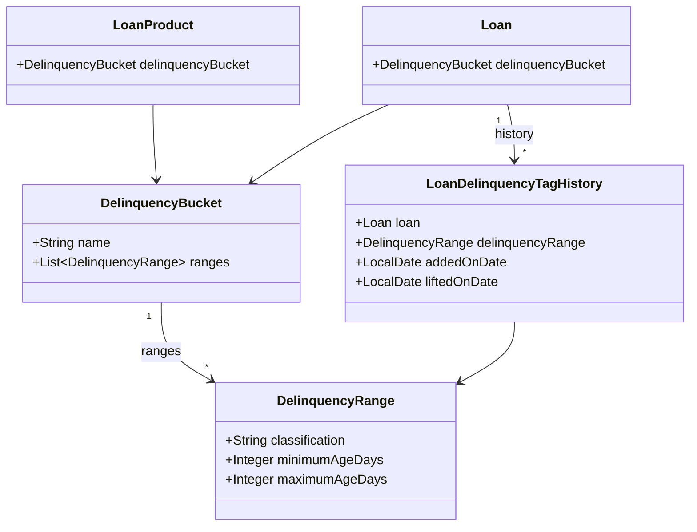
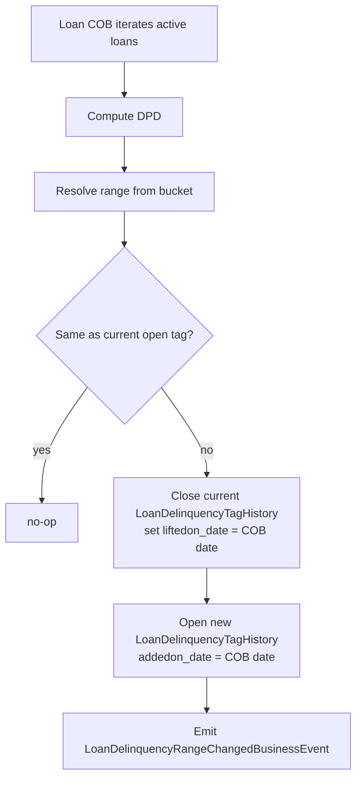
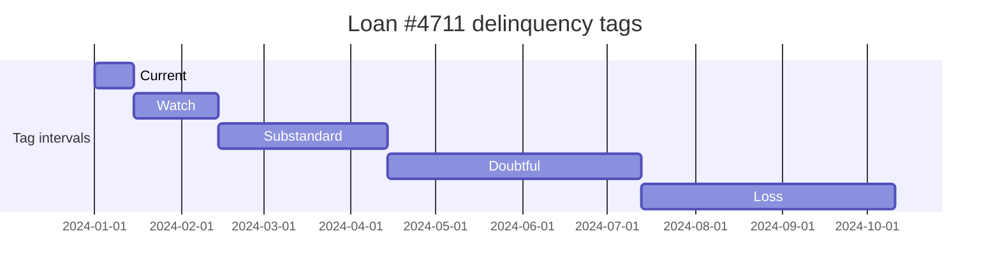

Beyond raw "days past due", banks and microfinance regulators require loans to be **classified** into named risk categories — *Current*, *Watch*, *Substandard*, *Doubtful*, *Loss*, or whatever the local supervisor mandates. Apache Fineract calls these categories **delinquency ranges** and groups them into reusable **delinquency buckets** that are attached to loan products. Every business day the [Loan COB](/cob/loan-cob-job) re-evaluates each active loan and writes a new row to `m_loan_delinquency_tag_history` whenever its classification changes.

This page documents the entities, the configuration model, the COB classification step, and the resulting tag history.

## The two-level model

The model is deliberately two-level so a tenant can define ranges once and reuse them across products.



### `DelinquencyRange`

```java fineract-core/src/main/java/org/apache/fineract/portfolio/delinquency/domain/DelinquencyRange.java
@Entity
@Table(name = "m_delinquency_range",
       uniqueConstraints = { @UniqueConstraint(columnNames = { "classification" }) })
public class DelinquencyRange extends AbstractAuditableWithUTCDateTimeCustom<Long> {

    @Column(name = "classification", nullable = false)
    private String classification;       // e.g. "WATCH"

    @Column(name = "min_age_days", nullable = false)
    private Integer minimumAgeDays;      // e.g. 1

    @Column(name = "max_age_days", nullable = true)
    private Integer maximumAgeDays;      // e.g. 30, or NULL meaning ∞
}
```

A range is just a half-open interval `[minAgeDays, maxAgeDays]` on days-past-due, labelled with a unique `classification` string.

### `DelinquencyBucket`

```java fineract-core/src/main/java/org/apache/fineract/portfolio/delinquency/domain/DelinquencyBucket.java
@Entity
@Table(name = "m_delinquency_bucket",
       uniqueConstraints = { @UniqueConstraint(columnNames = { "name" }) })
public class DelinquencyBucket extends AbstractAuditableWithUTCDateTimeCustom<Long> {

    @Column(name = "name", nullable = false)
    private String name;

    // join table m_delinquency_bucket_mappings holds the ordered ranges
    @Enumerated(EnumType.STRING)
    @Column(name = "bucket_type")
    private DelinquencyBucketType bucketType;
}
```

A bucket is a *named ordered list* of ranges. The mapping table is `m_delinquency_bucket_mappings`, modelled by `DelinquencyBucketMappings` and managed through `DelinquencyBucketMappingsRepository`. Validation enforces that the ranges in a bucket are **non-overlapping** and **gap-free** so any non-negative DPD value falls into exactly one range.

## Attaching a bucket to a product or loan

A `DelinquencyBucket` is referenced from `LoanProduct` and is copied onto each new `Loan` at submission. Once on the loan it can be overridden by the `UPDATE_LOAN_DELINQUENCY_BUCKET` command, which is dispatched to `UpdateLoanDelinquencyBucketCommandHandler` (an authoritative override is sometimes required during regulatory reclassifications).

## Daily classification

The decisive moment is the daily [Loan COB](/cob/loan-cob-job). One of its `LoanCOBBusinessStep` beans is `LoanDelinquencyClassificationBusinessStep`, which:

1. computes the loan's current DPD using `m_loan_arrears_aging.overdue_since_date_derived` (see [/loan/loan-arrears-aging](/loan/loan-arrears-aging));
2. locates the unique `DelinquencyRange` in the loan's bucket whose `[minimumAgeDays, maximumAgeDays]` contains that DPD;
3. compares it to the currently-open `LoanDelinquencyTagHistory` row;
4. if different, **closes** the open row (sets `liftedon_date`) and **opens** a new one for the new range.



## `LoanDelinquencyTagHistory`

The history table captures *intervals* during which a loan held a particular classification — the same interval-with-open-end pattern used for [loan officer assignment](/loan/loan-officer-assignment) and loan status history.

```java fineract-loan/src/main/java/org/apache/fineract/portfolio/delinquency/domain/LoanDelinquencyTagHistory.java
@Entity
@Table(name = "m_loan_delinquency_tag_history")
public class LoanDelinquencyTagHistory extends AbstractAuditableWithUTCDateTimeCustom<Long> {

    @ManyToOne
    @JoinColumn(name = "loan_id")
    private Loan loan;

    @ManyToOne
    @JoinColumn(name = "delinquency_range_id")
    private DelinquencyRange delinquencyRange;

    @Column(name = "addedon_date", nullable = false)
    private LocalDate addedOnDate;

    @Column(name = "liftedon_date", nullable = true)
    private LocalDate liftedOnDate;
}
```

Invariants enforced by the classification step:

- at most one row per loan has `liftedon_date IS NULL` — the **current tag**,
- intervals do not overlap,
- moving "back" — e.g. from *Substandard* to *Watch* — happens when a heavy repayment cures part of the arrears.

## Installment-level delinquency

For products that need finer-grained reporting, Fineract also tracks per-installment delinquency through `LoanInstallmentDelinquencyTag` and the `LoanInstallmentDelinquencyTagRepository`. Each row pins an installment of a loan to the range that covered it at the moment of classification, used by reports that report a "weighted average DPD across installments" instead of a single loan-level value.

## Delinquency actions

The optional **delinquency actions** mechanism allows pausing or resuming classification (e.g. during disaster forbearance). The relevant entities are:

| Entity | Table | Purpose |
|--------|-------|---------|
| `DelinquencyAction` | `m_delinquency_action` | Catalogue of action types (`PAUSE`, `RESUME`) |
| `LoanDelinquencyAction` | `m_loan_delinquency_action` | Per-loan effective intervals of those actions |

The classification step checks for an active `PAUSE` interval before re-tagging. While paused, the open tag is **not lifted**, but no new tag is opened either — the DPD continues to accrue silently.

Commands `CREATE_DELINQUENCY_ACTION` are dispatched to `CreateDelinquencyActionCommandHandler`.

## Command handlers (configuration)

The catalogue is managed through these handlers:

| Handler | `@CommandType(entity, action)` |
|---------|--------------------------------|
| `CreateDelinquencyRangeCommandHandler` | `DELINQUENCY_RANGE`, `CREATE` |
| `UpdateDelinquencyRangeCommandHandler` | `DELINQUENCY_RANGE`, `UPDATE` |
| `DeleteDelinquencyRangeCommandHandler` | `DELINQUENCY_RANGE`, `DELETE` |
| `CreateDelinquencyBucketCommandHandler` | `DELINQUENCY_BUCKET`, `CREATE` |
| `UpdateDelinquencyBucketCommandHandler` | `DELINQUENCY_BUCKET`, `UPDATE` |
| `DeleteDelinquencyBucketCommandHandler` | `DELINQUENCY_BUCKET`, `DELETE` |
| `UpdateLoanDelinquencyBucketCommandHandler` | `LOAN`, `UPDATE_DELINQUENCY_BUCKET` |
| `CreateDelinquencyActionCommandHandler` | `LOAN`, `CREATE_DELINQUENCY_ACTION` |

All sit under `org.apache.fineract.portfolio.delinquency.handler`.

## Reading current and historical state

| Question | How to answer |
|----------|---------------|
| Current classification of loan *L* | The open `LoanDelinquencyTagHistory` row for *L* (`liftedon_date IS NULL`) — its `DelinquencyRange.classification` |
| Classification on date *D* | The row where `addedon_date <= D AND (liftedon_date IS NULL OR liftedon_date > D)` |
| Distribution across portfolio | `SELECT delinquency_range_id, COUNT(*) FROM m_loan_delinquency_tag_history WHERE liftedon_date IS NULL GROUP BY delinquency_range_id` |
| Migration matrix between two dates | Join two snapshots of the history table at the two dates |

## End-to-end example

A loan disburses on day 0, all installments fall on the 15th. The product uses a bucket `Standard` with ranges `Current [0,0]`, `Watch [1,30]`, `Substandard [31,90]`, `Doubtful [91,180]`, `Loss [181,∞]`.



Each interval becomes one row in `m_loan_delinquency_tag_history`. If on 2024-05-10 the borrower makes a large repayment that brings DPD back down to 25 days, the COB closes the *Doubtful* row and opens a new *Watch* row — backward transitions are normal.

## Events

The classification step emits `LoanDelinquencyRangeChangedBusinessEvent` on every change, carrying the previous and new range. Subscribers (alerting, collections workflow, regulatory shippers) drive reactive behaviour off this event rather than polling the table.

<Note>
The COB step runs **after** `UPDATE_LOAN_ARREARS_AGEING`. The two together — arrears aging produces "since when", delinquency classifies "what bucket" — are the input to virtually every collections KPI in Apache Fineract.
</Note>

## Summary

- **`DelinquencyRange`** = a labelled interval on days past due.
- **`DelinquencyBucket`** = an ordered, non-overlapping list of ranges, attached to a product or loan.
- **`LoanDelinquencyTagHistory`** = an audit trail of the (range, interval) pairs a loan has lived through.
- **`LoanInstallmentDelinquencyTag`** = the same idea, finer grained, per installment.
- **`LoanDelinquencyAction`** = administrative pauses to that classification.

The daily Loan COB recomputes everything and is the only writer that should mutate the history rows.
