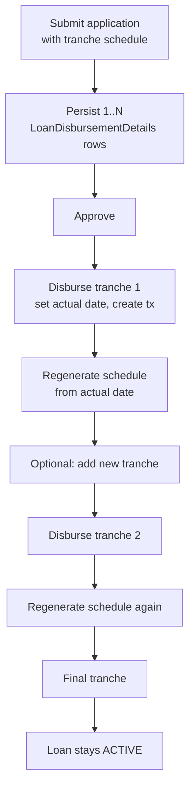
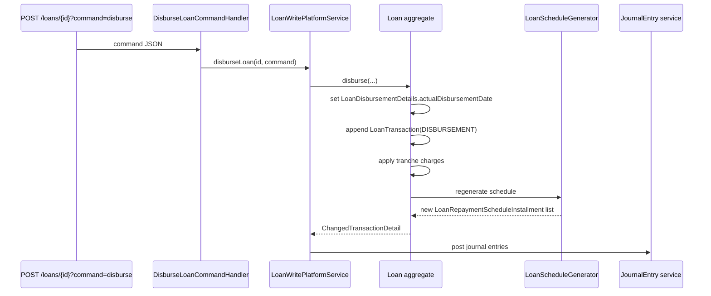

Apache Fineract treats disbursement as a first-class entity. Even single-disburse loans have at least one `LoanDisbursementDetails` row, and multi-tranche products have one row per planned tranche with `expected_disburse_date` / `disbursedon_date` independently. The disburse command pulls a row, marks it actual, posts a `DISBURSEMENT` transaction, fires tranche charges, and asks the schedule generator to regenerate downstream installments.

## Source

`fineract-loan/src/main/java/org/apache/fineract/portfolio/loanaccount/domain/`:

| File | Purpose |
| --- | --- |
| `LoanDisbursementDetails.java` | Per-tranche metadata, `m_loan_disbursement_detail` |
| `LoanDisbursementDetailsRepository.java` | Spring Data repo |
| `LoanTrancheCharge.java` | Product-level template for tranche fees |
| `LoanTrancheDisbursementCharge.java` | Tranche → charge link once applied |

## The entity

```java
@Getter
@Entity
@Table(name = "m_loan_disbursement_detail")
public class LoanDisbursementDetails extends AbstractPersistableCustom<Long> {

    @ManyToOne @JoinColumn(name = "loan_id", nullable = false) private Loan loan;

    @Column(name = "expected_disburse_date") private LocalDate expectedDisbursementDate;
    @Column(name = "disbursedon_date")       private LocalDate actualDisbursementDate;
    @Column(name = "principal", scale = 6, precision = 19, nullable = false) private BigDecimal principal;
    @Column(name = "net_disbursal_amount", scale = 6, precision = 19) private BigDecimal netDisbursalAmount;
    @Column(name = "is_reversed", nullable = false) private boolean reversed;
    ...
}
```

## Fields at a glance

<ResponseField name="expectedDisbursementDate" type="LocalDate">
  The planned date. For single-disburse loans this matches the loan's
  `expected_disbursedon_date`.
</ResponseField>
<ResponseField name="actualDisbursementDate" type="LocalDate">
  Filled when the disburse command runs.
</ResponseField>
<ResponseField name="principal" type="BigDecimal">
  The gross tranche amount.
</ResponseField>
<ResponseField name="netDisbursalAmount" type="BigDecimal">
  Gross minus charges deducted at disbursement (the cash actually handed
  out / transferred).
</ResponseField>
<ResponseField name="reversed" type="boolean">
  Marks an undone tranche so the engine ignores it without deleting.
</ResponseField>

## Single vs multi-tranche

<Tabs>
  <Tab title="Single-disburse">
    The default for most products. One `LoanDisbursementDetails` row is
    created at submission with the planned amount; the disburse command
    sets `actualDisbursementDate` and creates the
    `LoanTransaction(DISBURSEMENT)` row.
  </Tab>
  <Tab title="Multi-tranche">
    Activated when `LoanProductTrancheDetails.multiDisburseLoan = true`.
    The borrower receives money in multiple tranches over time; each
    tranche has its own date and amount, capped by
    `maxTrancheCount` and `outstandingLoanBalance`.
  </Tab>
</Tabs>

## Multi-tranche workflow



Adding a new tranche after disbursement uses the `LoanWritePlatformService.addAndDeleteLoanDisburseDetails(...)` path; the engine enforces that the sum of approved tranches does not exceed the loan's `approvedPrincipal`.

## Tranche charges

When a product has `LoanTrancheCharge` templates configured, each tranche disbursal:

1. Looks up the relevant templates from the product.
2. Builds a `LoanCharge` per template with `chargeTime = TRANCHE_DISBURSEMENT`.
3. Persists a `LoanTrancheDisbursementCharge` link row pinning the
   charge to this tranche's `LoanDisbursementDetails`.
4. Optionally deducts the charge from `netDisbursalAmount`.

<Note>
  Tranche charges are independent of standard `DISBURSEMENT` charges
  (`chargeTime = 1`). The latter fire on the first disbursal only; the
  former fire on every tranche.
</Note>

## The disburse command path



## Validation rules enforced

<Accordion title="Selected validations">
  - `expectedDisbursementDate` must be on or after loan submission date.
  - `actualDisbursementDate` must be on or after the loan's
    `approvedOnDate`.
  - Sum of tranche principals ≤ `approvedPrincipal`.
  - Cannot disburse the next tranche before the previous one if the
    product flag `disallowExpectedDisbursements` is set out of order.
  - Total tranche count ≤ `LoanProductTrancheDetails.maxTrancheCount`.
  - Outstanding principal at any point ≤
    `LoanProductTrancheDetails.outstandingLoanBalance` when configured.
  - First repayment date must not precede the actual disbursement date
    of any already-disbursed tranche.
</Accordion>

## Net disbursal amount

`netDisbursalAmount` is recomputed when:

- Charges at `DISBURSEMENT` or `TRANCHE_DISBURSEMENT` time are toggled.
- A `REPAYMENT_AT_DISBURSEMENT` (tx 5) transaction is created from the
  fee deduction.
- A subsequent reversal / undo zeroes part of the tranche.

It is what reporting joins on for "cash actually out the door".

## Undo disbursal

The `undoDisbursal` command reverses the most recent (or specified) tranche:

1. Removes the `LoanTransaction(DISBURSEMENT)` row by marking it reversed.
2. Clears `actualDisbursementDate` on the `LoanDisbursementDetails`.
3. Reverses any tranche-level charges raised.
4. Regenerates the schedule with the surviving tranches.
5. State machine transitions back from `ACTIVE` (300) to `APPROVED` (200)
   if no tranches remain disbursed.

<Warning>
  Undo disbursal is invalid once repayments have been recorded against
  the loan. The validator forces the user to reverse repayments first
  through `adjustLoanTransaction`.
</Warning>

## Read-side projection

The `DisbursementData` DTO (in `loanaccount.data`) projects a `LoanDisbursementDetails` for read APIs and the schedule generator. It contains the same date / principal / net fields plus the loan ID and a `loanChargeId` list of tranche fees.

## Related pages

<CardGroup cols={2}>
  <Card title="Loan product" icon="sliders" href="/loan/loan-product">
    Where multi-disburse flags are configured.
  </Card>
  <Card title="Charges" icon="tag" href="/loan/loan-charges">
    `TRANCHE_DISBURSEMENT` charges in detail.
  </Card>
  <Card title="Schedule" icon="calendar-days" href="/loan/loan-repayment-schedule">
    How disbursal triggers schedule regeneration.
  </Card>
  <Card title="Lifecycle" icon="route" href="/loan/loan-application-lifecycle">
    The 200 → 300 transition.
  </Card>
</CardGroup>
