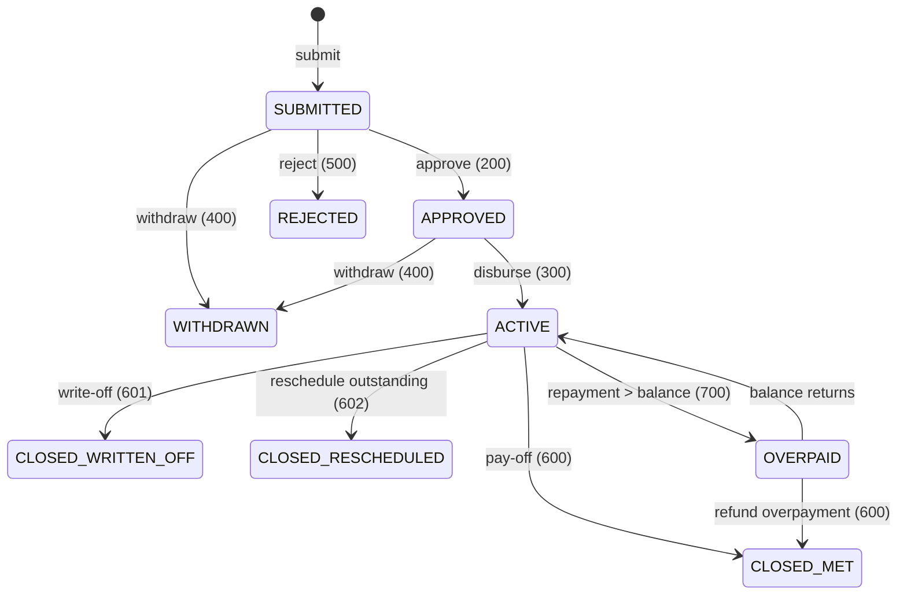

The `Loan` class in Apache Fineract is the aggregate root for everything that happens to a borrower's account. It is a JPA entity mapped to `m_loan`, owns collections of transactions, charges, disbursement details, schedule installments and reschedule requests, and exposes mutator methods that the write platform service calls from REST handlers. Every business rule that touches money flows through this object.

## Source

`fineract-loan/src/main/java/org/apache/fineract/portfolio/loanaccount/domain/Loan.java`

```java
@Entity
@Table(name = "m_loan",
       uniqueConstraints = {
         @UniqueConstraint(columnNames = { "account_no" },  name = "loan_account_no_UNIQUE"),
         @UniqueConstraint(columnNames = { "external_id" }, name = "loan_externalid_UNIQUE") })
@Getter
public class Loan extends AbstractAuditableWithUTCDateTimeCustom<Long> {

    @Version int version;
    ...
}
```

It extends `AbstractAuditableWithUTCDateTimeCustom<Long>` so created/modified user and UTC datetime columns are filled automatically. The `@Version` field gives optimistic locking against concurrent COB and command-handler updates.

## Identity columns

<ParamField path="accountNumber" type="String(20) unique">
  Human-friendly account number generated through `AccountNumberGenerator`
  at submission time.
</ParamField>

<ParamField path="externalId" type="ExternalId unique">
  Optional client-supplied identifier; wrapped in a value object that
  validates non-empty and trims whitespace.
</ParamField>

<ParamField path="version" type="int">
  JPA `@Version` for optimistic concurrency.
</ParamField>

## Ownership and product

| Field | Type | Mapping |
| --- | --- | --- |
| `client` | `Client` | `client_id` (FK), nullable for group loans |
| `group` | `Group` | `group_id` (FK), nullable for individual loans |
| `glim` | `GroupLoanIndividualMonitoringAccount` | `glim_id` for GLIM products |
| `loanType` | `AccountType` enum | `loan_type_enum` (Individual / Group / JLG / GLIM) |
| `loanProduct` | `LoanProduct` | `product_id` lazy FK |
| `fund` | `Fund` | `fund_id` eager FK |
| `loanOfficer` | `Staff` | `loan_officer_id` eager FK |
| `loanPurpose` | `CodeValue` | `loanpurpose_cv_id` |

## Repayment configuration

The aggregate embeds `LoanProductRelatedDetail` which copies amortization, interest method, repayment frequency, charges-included-in-EMI flags from the product at submission time. That snapshot stays even if the product is later updated.

```java
@Embedded
private LoanProductRelatedDetail loanRepaymentScheduleDetail;
```

Top-level term fields live directly on the row:

<ResponseField name="termFrequency" type="Integer">
  Length of the loan in `termPeriodFrequencyType` units (`DAYS`, `WEEKS`,
  `MONTHS`, `YEARS`).
</ResponseField>
<ResponseField name="termPeriodFrequencyType" type="PeriodFrequencyType">
  Enum mapped to `term_period_frequency_enum`.
</ResponseField>
<ResponseField name="transactionProcessingStrategyCode" type="String">
  Lookup key for the `LoanRepaymentScheduleTransactionProcessorFactory`.
</ResponseField>
<ResponseField name="transactionProcessingStrategyName" type="String">
  Cached display name so the strategy can be shown without resolving the
  bean.
</ResponseField>

## Lifecycle dates

<Accordion title="Submission, approval, disbursement, closure">
  | Column | Meaning |
  | --- | --- |
  | `submittedon_date` | Application created |
  | `approvedon_date` | Approval recorded |
  | `expected_disbursedon_date` | Planned disbursement |
  | `disbursedon_date` | Actual disbursement |
  | `expected_firstrepaymenton_date` | Planned first installment |
  | `interest_calculated_from_date` | Interest accrual origin |
  | `closedon_date` | Closure (any reason) |
  | `writtenoffon_date` | Write-off date |
  | `withdrawnon_date` | Withdrawn by client |
  | `rejectedon_date` | Rejected by approver |
  | `rescheduledon_date` | Rescheduled |
</Accordion>

Each date column has a paired `*_userid` column that captures which `AppUser` performed the transition, populated by mutator methods like `approve(...)`, `disburse(...)`, `writeOff(...)`.

## Status state machine

The `loan_status_id` column stores a numeric code converted via `LoanStatusConverter`:



See [Application lifecycle](/loan/loan-application-lifecycle) for the full state-machine implementation.

## Embedded summary

```java
@Embedded
private LoanSummary summary;
```

`LoanSummary` is an `@Embeddable` holding ~30 derived totals: principal/interest/fees/penalty for `disbursed`, `charged`, `repaid`, `waived`, `writtenOff`, `outstanding`. These are updated by `LoanSummaryWrapper` after each transaction and by the summary refresh scheduled job.

<Note>
  The summary fields are convenience denormalizations; the **source of
  truth** is the `LoanTransaction` log plus the
  `LoanRepaymentScheduleInstallment` rows.
</Note>

## Collections

<Tabs>
  <Tab title="Transactions">
    ```java
    @OneToMany(mappedBy = "loan", cascade = CascadeType.ALL,
               orphanRemoval = true, fetch = FetchType.LAZY)
    private List<LoanTransaction> loanTransactions = new ArrayList<>();
    ```
    Initialised lazily; processors walk this list ordered by date then ID.
  </Tab>
  <Tab title="Charges">
    ```java
    @OneToMany(mappedBy = "loan", cascade = CascadeType.ALL,
               orphanRemoval = true, fetch = FetchType.LAZY)
    private Set<LoanCharge> charges = new HashSet<>();
    ```
    Backed by `m_loan_charge`; per-installment splits live in
    `LoanInstallmentCharge`.
  </Tab>
  <Tab title="Schedule">
    ```java
    @OneToMany(mappedBy = "loan", cascade = CascadeType.ALL,
               orphanRemoval = true, fetch = FetchType.LAZY)
    @OrderBy("installmentNumber ASC")
    private List<LoanRepaymentScheduleInstallment> repaymentScheduleInstallments;
    ```
    Maintained by the schedule generator; regenerated on disburse,
    charge add, reschedule and interest-recalculation events.
  </Tab>
  <Tab title="Disbursement details">
    ```java
    @OneToMany(mappedBy = "loan", cascade = CascadeType.ALL,
               orphanRemoval = true, fetch = FetchType.LAZY)
    private List<LoanDisbursementDetails> disbursementDetails = new ArrayList<>();
    ```
    Populated only for multi-tranche products.
  </Tab>
</Tabs>

## Officer assignment history

`Loan` also owns a `Set<LoanOfficerAssignmentHistory>` so the previous officer assignments are auditable when the active officer is reassigned. The currently-assigned officer reference is the `loanOfficer` field above.

## Mutator surface

The aggregate exposes high-level methods used by the write platform service. A few representative ones:

| Method | Purpose |
| --- | --- |
| `loanApplicationSubmittal(...)` | Create initial state with status 100 |
| `loanApplicationApproval(...)` | Move to status 200 and record approver/date |
| `disburse(...)` | Record disbursement, status 300, create disbursement tx |
| `makeRepayment(...)` | Append a `REPAYMENT` transaction, route to processor |
| `closeAsWrittenOff(...)` | Status 601, build write-off transaction |
| `rescheduleAsTermsChange(...)` | Update terms, regen schedule, status 602 if needed |
| `recalculateAllCharges(...)` | Re-evaluate every `LoanCharge` against new schedule |

## Related pages

<CardGroup cols={2}>
  <Card title="Loan repository" icon="layer-group" href="/loan/loan-repository">
    How services fetch the aggregate without leaking nulls.
  </Card>
  <Card title="Repayment schedule" icon="calendar-days" href="/loan/loan-repayment-schedule">
    The installment collection in detail.
  </Card>
  <Card title="LoanProduct" icon="sliders" href="/loan/loan-product">
    Where the embedded product details come from.
  </Card>
  <Card title="Transactions" icon="receipt" href="/loan/loan-transactions">
    Drill into each `LoanTransaction` type.
  </Card>
</CardGroup>

<Tip>
  When reading `Loan.java` for the first time, jump straight to the
  field block; every business operation lights up the same fields. Once
  you can recite the timeline dates and the embedded `LoanSummary`
  layout, the 4 000+ line file becomes much easier to navigate.
</Tip>
