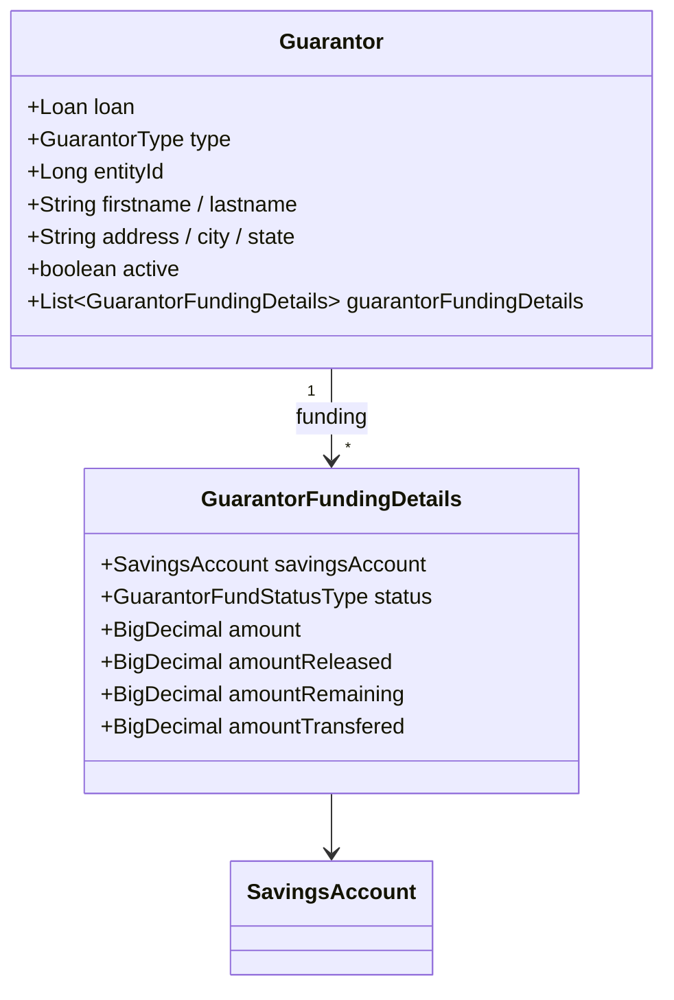
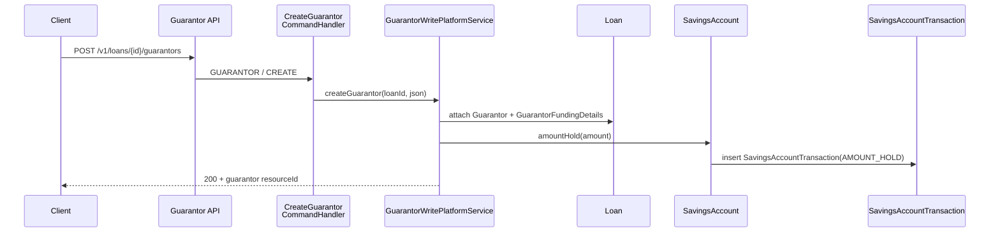
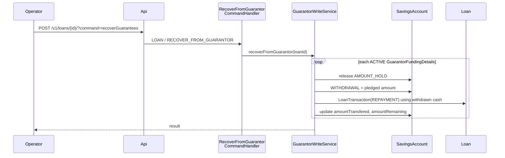

A **guarantor** in Apache Fineract is a person or entity who pledges to make good on a loan if the borrower defaults. Fineract supports three structurally different kinds: the borrower themselves (*self*), another client in the same tenant (*existing customer*), and an unrelated *external* individual identified only by name and contact details. When the guarantor is a client whose savings account is pledged, Fineract additionally places **on-hold** transactions against that savings account so the pledged amount cannot be withdrawn.

This page documents:

- the `Guarantor` and `GuarantorFundingDetails` entities,
- the `GuarantorType` and `GuarantorFundStatusType` enums,
- the savings on-hold mechanism,
- the guarantor write platform service and command handlers,
- the recovery flow when a guarantor is called on.

## The two entities



### `Guarantor`

```java fineract-provider/src/main/java/org/apache/fineract/portfolio/loanaccount/guarantor/domain/Guarantor.java
@Entity
@Table(name = "m_guarantor")
public class Guarantor extends AbstractPersistableCustom<Long> {

    @Column(name = "type_enum", nullable = false)
    private Integer gurantorType;     // see GuarantorType

    @Column(name = "entity_id")
    private Long entityId;            // FK to m_client when type = CUSTOMER, else null

    @Column(name = "firstname", length = 50)
    private String firstname;
    @Column(name = "lastname", length = 50)
    private String lastname;
    @Column(name = "dob")
    private LocalDate dateOfBirth;

    @Column(name = "address_line_1", length = 500) private String addressLine1;
    @Column(name = "address_line_2", length = 500) private String addressLine2;
    @Column(name = "city", length = 50)            private String city;
    @Column(name = "state", length = 50)           private String state;
    @Column(name = "country", length = 50)         private String country;
    @Column(name = "zip", length = 20)             private String zip;
    @Column(name = "house_phone_number", length = 20) private String housePhoneNumber;
    @Column(name = "mobile_number", length = 20)   private String mobileNumber;
    @Column(name = "comment", length = 500)        private String comment;

    @Column(name = "is_active", nullable = false)
    private boolean active;
}
```

For `CUSTOMER` (existing-client) guarantors only `entityId` is mandatory — name and address are pulled from `m_client`. For `EXTERNAL` guarantors the contact fields are mandatory and `entityId` stays null. For `CUSTOMER_SELF` the `entityId` points back to the loan's own client.

### `GuarantorFundingDetails`

```java fineract-provider/.../guarantor/domain/GuarantorFundingDetails.java
@Entity
@Table(name = "m_guarantor_funding_details")
public class GuarantorFundingDetails extends AbstractPersistableCustom<Long> {

    // FK to m_guarantor
    // FK to m_savings_account (the pledged account)

    @Column(name = "status_enum", nullable = false)
    private Integer status;                          // see GuarantorFundStatusType

    @Column(name = "amount", scale = 6, precision = 19, nullable = false)
    private BigDecimal amount;                       // pledged amount

    @Column(name = "amount_released_derived", scale = 6, precision = 19)
    private BigDecimal amountReleased;

    @Column(name = "amount_remaining_derived", scale = 6, precision = 19)
    private BigDecimal amountRemaining;

    @Column(name = "amount_transfered_derived", scale = 6, precision = 19)
    private BigDecimal amountTransfered;
}
```

A single `Guarantor` row can carry several `GuarantorFundingDetails` — one per pledged savings account. The four amount columns track the lifecycle of each pledge.

## The two enums

### `GuarantorType`

| Value | `int` | Meaning |
|-------|-------|---------|
| `CUSTOMER` | 1 | An existing `m_client` other than the borrower |
| `EXTERNAL` | 2 | An external person — name/address mandatory |
| `CUSTOMER_SELF` | 3 | The borrower themselves (sometimes used for self-pledged collateral) |

(From `GuarantorType` enum in `fineract-loan/.../guarantor/domain/GuarantorType.java`.)

### `GuarantorFundStatusType`

```java fineract-loan/.../guarantor/domain/GuarantorFundStatusType.java
public enum GuarantorFundStatusType {
    INVALID(0,   "guarantorFundStatusType.invalid"),
    ACTIVE(100,  ...),
    COMPLETED(200, ...),
    WITHDRAWN(300, ...),
    DELETED(400, ...);
}
```

| Status | Code | Meaning |
|--------|------|---------|
| `ACTIVE` | 100 | The pledge is in force and funds are held on the savings account |
| `COMPLETED` | 200 | The loan has been fully repaid; the pledge has been released |
| `WITHDRAWN` | 300 | The guarantor has been allowed to withdraw the pledge before maturity |
| `DELETED` | 400 | Pledge soft-deleted |

## Savings on-hold transactions

When a `GuarantorFundingDetails` row is created for a savings account, Fineract immediately writes a **hold** `SavingsAccountTransaction` of type `AMOUNT_HOLD` (transaction type `AMOUNT_HOLD = 200`). The savings account's "available balance" calculation subtracts every active hold from the running balance — so the guarantor cannot withdraw the pledged amount even though it still belongs to them.



The `LoanTransactionRelation` mechanism is then used to link the loan disbursal back to the hold transaction so reports can trace which loan caused which hold.

## Command handlers

The three handlers under `org.apache.fineract.portfolio.loanaccount.guarantor.handler`:

| Handler | `@CommandType(entity, action)` | Effect |
|---------|--------------------------------|--------|
| `CreateGuarantorCommandHandler` | `GUARANTOR`, `CREATE` | Add a guarantor (and optionally funding details + AMOUNT_HOLD) |
| `UpdateGuarantorCommandHandler` | `GUARANTOR`, `UPDATE` | Edit guarantor details; can add or remove funding details |
| `DeleteGuarantorCommandHandler` | `GUARANTOR`, `DELETE` | Soft-delete (sets `is_active = false`, status `DELETED`); releases the AMOUNT_HOLD |

Each handler delegates to `GuarantorWritePlatformService`, which validates business rules:

- An existing customer guarantor cannot also be the loan's borrower (unless type is `CUSTOMER_SELF`).
- The pledged savings account must belong to the guarantor (when type is `CUSTOMER`).
- The pledged amount cannot exceed the savings available balance.
- Multiple funding details for the same loan/savings pair are forbidden.

A fourth handler — `RecoverFromGuarantorCommandHandler` — performs the recovery flow described below.

## Recovery flow

When the borrower defaults and the guarantor's funds are called on, an operator triggers `LOAN / RECOVER_FROM_GUARANTOR`:



The withdrawn money is routed straight into a `REPAYMENT` on the defaulting loan, decrementing principal/interest/fees per the standard waterfall.

## Linking from the loan

The `Loan` aggregate has a `@OneToMany` to `Guarantor` and exposes:

- `getGuarantors()` — all guarantor rows (active and inactive),
- helpers to compute the **total guaranteed amount** by summing `GuarantorFundingDetails.amount` of active funding details,
- a check used at disbursal time: if the product requires guarantor coverage `>=` the principal, the loan cannot be disbursed without sufficient pledges.

Product-level configuration toggles this requirement and lives on `LoanProduct.useBorrowerCycle` and the closely-related `m_product_loan_guarantee_details` table.

## Read API

Guarantors are returned by:

- `GET /v1/loans/{loanId}/guarantors` — list,
- `GET /v1/loans/{loanId}/guarantors/{guarantorId}` — detail with funding details,
- `GET /v1/loans/{loanId}/guarantors/template` — form scaffolding (guarantor types, savings dropdowns).

The read service joins `m_guarantor`, `m_guarantor_funding_details`, `m_client`, `m_savings_account` and formats responses with money helpers from the platform.

## End-to-end example

A loan of USD 5 000 is disbursed to client *A*. Two guarantors:

1. *Client B* pledges USD 2 000 from their savings.
2. *External Person C* pledges nothing (informational).

The resulting rows:

| Table | Rows |
|-------|------|
| `m_guarantor` | 2 (B as CUSTOMER, C as EXTERNAL) |
| `m_guarantor_funding_details` | 1 (B → savings #99, amount 2 000, status ACTIVE) |
| `m_savings_account_transaction` | 1 (AMOUNT_HOLD 2 000 on savings #99) |

If A pays the loan in full, `RecoverFromGuarantor` is *not* fired — instead the `UPDATE_GUARANTOR` flow when the loan moves to `CLOSED_OBLIGATIONS_MET` flips the funding-details status to `COMPLETED` and releases the hold. If A defaults, `RecoverFromGuarantor` issues a WITHDRAWAL of 2 000 from savings #99 and a 2 000 `REPAYMENT` on the loan.

<Note>
Only the **savings-pledge** path leads to AMOUNT_HOLD transactions. External and self guarantors without a pledged account are recorded purely as contractual obligations — they create no holds and no automatic recovery on default. Operators must collect from them through out-of-system processes.
</Note>

## Summary

| Concern | Entity / Code |
|---------|---------------|
| Who the guarantor is | `Guarantor` + `GuarantorType` |
| What they pledged | `GuarantorFundingDetails` + `GuarantorFundStatusType` |
| How the pledge is enforced | `SavingsAccountTransaction(AMOUNT_HOLD)` |
| How a pledge is created/updated/deleted | `Create/Update/DeleteGuarantorCommandHandler` |
| How a pledge is called on | `RecoverFromGuarantorCommandHandler` |
| Where it surfaces | `GET /v1/loans/{id}/guarantors` |

Together these give Apache Fineract a complete guarantor model that covers both informational (external) and enforceable (savings-pledged) guarantees in a single data shape.
