Every state-changing action on a loan in Apache Fineract — submit, approve, disburse, repay, waive, charge-off, write-off, refund, foreclosure, reschedule — runs through the central command bus rather than direct service calls. The bus dispatches each command to a class annotated with `@CommandType(entity = ..., action = ...)`, gives it a transaction, runs its `processCommand(JsonCommand)`, captures the `CommandProcessingResult` for audit, and (when configured) raises hooks and business events. This page is a catalogue of the 70+ handlers shipped in `fineract-loan` so you can find the entry point for any loan operation by name.

The handlers live in three sub-packages: `loanaccount/handler/` (loans and transactions), `loanaccount/rescheduleloan/handler/`, `loanaccount/guarantor/handler/`, plus `delinquency/handler/`, `interestpauses/handler/` and `loanproduct/handler/`.

## What a handler does

<CardGroup cols={2}>
  <Card title="Tiny class, one annotation" icon="bolt">
    Each handler is a `@Service @CommandType` Spring bean implementing `NewCommandSourceHandler`. Its `processCommand` typically delegates to one method on a `*WritePlatformService`.
  </Card>
  <Card title="Why this matters" icon="circle-info">
    The annotation is what the bus uses to route. To add a new loan action you only need a handler + service method — the bus, audit and hooks come for free.
  </Card>
</CardGroup>

```java
@Service
@CommandType(entity = "LOAN", action = "APPROVE")
@RequiredArgsConstructor
public class LoanApplicationApprovalCommandHandler implements NewCommandSourceHandler {

    private final LoanApplicationWritePlatformService writePlatformService;

    @Override
    public CommandProcessingResult processCommand(final JsonCommand command) {
        return this.writePlatformService.approveApplication(command.entityId(), command);
    }
}
```

## Handler entities

The `entity` annotation values used by the loan subsystem:

| Entity | What it covers |
| --- | --- |
| `LOAN` | Loan application + lifecycle actions |
| `LOANTRANSACTION` | Money-movement transactions on a loan |
| `LOANCHARGE` | Charges attached to a loan |
| `LOANRESCHEDULEREQUEST` | Reschedule workflow |
| `GUARANTOR` | Guarantor management |
| `LOANPRODUCT` | Loan-product create/update |
| `DELINQUENCY_BUCKET`, `DELINQUENCY_RANGE`, `DELINQUENCY_ACTION`, `LOAN_DELINQUENCY_BUCKET` | Delinquency configuration |
| `INTEREST_PAUSE` | Interest pause periods |
| `GLIMLOAN` | Group Loan Individual Monitoring bulk actions |

## LOAN entity — application lifecycle

| Action | Handler |
| --- | --- |
| `CREATE` | `LoanApplicationSubmittalCommandHandler` |
| `UPDATE` | `LoanApplicationModificationCommandHandler` |
| `DELETE` | `LoanApplicationDeletionCommandHandler` |
| `APPROVE` | `LoanApplicationApprovalCommandHandler` |
| `APPROVALUNDO` | `LoanApplicationApprovalUndoCommandHandler` |
| `REJECT` | `LoanApplicationRejectedCommandHandler` |
| `WITHDRAW` | `LoanApplicationWithdrawnByApplicantCommandHandler` |
| `DISBURSE` | `DisburseLoanCommandHandler` |
| `DISBURSETOSAVINGS` | `DisburseLoanToSavingsCommandHandler` |
| `DISBURSALUNDO` | `UndoDisbursalLoanCommandHandler` |
| `DISBURSALLASTUNDO` | `UndoLastDisbursalLoanCommandHandler` |
| `UPDATEDISBURSEDATE` | `UpdateLoanDisburseDateCommandHandler` |
| `ADD_AND_DELETE_DISBURSAL_DETAIL` | `AddAndDeleteLoanDisburseDetailsCommandHandler` |
| `MODIFY_APPROVED_AMOUNT` | `LoanApprovedAmountModificationCommandHandler` |
| `UPDATE_AVAILABLE_DISBURSAL_AMOUNT` | `LoanAvailableDisbursementAmountModificationCommandHandler` |
| `CLOSE` | `CloseLoanCommandHandler` |
| `CLOSE_RESCHEDULE` | `CloseLoanAsRescheduledCommandHandler` |
| `FORECLOSURE` | `ForeClosureCommandHandler` |
| `WRITEOFF` | `WriteOffLoanCommandHandler` |
| `UNDO_WRITEOFF` | `UndoWriteOffLoanCommandHandler` |
| `CHARGE_OFF` | `ChargeOffLoanCommandHandler` |
| `UNDO_CHARGE_OFF` | `UndoChargeOffLoanCommandHandler` |
| `MARK_AS_FRAUD` | `MarkLoanAsFraudCommandHandler` |
| `UPDATELOANOFFICER` | `UpdateLoanOfficerCommandHandler` |
| `REMOVELOANOFFICER` | `RemoveLoanOfficerCommandHandler` |
| `BULKREASSIGN` | `BulkUpdateLoanOfficerCommandHandler` |
| `CREATE_SCHEDULE_VARIATIONS` | `LoanScheduleCreateVariationCommandHandler` |
| `DELETE_SCHEDULE_VARIATIONS` | `LoanScheduleDeleteVariationCommandHandler` |
| `RECOVERYPAYMENT` | `LoanRecoveryPaymentCommandHandler` |

## LOANTRANSACTION entity — money movement

| Action | Handler |
| --- | --- |
| `REPAYMENT` | `LoanRepaymentCommandHandler` |
| `ADJUST` | `LoanRepaymentAdjustmentCommandHandler` |
| `CHARGEBACK` | `LoanRepaymentChargebackCommandHandler` |
| `MERCHANT_ISSUED_REFUND` | `LoanMerchantIssuedRefundCommandHandler` |
| `PAYOUT_REFUND` | `LoanPayoutRefundCommandHandler` |
| `GOODWILL_CREDIT` | `LoanGoodwillCreditCommandHandler` |
| `REFUNDBYCASH` | `LoanRefundByCashCommandHandler` |
| `WAIVEINTERESTPORTION` | `WaiveInterestPortionOnLoanCommandHandler` |
| `CREDITBALANCEREFUND` | `CreditBalanceRefundCommandHandler` |
| `RECOVERFROMGUARANTOR` | `RecoverFromGuarantorCommandHandler` |
| `INTEREST_PAYMENT_WAIVER` | `ManualInterestRefundCommandHandler` |
| `DOWN_PAYMENT` | `LoanDownPaymentCommandHandler` |

These all create a `LoanTransaction` row and run it through the configured `LoanRepaymentScheduleTransactionProcessor`.

## LOANCHARGE entity

| Action | Handler |
| --- | --- |
| `CREATE` | `AddLoanChargeCommandHandler` |
| `UPDATE` | `UpdateLoanChargeCommandHandler` |
| `DELETE` | `DeleteLoanChargeCommandHandler` |
| `PAY` | `PayLoanChargeCommandHandler` |
| `WAIVE` | `WaiveLoanChargeCommandHandler` |
| `UNDOWAIVE` | `UndoLoanChargeWaiveCommandHandler` |
| `REFUND` | `LoanChargeRefundCommandHandler` |
| `ADJUSTMENT` | `LoanChargeAdjustmentCommandHandler` |
| `DEACTIVATE_OVERDUE` | `LoanChargeDeactivateOverdueCommandHandler` |

## LOANRESCHEDULEREQUEST entity

| Action | Handler |
| --- | --- |
| `CREATE` | `CreateLoanRescheduleRequestCommandHandler` |
| `APPROVE` | `ApproveLoanRescheduleRequestCommandHandler` |
| `REJECT` | `RejectLoanRescheduleRequestCommandHandler` |

See the [Reschedule page](/loan/loan-reschedule) for the full workflow.

## GUARANTOR entity

| Action | Handler |
| --- | --- |
| `CREATE` | `CreateGuarantorCommandHandler` |
| `UPDATE` | `UpdateGuarantorCommandHandler` |
| `DELETE` | `DeleteGuarantorCommandHandler` |

## GLIMLOAN entity

| Action | Handler |
| --- | --- |
| `APPROVE` | `GLIMLoanApplicationApprovalCommandHandler` |
| `REJECT` | `GLIMApplicationRejectionCommandHandler` |
| `DISBURSE` | `GlimLoanApplicationDisburseCommandHandler` |
| `UNDODISBURSAL` | `UndoGLIMLoanDisbursalCommandHandler` |
| `REPAYMENT` | `GLIMBulkRepaymentCommandHandler` |

These mirror the per-loan handlers but operate across all child loans of a `GroupLoanIndividualMonitoringAccount`. See the [GLIM page](/loan/glim) for the model.

## Delinquency configuration

| Action | Handler |
| --- | --- |
| `CREATE DELINQUENCY_RANGE` | `CreateDelinquencyRangeCommandHandler` |
| `UPDATE DELINQUENCY_RANGE` | `UpdateDelinquencyRangeCommandHandler` |
| `DELETE DELINQUENCY_RANGE` | `DeleteDelinquencyRangeCommandHandler` |
| `CREATE DELINQUENCY_BUCKET` | `CreateDelinquencyBucketCommandHandler` |
| `UPDATE DELINQUENCY_BUCKET` | `UpdateDelinquencyBucketCommandHandler` |
| `DELETE DELINQUENCY_BUCKET` | `DeleteDelinquencyBucketCommandHandler` |
| `UPDATE LOAN_DELINQUENCY_BUCKET` | `UpdateLoanDelinquencyBucketCommandHandler` |
| `CREATE DELINQUENCY_ACTION` | `CreateDelinquencyActionCommandHandler` |

## Interest pauses

| Action | Handler |
| --- | --- |
| `CREATE` | `CreateInterestPauseCommandHandler` |
| `UPDATE` | `UpdateInterestPauseCommandHandler` |
| `DELETE` | `DeleteInterestPauseCommandHandler` |

## Loan product

| Action | Handler |
| --- | --- |
| `CREATE` | `CreateLoanProductCommandHandler` |
| `UPDATE` | `UpdateLoanProductCommandHandler` |

## Dispatch flow

```mermaid
sequenceDiagram
  participant U as REST / API
  participant W as Command writer
  participant CS as CommandSource
  participant B as Command bus
  participant H as @CommandType handler
  participant S as WritePlatformService
  participant DB as DB
  participant EV as Business events

  U->>W: POST /loans/{id}?command=approve
  W->>CS: persist CommandSource row
  W->>B: dispatch
  B->>H: route by entity+action
  H->>S: approveApplication&#40;id, command&#41;
  S->>DB: mutate loan
  S->>EV: raise LoanApprovedBusinessEvent
  S-->>H: CommandProcessingResult
  H-->>B: result
  B-->>W: store result on CommandSource
  W-->>U: 200 + resourceId
```



## How an action becomes a handler

<Steps>
  <Step title="Define entity and action">
    Pick (or reuse) an entity name like `LOAN` and an action like `APPROVE`. The pair must be unique across the codebase.
  </Step>
  <Step title="Write a service method">
    Add the actual logic on a `*WritePlatformService`. This is the only place that touches repositories.
  </Step>
  <Step title="Create a handler class">
    Annotate with `@Service @CommandType(entity="LOAN", action="APPROVE")`, implement `NewCommandSourceHandler`, and delegate to the service method.
  </Step>
  <Step title="Add a command-writer route">
    Add a route in `CommandWrapperBuilder` so REST endpoints can produce the command.
  </Step>
  <Step title="Optionally raise a business event">
    Subclass `AbstractBusinessEvent` so listeners can react without coupling to the handler.
  </Step>
</Steps>

## Conventions

<Info>
Handler classes are intentionally thin so the audit framework can persist a clean before/after picture in `m_command_source`. Put business logic in services; reserve handlers for routing and authorisation.
</Info>

<Warning>
Handler annotations are read at startup. Two handlers with the same `entity` + `action` will cause a context-startup failure — never duplicate.
</Warning>

## Common patterns

A few patterns appear repeatedly across the handler set:

<CardGroup cols={2}>
  <Card title="Undo pairs" icon="rotate-left">
    Most state changes have an `UNDO*` counterpart — `LoanApplicationApprovalUndoCommandHandler`, `UndoDisbursalLoanCommandHandler`, `UndoChargeOffLoanCommandHandler`, `UndoWriteOffLoanCommandHandler`, `UndoLoanChargeWaiveCommandHandler`. This lets ops correct mistakes without manual SQL.
  </Card>
  <Card title="Adjust vs. reverse" icon="arrows-left-right">
    `LoanRepaymentAdjustmentCommandHandler` produces a corrective transaction (the original stays) whereas `LoanRepaymentChargebackCommandHandler` reverses the original allocations and re-opens installments — pick by accounting requirement.
  </Card>
  <Card title="Refund family" icon="hand-holding-dollar">
    `LoanGoodwillCreditCommandHandler`, `LoanMerchantIssuedRefundCommandHandler`, `LoanPayoutRefundCommandHandler`, `LoanRefundByCashCommandHandler`, `CreditBalanceRefundCommandHandler` — five distinct refund flavours mapped to specific accounting treatments.
  </Card>
  <Card title="Bulk variants" icon="layer-group">
    `BulkUpdateLoanOfficerCommandHandler` (per-loan officer reassignment) and the GLIM handlers (per-member fan-out) are the only true bulk handlers; everything else operates on one loan at a time.
  </Card>
</CardGroup>

## Related pages

<CardGroup cols={2}>
  <Card title="Application lifecycle" icon="route" href="/loan/loan-application-lifecycle">
    The state machine driven by the LOAN entity handlers.
  </Card>
  <Card title="Transactions" icon="receipt" href="/loan/loan-transactions">
    What the LOANTRANSACTION handlers create.
  </Card>
  <Card title="Charges" icon="money-bill" href="/loan/loan-charges">
    Covers the LOANCHARGE handlers in depth.
  </Card>
  <Card title="Reschedule" icon="calendar-days" href="/loan/loan-reschedule">
    Detail for the LOANRESCHEDULEREQUEST handlers.
  </Card>
</CardGroup>
