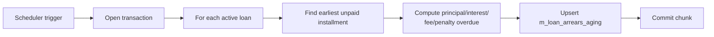
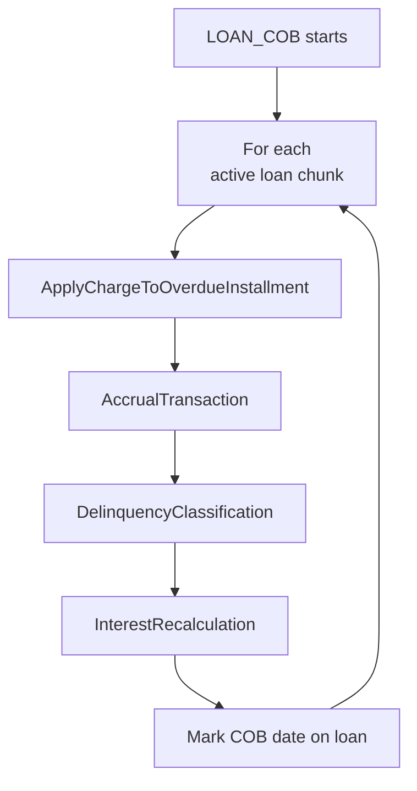

A meaningful share of the daily accounting work in Apache Fineract happens not in user-facing API calls but in batch jobs that sweep across the loan portfolio at end-of-day or end-of-period. They post accruals, refresh arrears ageing, apply overdue penalties, propagate holiday changes, and post loan-loss provisioning. Each job is registered with a `JobName` enum value in `fineract-core` and implemented by a Spring Batch job in `fineract-provider`; this page lists the loan-relevant ones with their inputs, outputs and side-effects.

The full job catalogue is in `org.apache.fineract.infrastructure.jobs.service.JobName`. The names here use the enum constant for unambiguous reference; the human-readable display name (as seen in the Scheduler Jobs admin UI) appears in the table.

## Job catalogue

| Enum | Display name | Frequency |
| --- | --- | --- |
| `UPDATE_LOAN_ARREARS_AGEING` | Update Loan Arrears Ageing | Daily |
| `APPLY_HOLIDAYS_TO_LOANS` | Apply Holidays To Loans | On demand / daily |
| `APPLY_CHARGE_TO_OVERDUE_LOAN_INSTALLMENT` | Apply penalty to overdue loans | Daily |
| `ADD_ACCRUAL_ENTRIES` | Add Accrual Transactions | Daily |
| `ADD_PERIODIC_ACCRUAL_ENTRIES` | Add Periodic Accrual Transactions | Daily |
| `ADD_PERIODIC_ACCRUAL_ENTRIES_FOR_LOANS_WITH_INCOME_POSTED_AS_TRANSACTIONS` | Add Periodic Accrual Transactions (income-as-tx products) | Daily |
| `RECALCULATE_INTEREST_FOR_LOAN` | Recalculate Interest For Loans | Daily |
| `GENERATE_LOANLOSS_PROVISIONING` | Generate Loan Loss Provisioning | Monthly |
| `LOAN_COB` | Loan COB | Daily |
| `LOAN_DELINQUENCY_CLASSIFICATION` | Loan Delinquency Classification | Daily |
| `ACCRUAL_ACTIVITY_POSTING` | Accrual Activity Posting | Daily |
| `TRANSFER_FEE_CHARGE_FOR_LOANS` | Transfer Fee For Loans From Savings | Daily |

## Update Loan Arrears Ageing

<CardGroup cols={2}>
  <Card title="Purpose" icon="bullseye">
    Refresh the `m_loan_arrears_aging` snapshot used by reports and the dashboard. Counts days past due per loan and tallies overdue principal, interest, fees and penalties.
  </Card>
  <Card title="Driver" icon="gears">
    `UpdateLoanArrearsAgeingTaskletConfig` walks active loans, computes `daysInArrears` against business date and overwrites the row.
  </Card>
</CardGroup>

Reports such as the portfolio-at-risk (PAR) and aged trial balance read directly from this table, so the job must run before the morning report cycle.

## Apply Holidays To Loans

When a tenant declares a new holiday or changes the repayment reschedule strategy, existing schedules are not retroactively shifted in the same transaction — that would be too expensive. Instead the holiday is flagged "to be processed" and this job sweeps active loans nightly.

<Steps>
  <Step title="Select loans">
    Pick all loans whose office is bound to a holiday with `processed = false`.
  </Step>
  <Step title="Replan due dates">
    For each loan, walk future installments and shift those that fall on a holiday using the configured `RepaymentRescheduleType` from `WorkingDays`.
  </Step>
  <Step title="Persist and mark processed">
    Update `m_loan_repayment_schedule` and flip the holiday row to `processed = true`.
  </Step>
</Steps>

<Info>
Holiday application never moves a past-due installment. It only adjusts installments whose original due date is in the future at the time the job runs.
</Info>

## Apply penalty to overdue loans

`APPLY_CHARGE_TO_OVERDUE_LOAN_INSTALLMENT` materialises overdue penalty charges. Loan products can carry one or more charges with charge-time `OVERDUE_INSTALLMENT` and charge-calculation `FLAT` or `% INSTALLMENT`. Those charges are not posted at schedule generation; they are applied here, after the grace period configured on the charge has elapsed.

| Configuration | Effect |
| --- | --- |
| `gracePeriod` (charge) | Days after due date before the penalty fires |
| `feeFrequency` | NONE (one-off) or DAILY/WEEKLY/MONTHLY (recurring penalty) |
| `feeInterval` | Days between recurring penalty applications |
| `chargeCalculationType` | What the penalty is computed against |

The job emits regular `LoanCharge` rows attached to the overdue installment and runs them through the configured transaction processor so the schedule reflects the new due penalty portion. A `LoanChargeAppliedBusinessEvent` is raised per charge.

## Accrual jobs

Three closely related jobs post accrual `LoanTransaction` rows:

<Tabs>
  <Tab title="ADD_ACCRUAL_ENTRIES">
    Posts a single accrual transaction at each installment's accrual cut-off date. Used by products with `AccountingRule = ACCRUAL_UPFRONT`, where interest, fees and penalties for the whole installment hit the books on the cut-off day.
  </Tab>
  <Tab title="ADD_PERIODIC_ACCRUAL_ENTRIES">
    Posts a daily slice of interest and a per-installment slice of fees / penalties so the GL reflects accrued income smoothly across the period. Used by `AccountingRule = ACCRUAL_PERIODIC`. The job computes how much of each component is earned up to business date and posts the delta vs. previously accrued.
  </Tab>
  <Tab title="...FOR_LOANS_WITH_INCOME_POSTED_AS_TRANSACTIONS">
    Variant that treats fees and penalty income as transactions (rather than journal-only entries) — important for some accounting layouts where income must be visible as cash-equivalent rows in the loan ledger.

```mermaid
sequenceDiagram
  participant J as Scheduler
  participant SVC as AccrualWritePlatformService
  participant L as Loan
  participant TX as LoanTransaction
  participant GL as Journal

  J->>SVC: addPeriodicAccruals&#40;tillDate&#41;
  SVC->>L: load active loans
  loop per loan
    SVC->>SVC: compute accrued interest<br/>fees, penalties up to tillDate
    SVC->>TX: insert ACCRUAL transaction
    SVC->>GL: post journal entries
  end
```

  </Tab>
</Tabs>

A single business event, `LoanAccrualTransactionCreatedBusinessEvent`, is raised per posted transaction so external listeners can mirror the accrual.

## Recalculate Interest For Loans

For products with **interest recalculation** enabled, future interest depends on actual repayment dates. This nightly job rebuilds the schedule of every active loan with interest recalculation when:

| Condition | Why it triggers a recalc |
| --- | --- |
| A payment landed since last recalc | Outstanding principal changed |
| A penalty was applied | Compounding base changed |
| A term variation became active | Rate or grace changed |
| Compounding frequency boundary crossed | Capitalisation event |

The job calls the same `LoanScheduleGenerator` used at disbursement, but with `recalculationDetails` populated from `LoanTransaction` history; the resulting schedule replaces future installments while preserving paid ones.

## Generate Loan Loss Provisioning

`GENERATE_LOANLOSS_PROVISIONING` posts provisioning journal entries at the configured cadence (typically end-of-month). It reads the configured `ProvisioningCriteria` — a set of bands like "1-30 days overdue: 10% of outstanding, 31-90: 25%, 91+: 100%" — multiplies the band rate by each loan's outstanding, and posts the result via the accounting subsystem.

<Info>
Provisioning entries do not change the loan balance. They post offsetting debits and credits in the configured provisioning expense and provision liability GL accounts so the books reflect the expected-loss reserve.
</Info>

## Loan COB

The Close-of-Business job is the master orchestrator for daily loan processing. It runs a chain of tasks per loan inside Spring Batch, so all daily state changes happen in a single deterministic pass.

Each step is a `LoanCOBBusinessStep` Spring bean discovered at runtime; new steps can be plugged in without modifying the job itself.

## Loan Delinquency Classification

This job evaluates the configured `DelinquencyBucket` against each active loan's `daysInArrears` and assigns a `DelinquencyRange`. The result is persisted to `m_loan_delinquency_tag_history` and surfaced on the loan summary so the UI, reports and external listeners can colour-code loans by delinquency band.

`LoanDelinquencyRangeChangedBusinessEvent` is raised when a loan's range changes between runs, enabling collections workflows to react.

## Accrual Activity Posting

For products with `AccountingRule = ACCRUAL_UPFRONT` the up-front amounts are accrued at schedule generation time. `ACCRUAL_ACTIVITY_POSTING` records the per-installment accrual activity rows once the installment's due date has passed, so reports can show the activity timeline.

## Transfer Fee For Loans From Savings

When a loan charge is configured to be auto-debited from a linked savings account, this job sweeps the unpaid fees and creates `SAVINGS WITHDRAW_FEE` transactions that fund the corresponding `PAY_CHARGE` on the loan side.

## Operational notes

<CardGroup cols={2}>
  <Card title="Idempotency" icon="rotate">
    Each job records its last-completed `businessDate` and skips already-processed rows so re-running the same job on the same day is safe.
  </Card>
  <Card title="Chunked execution" icon="layer-group">
    Most jobs use Spring Batch chunks (typically 50–500 loans per chunk) so failures only roll back the current chunk.
  </Card>
  <Card title="Tenant isolation" icon="building">
    The scheduler dispatcher fans out per tenant and per office, so a slow tenant cannot block others.
  </Card>
  <Card title="Manual run" icon="play">
    Admins can trigger any job manually from `/v1/jobs/{jobId}` for catch-up runs after downtime.
  </Card>
</CardGroup>

<Warning>
Several jobs depend on `UPDATE_LOAN_ARREARS_AGEING` and on the accrual jobs having completed for the same business date. Configure execution order in the Scheduler to avoid reading stale arrears data downstream.
</Warning>

## Execution order

Some jobs must run before others on the same business date because they consume their predecessor's output. A typical end-of-day sequence:

```mermaid
flowchart LR
  A[APPLY_HOLIDAYS_TO_LOANS] --> B[APPLY_CHARGE_TO_OVERDUE_LOAN_INSTALLMENT]
  B --> C[RECALCULATE_INTEREST_FOR_LOAN]
  C --> D[ADD_PERIODIC_ACCRUAL_ENTRIES]
  D --> E[ACCRUAL_ACTIVITY_POSTING]
  E --> F[UPDATE_LOAN_ARREARS_AGEING]
  F --> G[LOAN_DELINQUENCY_CLASSIFICATION]
  G --> H[LOAN_COB &mdash; per-loan finalisation]
```

`LOAN_COB` itself bundles many of these into a single per-loan pass and is the recommended approach for new deployments — individual jobs remain available for tenants migrating from older versions.

## Job configuration

Jobs are configured per tenant in `m_scheduler_jobs` (cron expression, enabled flag, parameters). Admins can:

| Setting | Effect |
| --- | --- |
| `cron_expression` | Standard Spring/Quartz cron, e.g. `0 0 1 * * ?` for 01:00 daily |
| `active_schedular` | Disable a job without removing it |
| `task_priority` | Order within the same trigger time |
| `previous_run_start_time`, `previous_run_status` | Last run audit |
| `job_initiating_node` | Cluster node that picked up the run |

The `m_scheduler_job_run_history` table records every execution with start/end timestamps, status (`success`, `failed`) and error trace for failed runs.

## Failure handling

<CardGroup cols={2}>
  <Card title="Per-chunk rollback" icon="circle-xmark">
    A failure in chunk N rolls back chunk N only; chunks 1..N−1 are committed and N+1 onward keep going if `skip-policy` allows.
  </Card>
  <Card title="Retryable" icon="rotate">
    Most jobs detect their own checkpoint and can be re-run for the same business date without double-processing rows.
  </Card>
  <Card title="Alerting" icon="bell">
    A failed run flips `previous_run_status` so monitoring queries against `m_scheduler_job_run_history` can fire alerts.
  </Card>
  <Card title="Catch-up runs" icon="forward">
    For accrual and arrears jobs, a missed day's run is detected on the next run via `last_processed_date` and replayed automatically.
  </Card>
</CardGroup>

## Related pages

<CardGroup cols={2}>
  <Card title="Arrears ageing" icon="hourglass-half" href="/loan/loan-arrears-aging">
    The snapshot table populated by UPDATE_LOAN_ARREARS_AGEING.
  </Card>
  <Card title="Accrual activity" icon="chart-line" href="/loan/loan-accrual-activity">
    Where the accrual transactions land.
  </Card>
  <Card title="Delinquency" icon="triangle-exclamation" href="/loan/loan-delinquency">
    Buckets and ranges used by the classification job.
  </Card>
  <Card title="Charges" icon="money-bill" href="/loan/loan-charges">
    Overdue penalties created by APPLY_CHARGE_TO_OVERDUE_LOAN_INSTALLMENT.
  </Card>
</CardGroup>
