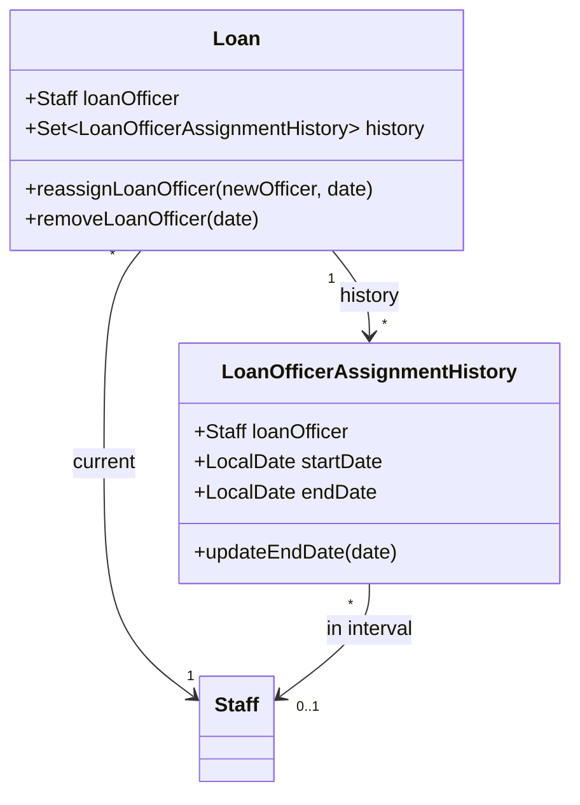
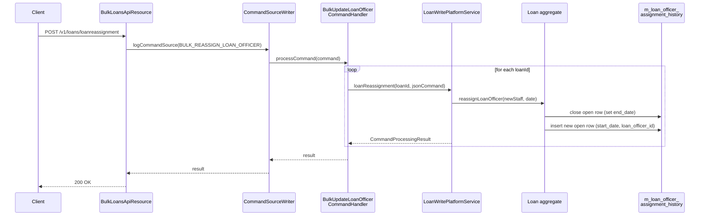

Every active loan in Apache Fineract is owned by exactly **one** loan officer (a row in `m_staff`). Because that owner changes — promotions, resignations, branch transfers, portfolio rebalancing — Fineract does not just update `m_loan.loan_officer_id` in place; it also writes an audit row to **`m_loan_officer_assignment_history`** so the system always knows *who was responsible for the loan on a given business date*. That history table backs portfolio-attribution reports, loan-officer commission, and "who originated this" forensics.

This page documents:

- the `LoanOfficerAssignmentHistory` entity and `m_loan_officer_assignment_history` table,
- the single-loan `assign` / `removeLoanOfficer` flows,
- the bulk reassignment API `POST /v1/loans/loanreassignment`,
- the command handlers that wire actions to the write platform service,
- the business events emitted on every assignment change.

## The history entity

`LoanOfficerAssignmentHistory` is a small auditable entity scoped to one loan:

```java fineract-loan/src/main/java/org/apache/fineract/portfolio/loanaccount/domain/LoanOfficerAssignmentHistory.java
@Entity
@Table(name = "m_loan_officer_assignment_history")
public class LoanOfficerAssignmentHistory extends AbstractAuditableCustom {

    @ManyToOne
    @JoinColumn(name = "loan_id", nullable = false)
    private Loan loan;

    @ManyToOne
    @JoinColumn(name = "loan_officer_id", nullable = true)
    private Staff loanOfficer;

    @Column(name = "start_date")
    private LocalDate startDate;

    @Column(name = "end_date")
    private LocalDate endDate;

    public static LoanOfficerAssignmentHistory createNew(final Loan loan,
            final Staff loanOfficer, final LocalDate startDate) {
        return new LoanOfficerAssignmentHistory(loan, loanOfficer, startDate, null);
    }
}
```

A row represents an **interval** during which `loanOfficer` was the assigned owner of `loan`. The currently-open interval has `end_date IS NULL`. When the loan officer changes, the open row is closed (its `end_date` is set to the change date) and a new row is opened.

| Column | Meaning |
|--------|---------|
| `loan_id` | FK to `m_loan` |
| `loan_officer_id` | FK to `m_staff` — nullable, supports "no officer" via `RemoveLoanOfficer` |
| `start_date` | Local business date when this officer took over |
| `end_date` | `NULL` while interval is open; set when officer is unassigned or replaced |
| `created_by` / `created_date` | Audit fields from `AbstractAuditableCustom` |

The entity exposes `updateLoanOfficer`, `updateStartDate`, `updateEndDate` and `matchesStartDateOf(LocalDate)` so the orchestrating service can manipulate intervals when corrections are made on the same business day.

## Where the field lives on the loan

The Loan aggregate keeps the currently-assigned officer as a `Staff` reference plus a `@OneToMany` collection of history rows. The domain model exposes helpers like `reassignLoanOfficer(Staff newOfficer, LocalDate assignmentDate)` that mutate both sides atomically: they close the previously-open `LoanOfficerAssignmentHistory`, append a new one, and update `Loan.loanOfficer`.



## Single-loan assignment

Two command actions act on one loan:

- `UPDATE_LOAN_OFFICER` (entity `LOAN`) — reassign to a new officer
- `REMOVE_LOAN_OFFICER` (entity `LOAN`) — unassign (sets `loan_officer_id = NULL`)

Both are thin handlers that delegate to `LoanWritePlatformService`:

```java fineract-loan/src/main/java/org/apache/fineract/portfolio/loanaccount/handler/UpdateLoanOfficerCommandHandler.java
@CommandType(entity = "LOAN", action = "UPDATELOANOFFICER")
public class UpdateLoanOfficerCommandHandler implements NewCommandSourceHandler {

    private final LoanWritePlatformService writePlatformService;

    @Override
    public CommandProcessingResult processCommand(final JsonCommand command) {
        return this.writePlatformService.loanReassignment(command.getLoanId(), command);
    }
}
```

The service-layer method validates that:

1. the target Staff exists and is flagged as a loan officer,
2. the target Staff belongs to the same office (or an accessible parent),
3. the assignment date is not before the loan's submitted-on date,
4. the loan is not closed or written-off.

After validation it calls `Loan.reassignLoanOfficer(...)`, which closes the open history row and inserts a new one.

## Bulk reassignment API

For portfolio shuffles the provider exposes a bulk endpoint:

```java fineract-provider/src/main/java/org/apache/fineract/portfolio/loanaccount/api/BulkLoansApiResource.java
@Path("/v1/loans/loanreassignment")
@Component
@Tag(name = "Bulk Loans")
public class BulkLoansApiResource {

    @POST
    @Consumes(MediaType.APPLICATION_JSON)
    @Produces(MediaType.APPLICATION_JSON)
    public String loanReassignment(final String apiRequestBodyAsJson) {
        final CommandWrapper commandRequest = new CommandWrapperBuilder()
                .assignLoanOfficersInBulk()
                .withJson(apiRequestBodyAsJson).build();
        final CommandProcessingResult result =
                this.commandsSourceWritePlatformService.logCommandSource(commandRequest);
        return this.toApiJsonSerializer.serialize(result);
    }
}
```

The `assignLoanOfficersInBulk()` builder produces a `BULK_REASSIGN_LOAN_OFFICER` command on entity `LOAN`, dispatched to `BulkUpdateLoanOfficerCommandHandler`. The request body contains:

| Field | Description |
|-------|-------------|
| `officeId` | Office whose loans are being reassigned |
| `fromLoanOfficerId` | Source officer (optional) |
| `toLoanOfficerId` | Target officer |
| `assignmentDate` | Business date when the new officer takes over |
| `loans` | Array of `loanId` values to reassign |
| `accounts` | Array of `savingsId` values (the same endpoint also moves savings) |

### Template endpoint

A companion `GET /v1/loans/loanreassignment/template?officeId=…&fromLoanOfficerId=…` returns dropdown candidates: all loan officers in the office and an `AccountSummary` for the source officer's current portfolio. The UI uses this to render a transfer screen.

```java
public String loanReassignmentTemplate(@QueryParam(OFFICE_ID) final Long officeId,
        @QueryParam(FROM_LOAN_OFFICER_ID) final Long loanOfficerId, @Context final UriInfo uriInfo) {
    final Collection<OfficeData> offices = officeReadPlatformService.retrieveAllOfficesForDropdown();
    Collection<StaffData> loanOfficers = null;
    StaffAccountSummaryCollectionData staffAccountSummaryCollectionData = null;
    if (officeId != null) {
        loanOfficers = staffReadPlatformService.retrieveAllLoanOfficersInOfficeById(officeId);
    }
    if (loanOfficerId != null) {
        staffAccountSummaryCollectionData =
                bulkLoansReadPlatformService.retrieveLoanOfficerAccountSummary(loanOfficerId);
    }
    ...
}
```

## End-to-end flow



## Triggering events

Assignment history is also written *implicitly* by other lifecycle transitions. The Loan aggregate calls `reassignLoanOfficer(…)` (or opens an initial history row) when:

- The loan **application is submitted** with a loan officer set on the request,
- The loan is **approved** with an officer specified for the first time,
- The loan is **disbursed** if the disburse command supplies a new officer,
- The loan is **transferred** to another client/group whose office implies a different officer,
- An **inter-branch transfer** moves the loan to a new office.

In each case the same invariant holds: at most one history row per loan has `end_date IS NULL`, and intervals never overlap.

<Note>
Removing a loan officer leaves the loan **unassigned** — `loan_officer_id` on `m_loan` becomes `NULL`, and the new history row has a `NULL` `loan_officer_id` as well. Reporting queries that join through history therefore see "no officer" as a distinct value, not a gap.
</Note>

## Business events

Each assignment change emits an event through the business-event-notifier framework. The most common ones are:

- `LoanReassignedBusinessEvent` — fired after every successful single or bulk reassignment,
- `LoanRemovedFromOfficerBusinessEvent` — fired when an officer is unassigned,
- `LoanCreatedBusinessEvent` — carries the initial officer when the application is submitted.

External listeners (Kafka outbox, audit shippers, commission engines) subscribe to these to drive downstream pipelines without coupling to the JPA model.

## Reading history

The history is read through `LoanOfficerReadPlatformService` and surfaces in:

- `GET /v1/loans/{loanId}?associations=loanOfficerAssignmentHistory`
- The provider's portfolio-attribution reports, which join `m_loan_arrears_aging` and similar fact tables to the history interval that covers the report date,
- Point-in-time loan reconstruction (see [/loan/loan-point-in-time](/loan/loan-point-in-time)), where the history row whose `[start_date, COALESCE(end_date, ∞))` interval contains the requested date is used to attribute the loan.

## Validation rules

The write platform service rejects the assignment if any of the following hold:

| Rule | Error code |
|------|------------|
| `assignmentDate` is before the existing open interval's `start_date` | `error.msg.loan.officer.assignment.date.cannot.be.before` |
| The new officer is the same as the current one | `error.msg.loan.same.loan.officer.assigned` |
| Target Staff is not flagged `is_loan_officer = true` | `error.msg.staff.not.loan.officer` |
| Loan is closed, written-off, or in a terminal sub-status | `error.msg.loan.is.closed` |

These checks live in `LoanWritePlatformServiceJpaRepositoryImpl.loanReassignment(...)`.

## Putting it together

The combination of an immutable interval table, a single open row per loan, and command-sourced mutations means Fineract can always answer two questions deterministically:

1. **Who owns this loan right now?** — `m_loan.loan_officer_id`.
2. **Who owned this loan on date *D*?** — the unique row in `m_loan_officer_assignment_history` where `start_date <= D AND (end_date IS NULL OR end_date > D)`.

Combined with [loan status history](/loan/loan-application-lifecycle) and the [loan transaction journal](/loan/loan-transactions), this gives operations and finance teams a complete attribution audit for every cash flow on the portfolio.
